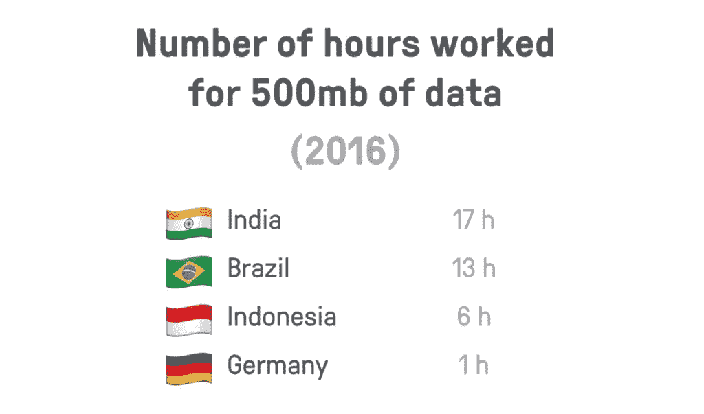
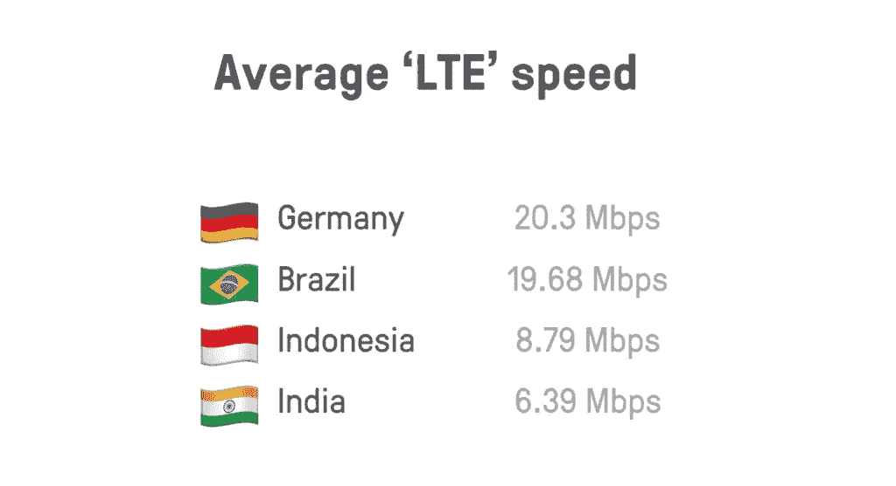
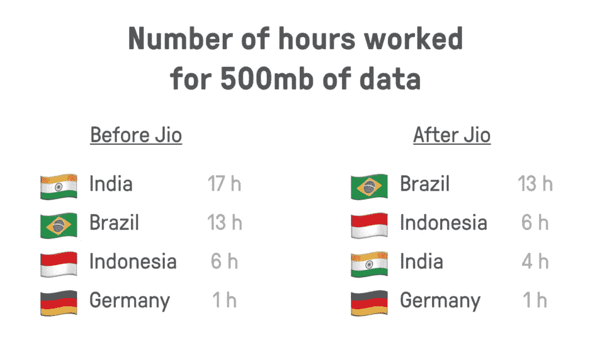
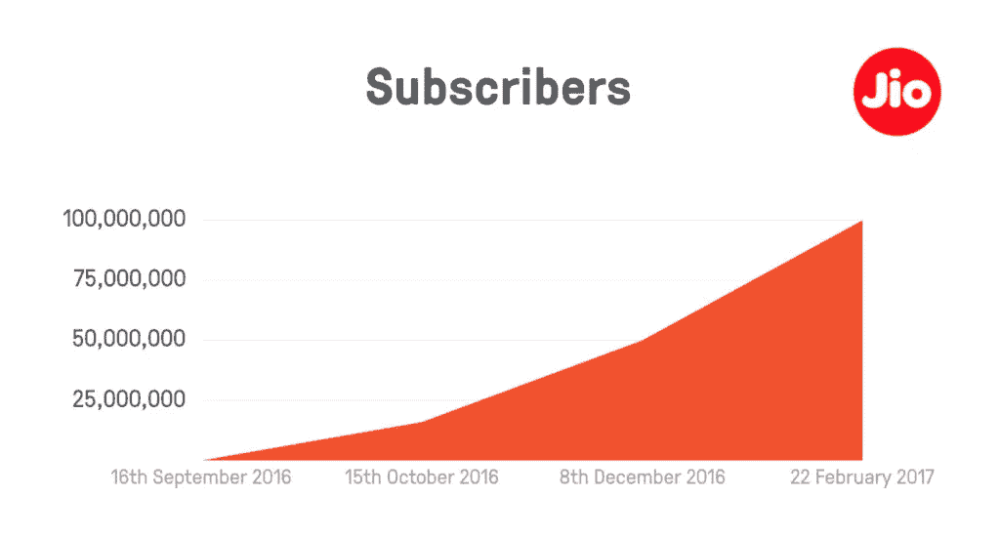
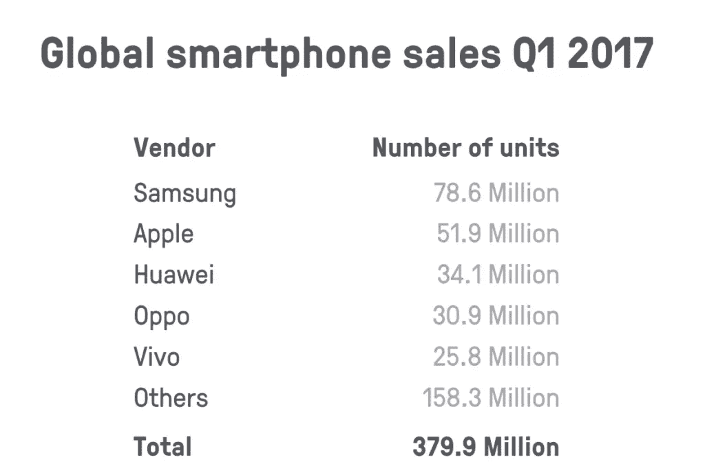
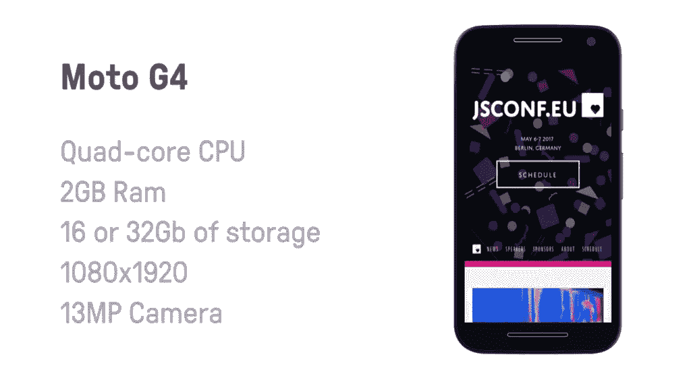
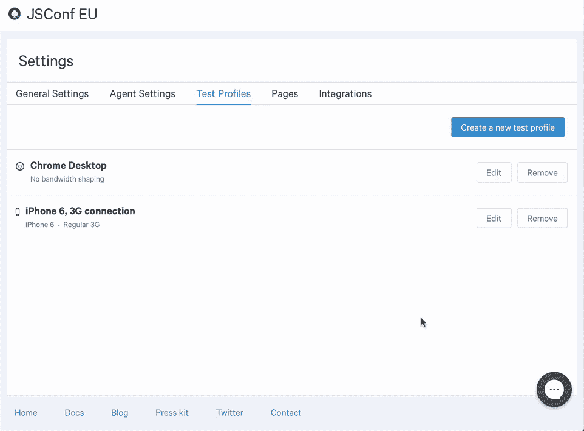
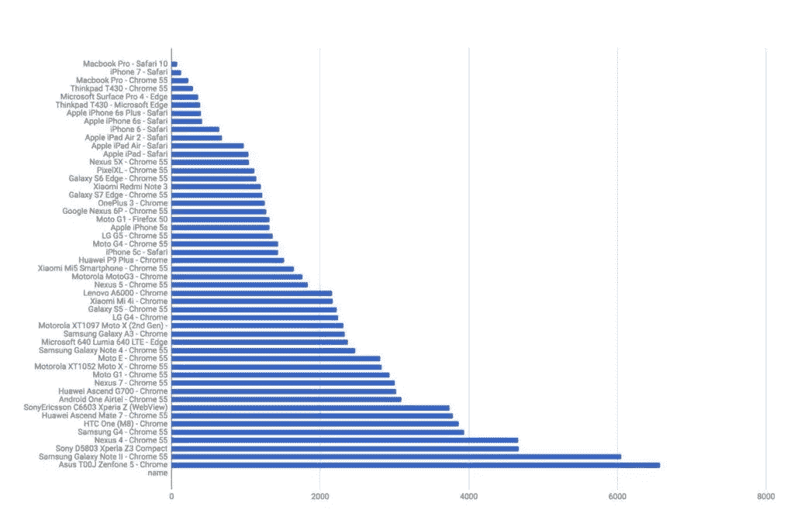

# 用真实设备上的自动化测试构建更好的网络

> 原文：<https://www.sitepoint.com/building-better-web-automated-testing-real-devices/>

*本文原载于[媒体](https://building.calibreapp.com/beyond-the-bubble-real-world-performance-9c991dcd5342)。*

我的工作完全致力于帮助人们构建更好、更快、更易访问的应用程序和网站。运行 [Calibre](https://calibreapp.com/?utm_source=sitepoint&utm_medium=post&utm_content=babwwatord) 让我对团队在构建和维护他们的小部分网络时所面临的挑战有了更多的了解。

在过去的一年里，真正让我震惊的是，作为一个网络行业，我们对人们(是的，真实的人，而不是其他网络开发者)访问互联网的方式知之甚少，顺便提一下，我们向用户交付内容的方法到底有多过时。

当然，在过去的几年中，我们已经取得了一些重大进展，极大地提高了我们将内容推送到设备的速度，但最终作为一个行业，从“加载 HTML，找到其他资源，然后也加载它们”的核心前提出发，并没有太大的变化

左:网络开发者，右:互联网用户。

今天，全球互联网接入率约为 46.1%(T1)。也就是说，在这个我们称之为家的美丽的蓝色大理石上，只有一半的人会大致了解“拉动以刷新”是什么意思。其余的呢？嗯，他们没有联系，所以他们可能没有。

如果你调查一下过去三年网络的发展，很快就会发现印度的互联网接入正以前所未有的速度增长。

仅在 2016 年，印度就有 1.06 亿人使用互联网，**首次使用互联网**。补充一些视角，那就是每天 **29 万人***左右。*

 *这比 2015 年增长了约 30%，如果这些数字在 2017 年再次匹配(这是非常可能的)，那将是另一个 1 . 4 亿人。

的确，今天只有 35%的印度人上网，而人口是 12 亿。

未来几年，我们将实现前所未有的巨大增长。

在 2014 年的某个时候，移动设备的使用量超过了台式机— **51.3%的联网设备是手持设备**。手持设备通常要便宜得多(而且通常与价格更高、便携性更差的台式电脑一样能够完成日常任务)，这并不令人感到意外。

* * *

**寻找更多关于 Jenkins 和持续集成的信息？看看这些伟大的链接:**

*   2Mb 网页:该怪谁？
*   [五个 CSS 性能工具加速你的网站](https://www.sitepoint.com/five-css-performance-tools-speed-website/)
*   [如何提高你的 WordPress 主题的性能](https://www.sitepoint.com/improve-wordpress-theme-performance/)
*   [浏览器趋势:移动超越桌面](https://www.sitepoint.com/browser-trends-december-2016-mobile-overtakes-desktop/)
*   书:[精益网站](https://www.sitepoint.com/premium/books/lean-websites)

查看 [SitePoint Premium](https://www.sitepoint.com/premium) 获取更多书籍、课程和免费视频。

* * *

## 数据和连接

去年，我做了一些研究，计算了全球许多地方的移动数据费用。采用当地的最低工资，找到具有最大市场份额的运营商，并找到具有至少 500mb 数据的最物有所值的预付费计划。

印度在排行榜上名列榜首。超过 2 天的全职工作，以获得一个数据计划，我们在西方世界会认为“也许可以为你的父母”。

它还不止于此，因为即使你能买得起一台设备，有一个体面的每月数据津贴，也不要认为它会很快。

不考虑平均 LTE 速度，我有更多，也许是令人震惊的消息:**世界平均移动连接的 60%是 2G** 。

这不仅仅是“2G 速度”，而是 2G 连接。在你的 iPhone 上，你可能已经看到网络被宣传为“Edge ”,等等……嗯，它停止工作了，对吗？

你可能会想，“嗯，我认识的几乎每个人都至少有一个 DSL 连接……这应该比我在这里读到的速度更快”，不幸的是，事实并非如此。

**全球平均互联网连接速度？7 Mbps。**🤕

## 👋印度合十礼

去年年底，一家新的纯 4G 无线网络提供商出现了，此前他们的朋友、家人和员工进行了一年的私人测试。

在短短的几个月里，Jio 一举改变了印度互联网的面貌，也改变了我认为是世界上最快的客户增长曲线，这将使硅谷屈服(如果他们知道还有其他国家存在的话)😏).

自从进入市场以来， **Jio 已经迫使关税下降了 80%** 。

### 结束所有增长曲线的增长曲线

> 该公司于 2016 年 9 月 5 日推出其商业服务。在商业运营的第一个月内，Jio 宣布它已经获得了 1600 万用户。这是世界上任何地方的移动网络运营商最快的提升速度。Jio 在上线 83 天内就突破了 5000 万用户大关。Jio 于 2017 年 2 月 22 日突破 1 亿用户。*——[维基百科](https://en.wikipedia.org/wiki/Jio)*

不到 90 天就有 5000 万用户。不到 6 个月完成 100 米。我不能忘记那些数字。我不停地对自己重复这些话。

## 不是每个人都有 iPhone

现在，你可能正坐在一张漂亮的桌子前，在一台价格在 1600-3000 美元左右的电脑上使用 Wi-Fi，或者是一台相当流行的 Android 或 iPhone。

鉴于你很可能是 web 开发社区的一员(嘿，那是我的观众)，这并不奇怪。

除了你的父母，他们有和你离家时一样的坏掉的电脑…其他人有现在的模型机器，对吗？

在过去的几年里，我看到和听到了很多关于 Android 碎片化的事情，但直到我研究了全球智能手机的销售情况，我才确定我是否真正理解了它。

原来我从未听说过⅔有手机在销售。

我发现这些统计数据的惊人之处不仅在于设备数量巨大(你有没有想象过，如果你把 3.8 亿部手机堆在一个房间里，会占用多少空间？)，但更重要的是，我从来没有听说过一些这样的供应商，他们在短短三个月内销售了超过 2 亿台设备。😳

市场上如此多种多样的设备让许多网络开发者感到恶心。我们究竟该如何测试所有这些，更不用说深入了解它们的怪癖了？

我喜欢的一个策略是:

*   使用真实硬件进行测试。(并自动化您的测试。你好口径)
*   在给定市场的所有主流浏览器中进行测试。
*   使用给定市场的真实平均网络条件进行测试。

在正确的设备上进行测试有一些微妙之处，但值得庆幸的是[亚历克斯·罗素](https://medium.com/@slightlylate)非常友好地分享了他 2016 年的研究，他在研究中做了一些探索工作，以找到一款最能代表野外设备的移动设备，可以在今天购买，并在未来几年成为一款值得信赖的测试手机。🕵

这种装置的标准如下:

1.  这种设备需要全球可用，价格合理，软件体积最小，因此进入门槛较低。
2.  该设备需要比 2016 年的平均水平稍微领先*一点点，这样它才是购买测试设备的可靠候选。(*一笔投资！*)*
3.  由于热不稳定性，Nexus 5X 不是一个选项。有时它们真的很快，有时超慢(A57 对 A53 芯片组)。
4.  有数十亿的安卓设备在使用高通 28 纳米 A53 芯片组。这些四核 CPU 无处不在*，而且几乎没有任何缓存。最好选择那个芯片组上的设备。*

 *大多数用户通过他们的运营商接收手机，设备因人口统计和地理位置的不同而有很大差异。

这款手机可不简单

在进行了这项研究之后，Alex 来到了摩托罗拉 G4——从统计数据来看，这比平均水平高了不少。有一些注意事项:

*   真正的中值是更慢、更老、更便宜的手机。
*   Moto G4 是一款很好的候选设备，将在 2017 年底和 2018 年初成为中值设备。(所以，就当是投资吧。)
*   内存相当大(2GB)——内存并不便宜。这就是为什么真正便宜的手机仍然配备 512mb-1gb 内存。

如果你从今天开始用摩托罗拉 G4 进行开发和测试，并且它表现得“还不错”，那么每个使用更新、更强大设备的人都会感到惊讶。🎉

当谈到流畅、愉快的用户体验时，设备规格确实是一个重要因素，特别是如果您依赖 JS 进行交互和渲染的话。您在脚本中投入的越多，您的应用就越依赖本地单核性能。

功率较低的设备*会*感觉迟钝，而较新的设备可以一次运行多个页面，不费吹灰之力。

### 自动化

在真实设备上进行测试也会变得非常有限。谢天谢地，[网页测试](https://www.webpagetest.org/)和[口径](https://calibreapp.com/?utm_source=sitepoint&utm_medium=post&utm_content=babwwatord)已经覆盖了你。

WPT 在弗吉尼亚州的杜勒斯驾驶一辆真正的摩托 G4！

Calibre 还有一系列真实设备和仿真目标。

真实的设备对于培养同理心和理解很重要，但是让测试变得繁琐对于团队来说是至关重要的。就像一个持续的集成过程一样，它应该是自动化的，并定期运行，以开发一个完整的性能变化时间表。

在 [Addy Osmani](https://medium.com/@addyosmani) 的优秀文章“ [JavaScript 启动性能](https://medium.com/reloading/javascript-start-up-performance-69200f43b201)”中，他研究了在各种设备上解析(也就是解析，而不是执行)1mb JavaScript 所需的时间。

您会注意到，不同设备之间的解析时间差别很大。 [Addy 的文章太，太重要了](https://medium.com/reloading/javascript-start-up-performance-69200f43b201)。请去读它。😘

今天， **620Kb 的 JavaScript 是全球中位数**，听起来很多，但是要记住，**这是 GZipped** 。忘了 620kb 吧，更像是**2–3mb 解压后的**。在速度较慢的设备上，我们说的是完全锁定——几秒钟内几乎没有响应。

这就是为什么用真实设备进行测试如此重要的原因，因为你 1000 美元的 iPhone 几乎和一台相当新的 Macbook Pro 一样好。那不是现实。

## 你的工作:建立对用户体验的深刻理解

我希望我向你们提供的信息给了你们一些东西，你们可以指着它们，跺跺脚，说“我们需要做得更好”，因为这是事实。我们有。

网络的本质是变化的。没有常数。经历因环境不同而大相径庭。

对于 web 开发社区来说，web 有两个版本，一个是我们日常使用的，另一个是我们不使用的。

我们自己知道，连接因你所在的位置而异:也许你在大楼的另一端，在会议上，在飞机上，在隧道里，或者出于任何该死的原因，调制解调器需要重新启动。

我们必须停止对 3000 美元的高速连接电脑的优化。

如果你看看你的泡泡外面，你会发现我们真的没有努力为我们亲爱的“用户”建立美丽、快速、高效和愉快的用户体验。

我敢肯定，没有人签署了建立富裕的西方网络。我们都在为万维网而努力，现在是我们作为一个社区开始这样做的时候了。👍

✨:让每个人都能快速上网。 ✨

* * *

为帮助我准备这些信息的我的朋友和英雄们大声欢呼吧:[卡罗琳娜·什苏尔](https://medium.com/@fox)，[艾迪·奥斯马尼](https://medium.com/@addyosmani)，[亚历克斯·罗素](https://medium.com/@slightlylate)和[布鲁斯·劳森](https://twitter.com/brucel)。

*本文原载于[媒体](https://building.calibreapp.com/beyond-the-bubble-real-world-performance-9c991dcd5342)。*

## 分享这篇文章**