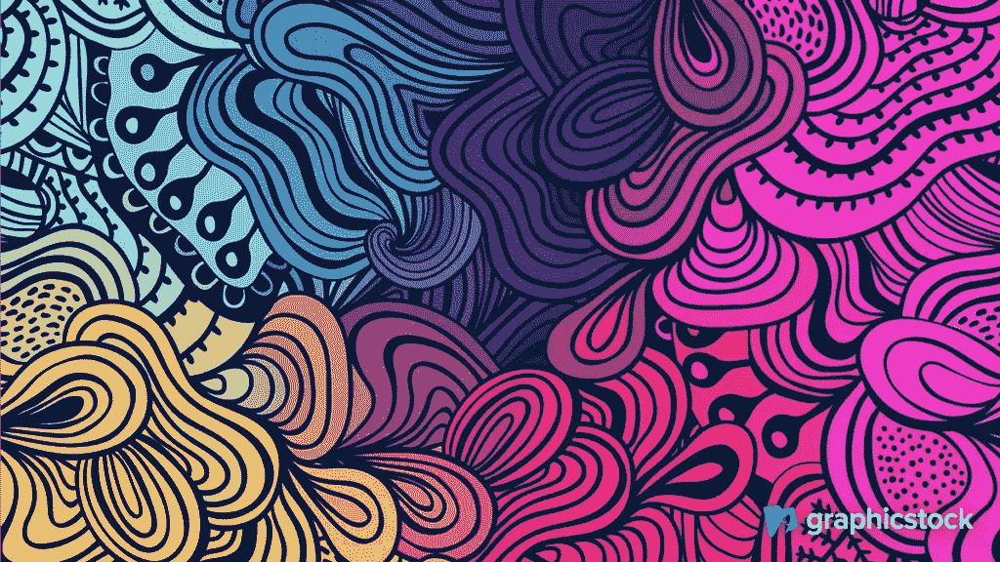
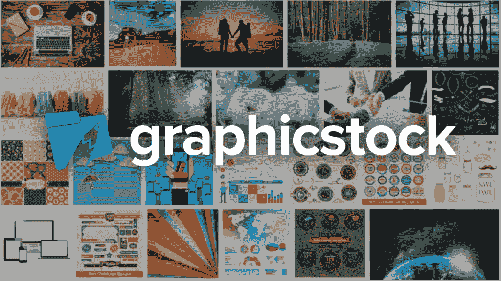
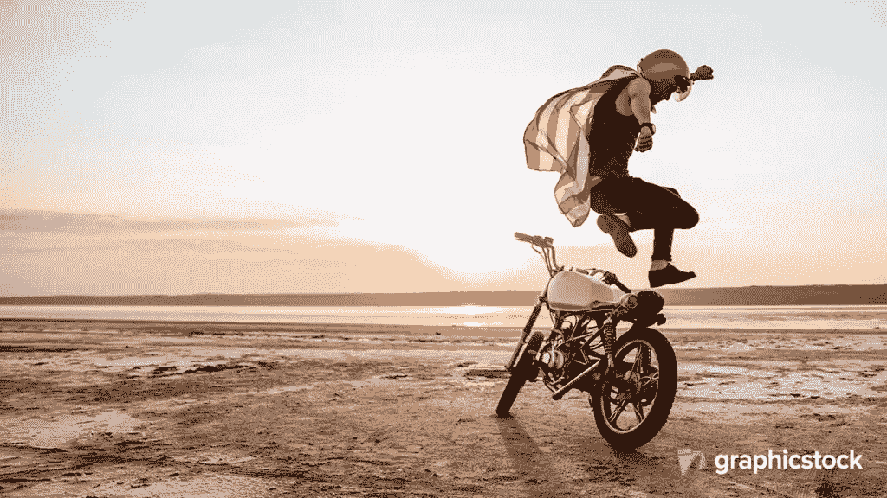
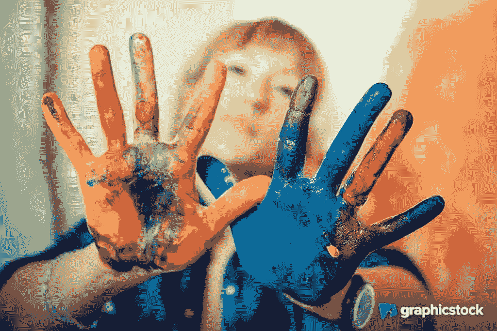
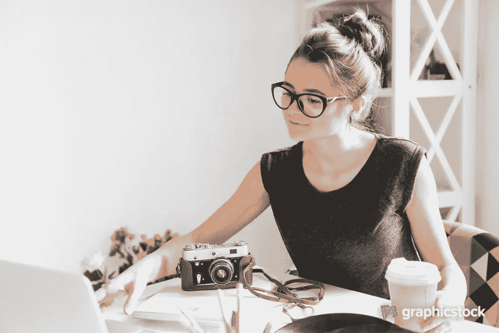
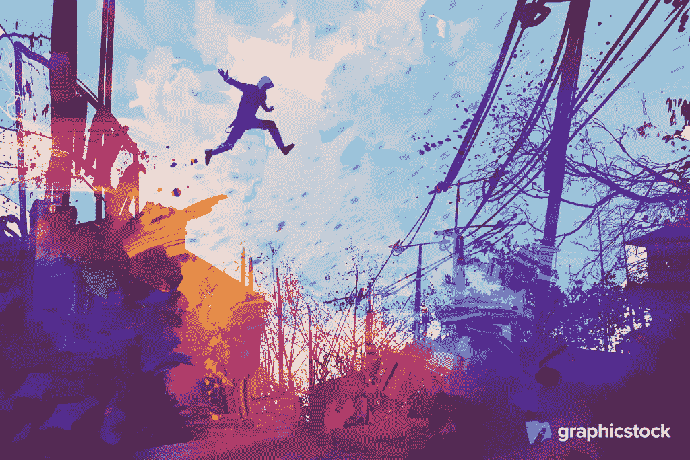

# 如何挑选吸引用户的库存照片

> 原文：<https://www.sitepoint.com/how-to-pick-stock-photos-that-captivate-users/>

*本文由 [GraphicStock](http://synd.co/2uHVMoa) 赞助。感谢您对使 SitePoint 成为可能的合作伙伴的支持。*

设计中的摄影——无论是网络、手机还是其他——都很常见。寻找图片几乎是大多数设计师的第二天性，所以很容易将图片整合到网页和应用程序设计中，而无需真正思考我们为什么要这样做。

在这篇文章中，我们将讨论一些股票摄影在网页设计和应用程序设计中非常有效的示例场景，*为什么*有效，以及如何选择股票图像，不仅*看起来*惊人，而且实际上有助于实现设计的*目标*(销售、注册、转化等)。

## 何时使用库存摄影(及原因)

通过在你的网页和应用程序设计中使用图片，**你在冒险**。你牺牲了更快的加载时间，这直接导致更少的转换，因为不耐烦的用户*和* SEO，你也牺牲了本来可以用于更重要的事情的屏幕空间。

作为一名设计师，没有默认设置是至关重要的(这就是为什么所有的设计最终都是一样的)。取而代之的是，考虑一下设计目标和意象是如何发挥作用的。

一般来说，当试图说服 T1 时，库存摄影效果最好。有说服力的写作完全是一件事，许多文案在这方面非常棒，但是摄影做了文字*不能*做的事情——摄影触及用户的情感。当我们能够挖掘用户的情绪时，说服用户购买、注册或转化就变得更容易了。

***提示*** *:为了获得最佳效果，请协调使用文字和图像。*

你还需要一个很好的库存照片来源。在一个充斥着我们多年前就学会过滤掉的那种老套股票照片的市场上，花一大笔钱太容易了。

幸运的是，GraphicStock 提供了一个巨大的图片库，看起来很棒。开始您的免费 [7 天 GraphicStock 试用](http://synd.co/2uHVMoa)，每天下载多达 20 张图片。之后，你可以订阅第一年的 99 美元，订阅每年更新 149 美元。

## 挖掘用户的恐惧和欲望

让我们来看看股票摄影积极和直接提高转化率的三个例子，以及为什么。

### 1.海滩度假

你马上就会想到“海滩”。海滩很好，但一个人在海滩上享受自己更好，因为它与用户的放松欲望产生共鸣，在那里他们可以很容易地想象自己是图像中的人。如果主题不是用户所期望的，那就更好了(海洋是只有 Photoshop 才能完成的蓝色阴影)。

### 2.艺术家体验

想象一下你花钱学习如何成为一名艺术家的课程或“体验日”。颜料、画架——这些是最先浮现在脑海中的想法，尽管它们也是最明显的想法。一个更好、更令人兴奋的方法再次在情感上吸引了用户，通过使用一个被*颜料*覆盖的人类主题。

它很有趣，很大胆，很有共鸣，而且它迎合了用户逃离日常生活的欲望。

### 3.相机产品

假设你在为一个*产品*(比如一个相机)做广告，而用户不确定他们真的想要或者需要它。像 iPhones 和 MacBook Pros 这样的产品使用直截了当的“透视”照片，因为它们看起来**令人惊讶**:每个人都想要一个，这是他们的东西，这就是他们如何销售它们，他们销售自己。

不能自我推销的产品，公平地说是大多数产品，需要在情感上吸引用户。当处于观望状态时，用户需要想象自己使用这个项目，他们需要看到自己使用它，看起来很酷或者很开心。

这三个例子的共同点是它们是相关的。用户很容易想象自己是图像的焦点，因此他们在情感上被它迷住了。

## 说服性设计由同理心驱动

设身处地为用户着想。现在，想想看:

购买产品或订购服务的核心原因可能是什么？扑热息痛:**怕头痛**？跑车:**关于变老的焦虑**？康提基之旅:渴望逃离或做某事**冒险**？

恐惧、焦虑、冒险——这些都是与购买相关的感受。为了知道这些感觉是什么，我们需要与用户感同身受，如上所述，这意味着站在他们的角度看问题。

一旦你有了同理心，你就会更好地理解用户，一旦发生这种情况，你会发现选择有吸引力的股票图片会更容易。

## 什么在情感上吸引了用户？

同理心会导致情绪上的着迷，而情绪上的着迷可以带来销售和转化。那么，是什么在情感上吸引了用户呢？我们已经讨论了上面的一些例子，但是什么是“要记住的规则”？让我们回顾一下要点——最好的库存图片使用的主题是:

1.  …帮助用户意识到他们遇到的一个问题
2.  …展示一个明显的解决方案
3.  …看起来很惊讶，好像他们不可能说*不*
4.  …帮助用户将*自己*视为主题

GraphicStock 以其实惠的无限下载定价模式提供了真正的价值。当你购买，你保持，你也将有一个简单的，无限制的许可和永无止境的访问一个不断增长的粉碎股票图像库的声音安心。

哦，还有一个内部客户服务团队——你还能要求什么呢？[现在就开始使用 GraphicStock](http://synd.co/2uP9mmG) 的**7 天免费试用**，或者 99 美元/年的订阅(续订价格为 149 美元)。

## 分享这篇文章