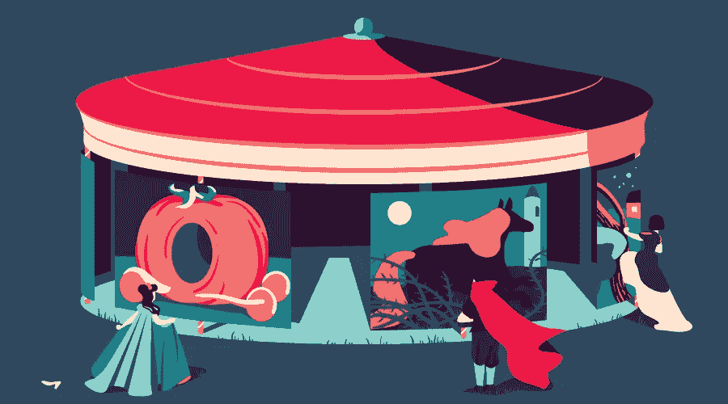
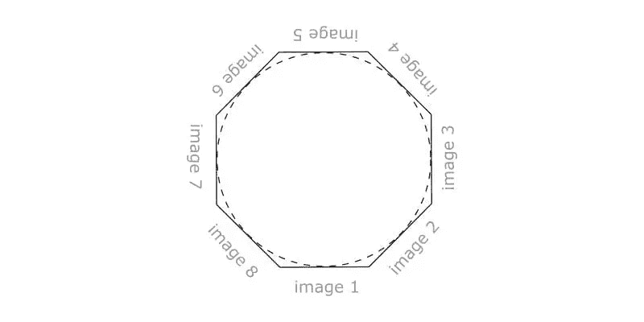

# 用 CSS 和 JavaScript 构建 3D 旋转木马

> 原文：<https://www.sitepoint.com/building-3d-rotating-carousel-css-javascript/>

关于传统 2D 旋转木马的使用已经说了很多，例如《粉碎》杂志上的这篇文章就涉及了这个主题。*这个问题没有简单的是或否的答案，我应该使用旋转木马吗？*‘问题；这取决于具体情况。



当我开始研究这个主题时，我并不需要 3D 旋转木马，相反，我对实现它的技术细节更感兴趣。使用的核心技术当然来自于 [CSS Transforms 模块第 1 级](https://www.w3.org/TR/css-transforms-1/)，但是在这个过程中还会应用一些其他前端开发技术，涉及 CSS、 [Sass](https://www.sitepoint.com/premium/courses/starting-sass-2970) 和[客户端 JavaScript](https://www.sitepoint.com/premium/courses/introduction-to-javascript-2908) 中的各种主题。

这个代码笔显示了组件的不同版本，我将向你展示如何构建 。

为了说明 CSS 3D 转换的设置，我将向您展示该组件的纯 CSS 版本。然后，我将向您展示如何用 JavaScript 增强它，开发一个简单的组件脚本。

## 旋转木马的标记

对于标记，组件中的图像被包装在一个`<figure>`元素中，该元素提供了一个基本框架:

```
<div class="carousel">
  <figure>
    
    
    ...
    
  </figure>
</div>
```

这将是我们的起点。

## 旋转木马几何结构

在研究 CSS 之前，让我们先了解一下将在下面几节中开发的计划。

``元素应排列在转盘描绘的圆圈周围。这个圆可以通过其外切的[正多边形](https://en.wikipedia.org/wiki/Regular_polygon)和放置在其边上的图像来近似:



所以，这样一个多边形的边数与转盘中图像的数量相同:有了三个图像，这个多边形就是一个等边三角形；有四个图像，它是一个正方形；有五个五边形；以此类推:

在 [CodePen](https://codepen.io) 上通过 SitePoint ( [@SitePoint](https://codepen.io/SitePoint) )看到钢笔[正多边形](https://codepen.io/SitePoint/pen/yXWXOZ/)。