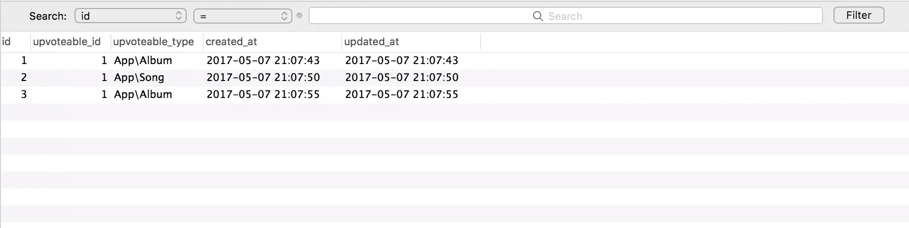

# 重新介绍雄辩的多态关系

> 原文：<https://www.sitepoint.com/eloquents-polymorphic-relationships-explained/>

*这篇文章由[尤尼斯·拉菲](https://www.sitepoint.com/author/yrafie)同行评审。感谢 SitePoint 的所有同行评审员使 SitePoint 的内容尽可能做到最好！*

* * *


您可能在模型或数据库表之间使用过不同类型的关系，就像在 Laravel 中常见的那样:一对一、一对多、多对多和多对多。但是还有另一种不太常见的关系:多态关系。那么什么是多态关系呢？

> 多态关系是指在一个关联中，一个模型可以属于多个其他模型。

为了澄清这一点，让我们创建一个假想的场景，其中我们有一个`Topic`和一个`Post`模型。用户可以对主题和帖子发表评论。使用多态关系，我们可以对这两种场景使用一个`comments`表。令人惊讶，是吗？这似乎有点不切实际，因为理想情况下，我们必须创建一个`post_comments`表和一个`topic_comments`表来区分评论。对于多态关系，我们不需要两个表。让我们通过一个实例来研究多态关系。

## 我们将会建造什么

我们将创建一个演示音乐应用程序，其中有歌曲和专辑。在这个应用程序中，我们可以选择增加歌曲和专辑的投票。使用多态关系，我们将为这两种场景使用一个 upvotes 表。首先，让我们检查一下建立这种关系所需的表结构:

```
albums
    id - integer
    name - string

songs
    id - integer
    title - string
    album_id - integer

upvotes
    id - integer
    upvoteable_id - integer
    upvoteable_type - string 
```

让我们来讨论一下`upvoteable_id`和`upvoteable_type`列，对于那些以前没有使用过多态关系的人来说，这可能有点陌生。`upvoteable_id`列将包含专辑或歌曲的 ID 值，而`upvoteable_type`列将包含拥有模型的类名。`upvoteable_type`列是 ORM 在访问`upvoteable`关系时决定返回哪个“类型”的拥有模型的方式。

## 在迁移的同时生成模型

我假设你已经有了一个正在运行的 Laravel 应用程序。如果没有，这个[高级快速入门课程](https://www.sitepoint.com/premium/courses/laravel-5-2930/?aref=bskvorc)可能会有帮助。让我们从创建三个模型和迁移开始，然后编辑迁移以满足我们的需要。

```
php artisan make:model Album -m
php artisan make:model Song -m
php artisan make:model Upvote -m 
```

注意，在创建模型时传递`-m`标志也会生成与那些模型相关联的迁移。让我们调整这些迁移中的`up`方法，以获得期望的表结构:

*{某 _ 时间戳}_create_albums_table.php*

```
public function up()
    {
        Schema::create('albums', function (Blueprint $table) {
           $table->increments('id');
            $table->string('name');
            $table->timestamps();
        });
    } 
```

*{某 _ 时间戳}_create_songs_table.php*

```
public function up()
    {
        Schema::create('songs', function (Blueprint $table) {
            $table->increments('id');
            $table->string('title');
            $table->integer('album_id')->unsigned()->index();
            $table->timestamps();

            $table->foreign('album_id')->references('id')->on('album')->onDelete('cascade');
        });
    } 
```

*{ some _ timestamp } _ create _ up votes _ table . PHP*

```
public function up()
    {
        Schema::create('upvotes', function (Blueprint $table) {
            $table->increments('id');
            $table->morphs('upvoteable'); // Adds unsigned INTEGER upvoteable_id and STRING upvoteable_type
            $table->timestamps();
        });
    } 
```

我们现在可以运行 artisan `migrate`命令来创建三个表:

```
php artisan migrate 
```

现在让我们配置我们的模型，以记录专辑、歌曲和 upvotes 之间的多态关系:

*app/Upvote.php*

```
[...]
class Upvote extends Model
{
    /**
     * Get all of the owning models.
     */
    public function upvoteable()
    {
        return $this->morphTo();
    }
} 
```

*app/Album.php*

```
class Album extends Model
{
    protected $fillable = ['name'];

    public function songs()
    {
        return $this->hasMany(Song::class);
    }

    public function upvotes()
    {
        return $this->morphMany(Upvote::class, 'upvoteable');
    }
} 
```

*app/Song.php*

```
class Song extends Model
{
    protected $fillable = ['title', 'album_id'];

    public function album()
    {
        return $this->belongsTo(Album::class);
    }

    public function upvotes()
    {
        return $this->morphMany(Upvote::class, 'upvoteable');
    }
} 
```

`Album`和`Song`模型中的`upvotes`方法定义了这些模型和`Upvote`模型之间的多态一对多关系，并将帮助我们获得该特定模型实例的所有 upvotes。

定义好关系后，我们现在可以使用这个应用程序，以便更好地理解多态关系是如何工作的。我们不会为这个应用程序创建任何视图，我们只是从控制台修补我们的应用程序。

如果你在考虑控制器以及我们应该在哪里放置`upvote`方法，我建议创建一个`AlbumUpvoteController`和一个`SongUpvoteController`。这样，在处理多态关系时，我们就可以将事情严格地限制在我们正在处理的事情上。在我们的例子中，我们可以投票支持专辑和歌曲。upvote 不是专辑的一部分，也不是歌曲的一部分。此外，这不是一个普通的向上投票的事情，与我们如何在大多数一对多关系中有一个`UpvotesController`相反。希望这有意义。

让我们启动控制台:

```
php artisan tinker
>>> $album = App\Album::create(['name' => 'More Life']);
>>> $song = App\Song::create(['title' => 'Free smoke', 'album_id' => 1]);
>>> $upvote1 = new App\Upvote;
>>> $upvote2 = new App\Upvote;
>>> $upvote3 = new App\Upvote;
>>> $album->upvotes()->save($upvote1)
>>> $song->upvotes()->save($upvote2)
>>> $album->upvotes()->save($upvote3) 
```

## 检索关系

现在我们已经有了一些数据，我们可以通过我们的模型来访问我们的关系。下面是 *upvotes 表*中的数据截图:



要访问一个相册的所有 upvotes，我们可以使用 upvotes 动态属性:

```
$album = App\Album::find(1);
$upvotes = $album->upvotes;
$upvotescount = $album->upvotes->count(); 
```

通过访问执行对`morphTo`的调用的方法的名称，也可以从多态模型中检索多态关系的所有者。在我们的例子中，这是 Upvote 模型上的`upvoteable`方法。因此，我们将访问该方法作为一个动态属性:

```
$upvote = App\Upvote::find(1);
$model = $upvote->upvoteable; 
```

Upvote 模型上的`upvoteable`关系将返回一个`Album`实例，因为这个 upvote 属于`Album`实例的一个实例。

因为有可能获得一首歌曲或一张专辑的上传票数，我们可以根据一个视图的上传票数对歌曲或专辑进行排序。这就是音乐排行榜上发生的事情。

就一首歌来说，我们会得到这样的票数:

```
$song = App\Song::find(1);
$upvotes = $song->upvotes;
$upvotescount = $song->upvotes->count(); 
```

## 自定义多态类型

默认情况下，Laravel 将使用完全限定类名来存储相关模型的类型。例如，给定上面的例子，其中一个`Upvote`可能属于一个`Album`或一个`Song`，默认的`upvoteable_type`将分别是`App\Album`或`App\Song`。

然而，这有一个很大的缺陷。如果`Album`模型的名称空间改变了怎么办？我们必须进行某种迁移来重命名`upvotes`表中的所有事件。这有点狡猾！长名称空间(如`App\Models\Data\Topics\Something\SomethingElse`)会发生什么？这意味着我们必须在列上设置一个长的最大长度。这就是`MorphMap`方法帮助我们的地方。

“morphMap”方法将指示 concertive 为每个模型使用一个自定义名称，而不是类名:

```
use Illuminate\Database\Eloquent\Relations\Relation;

Relation::morphMap([
    'album' => \App\Album::class,
    'song' => \App\Song::class,
]); 
```

我们可以在我们的`AppServiceProvider`的引导函数中注册`morphMap`或者创建一个单独的服务提供者。为了让新的更改生效，我们必须运行`composer dump-autoload`命令。现在，我们可以添加这个新的 upvote 记录:

```
[
    "id" => 4,
    "upvoteable_type" => "album",
    "upvoteable_id" => 1
] 
```

它的行为方式与前面的例子完全相同。

## 结论

尽管你可能从未遇到过需要使用多态关系的情况，但那一天很可能最终会到来。与 Laravel 一起工作的好处是，处理这种情况真的很容易，不需要做任何类型的模型关联欺骗来让事情工作。Laravel 甚至支持多对多多态关系。你可以在这里阅读更多关于那个[的内容。](https://laravel.com/docs/5.4/eloquent-relationships#many-to-many-polymorphic-relations)

我希望你现在已经理解了多态关系和可能需要这些类型关系的情况。另一个稍微高级一点的多态关系的例子是[这里的](https://www.sitepoint.com/what-are-polymorphic-relations-and-how-do-we-use-them-with-eloquent/)。如果您发现这很有帮助，请与您的朋友分享，不要忘记点击“喜欢”按钮。欢迎在下面的评论区留下你的想法！

## 分享这篇文章