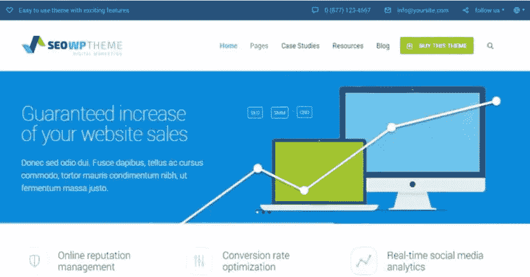
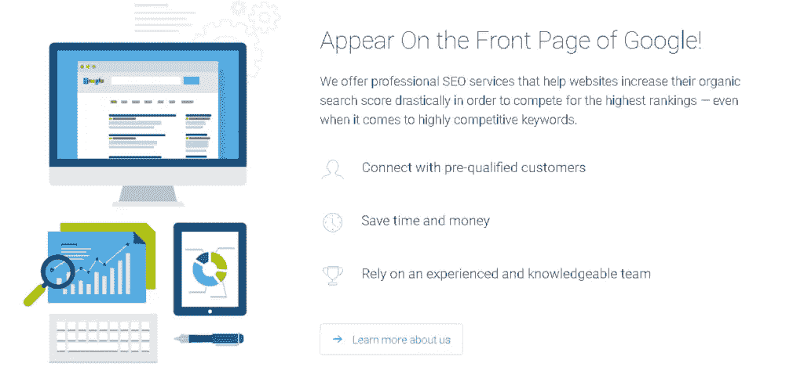
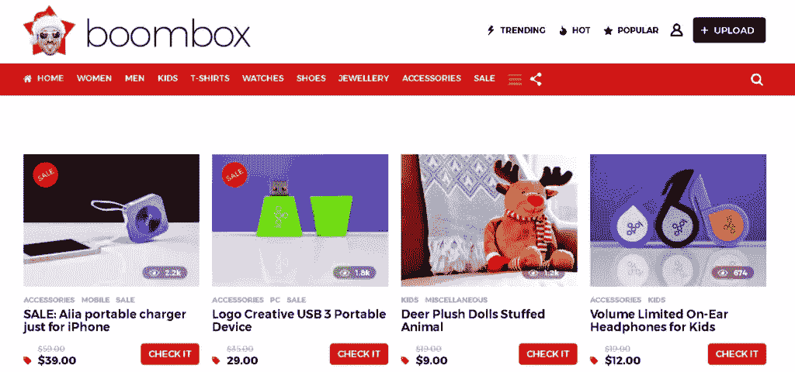
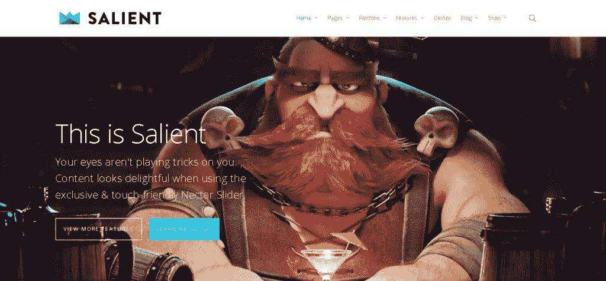
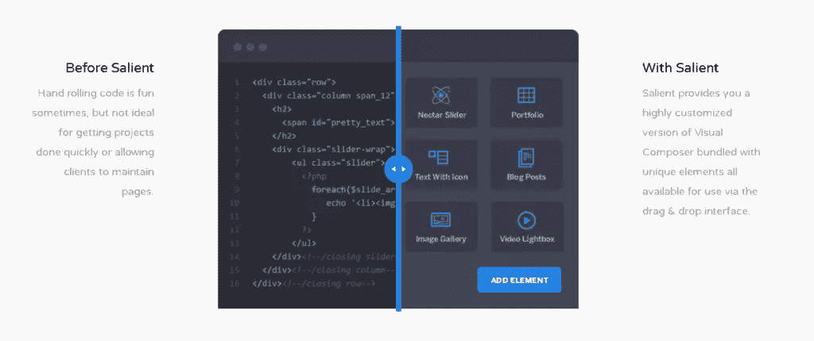
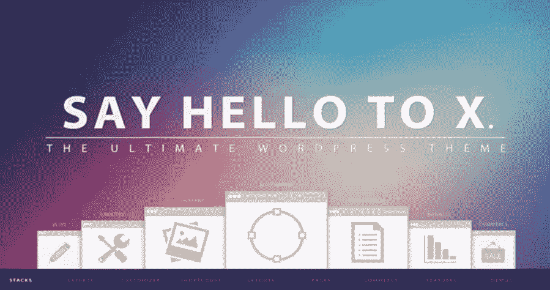
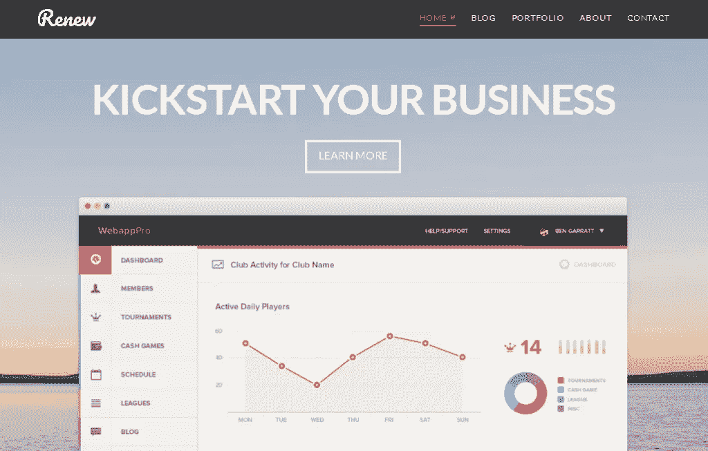
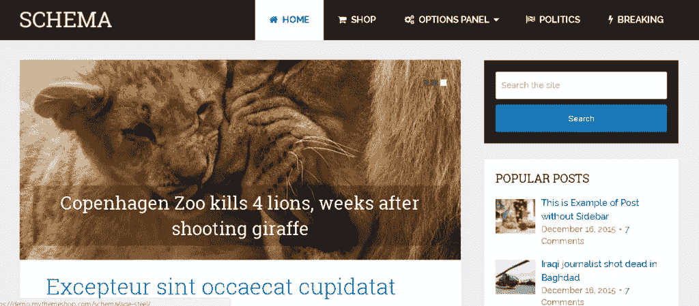
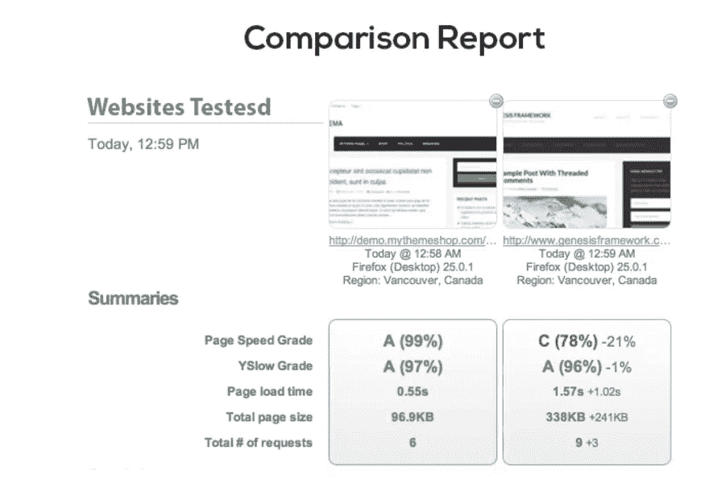

# SEO 可见性的 5 个最佳主题

> 原文：<https://www.sitepoint.com/the-5-best-wordpress-themes-for-seo-visibility/>

*本文是与 [SiteGround](https://www.siteground.com/go/article-sp) 合作创作的系列文章的一部分。感谢您对使 SitePoint 成为可能的合作伙伴的支持。*

主题选择对优化网站的搜索引擎优化比你想象的更重要。SEO 很容易受到糟糕的主题的负面影响。具体来说，以下几点可能会损害您的 SEO 或用户体验，导致您的搜索引擎排名受损:

*   无法删除垃圾链接。太多时候，免费或低价的 WordPress 主题在一些活动中被放弃，以产生线索，并附带代码和链接，这会损害你的有机搜索可见性。
*   糟糕的可用性会导致更高的跳出率
*   非移动友好设计将遭受谷歌的搜索引擎优化审查
*   糟糕的设计将导致较低的平均每页时间，这告诉谷歌你的内容是不相关的，从而导致较低的排名
*   臃肿的网页加载速度慢也违背了谷歌搜索引擎优化的最佳实践
*   定期更新和持续支持。当 WordPress 推出新版本时，很少有免费或低价的主题出于安全目的被修补或升级。这使得你的网站容易受到各种各样的攻击，从黑客攻击到糟糕的 SEO 性能。

这些都有助于整体用户体验，因此会影响你的搜索引擎优化。有了这些知识作为基础，我们开始寻找 SEO 可见性的前五个 WordPress 主题。这个列表将列出我们的前五名，并让你深入了解他们将如何加强你的网站的搜索引擎优化性能。

## 1.搜索引擎优化 WP

根据著名 SEO 专家 Brian Dean 的说法，SEO WP 是他对 SEO 优化 WordPress 主题的首选推荐。是什么让它如此特别？

*   从你下载的那一分钟开始，你就可以得到极快的主题加载时间，只有三秒钟，这大大提高了网站的搜索引擎优化和整体用户体验。
*   你的网站反应灵敏，在任何网页上看起来都很棒。他们用谷歌手机友好的检查来验证每个网站。
*   坚持每月更新，以获得最好的 SEO 代码，并确保它没有任何已知的错误。
*   轻量级的设计和代码使你的网站的平均规模减少了三分之一。

除了坚实的 SEO 基础外，该主题还附带了一个免费的 live composer 页面生成器，允许您根据自己的需要定制主题。

阅读更多关于 [SEO WP 主题](http://www.seowptheme.com/)的信息，或者阅读用户评论并在[主题森林](https://themeforest.net/item/seo-wp-online-marketing-seo-social-media-agency/8012838)上试用。

## 2.内置扬声器

BoomBox 是开箱即用的可靠主题选择。它是专门为 SEO 设计的，因为它的目的是迎合创建病毒式内容和构建每天产生大量流量的流行网站。

与 Reddit 非常相似，BoomBox 内置了一个简洁的前端提交功能，因此访问者可以提交内容进行投票，而无需访问网站的后端管理部分。你还可以选择根据你想要的表情符号回复对帖子进行投票。当然，这个特性是可选的。

阅读更多关于 BoomBox 的内容，获取用户反馈，并在 [ThemeForest](https://themeforest.net/item/boombox-viral-buzz-wordpress-theme/16596434) 上下载主题。

## 3.显著的

突出是一个多用途的 SEO 优化 WordPress 主题，以高质量产品而闻名。它配有一个专门定制的 Visual Composer 拖放构建器版本，即使是最新手的网站设计者也可以很快成为专业人员。

突出拥有 150+专业设计的模板，所以你可以得到你的网站建设效率和你的标准。它还拥有超过 3500 个图标，超过 700 种字体，以及无限的颜色可能性，包括渐变颜色。

如果你想要开箱即用的真正可定制和完整的 SEO 优化，那么就去 [ThemeForest](https://themeforest.net/item/salient-responsive-multipurpose-theme/4363266?ref=coolansh63) 下载 Salient。

## 4.x 主题

作为 2017 年最受欢迎的主题之一，X 主题通过引入堆栈的概念，将 WordPress 主题市场带到了一个新的高度。目前 X 有四种不同的堆栈可供选择:

1.  **Integrity**–非常适合专业人士、创意人员和商业网站。
2.  **更新**–设计简洁，以易于理解的格式展示您的内容。用户友好的内容让访问者在页面上停留更长时间，这是任何 SEO 分析中的一个关键指标。
3.  **图标**——专为更现代的博客网站打造。它给出了一个最小化的设计，让博客的文字成为焦点。这个网站将运行更轻，设计元素更少，这给你的网站在搜索引擎优化速度类别的提升。
4.  **精神气质**—以杂志网站为中心。Ethos 强调吸引人的内容可以提高点击率，从而提高跳出率。

像它的许多重量级同行一样，X 带有一个前端页面生成器。每次购买，您都可以获得免费的 Cornerstone 许可证。

要尝试 X 主题或观看一些现场演示，请查看主题森林。

## 5\. (计划或理论的)纲要

就 SEO 优化的 WordPress 主题而言，Schema 是市场上需求最高的主题之一。它结合了 SEO 支持和无与伦比的加载时间。它被宣传为市场上加载速度最快的超友好 SEO WordPress 主题——这一说法得到了 MyThemeShop 上所有五星评论的呼应。充分了解加载时间对搜索引擎排名的影响，对于那些希望最大限度地提高网站性能而又不超出预算的人来说，Schema 是一个明智的选择。

正如你所看到的，他们不只是谈论 SEO 优化结果，他们测试它们。Schema 使自己与众不同的方法之一是利用庞大的短代码库，这些短代码与丰富的代码片段一起工作，帮助您在搜索引擎上获得更高的排名。他们还根据谷歌的搜索引擎优化最佳实践进行编码，并编写高质量的代码，使网站对谷歌的算法更加友好。

要阅读更多关于 Schema 的内容或亲自尝试，请查看 [MyThemeShop](https://mythemeshop.com/themes/schema/) 。

## 摘要

现在你知道了哪些主题是最重要的，你可以进一步测试和调整你的站点设置和内容，以获得更高的排名。遵循这个简短的搜索引擎优化清单，获得最佳搜索引擎优化实践:

1.  对照[谷歌网站管理员指南](https://support.google.com/webmasters/answer/35769?hl=en)进行质量检查
2.  确保你的网站对手机友好
3.  确保你的网站[快速加载](https://developers.google.com/speed/pagespeed/insights/)

最后，不管主题是什么，你仍然可以用你的内容和配置来搞乱你的 SEO。记住，用为人类(而不是搜索引擎)编写的高质量内容和一个可靠的 SEO 插件来补充你的主题的内置 SEO，比如一个 SEO 包中的 [Yoast](https://wordpress.org/plugins/wordpress-seo/) 或[。](https://wordpress.org/plugins/all-in-one-seo-pack/)

如果你已经想好了主题，正在寻找一个托管你的 WordPress 站点的地方，看看我们的合作伙伴， [SiteGround](https://www.siteground.com/go/article-sp) 。他们提供托管 WordPress 主机，一键安装，暂存环境，WP-CLI 界面，预装 Git，自动更新，等等！

如果你已经想好了主题，正在寻找一个托管你的 WordPress 站点的地方，看看我们的合作伙伴， [SiteGround](https://www.siteground.com/go/article-sp) 。他们提供托管 WordPress 主机，一键安装，暂存环境，WP-CLI 界面，预装 Git，自动更新等等。他们甚至有一个定制的插件， [SG Optimizer](https://wordpress.org/plugins/sg-cachepress/) ，可以极大地优化和加速客户端网站！

你还发现了哪些可以提升你的搜索引擎优化的主题？请在评论中告诉我们。

## 分享这篇文章