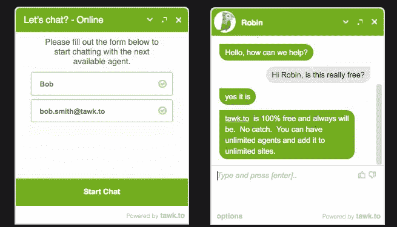
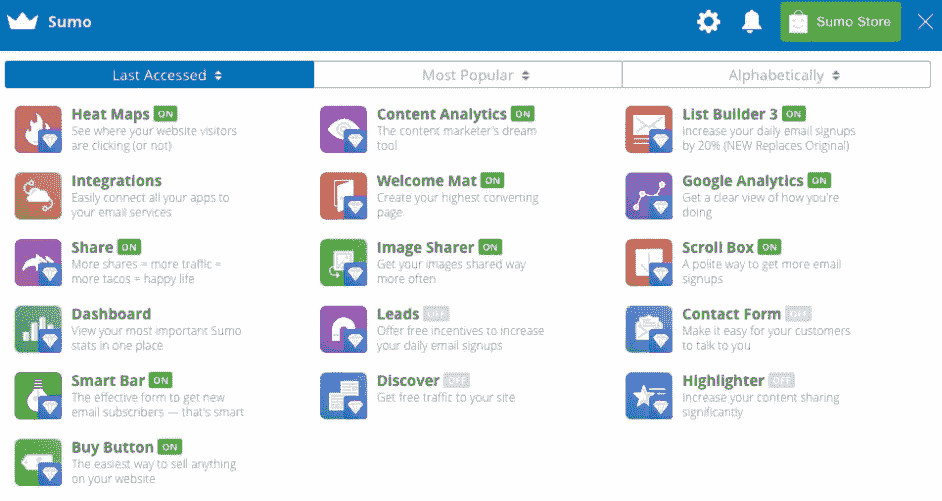
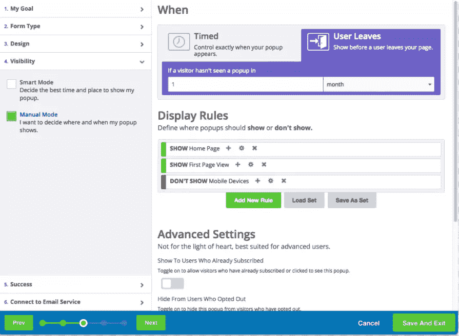
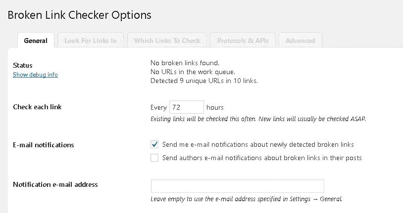

# 6 个独立创业者必备的 WordPress 插件

> 原文：<https://www.sitepoint.com/essential-wordpress-plugins-for-solopreneurs/>

*本文是与 [SiteGround](https://www.siteground.com/go/article-sp) 合作创作的系列文章的一部分。感谢您对使 SitePoint 成为可能的合作伙伴的支持。*

就像单亲父母做所有的烹饪、清洁和养育工作一样，一个个体企业家必须对他们的事业了如指掌。他们必须以技术为导向，能够扔在一起一个好看的功能性网站。他们必须是唯一的销售人员和一个人的营销团队。他们通常是会计、运输职员、客户服务助理，以及你能想到的几乎任何其他角色。那是一大堆帽子和你肩上的巨大压力。但是如果很简单，每个人都会去做，对吗？

这篇文章是关于从你的盘子里拿走一些东西。减轻压力，帮助你这个创业者改变一下。如果你能节省一些时间，并提高你的整体表现，那么你可以专注于更重要的事情，甚至花一天的时间。事不宜迟，以下是你的 WordPress 网站的 6 个基本插件:

## 1.托托

作为一名创业者，提供实时聊天并不容易。然而有了 [Tawk.to 插件](https://wordpress.org/plugins/tawkto-live-chat/)你就可以完成它。Tawk.to 是一个免费的信息应用程序，可以让你和你的网站访问者聊天。

您在网站上指定的每个页面都会在右下角有一个方便的聊天窗口，您可以根据自己的需要进行完全定制。一旦你的访问者点击了聊天窗口，他们就会被提示输入他们的名字和电子邮件来开始聊天。

Tawk.to 可以直接从你的 WordPress 网站的后端，从 Tawk.to 网站的仪表板，甚至从你手机上的应用程序被监控。您可以将其设置为像发送短信一样发送通知，这样您就可以在旅途中与网站访问者聊天。如果您处于离线状态，您可以设置您的状态来反映这一点，这将为您的访问者提供一个不错的离线消息，同时还可以让他们选择在您返回时给你留言。

最后但并非最不重要的一点是，你可以获得一个实时的仪表盘，显示你的访客的实时统计数据和有用的客户服务指标，如参与度、可用性和积极情绪。对于一个创业者来说，Tawk.to 是一个无需额外成本就能提供下一级客户服务的好方法。

## 2.相扑

相扑就像营销的瑞士军刀。这是很少或没有技术技能的一个人营销操作的理想选择。

为你的 WordPress 网站下载 Sumo ,你可以使用大量的工具，让你的网站更专业，帮助你获得更多的转化率。

有了热图，你可以直观地看到你的访问者点击了哪里，以及他们是如何浏览你的网站的。这让你更深刻地了解某些文字、按钮或视觉效果如何有效地转化为销售和注册。

您可以创建仅在访问者即将离开页面时显示的弹出窗口。这些网站会提示他们输入优惠券代码来保存销售或优质内容，以吸引他们继续阅读。

这只是相扑给你的几十种营销工具中的一种。相扑工具对于那些需要一个完整的营销部门而又没有价格的人来说是必不可少的。

## 3.WordPress 的 MailChimp

对于个体创业者来说，自动化就是一切。任何你可以摆脱的任务都可以让你把更多的时间放在获取和支持你的客户上。MailChimp 通过交互式电子邮件链为您提供业务所需的额外自动化。当客户注册您的简讯或请求报价时，您可以将 MailChimp 设置为自动向他们发送欢迎邮件或提示他们请求该报价的更多信息。这一过程给人一种亲身接触的错觉，可以让你的潜在客户在销售过程中无动于衷。

用于 WordPress 插件的[MailChimp](https://wordpress.org/plugins/mailchimp-for-wp/)将你的 WordPress 网站与你的 [MailChimp 账户](https://mailchimp.com/)连接起来，让你可以灵活地添加移动响应注册和选择加入方法到你的网站上，操作任何代码。

在创建用户友好的表单时，您可以自定义从按钮宽度和高度到背景颜色甚至文本大小的所有内容。几乎你能想到的任何东西都可以根据你的喜好进行定制，而不会影响任何功能。

## 4.海狸建造者

创业者有很多头衔，通常其中一个头衔不是程序员或网站设计师。幸运的是，对于我们这些没有丰富开发知识的人来说， [Beaver Builder](https://wordpress.org/plugins/beaver-builder-lite-version/) 可以成为我们的冠军。

Beaver Builder 是一个一次性的 WordPress 站点构建器插件，它是专门为技术上有挑战的人设计的。该插件被宣传为可以与任何主题一起工作，并且给你建立一个漂亮的、移动友好的网站的灵活性，而不需要接触任何代码。你所要做的就是创建一个新的页面或编辑一个现有的页面，你会看到一个新的选项来使用 Beaver Builder 的页面生成器。

页面生成器赋予你拖拽创建和重新排列站点任何部分的能力。最棒的是，所有这些都是在你网站的前端完成的，这意味着你的访问者将会看到你所创建的东西。你可以拖动不同的文本框、图像、视频等模块。

## 5.断开链接检查器

可以说，这不是六个插件中最酷或最性感的，但也同样重要。作为一名独立创业者，你可能没有时间或资源对你的业务和网站的细节进行不懈的关注。除非你正在外包网站维护，否则你可能会有一些语法问题(为此我们推荐[语法](https://app.grammarly.com/))和一些与之相关的断开链接。这就是[断链检查器](https://wordpress.org/plugins/broken-link-checker/)成为你的救星的地方。

这个插件成为你的眼睛和耳朵，帮助你找出网站上任何不起作用、重定向或丢失图片的链接。它有能力主动监控你的网页，博客文章，以及任何你想要的自定义域，以发现任何这样的链接。

在设置菜单中，你可以看到一个快速的网站状态更新，它会告诉你是否发现了任何断开的链接。如果有任何发现，它会告诉你有多少在你的工作队列中等待你去修复。你也可以选择设置插件多久检查一次断开的链接，以及如何通知你。虽然这可能不会改变你的工作流程，但肯定会让你看起来更专业。当你看到内容已经过时，并且链接被破坏或重定向时，没有什么比这更糟糕的了。

## 6.IFTTT

IFTTT 代表“If This Then That ”,它允许你创建强大的触发器和动作，自动完成你的 WordPress 站点的某些工作流程。WordPress 插件的 IFTTT 桥允许你直接在你的 WordPress 站点上显示来自 IFTTT 自动化的任何处理过的数据。或者，你可以[把你的 WordPress 站点和你的 IFTTT 账户](https://ifttt.com/wordpress)连接起来，用数百个小程序实现自动化。

作为一名独立创业者，IFTTT 会把你盘子里的常规和平凡的任务拿出来，分配给它们触发程序，促使一个工作流程产生你想要的最终结果。这里有一些小程序，你可以用它们来节省时间，让你的网站更强大:

*   通过在 Twitter、LinkedIn 和脸书上分享任何新帖子，实现营销自动化。
*   为了增加安全性[，将你的新 WordPress 帖子备份到 Google Drive](https://ifttt.com/applets/55029p-backup-new-wordpress-posts-to-google-drive) 。
*   通过[为每个新帖子](https://ifttt.com/applets/11249p-add-an-entry-to-my-calendar-for-each-published-post)添加一个日历事件来跟上你的编辑日历。
*   通过[向你的 Evernote](https://ifttt.com/applets/GH8jk9AK-archive-new-posts-to-an-evernote-notebook) 发送一份所有帖子的副本来保持有序。

正在为你的 WordPress 站点寻找主机吗？我们的合作伙伴 [SiteGround](https://www.siteground.com/go/article-sp) 有一个由 WordPress 专家组成的积极主动、知识渊博的支持团队，他们很乐意在这方面帮助你。SiteGround 有专门针对 WordPress 的功能，比如 WP-CLI，一键安装，staging，预装 Git，缓存等等。SiteGround 的计划现在为 SitePoint 用户提供高达 65%的折扣。

我们缺少哪些插件？请在下面的评论中分享它们。

## 分享这篇文章