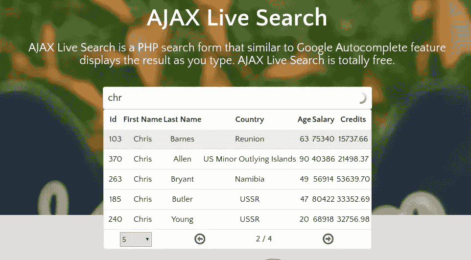
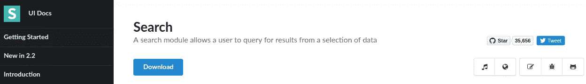
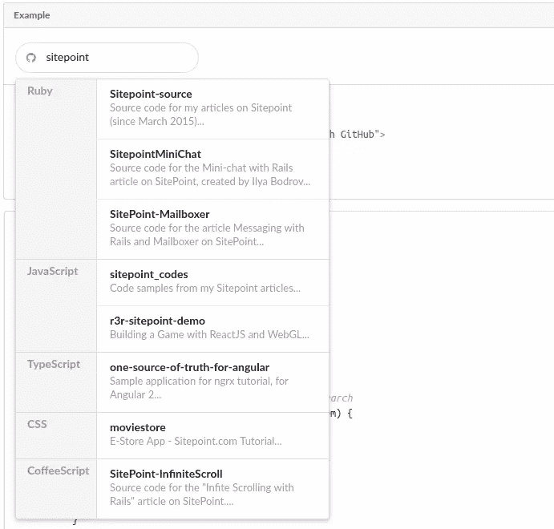
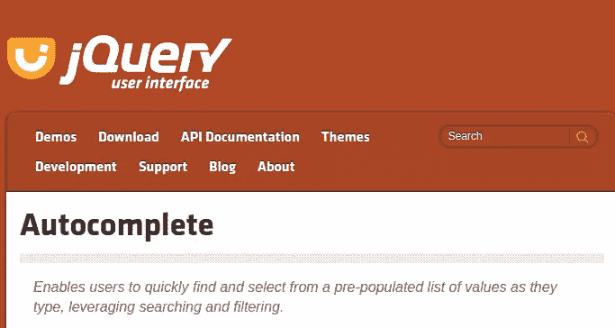
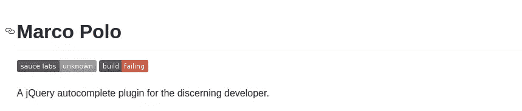
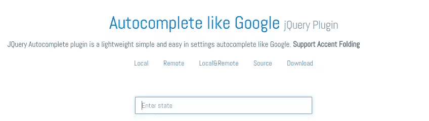
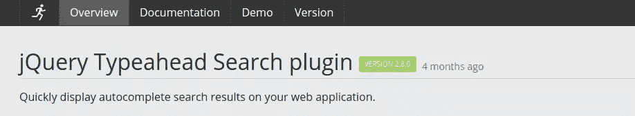
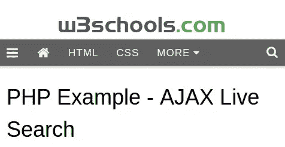

# 14 个 jQuery Live 搜索插件

> 原文：<https://www.sitepoint.com/14-jquery-live-search-plugins/>

一个 **live search** 是一个增强的搜索表单，它使用 AJAX 技术在同一个视图中提供结果或建议。这与 Chrome、Firefox 或 Safari 等现代浏览器提供的自动完成功能不同。一个**实时搜索**通常是一个输入字段，它被编程为从特定的数据集中加载建议。

> **2017 年 7 月 6 日**:这篇文章被重写，以更新插件列表，并包括一些额外的非 jQuery 库。

在你的应用程序中使用 **live search** 大大提高了你的网站的用户友好性。无论你使用何种后端技术——PHP、Java、Python、Ruby——JavaScript 都是实现客户端 **live search** 功能的最佳选择。

在我继续之前，我想指出, **live search** 这个术语有点含糊不清。这个术语没有权威的定义。其他经常用来表示相同意思的术语有**自动完成**和**提前键入**。

我遇到过许多标有 **live search** 的解决方案，它们缺乏某些关键的特性。对于这篇文章，我将只列出符合我上面定义的 **live search** 解决方案。

## 1.Ajax 实时搜索



这个列表中的第一个是一个相当惊人的开源的， **live search** jQuery 插件。它在 Chrome、Firefox、Safari、Opera 和 IE8 上都有很好的文档记录，并且运行良好。最令人印象深刻的特性是它可以以**分页表的形式返回结果！**多酷啊？

您可以通过以下链接了解更多信息:

*   [网站](https://ajaxlivesearch.com/)
*   [来源](https://github.com/iranianpep/ajax-live-search)
*   [下载](https://github.com/iranianpep/ajax-live-search/archive/master.zip)

## 2.语义 UI 搜索组件



如果你对 CSS 框架感兴趣，你应该看看语义 UI。他们有一个很酷的[搜索组件](https://semantic-ui.com/modules/search.html)，可以让你非常容易地在你的表单上实现**实时搜索**。看一下这个示例代码:

HTML:

```
<div class="ui search">
  <input class="prompt" type="text" placeholder="Search GitHub...">
  <div class="results"></div>
</div> 
```

JavaScript:

```
$('.ui.search')
  .search({
    apiSettings: {
      url: '//api.github.com/search/repositories?q={query}'
    },
    fields: {
      results : 'items',
      title   : 'name',
      url     : 'html_url'
    },
    minCharacters : 3
  })
; 
```

它惊人的小巧却功能强大。如果您使用 API 设置选项，您可以进行自定义，例如将结果分组到类别中！。



语义 UI 也有专门为 React、Meteor、Ember 和 Angular 构建的不同风格。查看他们的[集成页面](https://semantic-ui.com/introduction/integrations.html)以获得完整列表。

要了解更多信息，请访问以下链接。

*   [下载](https://semantic-ui.com/introduction/getting-started.html)
*   [文档](https://semantic-ui.com/modules/search.html)
*   [演示](https://semantic-ui.com/modules/search.html#using-api-settings)

## 3.jQueryUI 自动完成



这是一个 jQuery 小部件，是 jQuery UI 库的一部分。这个库本身是一组基于 jQuery 构建的用户界面组件、效果和主题。

Autocomplete 附带了几个模板来提供不同的实现。这里有一个这样的例子:

HTML:

```
<div class="ui-widget">
  <label for="birds">Birds: </label>
  <input id="birds">
</div>

<div class="ui-widget" style="margin-top:2em; font-family:Arial">
  Result:
  <div id="log" style="height: 200px; width: 300px; overflow: auto;" class="ui-widget-content"></div>
</div> 
```

JavaScript:

```
$( function() {
  function log( message ) {
    $( "<div>" ).text( message ).prependTo( "#log" );
    $( "#log" ).scrollTop( 0 );
  }

  $( "#birds" ).autocomplete({
    source: "search.php",
    minLength: 2,
    select: function( event, ui ) {
      log( "Selected: " + ui.item.value + " aka " + ui.item.id );
    }
  });
} ); 
```

要了解更多信息，请访问以下链接:

*   [来源](https://github.com/jquery/jquery-ui)
*   [演示](http://jqueryui.com/demos/autocomplete/)

## 4.DevBridge jQuery 自动完成


DevBridge jQuery AutoComplete 是一个很小的 JavaScript 库，允许您将常规文本输入字段转换为自动完成建议框。它的 API 非常庞大，并且有很好的文档记录，允许您执行许多不同的配置。实现它非常简单，请看这个例子:

HTML:

```
<input type="text" name="country" id="autocomplete"/> 
```

JavaScript(AJAX 查找):

```
// AJAX Lookup
$('#autocomplete').autocomplete({
    serviceUrl: '/autocomplete/countries',
    onSelect: function (suggestion) {
        alert('You selected: ' + suggestion.value + ', ' + suggestion.data);
    }
}); 
```

JavaScript(本地查找):

```
var countries = [
   { value: 'Andorra', data: 'AD' },
   // ...
   { value: 'Zimbabwe', data: 'ZZ' }
];

$('#autocomplete').autocomplete({
    lookup: countries,
    onSelect: function (suggestion) {
        alert('You selected: ' + suggestion.value + ', ' + suggestion.data);
    }
}); 
```

要了解更多信息，请访问以下链接:

*   [网站](https://www.devbridge.com/sourcery/components/jquery-autocomplete/)

## 5.轻松自动完成


EasyAutocomplete 是一个高度可定制的 jQuery autocomplete 插件，具有所有常用的特性。它支持 JSON、XML 和纯文本格式的本地和远程数据集。它还支持回调处理程序和一些默认样式。

让这个插件与众不同的是它们的[模板特性](http://easyautocomplete.com/guide#sec-templates)。模板用于定义结果视图。您可以创建自定义模板或使用可用的内置预设，包括:

*   描述模板
*   图标右/左模板
*   链接模板

用这个插件实现一个基本的自动完成非常容易，请看下面的代码示例:

HTML:

```
<input id="countries"/> 
```

JavaScript:

```
var options = {

  url: "resources/countries.json",

  getValue: "name",

  list: {
    match: {
      enabled: true
    }
  },

  theme: "square"
};

$("#countries").easyAutocomplete(options); 
```

JSON:

```
[
  {"name": "Afghanistan", "code": "AF"},
  {"name": "Aland Islands", "code": "AX"},
  {"name": "Albania", "code": "AL"},
  {"name": "Algeria", "code": "DZ"},
  {"name": "American Samoa", "code": "AS"}
 ] 
```

要了解更多信息，请访问以下链接:

*   [网站](http://easyautocomplete.com/)
*   [下载](http://easyautocomplete.com/download)
*   [来源](https://github.com/pawelczak/EasyAutocomplete)

## 6.pix abay jQuery-自动完成


Pixabay.com，一个免费的股票网站，有一个很棒的开源自动完成 jQuery 插件，你可以用在你的项目中。最初他们使用的是 DevBridge 的 jQuery Autocomplete(no . 4。在列表中)。后来他们创建了一个 fork，并开始更新它以满足他们自己的需求。最终，他们对原始源代码进行了大量的修改，最终开发出了自己的超轻量级优化插件。

该插件仅压缩了 1.4 kB，支持多数据源、回调和智能缓存系统。下面是该插件的一个实现示例:

JavaScript:

```
$('input[name="q"]').autoComplete({
  source: function(term, response){
    $.getJSON('/some/ajax/url/', { q: term }, function(data){ response(data); });
  }
}); 
```

要了解更多信息，请访问以下链接:

*   [来源](https://github.com/Pixabay/jQuery-autoComplete)
*   [下载](https://github.com/Pixabay/jQuery-autoComplete/archive/master.zip)

## 7.马可·波罗



这是一个 jQuery 自动完成插件，它是由于当时缺乏可靠的自动完成插件而开发出来的。它具有[质量文档](https://github.com/jstayton/jquery-marcopolo#readme)、缓存、内存选择、定制样式、回调处理和 WAI-ARIA 支持。它需要 jQuery v1.4.3 或更高版本，并支持所有现代浏览器(甚至 IE6！).

实现马可波罗很简单。下面是一个示例实现:

HTML:

```
...
<head>
  <script src="jquery.min.js"></script>
  <script src="jquery.marcopolo.min.js"></script>
</head>
...
<body>
  <input type="text" name="userSearch" id="userSearch">
</body> 
```

JavaScript:

```
$('#userSearch').marcoPolo({
  url: '/users/search',
  formatItem: function (data, $item) {
    return data.first_name + ' ' + data.last_name;
  },
  onSelect: function (data, $item) {
    window.location = data.profile_url;
  }
}); 
```

JSON(源数据):

```
[
  {
    "first_name": "James",
    "last_name": "Butler",
    "profile_url": "/users/78749",
  },
  {
    "first_name": "Win",
    "last_name": "Butler",
    "profile_url": "/users/41480",
  },
] 
```

要了解更多信息，请访问以下链接:

*   [来源](https://github.com/jstayton/jquery-marcopolo)
*   [演示](http://jstayton.github.io/jquery-marcopolo/example1.html)

## 8.xDSoft 自动完成像谷歌



这是一个轻量级自动完成 jQuery 插件，支持本地和远程数据源。它的特点是强调折叠。

下面是一个代码实现示例:

Java Script 语言

```
$('#remote_input2').autocomplete({source:[
 {
  url:"/component/jquery_plugins/?task=demodata&q=%QUERY%",
  type:'remote'
 },
 ["One","Two","Three"]
]}); 
```

要了解更多信息，请访问以下链接:

*   [网站](http://xdsoft.net/jqplugins/autocomplete/)
*   [下载](https://github.com/xdan/autocomplete/archive/master.zip)
*   [来源](https://github.com/xdan/autocomplete/)

## 9.jQuery Typeahead 搜索



jQuery Typeahead 搜索是一个带有深度定制选项的自动完成插件。它可以在 IE8+的所有现代浏览器中工作，并支持多个内部和外部 AJAX 回调。

如果你查看一下**演示**页面，你会发现许多不同代码实现的例子。

*   [网站](http://www.runningcoder.org/jquerytypeahead/overview/)
*   [演示](http://www.runningcoder.org/jquerytypeahead/demo/)
*   [下载](https://www.npmjs.com/package/jquery-typeahead)

## 10.Algolia 自动完成


这个 JavaScript 库能够向搜索框添加一个快速且功能全面的自动完成菜单。它可以与 [Algolia 的搜索引擎](https://www.algolia.com/)结合使用。

它支持从 IE9 开始的所有现代浏览器，并作为 jQuery 插件、Angular 指令和独立库提供。除了通常的功能，它还具有安全功能，如防止 XSS 攻击。

*   [来源](https://github.com/algolia/autocomplete.js)
*   [下载](https://www.npmjs.com/package/autocomplete.js)

## 11.ng-引导类型提前


如果你在项目中同时使用 Angular 和 Bootstrap，你应该使用 [ng-bootstrap](https://ng-bootstrap.github.io/#/home) 框架。它有一个 **Typeahead** 组件，就像一个普通的 jQuery 自动完成插件一样工作。

它支持模板、本地和远程数据集，以及常见的 **livesearch** 功能。下面是维基百科搜索的部分代码实现:

HTML:

```
<div class="form-group" [class.has-danger]="searchFailed">
  <label for="typeahead-http">Search for a wiki page:</label>
  <input id="typeahead-http" type="text" class="form-control" [(ngModel)]="model" [ngbTypeahead]="search" placeholder="Wikipedia search" />
  <span *ngIf="searching">searching...</span>
  <div class="form-control-feedback" *ngIf="searchFailed">Sorry, suggestions could not be loaded.</div>
</div> 
```

打字稿:

```
@Injectable()
export class WikipediaService {
  constructor(private _jsonp: Jsonp) {}

  search(term: string) {
    if (term === '') {
      return Observable.of([]);
    }

    let wikiUrl = 'https://en.wikipedia.org/w/api.php';
    let params = new URLSearchParams();
    params.set('search', term);
    params.set('action', 'opensearch');
    params.set('format', 'json');
    params.set('callback', 'JSONP_CALLBACK');

    return this._jsonp
      .get(wikiUrl, {search: params})
      .map(response => <string[]> response.json()[1]);
  }
}

@Component({
  selector: 'ngbd-typeahead-http',
  templateUrl: './typeahead-http.html',
  providers: [WikipediaService],
  styles: [`.form-control { width: 300px; display: inline; }`]
})
export class NgbdTypeaheadHttp {
  model: any;
  searching = false;
  searchFailed = false;

  constructor(private _service: WikipediaService) {}

  search = (text$: Observable<string>) =>
    text$
      .debounceTime(300)
      .distinctUntilChanged()
      .do(() => this.searching = true)
      .switchMap(term =>
        this._service.search(term)
            .do(() => this.searchFailed = false)
            .catch(() => {
              this.searchFailed = true;
              return Observable.of([]);
            }))
      .do(() => this.searching = false);
} 
```

要了解更多信息，请访问以下链接:

*   [文档](https://ng-bootstrap.github.io/#/components/typeahead)
*   [下载](https://www.npmjs.com/package/@ng-bootstrap/ng-bootstrap)

## 12.反应自动暗示


从标题可以看出这不是一个 jQuery 插件，但它仍然是 JavaScript。React Autosuggest 是一个开源库，有大量的配置选项。它的移动友好，WAI-ARIA 兼容，完全可定制，它与 Redux 和 Flux 很好地集成。

设置起来需要一点努力，但是一旦你这样做了，你就会得到一个完全按照你想要的方式运行的 **live search** 插件。以下是组件的部分代码示例:

```
 return (
    <Autosuggest
      suggestions={suggestions}
      onSuggestionsFetchRequested={this.onSuggestionsFetchRequested}
      onSuggestionsClearRequested={this.onSuggestionsClearRequested}
      getSuggestionValue={getSuggestionValue}
      renderSuggestion={renderSuggestion}
      inputProps={inputProps}
    />
  ); 
```

虽然源代码文档展示了一个使用本地数组作为数据源的解决方案，但是您可以很容易地在`onSuggestionsFetchRequested()`函数中用远程获取调用来替换它。

要了解更多信息，请访问以下链接:

*   [网站](http://react-autosuggest.js.org/)
*   [来源](https://github.com/moroshko/react-autosuggest)

## 13.W3Schools Ajax Live Search



如果你想避免依赖，用纯 JavaScript 实现一个解决方案，那么你应该试试这个由 w3schools.com 提供的解决方案。

本例中使用的后端是一个 PHP 服务器。显然，您可以用自己选择的服务器技术来代替它。代码需要 XML 格式的数据。您也可以重构代码来接受 JSON 格式。

这个解决方案的伟大之处在于，它可以与所有现代浏览器和 IE5 以前的浏览器兼容！

HTML:

```
<form>
  <input type="text" size="30" onkeyup="showResult(this.value)">
  <div id="livesearch"></div>
</form> 
```

JavaScript:

```
function showResult(str) {
  if (str.length==0) {
    document.getElementById("livesearch").innerHTML="";
    document.getElementById("livesearch").style.border="0px";
    return;
  }
  if (window.XMLHttpRequest) {
    // code for IE7+, Firefox, Chrome, Opera, Safari
    xmlhttp=new XMLHttpRequest();
  } else {  // code for IE6, IE5
    xmlhttp=new ActiveXObject("Microsoft.XMLHTTP");
  }
  xmlhttp.onreadystatechange=function() {
    if (this.readyState==4 && this.status==200) {
      document.getElementById("livesearch").innerHTML=this.responseText;
      document.getElementById("livesearch").style.border="1px solid #A5ACB2";
    }
  }
  xmlhttp.open("GET","livesearch.php?q="+str,true);
  xmlhttp.send();
} 
```

要了解更多信息，请访问以下链接:

*   [源+演示](https://www.w3schools.com/php/php_ajax_livesearch.asp)

## 14.WordPress Live 搜索


如果你正在使用 WordPress，你会很高兴地知道你可以用最少的代码甚至不用代码来实现 **live search** 。你所需要的就是安装并设置一个带有 **live search** 功能的 WordPress 插件。最受欢迎的是**戴夫的 WordPress Live Search** ，目前有超过 10，000 个活跃安装。它与大多数主题兼容，有几个可配置的选项，很容易集成。它还附带了一个 YouTube 教程，演示了整个设置过程。

要了解更多信息，请访问以下链接:

*   [下载](https://wordpress.org/plugins/daves-wordpress-live-search)
*   [文档](https://youtu.be/7CGR2bJ1mLM)

## 摘要

我希望这个列表能帮助你为你的项目选择一个合适的 **live search** 解决方案。根据您的经验和项目环境，有些比其他的更容易实现和定制。

还有其他无数有能力的解决方案我没有列出来。也许你可以把它们列在下面的评论里。

## 分享这篇文章