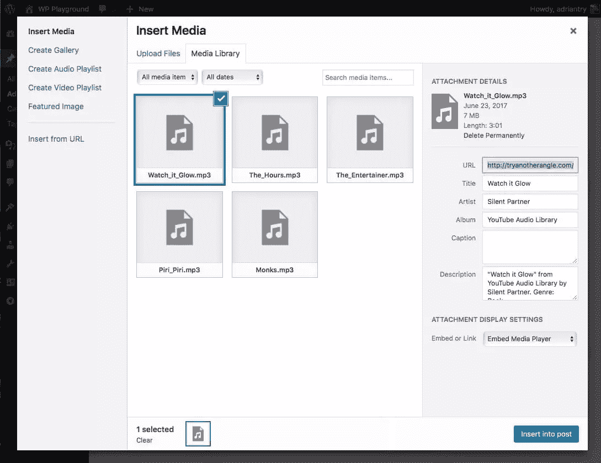
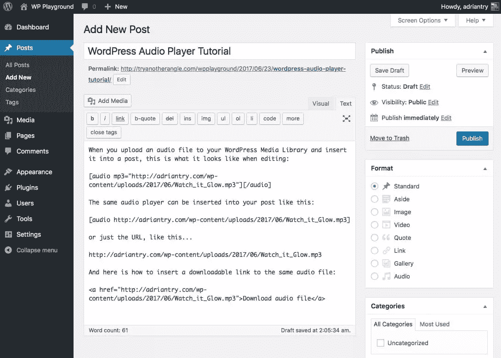
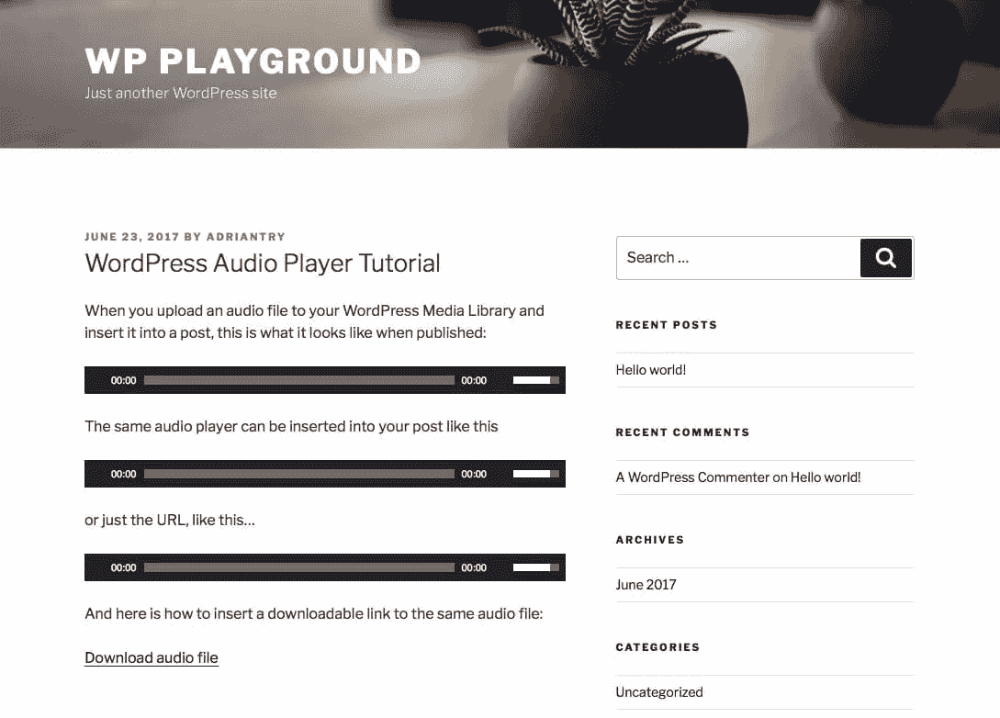
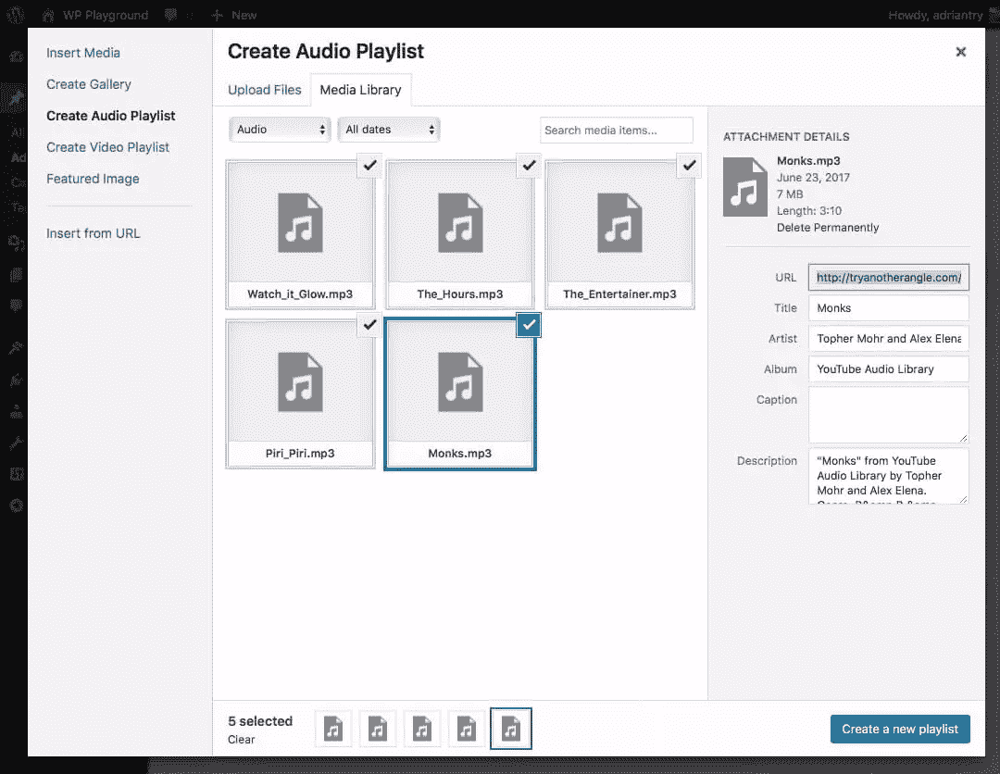
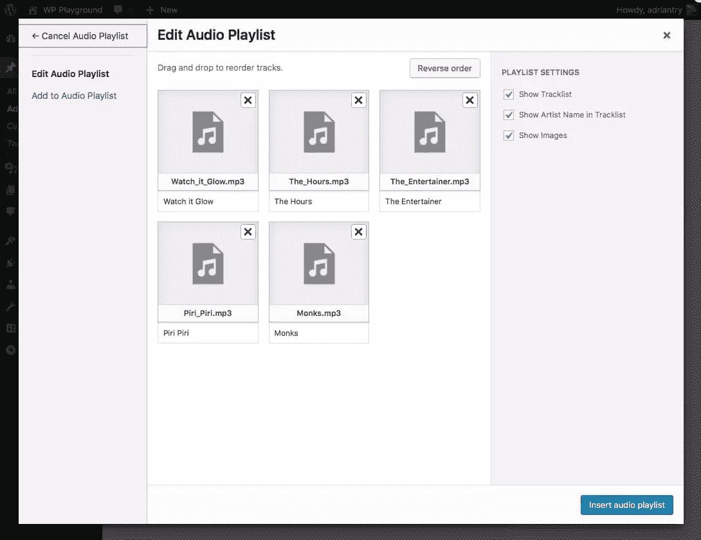
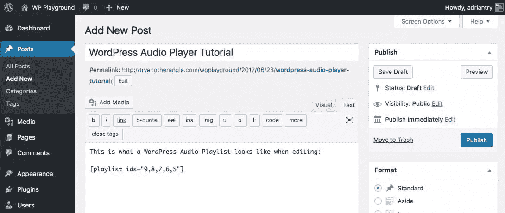
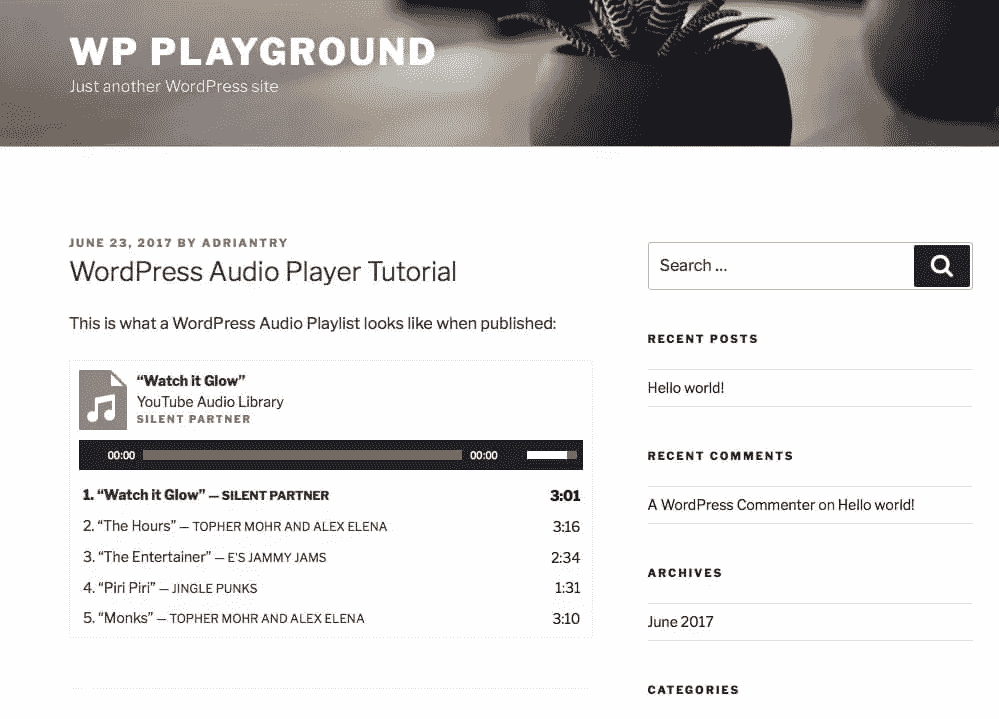
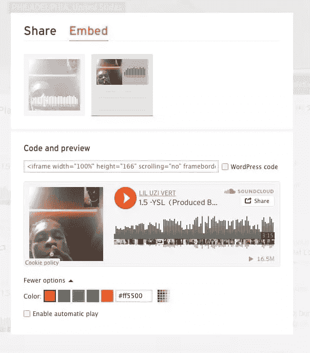
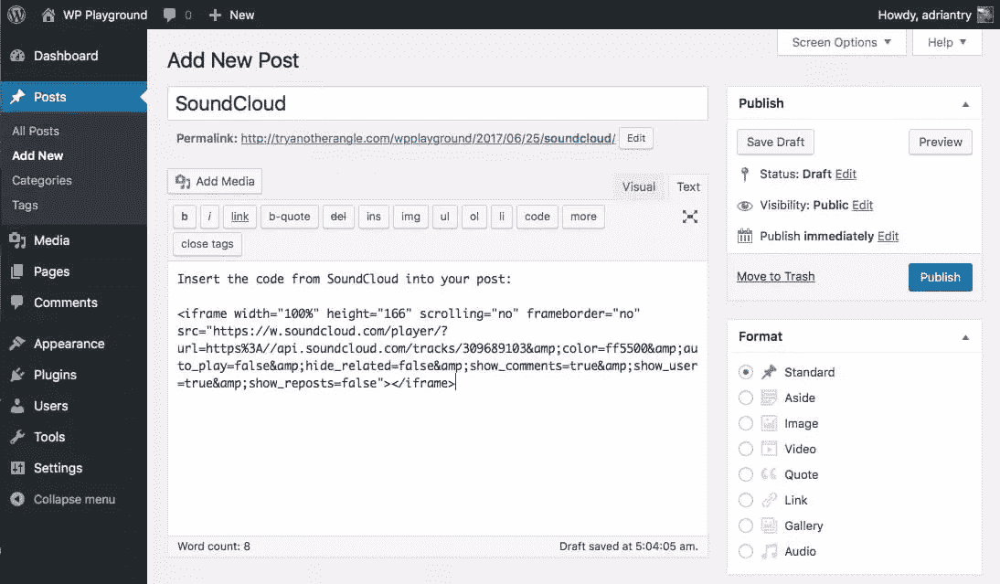
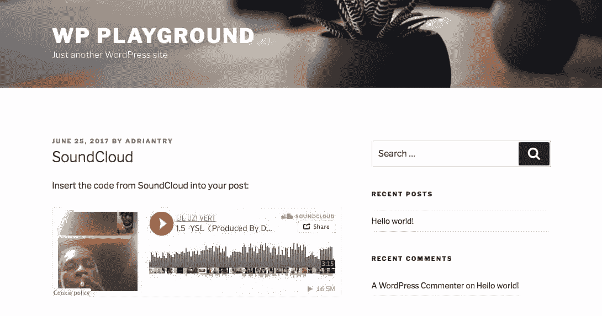

# 给你的 WordPress 站点添加音频的 4 个简单方法

> 原文：<https://www.sitepoint.com/4-simple-ways-add-audio-wordpress-site/>


本文是与 SiteGround 合作创作的系列文章的一部分。感谢您对使 SitePoint 成为可能的合作伙伴的支持。

你有想要与听众分享的音频文件吗？脸书不会让你这么做的……除非你采取令人沮丧的手段，比如在 Dropbox 上分享音频文件或者把它转换成视频。但是如果你有自己的 WordPress 网站，没有比这更简单的了。

如果提到给网站添加音频让你犹豫，让我解释一下。我不是在谈论给一个充满动画 GIF 的 GeoCities 网站添加俗气的背景音乐。

虽然仅仅为了音乐而在你的网站上添加音乐不是一个好主意，但是在你的网站上添加音频有一些好的和有效的理由。以下是一些例子:

*   一位音乐家分享她的音乐样本。
*   让他的节目可以看的播客。
*   学校、教堂和活动网站允许游客听研讨会、布道或主题演讲。
*   教师、培训师和教育工作者在他们的在线课程中加入音频示例。
*   博客作者在他们的网站上添加额外的内容，例如采访。

你可能没有意识到这一点，但是 WordPress 在默认情况下能够处理音频文件。这并不难——如果你知道如何在帖子中插入图片，插入音频就不会有任何问题。

在 HTML5 之前，没有在网页上播放音频的标准方式。闪光灯被广泛使用。不太好。WordPress 使用 HTML5 来嵌入音频，所以它兼容大多数浏览器和设备，包括移动设备。

还有其他方法可以在你的站点中包含音频。这些包括第三方的嵌入式播放器(包括音频库网站)和 WordPress 插件。这些提供了附加功能的好处，以及使用来自库站点的音频的能力。

当然，只使用你可以合法使用的音频文件。这将包括您自己创建的音频、您从他人处获得许可的音频以及免版税的音频。本文中使用的样本音频来自 YouTube 的免费音乐音频库。

## 1.使用 WordPress 音频播放器

给你的网站添加音频最简单的方法是使用 WordPress 的本地音频播放器。除非你有特殊的需求，否则没有理由去别处寻找。

可以添加. mp3、. m4a、.奥格或者。wav 文件到你的 WordPress 媒体库。从那里你可以把它插入到你的文章中，并附带一个可选的标题。

方法如下:

1.  点击`Add Media`按钮。
2.  将您的音频文件拖到媒体库上，或者单击`Upload Files`然后单击`Select Files`将您的音频内容添加到媒体库。
3.  在屏幕右侧，填写音频文件的相关元数据，包括标题、艺术家、专辑、说明和描述。
4.  确保选择了`Embed Media Player`选项，允许您的读者播放您帖子中的音频文件。
5.  点击`Insert into Post`。

这是添加一些音频文件后媒体播放器的截图。您可以在右边的面板中填写文件的相关元数据。



现在是添加图像后的文章的文本视图(见第二段)。该屏幕截图还展示了其他一些手动添加音频播放器代码的方法。



而这就是帖子预览时，或者发布后的样子。为音频文件显示一个迷你播放器。请注意，这三种方法的播放器看起来都一样。



**实例**

试着点击下面的音频文件来听它的播放。

<audio class="wp-audio-shortcode" id="audio-156256-1" preload="none" style="width: 100%;" controls=""><source type="audio/mpeg" src="https://uploads.sitepoint.com/wp-content/uploads/2017/06/1498379475Medium_Bell_Ringing_Near.mp3?_=1">[https://uploads.sitepoint.com/wp-content/uploads/2017/06/1498379475Medium_Bell_Ringing_Near.mp3](https://uploads.sitepoint.com/wp-content/uploads/2017/06/1498379475Medium_Bell_Ringing_Near.mp3)</audio>

你不必在你的 WordPress 媒体播放器中存储音频文件。将它们存储在另一台服务器上会减轻你的虚拟主机的负荷，节省你的存储空间、系统资源和带宽。在这种情况下，使用相同的音频短代码，但是使用正确的音频文件 URL。

通过在代码中添加一些选项，音频文件可以循环播放或自动播放(参见 WordPress.org 上的[音频短码](https://codex.wordpress.org/Audio_Shortcode)页面)。要更改媒体播放器的颜色，您需要使用如下自定义 CSS:

```
.music-player .wp-playlist-light,
.music-player .wp-playlist-light .wp-playlist-playing {
    background: #999;
    border-color: #999; 
```

或者，如果额外的功能或定制媒体播放器的外观对你很重要，看看下面的插件。

## 2.创建一个 WordPress 音频播放列表

您是否有多个音频文件要共享？WordPress 也内置了对播放列表的支持。以下是开始的方法:

1.  在您的媒体库中，点击`Create Audio Playlist`。
2.  选择您希望包含在播放列表中的音频文件。
3.  为播放列表添加任何相关元数据，然后单击`Create a new playlist`。
4.  选择所需选项(用于显示曲目列表、艺术家姓名和作品)，然后单击`Insert audio playlist`。

这是你从媒体库点击`Create Audio Playlist`后看到的画面。只有当库中有音频文件时，该选项才可用。



以下是您可以为播放列表选择的选项。



这是一个添加了播放列表的帖子的文本视图。



这是它出版后的样子。



**实例**

这里有一个嵌入的播放列表，你可以玩。

<noscript><ol> <li><a href="https://uploads.sitepoint.com/wp-content/uploads/2017/06/1498379478Digital_Watch_Alarm_Long.mp3">数字手表报警长</a></li><li><a href="https://uploads.sitepoint.com/wp-content/uploads/2017/06/1498379475Medium_Bell_Ringing_Near.mp3">中等铃声在</a>附近响起</li><li><a href="https://uploads.sitepoint.com/wp-content/uploads/2017/06/1498379472Crowd_Yelling_Series.mp3">人群叫喊系列</a></li><li><a href="https://uploads.sitepoint.com/wp-content/uploads/2017/06/1498379468Walking_on_Hollow_Metal.mp3">在空心金属上行走</a></li><li><a href="https://uploads.sitepoint.com/wp-content/uploads/2017/06/1498379298Walk_on_Grass_Series.mp3">漫步草地系列</a></li> </ol></noscript>

## 3.用 SoundCloud 的播放器嵌入音频

SoundCloud 是专为在线分享音乐而创建的流行服务。这基本上是 YouTube 的音频。您可以使用 SoundCloud 来托管您嵌入到网站中的音频。或者，SoundCloud 上可能已经有您想与网站访问者分享的内容。

无论是哪种情况，SoundCloud 都可以轻松地将他们的内容嵌入到您自己的网站上:

1.  SoundCloud 上任何允许嵌入的音频文件都会有一个共享按钮。按下它。
2.  点击`Embed`并选择大的正方形播放器或小的长方形播放器。选择您需要的任何选项。
3.  复制代码并粘贴到您的帖子中。

这是点击 SoundCloud 上的“分享”按钮后显示的屏幕。点击顶部的`Embed`，选择您喜欢的选项。除非你的网站位于 WordPress.com，否则不要勾选“WordPress 代码”框。



下面是粘贴到帖子中的代码的样子。



这是你的帖子发布后 SoundCloud 播放器的样子。



你也可以使用插件 SoundCloud is Gold，我们将在下面介绍它。

其他音频库网站，包括 [Audiomack](https://www.audiomack.com/) 都提供了类似的嵌入式播放器。

## 4.使用 WordPress 音频插件

如果你正在寻找扩展的功能或者比 WordPress 音频播放器支持的更强的可配置性，就去找一个插件吧。这里有一些高评级的选项，可能有你正在寻找的。

[紧凑型 WP 音频播放器](https://wordpress.org/plugins/compact-wp-audio-player/)
活跃安装数:40，000+
评分:4.3(49 条评论)

这个音频播放器比默认的要小巧得多。它显示为一个播放图标。支持`.mp3`和`.ogg`音频格式。

[MP3-jp player](https://wordpress.org/plugins/mp3-jplayer/)
活跃安装数:30，000+
评分:4.1 分(共 68 条评论)

一个灵活的多播放器音频插件，用新的功能和选项扩展了 WordPress 的本地短代码。有风格，颜色和布局选项，一个拖放界面，并播放媒体库中的媒体，上传的文件夹和网址。

[悦耳的背景音乐](https://wordpress.org/plugins/soundy-background-music/)
活跃安装数:2 万+
评分:4.7 分(22 条评论)

每当一个页面被浏览时，这个插件会自动播放一个音频文件。可以显示可选的播放/暂停按钮。

[SoundCloud 是黄金](https://wordpress.org/plugins/soundcloud-is-gold/)
活跃安装数:20，000+
评分:4.2 分(21 条评论)

这个插件是将你的 SoundCloud 内容整合到 WordPress 的一个很好的方式。如果你是 SoundCloud 的大用户，这个是给你的。

[非常简单的播客](https://wordpress.org/plugins/seriously-simple-podcasting/)
活跃安装数:10，000+
评分:4.8 分(126 条评论)

WordPress 的易于使用的播客解决方案。功能强大，但使用简单。不断增加的加载项库是可用的，包括一个免费的统计加载项。

[mb.miniAudioPlayer](https://wordpress.org/plugins/wp-miniaudioplayer/)
活跃安装数:10，000+
评分:4.6(44 条评论)

一个易于使用的皮肤音频播放器。在线皮肤编辑器可以很容易地定制你的播放器的外观。

[音频专辑](https://wordpress.org/plugins/audio-album/)
活跃安装数:3000+
评分:5 颗星中的 5 颗(6 条评论)

一个优秀的插件，可以为你的网站创建尽可能多的可配置播放列表。

在你的网站上添加音频只是你可以用 WordPress 进行的众多互动之一。如果你正在寻找功能丰富的托管 WordPress 主机，看看我们的合作伙伴 SiteGround，它也提供免费的网站迁移。

你的网站上有音频吗？你用哪种方法？

## 分享这篇文章