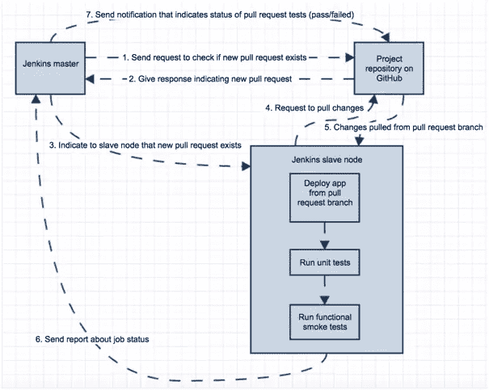
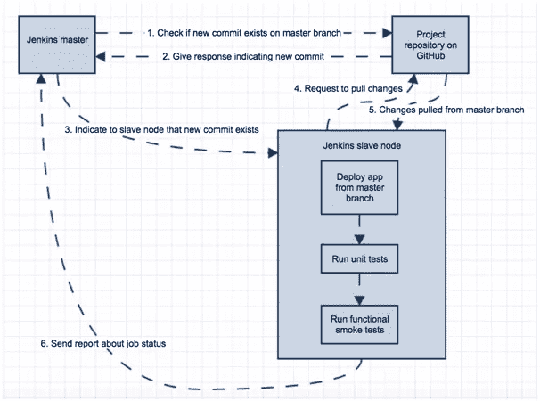
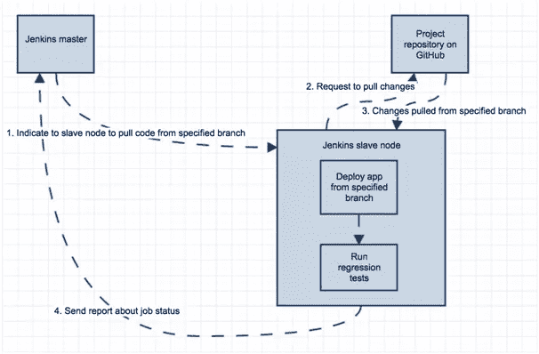
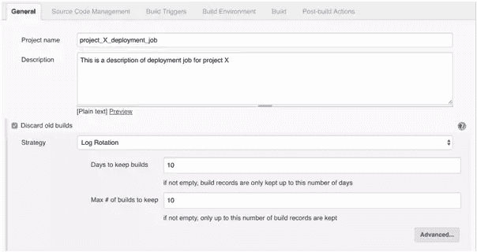
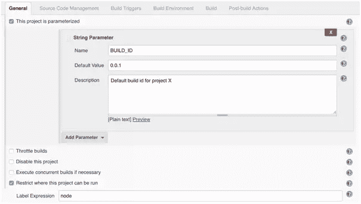
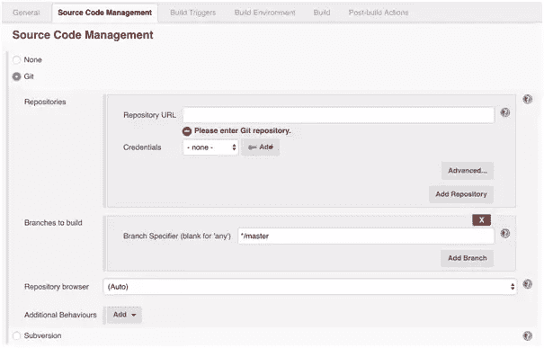
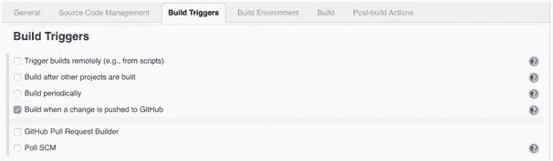
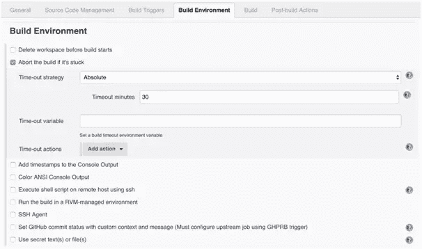
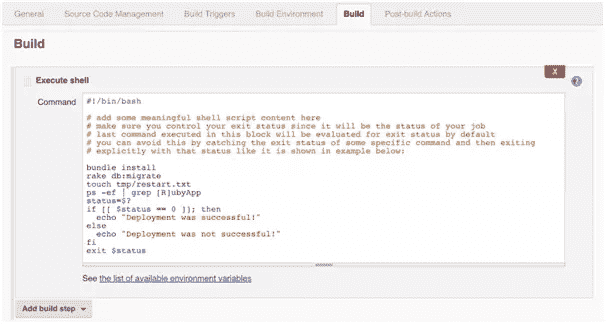
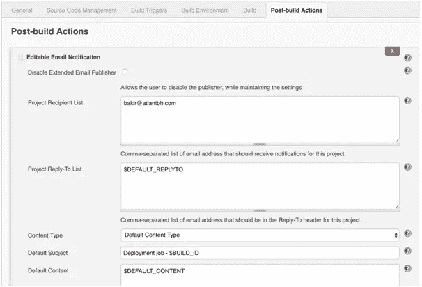

# 持续集成和 Jenkins CI 服务器的关键指南

> 原文：<https://www.sitepoint.com/key-guidelines-continuous-integration-jenkins-ci-server/>

*这篇文章最初发表在[Test project——测试自动化博客](https://blog.testproject.io/2017/05/11/jenkins-ci/)上。*

下面的文章详细介绍了持续集成(CI)，这是软件开发中的一个必不可少的实践，以及行业标准开源持续集成工具 [Jenkins](https://jenkins.io/) 。通过实现持续集成和 Jenkins CI 服务器，您将发现 Jenkins 部署如何帮助您的开发团队发布更高质量的软件并节省宝贵的时间。

* * *

**寻找更多关于 Jenkins 和持续集成的信息？看看这些伟大的链接:**

*   截屏:[哪些持续集成工具支持 Bitbucket？](https://www.sitepoint.com/premium/screencasts/which-continuous-integration-tools-support-bitbucket)
*   [在 Jenkins 中准备和构建一个 PHP 项目](https://www.sitepoint.com/preparing-building-php-project-jenkins/)
*   [与詹金斯的持续整合](https://www.sitepoint.com/continuous-integration-with-jenkins-1/)
*   [重新介绍 Jenkins:流水线自动化测试](https://www.sitepoint.com/re-introducing-jenkins-automated-testing-with-pipelines/)
*   [安装并固定詹金斯](https://www.sitepoint.com/installing-securing-jenkins/)

* * *

现代软件开发实践要求尽可能快地或经常地在产品中部署一个功能良好的软件。例如，敏捷方法通过让团队在小的增量上工作并在每次冲刺后部署到生产中来直接实施这种行为(阅读:[为您的敏捷项目测试自动化策略](http://blog.testproject.io/2017/04/10/test-automation-strategy-agile-testing/))。

开发团队花几个月的时间开发一个软件，然后把它交给 QA、UAT 和所有生产人员的日子已经不存在了。如今，重点是拥有一个功能良好的软件，绝不允许出现可能危及软件质量的情况，例如在发布周期结束时引入必要的软件变更。这就是持续集成发挥作用的地方。

## CI 是什么？

CI 是一种实践，它将测试代码频繁地集成到项目的稳定分支中..我将特别强调**“测试代码”**，因为这意味着在一个单独的分支上开发的特性也要被测试，并且同样地，被集成到稳定的分支中。

## 谁在做 CI？

一般来说，DevOps 工程师通常被指派设置 CI 管道。如今，DevOps 工程师的角色非常类似于测试工程师，因为他们都确保过程和软件质量。我通常说 QA 和生产是与客户最接近的会合点。从这个意义上来说，CI 为测试工程师提供了非常强大的工具，通过积极参与以下领域来增强整体过程和软件质量:

*   测试自动化:几年前，有一场关于手工测试和自动化测试的讨论。有了 CI，测试自动化变得不可或缺，这将最终节省大量宝贵的时间来关注其他的测试任务。同样值得一提的是，手动测试和自动化测试不能互相排斥。
*   **测试报告:**对于 CI 中的测试报告，我们可以使用现有的报告解决方案，也可以自建[报告模块](https://blog.testproject.io/2017/02/09/develope-reporting-module-test-automation-framework/)。在这两种情况下，这都清楚地表明了我们的应用程序代码在每次构建运行时的“健康状况”。开发团队的所有成员都可以访问这些信息，这一点很重要，为了[升级代码质量](https://blog.testproject.io/2017/05/03/upgrade-code-quality-automation-testing/)，我们将投入持续的努力。
*   **部署过程:**测试工程师更多地参与到应用程序的部署过程中，这产生了关于正在使用的测试自动化工具或框架的内部架构的附加信息。这一知识非常重要，尤其是为了识别“隐藏的”应用程序问题。

## CI 优势

*   CI 强调测试自动化，允许测试工程师专注于探索性测试，测试边缘案例，甚至发现新的测试方法。
*   在开发人员提交的几分钟内，就可以看到特定分支上的特定提交的质量。
*   在代码已经在分支上测试之后，集成到稳定分支是非常小心的(CI 过程应该运行这个)。正确设置后，应用程序的部署会自动执行，不需要重复的命令。
*   从团队的角度来看，所有这些好处都会成倍增加。

## 典型 CI 场景

开发团队有自己的源代码版本控制存储库，项目就在那里(现在通常是 Github)。稳定分支(主分支)通常被认为是工作分支，新特性的开发很少直接在主分支上完成。相反，开发人员创建他们自己的分支，在那里开发新的特性(特性 A 的分支 A)。当变更被推送到特定分支上的存储库，并且开发人员发出拉请求时，应该针对该分支执行一些基本的测试集(冒烟测试)。从 CI 的角度来看，这通常意味着:

当 CI 流程完成时，从测试工程师和开发人员的角度来看，需求很少:

*   **测试器:**再次重新测试分支 A 上的特性 A
*   来自另一个开发人员的同行代码评审，以确保代码质量足够好
*   **开发人员:**手动合并代码，掌握并解决任何合并冲突(如果出现的话)。

冒烟测试为将执行代码审查的开发人员以及需要重新测试拉式请求分支的测试工程师节省了大量时间。如果冒烟测试在拉请求时失败，从事功能 A 的开发人员现在负责修复冒烟测试功能并提出新的拉请求(有问题的代码在修复之前不会合并到主模块)。

如果这一过程通过，并且从配置项的角度来看，功能 A 的新代码被合并到主服务器上，则会发生以下情况:

这表明合并是成功的，冒烟测试特性仍然工作，现在测试工程师的责任是在主分支上再次重新测试特性 A(以确保合并不会对特性 A 造成任何副作用)。当然，随着时间的推移，增强您的测试自动化套件是一个很好的实践，这样可以覆盖大部分的特性。

这在项目的后期迭代中变得越来越重要，因为测试工程师有更多的任务(测试当前的特性以及所有先前的特性)。这就是[回归测试](https://blog.testproject.io/2017/01/18/automated-regression-testing-website/)变得方便的地方:从 CI 的角度来看，回归测试的执行通常要么在测试工程师显式运行回归测试时发生，要么通过使用调度程序发生(例如:每晚执行回归测试)。定制这个任务是一个好的实践，这样我们就能够指定这个任务将在哪个分支上执行(在这里你可以阅读更多关于为什么以及何时执行[回归测试自动化](https://blog.testproject.io/2016/04/26/regression-test-automation-scrum/))。该过程可能如下所示:

## Jenkins 工具简介

### Jenkins CI 服务器术语

**工作:**在 Jenkins 的术语中，最重要的“单位”是工作。作业是 Jenkins CI 服务器中的一个执行单元，必须有某种结果(通过/失败)。例如:作业可以是部署作业、冒烟测试作业、回归测试作业等。作业由按顺序执行的多个区域组成，这将在下一段中解释:Jenkins 作业剖析。

插件:Jenkins 测试自动化的一个主要特性是能够通过使用现有的插件或者创建自己的插件来定制它。Jenkins 工具中的一切，从作业配置部分到 Jenkins 配置部分，实际上都是插件。由于 Jenkins 的社区很大，各种 Jenkins 插件已经存在，可以用于要求最苛刻的 CI 工作流任务。也就是说，你很可能会遇到一个有用的插件，而不是创建一个自定义的解决方案。

**节点:**在最简单的设置中，Jenkins 实例将在一台机器上运行，所有作业都将在那里执行。对于较小的测试和少量的作业，这是有意义的。然而，在实践中，经常会有多个团队使用同一个 Jenkins 实例的情况。因为它们有大量的作业，所以在一个实例上执行被认为是不好的做法，原因有很多:安全性、灾难恢复、性能、可伸缩性等等。

**在 Jenkins 中输入主/从节点:** Jenkins 主节点仅用于将在 Jenkins 从机上执行的作业调度。通过这种方式，Jenkins 主机器没有被大量利用，团队拥有他们自己的从机器，其大小最适合他们的测试自动化项目。此外，从属节点然后被配置为处理一些被执行的并行作业(每个节点的执行器数量)。还可以从 AWS 配置按需节点。这意味着只有当作业需要在节点上执行时，节点才会存在。这是非常有用的，因为我们想要更大的机器，只有在回归测试运行时才能被充分利用。对于这个特定的场景，较大的 EC2 实例将在 AWS 上启动，作业将在这个实例上执行，完成后(基于配置的空闲时间)，这个实例将存活一段时间。之后，将确定使用按小时付费的服务(例如 AWS 服务)时哪个更有利。

## 詹金斯工作剖析

在 Jenkins CI 服务器中，每个 Jenkins 作业由多个部分组成:

*   **常规:**这是我们指定项目/作业名称/描述、根据需要添加作业参数、定义作业日志轮换策略等的地方。接下来的屏幕显示了如何配置日志循环(您可以指定保留构建日志的天数或保留上次构建日志的数量)，如何参数化作业(通过添加字符串 BUILD_ID，该字符串具有默认值 0.0.1，但该值可以在作业启动时指定)，以及如何配置该作业的执行位置(从属节点名称):

    

    

*   **Jenkins 源代码管理:**顾名思义，这是我们在 Jenkins CI server 中定义类似 GitHub 或 Subversion 的源代码库的地方:

    

*   **Jenkins Build Triggers:** 安排一个任务的执行时间(周期性地，在一些其他任务之后，当 GitHub pull 请求发生时，当更改被推送到 GitHub 时，等等。

    

*   **Jenkins 构建环境:**这是我们定义与构建将在其中执行的环境相关的选项(每次执行作业时移除工作区，如果挂起一段时间，则中止作业…等等。)

    

*   **Jenkins Build:** 在 Jenkins CI 服务器中，这是每项工作最重要的一步。此步骤的结果会影响作业在执行结束时的状态。根据安装的插件不同，有很多选项可用，最常用的插件有:执行 shell、执行 Groovy 脚本、调用 Ant/Maven/Gradle 脚本、执行 windows 批处理命令等。

    

    这是一个经常使用的“执行 shell”插件的例子，它提供了内联编写自己的 shell 脚本或者执行现有脚本的能力。

*   **Jenkins 后期构建操作:**这部分作业用于报告作业结果或调用 Jenkins 管道中的其他作业。一般来说，我们可以发送一封电子邮件，告知作业执行的状态，我们可以发布 HTML 报告、JUnit 结果，将构建阶段构建的工件发布到 S3，等等。

    

    注意$BUILD_ID 是如何在电子邮件的主题行中指定的。由于该作业是参数化的，因此在启动该作业时指定该值。该参数可用于作业的 Jenkins 构建和后期构建操作部分。

## 结论

到目前为止，您已经了解了 Jenkins CI 服务器的主要优势，以及 CI 本身是如何为软件开发过程和测试工程师带来好处的。和其他技术一样，掌握基础知识和体验优势需要时间。我强烈建议在 CI 上投入时间，从长远来看这绝对是值得的。特别是，一旦应用 Jenkins CI server，许多痛苦和重复的程序将被自动化，您将突然有更多的时间专注于产品改进。

*您的团队也实施持续集成和 Jenkins CI 服务器吗？欢迎分享你们团队的经验，并在评论中提问！*

* * *

*这篇文章最初发表在[Test project——测试自动化博客](https://blog.testproject.io/2017/05/11/jenkins-ci/)上。*

## 分享这篇文章