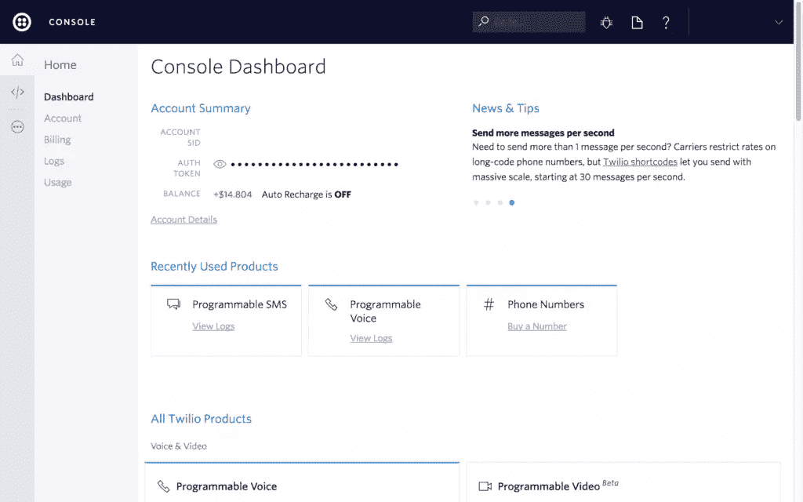
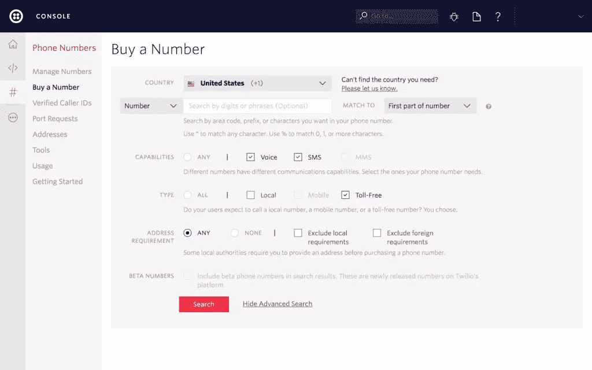
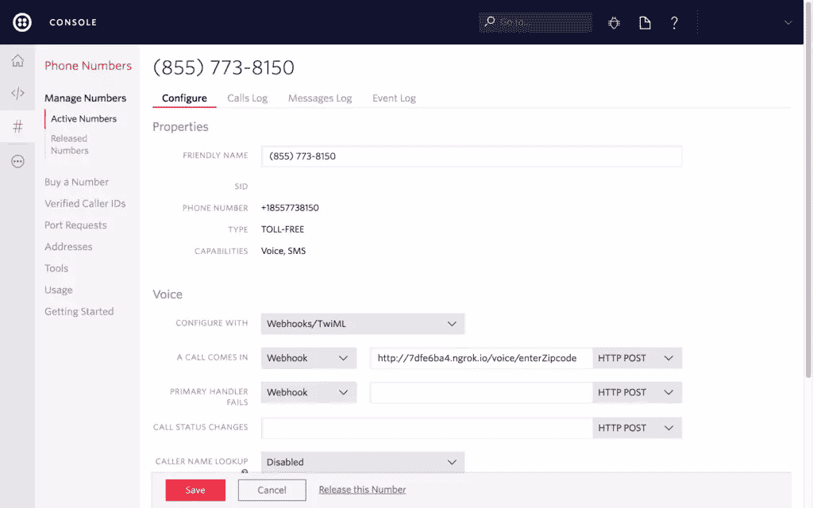

# 你好，拉弗尔？通过电话与 PHP 交流！

> 原文：<https://www.sitepoint.com/hello-laravel-communicating-php-phone-calls/>

Twilio 是一个 SaaS 应用程序，它使开发者能够使用 web 技术构建电话应用程序。在这个由两部分组成的系列中，我们将利用 Twilio 构建一个可以通过电话系统访问的天气预报应用程序。后端将使用 Laravel 框架编写(可购买探索视频课程[这里](https://www.sitepoint.com/premium/courses/laravel-5-2930?aref=bskvorc))。

在这一部分中，我们将创建一个简单的程序，允许用户拨打我们从 Twilio 购买的电话号码，输入邮政编码，并接收当前的天气预报。用户还可以通过语音菜单提示获得一周中任何一天的天气。在本系列的第二部分中，我们将利用本文中构建的内容，允许用户通过 SMS(文本消息)与应用程序进行交互。

## 先决条件

### 发展环境

本条假设[宅基地改良](https://www.sitepoint.com/quick-tip-get-homestead-vagrant-vm-running/)已安装。没有必要使用它，但是如果使用不同的环境，命令可能会略有不同。如果你不熟悉 Homestead，并希望产生类似本文旨在产生的结果，请访问[这篇](https://www.sitepoint.com/quick-tip-get-homestead-vagrant-vm-running/)展示如何建立 Homestead 的 SitePoint 文章，如果你需要一个流浪者速成班，请参见[这篇文章](https://www.sitepoint.com/re-introducing-vagrant-right-way-start-php/)。此外，如果这吊起了你的胃口，你想深入探索 PHP 开发环境，我们有一本关于它的[书可以购买](http://bit.ly/phpenv-sp)。

### 属国

我们将创建一个新的 Laravel 项目，然后将 [Twilio PHP SDK](https://www.twilio.com/docs/libraries/php) 和 Guzzle HTTP 客户端库添加到该项目中:

```
cd ~/Code
composer create-project --prefer-dist laravel/laravel Laravel 5.4.*
cd Laravel
composer require "twilio/sdk:^5.7"
composer require "guzzlehttp/guzzle:~6.0" 
```

## 发展

让我们一个接一个地检查所有的步骤。

### 路线

打开`routes/web.php`文件，添加以下内容:

```
Route::group(['prefix' => 'voice', 'middleware' => 'twilio'], function () {
    Route::post('enterZipcode', 'VoiceController@showEnterZipcode')->name('enter-zip');

    Route::post('zipcodeWeather', 'VoiceController@showZipcodeWeather')->name('zip-weather');

    Route::post('dayWeather', 'VoiceController@showDayWeather')->name('day-weather');

    Route::post('credits', 'VoiceController@showCredits')->name('credits');
}); 
```

在这个应用程序中，所有请求都在`/voice`路径下。当 Twilio 第一次连接到应用程序时，它会通过 HTTP `POST`连接到`/voice/enterZipcode`。根据电话中发生的情况，Twilio 将向其他端点发出请求。这包括`/voice/zipcodeWeather`用于提供今天的预测，`/voice/dayWeather`用于提供特定一天的预测，`/voice/credits`用于提供数据来源的信息。

### 服务层

我们将添加一个服务类。这个类将包含语音电话应用程序和短信应用程序之间共享的大量业务逻辑。

在`app`文件夹中新建一个名为`Services`的子文件夹。然后，创建一个名为`WeatherService.php`的文件，并将以下内容放入其中:

```
<?php

namespace App\Services;

use Illuminate\Support\Facades\Cache;
use Twilio\Twiml;

class WeatherService
{
} 
```

这是项目中的一个大文件，所以我们将一部分一部分地构建它。将这一部分中的以下代码放入我们的新服务类中:

```
 public $daysOfWeek = [
        'Today',
        'Sunday',
        'Monday',
        'Tuesday',
        'Wednesday',
        'Thursday',
        'Friday',
        'Saturday'
    ]; 
```

我们将使用这个数组将一周中的某一天映射为一个数字；星期日= 1，星期一= 2，以此类推。

```
 public function getWeather($zip, $dayName)
    {

        $point = $this->getPoint($zip);
        $tz = $this->getTimeZone($point);
        $forecast = $this->retrieveNwsData($zip);
        $ts = $this->getTimestamp($dayName, $zip);

        $tzObj = new \DateTimeZone($tz->timezoneId);

        $tsObj = new \DateTime(null, $tzObj);
        $tsObj->setTimestamp($ts);

        foreach ($forecast->properties->periods as $k => $period) {
            $startTs = strtotime($period->startTime);
            $endTs = strtotime($period->endTime);

            if ($ts > $startTs and $ts < $endTs) {
                $day = $period;
                break;
            }
        }

        $response = new Twiml();

        $weather = $day->name;
        $weather .= ' the ' . $tsObj->format('jS') . ': ';
        $weather .= $day->detailedForecast;

        $gather = $response->gather(
            [
                'numDigits' => 1,
                'action' => route('day-weather', [], false)
            ]
        );

        $menuText = ' ';
        $menuText .= "Press 1 for Sunday, 2 for Monday, 3 for Tuesday, ";
        $menuText .= "4 for Wednesday, 5 for Thursday, 6 for Friday, ";
        $menuText .= "7 for Saturday. Press 8 for the credits. ";
        $menuText .= "Press 9 to enter in a new zipcode. ";
        $menuText .= "Press 0 to hang up.";

        $gather->say($weather . $menuText);

        return $response;
    } 
```

`getWeather`方法接受一个带有星期几的邮政编码，并制作天气预报文本。首先，它计算出所请求的一天的参考时间，然后通过对预测数据数组进行 foreach 来查找天气预报。之后，它返回一个[语音 TwiML](https://www.twilio.com/docs/api/twiml) 响应。以下是返回内容的示例:

```
<?xml version="1.0" encoding="UTF-8"?>
<Response>
  <Gather numDigits="1" action="/voice/dayWeather">
    <Say>
      This Afternoon the 31st: Sunny, with a high near 72\. South southwest wind around 8 mph. Press 1 for Sunday, 2 for Monday, 3 for Tuesday, 4 for Wednesday, 5 for Thursday, 6 for Friday, 7 for Saturday. Press 8 for the credits. Press 9 to enter in a new zipcode. Press 0 to hang up.
    </Say>
  </Gather>
</Response> 
```

标签告诉 Twilio 期待来自用户键盘的输入。`numDigits`属性表示预期的位数。`action`属性表示接下来要联系的端点。

```
 protected function retrieveNwsData($zip)
    {
        return Cache::remember('weather:' . $zip, 60, function () use ($zip) {
            $point = $this->getPoint($zip);

            $point = $point->lat . ',' . $point->lng;
            $url = 'https://api.weather.gov/points/' . $point . '/forecast';

            $client = new \GuzzleHttp\Client();

            $response = $client->request('GET', $url, [
                'headers' => [
                    'Accept' => 'application/geo+json',
                ]
            ]);

            return json_decode((string)$response->getBody());
        });
    } 
```

`retrieveNwsData`方法获取天气预报数据。首先，该方法检查缓存中是否有邮政编码的天气预报副本。如果没有，那么使用 Guzzle HTTP 客户端向国家气象局(NWS) [API](https://forecast-v3.weather.gov/documentation) 端点`https://api.weather.gov/points/{point}/forecast`发出 HTTP `GET`请求。为了获得邮政编码的地理位置，在向天气 API 发出请求之前，调用了`getPoint`方法。来自 API 端点的响应是 [GeoJSON](http://geojson.org/) 格式的天气预报。预报是针对一周内的每一天每一夜的(有一些例外我们将在后面讨论)；总共 14 个条目。我们将 API 响应缓存一个小时，因为发出请求很慢，而且我们不想过于频繁地访问政府服务器而被禁止。

```
 protected function getPoint($zip)
    {
        return Cache::remember('latLng:' . $zip, 1440, function () use ($zip) {
            $client = new \GuzzleHttp\Client();
            $url = 'http://api.geonames.org/postalCodeSearchJSON';

            $response = $client->request('GET', $url, [
                'query' => [
                    'postalcode' => $zip,
                    'countryBias' => 'US',
                    'username' => env('GEONAMES_USERNAME')
                ]
            ]);

            $json = json_decode((string)$response->getBody());

            return $json->postalCodes[0];
        });
    } 
```

方法将邮政编码映射到一个地理点。这是通过使用 GeoNames API 完成的。结果会缓存一天，因为使用 API 很慢。

```
 protected function getTimeZone($point)
    {
        $key = 'timezone:' . $point->lat . ',' . $point->lng;

        return Cache::remember($key, 1440, function () use ($point) {
            $client = new \GuzzleHttp\Client();
            $url = 'http://api.geonames.org/timezoneJSON';

            $response = $client->request('GET', $url, [
                'query' => [
                    'lat' => $point->lat,
                    'lng' => $point->lng,
                    'username' => env('GEONAMES_USERNAME')
                ]
            ]);

            return json_decode((string) $response->getBody());
        });
    } 
```

`getTimeZone`方法用于获取地理点所在的时区。出于同样的原因，还使用了 GeoNames API 并将结果缓存一天。

```
 protected function getTimestamp($day, $zip)
    {
        $point = $this->getPoint($zip);
        $tz = $this->getTimeZone($point);

        $tzObj = new \DateTimeZone($tz->timezoneId);

        $now = new \DateTime(null, $tzObj);

        $hourNow = $now->format('G');
        $dayNow = $now->format('l');

        if ($day == $dayNow and $hourNow >= 18) {
            $time = new \DateTime('next ' . $day . ' noon', $tzObj);
            $ts = $time->getTimestamp();
        } elseif (($day == 'Today' or $day == $dayNow) and $hourNow >= 6) {
            $ts = $now->getTimestamp();
        } else {
            $time = new \DateTime($day . ' noon', $tzObj);
            $ts = $time->getTimestamp();
        }

        return $ts;
    } 
```

`getTimestamp`方法返回一个参考时间，用于查找特定日期的预测。大多数情况下，预测数据有一个白天和晚上的预测，但有时也有一个隔夜(早上 6 点之前)和当天的下午预测(下午，下午 6 点之前)。正因为如此，我们必须做一些计算来获得一个好的参考时间戳。在大多数情况下，它返回所请求的那一天邮政编码的中午时间。

```
 public function getCredits()
    {
        $credits = "Weather data provided by the National Weather Service. ";
        $credits .= "Zipcode data provided by GeoNames.";

        return $credits;
    }
} 
```

`getCredits`方法只是返回一些关于数据来源的标准文本。

### 控制器

在`app/Http/Controllers`文件夹中创建文件`VoiceController.php`，并将以下代码放入其中:

```
<?php

namespace App\Http\Controllers;

use App\Services\WeatherService;
use Illuminate\Http\Request;
use Twilio\Twiml;

class VoiceController extends Controller
{
    protected $weather;

    public function __construct(WeatherService $weatherService)
    {
        $this->weather = $weatherService;
    }

    public function showEnterZipcode()
    {
        $response = new Twiml();

        $gather = $response->gather(
            [
                'numDigits' => 5,
                'action' => route('zip-weather', [], false)
            ]
        );

        $gather->say('Enter the zipcode for the weather you want');

        return $response;
    }

    public function showZipcodeWeather(Request $request)
    {
        $zip = $request->input('Digits');

        $request->session()->put('zipcode', $zip);

        return $this->weather->getWeather($zip, 'Today');
    }

    public function showDayWeather(Request $request)
    {
        $digit = $request->input('Digits', '0');

        switch ($digit) {
            case '8':
                $response = new Twiml();
                $response->redirect(route('credits', [], false));
                break;
            case '9':
                $response = new Twiml();
                $response->redirect(route('enter-zip', [], false));
                break;
            case '0':
                $response = new Twiml();
                $response->hangup();
                break;
            default:
                $zip = $request->session()->get('zipcode');
                $day = $this->weather->daysOfWeek[$digit];
                $response = $this->weather->getWeather($zip, $day);
                break;
        }

        return $response;
    }

    public function showCredits()
    {
        $response = new Twiml();
        $credits = $this->weather->getCredits();

        $response->say($credits);
        $response->hangup();

        return $response;
    }
} 
```

当向`/voice/enterZipcode`端点发出请求时，执行`showEnterZipcode`方法。该方法返回要求调用者输入邮政编码的 TwiML。TwiML 还表示，当呼叫者输入 5 位数时，应该向`/voice/zipcodeWeather`发出请求。以下是一个示例响应:

```
<?xml version="1.0" encoding="UTF-8"?>
<Response>
  <Gather numDigits="5" action="/voice/zipcodeWeather">
    <Say>
      Enter the zipcode for the weather you want
    </Say>
  </Gather>
</Response> 
```

当向`/voice/zipcodeWeather`端点发出请求时，执行`showZipcodeWeather`方法。该方法以 TwiML 格式返回今天的天气预报文本和导航应用程序的语音菜单。下面是一个响应的样子:

```
<?xml version="1.0" encoding="UTF-8"?>
<Response>
  <Gather numDigits="1" action="/voice/dayWeather">
    <Say>
      This Afternoon the 31st: Sunny, with a high near 72\. South southwest wind around 8 mph. Press 1 for Sunday, 2 for Monday, 3 for Tuesday, 4 for Wednesday, 5 for Thursday, 6 for Friday, 7 for Saturday. Press 8 for the credits. Press 9 to enter in a new zipcode. Press 0 to hang up.
    </Say>
  </Gather>
</Response> 
```

当请求`/voice/dayWeather`端点时，执行`showDayWeather`方法。这将返回当天的天气预报，并以 TwiML 格式显示一个语音菜单来导航应用程序。对周一的回应可能是这样的:

```
<?xml version="1.0" encoding="UTF-8"?>
<Response>
  <Gather numDigits="1" action="/voice/dayWeather">
    <Say>
      Monday the 3rd: Sunny, with a high near 70\. Press 1 for Sunday, 2 for Monday, 3 for Tuesday, 4 for Wednesday, 5 for Thursday, 6 for Friday, 7 for Saturday. Press 8 for the credits. Press 9 to enter in a new zipcode. Press 0 to hang up.
    </Say>
  </Gather>
</Response> 
```

当请求`/voice/credits`端点时，执行最后一个方法`showCredits`。TwiML 响应包含信用和挂断指令。响应应该是这样的:

```
<?xml version="1.0" encoding="UTF-8"?>
<Response>
  <Say>
    Weather data provided by the National Weather Service. Zipcode data provided by GeoNames.
  </Say>
  <Hangup/>
</Response> 
```

### 中间件

默认情况下，Twilio 使用 HTTP `POST`向 webhooks 发出请求。因此，Laravel 要求`POST`提交有一个 CSRF 令牌。在我们的例子中，我们将不使用 CSRF 令牌，所以我们必须禁用检查令牌的中间件。在`app/Http/Kernel.php`文件中，删除或注释`\App\Http\Middleware\VerifyCsrfToken::class,`行。

在另一部分，我们将设置[ngrok](https://www.sitepoint.com/use-ngrok-test-local-site/)——一个允许互联网连接到我们本地环境的应用程序。因为应用程序不再有 CSRF 保护，互联网上的任何人都可以攻击我们的终端。为了确保请求来自 Twilio 或单元测试，我们必须创建一个定制的中间件。我们将使用一个在 [Twilio 文档](https://www.twilio.com/docs/guides/how-to-secure-your-lumen-app-by-validating-incoming-twilio-requests)中建议的中间件，但是要进行修改以适应我们的设置。

在`app/Http/Kernel.php`文件中，将下面一行添加到`$routeMiddleware`数组的末尾:

```
'twilio' => \App\Http\Middleware\TwilioRequestValidator::class, 
```

在`app/Http/Middleware`文件夹中创建一个名为`TwilioRequestValidator.php`的文件，并将以下代码粘贴到其中:

```
<?php

namespace App\Http\Middleware;

use Closure;
use Illuminate\Http\Response;
use Twilio\Security\RequestValidator;

class TwilioRequestValidator
{
    /**
     * Handle an incoming request.
     *
     * @param  \Illuminate\Http\Request  $request
     * @param  \Closure  $next
     * @return mixed
     */
    public function handle($request, Closure $next)
    {
        if (env('APP_ENV') === 'test') {
            return $next($request);
        }

        $host = $request->header('host');
        $originalHost = $request->header('X-Original-Host', $host);

        $fullUrl = $request->fullUrl();

        $fullUrl = str_replace($host, $originalHost, $fullUrl);

        $requestValidator = new RequestValidator(env('TWILIO_APP_TOKEN'));

        $isValid = $requestValidator->validate(
            $request->header('X-Twilio-Signature'),
            $fullUrl,
            $request->toArray()
        );

        if ($isValid) {
            return $next($request);
        } else {
            return new Response('You are not Twilio :(', 403);
        }
    }
} 
```

对于 Twilio 发出的每个请求，它发送一个用 URL 和请求变量作为数据、用 Twilio Auth 令牌作为密钥计算的 [HMAC](https://en.wikipedia.org/wiki/Hash-based_message_authentication_code) 。该 HMAC 在`X-Twilio-Signature`请求报头中发送。我们可以将请求中发送的`X-Twilio-Signature`与我们在 web 服务器上生成的 HMAC 进行比较。这是通过对`$requestValidator`对象使用`validate()`方法来完成的。

前往位于 https://www.twilio.com/console 的 Twilio 控制台仪表板。一旦出现，取消隐藏`AUTH TOKEN`并记下它。



然后，打开`.env`文件，然后将下面的代码添加到文件的末尾。

```
TWILIO_APP_TOKEN=YOUR_AUTH_TOKEN_HERE 
```

不要忘记用您在仪表板上记下的值替换`YOUR_AUTH_TOKEN_HERE`。

由于 Ngrok 的工作方式，它将原来客户端定义的`host`请求头(类似于`abc123.ngrok.io`)更改为我们指定的主机。在这种情况下，它将是`homestead.app`。我们需要更改 URL 来考虑这一点，以计算正确的 HMAC。如果确定有单元测试正在运行，则跳过中间件。

## 地名

为了能够使用 GeoNames API 进行邮政编码和时区查询，我们必须[创建一个免费帐户](http://www.geonames.org/login)。之后，我们必须通过访问[管理账户页面](http://www.geonames.org/manageaccount)来启用使用 API 的能力。

注册后，打开您的`.env`文件并添加变量`GEONAMES_USERNAME`，其值为您的 GeoNames 用户名。

## Ngrok

Twilio 要求您的应用程序可以从互联网上访问，因为 Twilio 调用您实现的 webhooks。使用 Homestead 的默认设计，web 服务器只对您的本地机器可用。为了避开这个限制，我们使用了 [Ngrok](https://ngrok.com/) 。这个程序允许你获得一个在互联网上工作的 FQDN，并使用隧道将该地址的流量转发到你的 Homestead 实例。

要使用 Ngrok，你必须首先[注册一个免费账户](https://dashboard.ngrok.com/user/signup)。之后，下载并安装 Ngrok。一旦安装了应用程序，请确保根据[入门](https://dashboard.ngrok.com/get-started)文档安装`authtoken`。接下来，我们将启动隧道:

```
./ngrok http 192.168.10.10:80 -host-header=homestead.app 
```

这个隧道将允许我们的本地服务器接收来自互联网的请求。Homestead 期望`host` HTTP 头是`homestead.app`。我们使用的 Ngrok 命令将把 HTTP 请求的原始`host`头复制到`X-Original-Host`头，然后用值`homestead.app`覆盖`host`。

请记下程序给出的 HTTP URL，因为我们稍后在设置要拨打的 Twilio 电话号码时需要主机名。


## Twilio

使用 [Twilio](https://www.twilio.com/) 创建一个帐户，并向您的帐户中添加资金。增加十美元足够实现和测试应用程序了。这笔钱是用来购买电话号码和支付打进来的电话的。前往[查找号码](https://www.twilio.com/console/phone-numbers/search)页面，购买具有语音和短信功能的号码。我选了一个免费电话号码。



在搜索页面中，单击“高级搜索”链接，并确保选中“语音”和“短信”功能复选框。然后点击“搜索”按钮。结果列表出现后，选择一个电话号码。

获得您的号码后，进入电话号码的设置页面，将语音“有电话进来”webhook，`https://demo.twilio.com/welcome/voice/`替换为进入您的应用程序的 webhook，即`http://YOUR_NGROK_HOSTNAME/voice/enterZipcode`，并保存更改。



## 使用应用程序

运行您的应用程序和 Ngrok 程序，拨打您的免费电话。你应该被要求输入邮政编码。输入邮政编码后，你应该会得到当前的天气预报和一个语音菜单来导航应用程序。

### 生产考虑因素

有一件事本文没有涉及，但可以用来改进这个应用程序，那就是让 Twilio 使用 HTTPS 端点来代替 HTTP。如果你想看看这是如何做到的，请在下面的评论中提出要求！

## 结论

在本文中，我们构建了一个 web 应用程序，用户可以使用 Twilio 调用它并与之交互。这个应用程序允许用户获得特定邮政编码的天气预报。请记住，如果用户从哪里打电话和他们输入的邮政编码在不同的时区，两者之间可能会有日期差异。

你可以在 [Github](https://github.com/sitepoint-editors/sitepoint-twilio-weather-example) 上找到这个系列文章中应用程序的代码。

在这个由两部分组成的系列的下一部分中，我们将利用我们在这里构建的东西来使这个应用程序在 SMS 上工作。

## 分享这篇文章