# 如何用苏鲁创办一个网上多语种杂志

> 原文：<https://www.sitepoint.com/set-online-multi-language-magazine-sulu/>

[我们之前演示过](https://www.sitepoint.com/getting-started-sulu-cms-vagrant-right-way/)通过在一台流浪机器上安装 Hello World 来开始使用 Sulu CMS 的正确方法。简单的东西，但可以很棘手。

如果你对流浪和孤立的环境不熟悉，我们关于这方面的优秀书籍[可以在](http://bit.ly/phpenv-sp)买到。

这一次，我们将研究基本的苏鲁术语，解释内容是如何形成、创建、存储和缓存的，并研究如何构建一个具有不同地区(语言)的简单在线杂志。

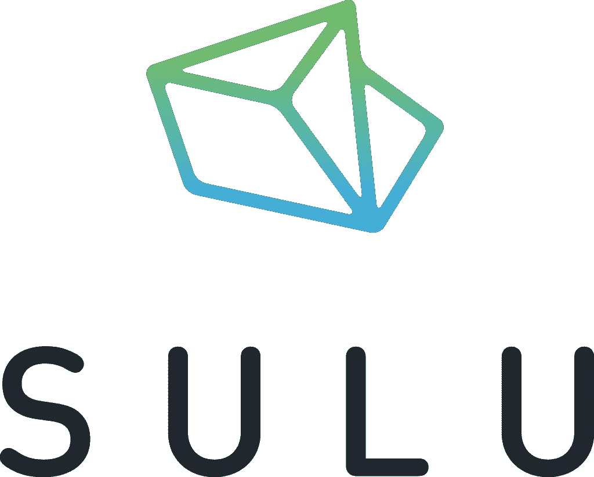

* * *

继续之前推荐阅读:

*   [为 PHP 建立独立的开发环境](https://www.sitepoint.com/quick-tip-get-homestead-vagrant-vm-running/)–5 分钟阅读
*   [苏鲁《流浪正道》入门](https://www.sitepoint.com/getting-started-sulu-cms-vagrant-right-way/)–10 分钟阅读

* * *

## 页面和页面模板

页面正是您所期望的:一个内容块，通常由更小的块组成。页面模板是关于如何组装页面的两部分配方。

一个页面模板有两个部分:[分支](https://twig.sensiolabs.org/)模板和 XML 配置。Twig 部分负责呈现页面子块的内容，如下所示:

```



    
        {{ sulu_seo(extension.seo, content, urls, shadowBaseLocale) }}
    



    <h1 property="title">{{ content.title }}</h1>

    <div property="article">
        {{ content.article|raw }}
    </div>
 
```

这是 [sulu-minimal](https://github.com/sulu/sulu-minimal) 自带的默认 twig 模板的全部内容，在`app/Resources/Views/Templates/default.html.twig`找到。它扩展了主布局，定义了一些块，并呈现了它们的内容。

另一方面，XML 配置有点复杂(大多数 XML 都是这样):

```
...
    <key>default</key>

    <view>templates/default</view>
    <controller>SuluWebsiteBundle:Default:index</controller>
    <cacheLifetime>2400</cacheLifetime>

    <meta>
        <title lang="en">Default</title>
        <title lang="de">Standard</title>
    </meta>

    <properties>
        <section name="highlight">
            <properties>
                <property name="title" type="text_line" mandatory="true">
                    <meta>
                        <title lang="en">Title</title>
                        <title lang="de">Titel</title>
                    </meta>
                    <params>
                        <param name="headline" value="true"/>
                    </params>

                    <tag name="sulu.rlp.part"/>
                </property>

... 
```

如果你是第一次到苏禄，这一切都没有意义——但我们会到达那里。目前，我们正在引入概念。上述 XML 片段的主要要点是:

*   `key`是模板的唯一标记，它进入管理模板选择菜单(它**必须**与 xml 文件的文件名相同，没有扩展名)。
*   `view`是可以找到其对应的`twig`的地方。**一个模板只有同时拥有 XML 和相应的 Twig 文件才会出现在菜单中！**
*   控制器是执行其逻辑的地方。稍后我们将更详细地讨论控制器，但是一般来说，对于简单的内容，您可以将其保留为默认值。
*   元数据是模板在管理模板选择菜单中的显示方式，取决于用户界面中选择的语言:
    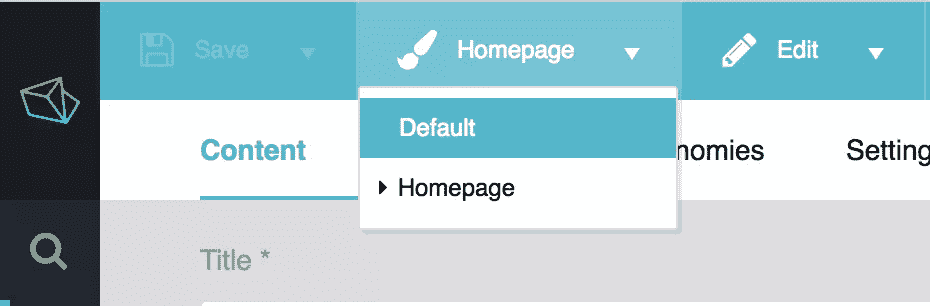
*   属性是页面的各种元素——在本例中，是一个输入标题的字段和一个不可编辑的 URL 字段

通过在这个 XML 文件中定义新的属性组合，然后在相应的 twig 文件中呈现它们，可以定义新的页面类型(模板)。

作为一个实验，尝试使用管理界面中的菜单将主页切换到默认模板，然后在`master.html.twig`布局文件(上面一个文件夹)中，将废话添加到 HTML 中。也可以随意填充 UI 中的`article`属性。

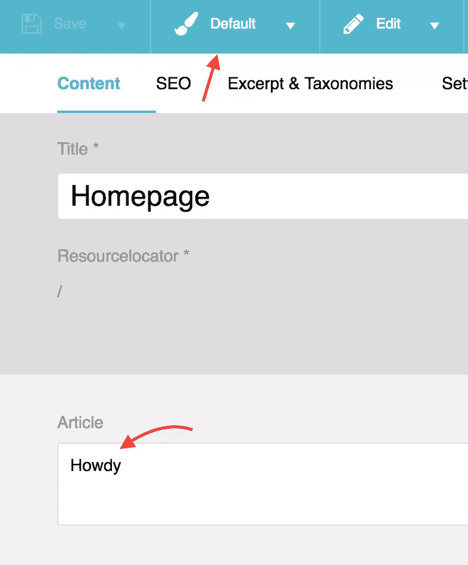

```
...
        <form action="{{ path('sulu_search.website_search') }}" method="GET">
            <input name="q" type="text" placeholder="Search" />
            <input type="submit" value="Go" />
        </form>
Lalala
        <section id="content" vocab="http://schema.org/" typeof="Content">
            
        </section>
... 
```

如果你现在点击左上角的`Save and Publish`，刷新主页，应该会看到变化。

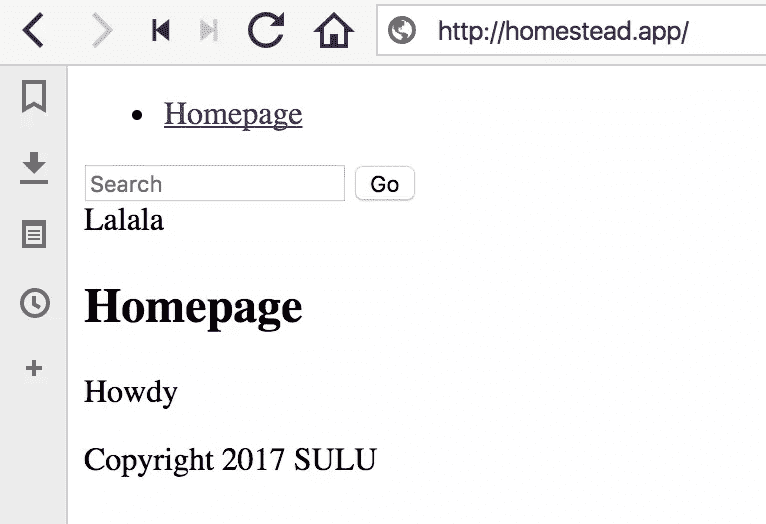

好奇者:你可能想知道为什么他们走 XML 路线，而不是让用户管理数据库中的一切。原因之一是能够对这些文件进行版本控制。第二个原因是，即使在 GUI 中添加了一个属性，它仍然会从 twig 模板中丢失。在这一点上，他们要么必须通过数据库使 twig 模板在 GUI 中可编辑，要么用户将再次被迫编辑文件——如果他们已经在编辑文件，他们也可以编辑 XML 文件。

### 页面与主题

那么，这一切的主题是什么呢？

主题是页面类型的集合。与普遍的看法相反，主题是**而不是**一个主布局，然后由页面模板分支扩展——它是一个页面模板**和**主布局的完整集合。一个主题还将包含完整呈现一个站点所需的所有资产:CSS、JS、图像、字体等等。

好奇者:我们不会在本教程中讨论这些主题，但是可以在这里随意阅读。

## 关于缓存

如果在修改和刷新主页时，主页内容没有变化，这可能与缓存有关。以下是需要记住的重要事项:

*   在开发过程中，您的服务器设置应该设置 Symfony 开发环境变量。这允许您将应用程序直接部署到生产环境中，而无需手动修改文件`web/admin.php`或`web/website.php`中的环境值，并使您的应用程序在开发中具有高度的可调试性。这些值是`SYMFONY_ENV`和`SYMFONY_DEBUG`，如果您使用的是[家园改良版](https://www.sitepoint.com/quick-tip-get-homestead-vagrant-vm-running/)，则会自动设置。如果没有，从这里[复制过来](https://github.com/Swader/homestead_improved/blob/master/scripts/serve-sulu.sh#L35)如果你在 Nginx 上的话。
*   Symfony apps 的[命令行(所以，在项目中使用`bin/adminconsole`或`bin/websiteconsole`时)默认为`dev`环境。为了对另一个环境执行命令，传递与该环境匹配的`--env=`标志，像这样:`bin/adminconsole cache:clear --env=prod`。如果您的应用程序处于`prod`模式，而您试图清除缓存却什么也没发生，这可能会使您出错——可能是环境不匹配，命令正在清除错误的缓存。](https://www.sitepoint.com/re-introducing-symfony-console-cli-php-uninitiated/)

## 在线杂志

让我们考虑想推出一个在线杂志。根据定义，这样的杂志具有:

*   解释事情的页面，如“关于”、“联系”、“职业”等。
*   许多文章，通常按月份分组(常见的 URL 模式很明显:mysite.com/05/2017/some-title-goes-here)
*   不同级别的员工拥有不同的权限(作者、编辑、访客、管理员……)
*   一个存储静态文件的媒体库，这些文件包含在文章和页面中(图片、CSS、JS 等)。)

这些都是苏禄支持的事情，但有一个警告。当建造这样的东西时，我们需要记住在苏鲁的*存储。*

### Jackawhat？

这一部分听起来可能令人困惑。没办法让它变得更容易理解。感到安慰的是，你根本不需要了解它的任何东西，把它当作“给那些想知道更多的人”的材料。

**Jackalope** 是 [PHPCR](https://phpcr.github.io/) 的 PHP 实现，是 [JCR](https://en.wikipedia.org/wiki/Content_repository_API_for_Java) 的一个版本。这些术语让人摸不着头脑，所以我建议不要试图去了解它们。如果你坚持，这在[这个要点](https://gist.github.com/Swader/90859116a0f355c8cebd7d2f7977842a#file-rantyquestion-md)中有所涉及。

简而言之，如果你不需要版本化你的内容，你可以使用 Sulu 自动引入的默认 Jackalope-Doctrine-DBAL 包。它将内容存储在一个普通的 RDBMS(如 MySQL)中，但没有版本。

如果您确实需要版本控制，您需要安装 jack rabbit——一个 Apache 产品，它基本上是一个数据库服务器[,有一个不明显的变化](https://en.wikipedia.org/wiki/Apache_Jackrabbit),并使用不同的 PHP 实现来存储内容:Jackalope-Jackrabbit(也是自动拉入的)。请注意，仍然需要 RDBMS——jack rabbit 只是通过为实际内容提供不同的存储机制，而不是权限、设置等，来扩充 RDBMS。仍然存储在常规数据库中。

问题是 Jackrabbit(以及一般的 PHPCR)每个节点有 10000 个子节点的限制。由于在线杂志和博客上的文章通常是连续的，没有层次结构(即，它们是*扁平的*)，它们最终会成为“根”的孩子，在 10k 帖子之后，你就有麻烦了。

这就是为什么 Sulu 团队[开发了一个捆绑包](https://github.com/sulu/SuluArticleBundle)，它将按月自动分片内容，并模拟一个平面结构。通过将每个月设置为父月，每个月可以有 10000 个帖子。如果需要，可以按周甚至按天进一步细分。请记住这一点:

> 如果你正在建立一个新闻网站、博客网站或杂志，文章捆绑包是一个先决条件，因为否则，在 10000 个内容之后，你就有麻烦了。

注意:ArticleBundle 目前正在大量开发中，在 1.0 发布之前可能会有一些 API 变化。慎用。

好了，让我们安装 ArticleBundle 来获得对我们在线杂志网站的支持。

### 弹性搜索

不幸的是，这个包需要 [ElasticSearch](https://www.sitepoint.com/introduction-to-elasticsearch-in-php/) ，安装起来可能更简单。如果你使用的是 Ubuntu 16.04(就像我们的[家园改进版](https://www.sitepoint.com/quick-tip-get-homestead-vagrant-vm-running/)盒子):

```
sudo add-apt-repository ppa:webupd8team/java
sudo apt-get update
sudo apt-get install oracle-java8-installer 
```

完成后(这需要一段时间，就像 Java 一样)，新安装的版本应该被设置为 Ubuntu 的默认版本。在其他地方，您可以使用以下命令对其进行配置:

```
sudo update-alternatives --config java 
```

最后，通过编辑`/etc/environment`并在顶部或底部添加行`JAVA_HOME="/usr/lib/jvm/java-8-oracle"`来永久设置`JAVA_HOME`环境变量。用`source /etc/environment`重新加载这个文件。

Java 现在已经准备好了，但是我们仍然需要安装 ES。

```
wget -qO - https://artifacts.elastic.co/GPG-KEY-elasticsearch | sudo apt-key add -
sudo apt-get install apt-transport-https
echo "deb https://artifacts.elastic.co/packages/5.x/apt stable main" | sudo tee -a /etc/apt/sources.list.d/elastic-5.x.list
sudo apt-get update && sudo apt-get install elasticsearch
sudo service elasticsearch start 
```

唷。

*注意:由于 RAM 要求，即使命令立即执行，ES 也需要一段时间才能启动，所以在尝试`curl http://localhost:9200`测试它之前，请等待一段时间。如果一分钟左右后还不行，进入`/etc/elasticsearch/elasticsearch.yml`，取消`network.host`的注释，设置为`0.0.0.0`。然后重启 ES，等一分钟，再尝试冰壶。*

### 商品包

现在我们终于可以安装这个包了。

注:在撰写本文时，ArticleBundle 处于实验状态，Sulu 本身也在经历一个 RC 过程。为了使用这两个主软件包的最新版本，我推荐下面的`composer.json`设置:

```
...
"sulu/sulu": "dev-develop as 1.6.0-RC1",
"sulu/article-bundle": "dev-develop"
...

...
  "repositories": [
    {
      "type": "vcs",
      "url": "https://github.com/sulu/SuluArticleBundle"
    },
    {
      "type": "vcs",
      "url": "https://github.com/sulu/sulu"
    }
  ],
...

...
    "minimum-stability": "dev",
    "prefer-stable": true
... 
```

然后，用`composer install`安装，或者用`composer update`更新，如果你已经在运行安装的话。一旦两个包都稳定了，就可以通过以下方式安装这个包:

```
composer require sulu/article-bundle 
```

既然已经下载了这个包，我们需要将它添加到`AbstractKernel.php`文件中:

```
new Sulu\Bundle\ArticleBundle\SuluArticleBundle(),
new ONGR\ElasticsearchBundle\ONGRElasticsearchBundle(), 
```

在`app/config/config.yml`中，我们添加了以下内容(`sulu_core`部分应与现有部分合并):

```
sulu_route:
    mappings:
        Sulu\Bundle\ArticleBundle\Document\ArticleDocument:
            generator: schema
            options:
                route_schema: /articles/{object.getTitle()}

sulu_core:
    content:
        structure:
            default_type:
                article: "article_default"
                article_page: "article_default"
            paths:
                article:
                    path: "%kernel.root_dir%/Resources/templates/articles"
                    type: "article"
                article_page:
                    path: "%kernel.root_dir%/Resources/templates/articles"
                    type: "article_page"

ongr_elasticsearch:
    managers:
        default:
            index: 
                index_name: su_articles
            mappings:
                - SuluArticleBundle
        live:
            index:
                index_name: su_articles_live
            mappings:
                - SuluArticleBundle

sulu_article:
    documents:
        article:
            view: Sulu\Bundle\ArticleBundle\Document\ArticleViewDocument
    types:

        # Prototype
        name:
            translation_key:      ~

    # Display tab 'all' in list view
    display_tab_all:      true 
```

然后，在`app/config/admin/routing.yml`中，我们添加路线:

```
sulu_arictle_api:
    resource: "@SuluArticleBundle/Resources/config/routing_api.xml"
    type: rest
    prefix: /admin/api

sulu_article:
    resource: "@SuluArticleBundle/Resources/config/routing.xml"
    prefix: /admin/articles 
```

添加示例模板。对于`templates/articles/article_default.xml`:

```
<?xml version="1.0" ?>
<template xmlns="http://schemas.sulu.io/template/template"
          xmlns:xsi="https://www.w3.org/2001/XMLSchema-instance"
          xmlns:xi="https://www.w3.org/2001/XInclude"
          xsi:schemaLocation="http://schemas.sulu.io/template/template http://schemas.sulu.io/template/template-1.0.xsd">

    <key>article_default</key>

    <view>articles/article_default</view>
    <controller>SuluArticleBundle:WebsiteArticle:index</controller>
    <cacheLifetime>144000</cacheLifetime>

    <meta>
        <title lang="en">Default</title>
        <title lang="de">Standard</title>
    </meta>

    <tag name="sulu_article.type" type="article"/>

    <properties>
        <section name="highlight">
            <properties>
                <property name="title" type="text_line" mandatory="true">
                    <meta>
                        <title lang="en">Title</title>
                        <title lang="de">Titel</title>
                    </meta>
                    <params>
                        <param name="headline" value="true"/>
                    </params>
                </property>

                <property name="routePath" type="route">
                    <meta>
                        <title lang="en">Resourcelocator</title>
                        <title lang="de">Adresse</title>
                    </meta>
                </property>
            </properties>
        </section>

        <property name="article" type="text_editor">
            <meta>
                <title lang="en">Article</title>
                <title lang="de">Artikel</title>
            </meta>
        </property>
    </properties>
</template> 
```

对于`views/articles/article_default.html.twig`:

```



    <h1 property="title">{{ content.title }}</h1>

    <div property="article">
        {{ content.article|raw }}
    </div>
 
```

完成初始化:

```
php bin/console assets:install # this installs JS, CSS, etc for the UI. Defaults to hard copy, if you want symlinks use `--symlinks`
php bin/console sulu:translate:export # creates translations
php bin/console sulu:document:init # initializes some PHPCR nodes
php bin/console ongr:es:index:create # initializaes the elasticsearch index 
```

添加权限:在管理用户界面，进入设置->用户角色。选择用户角色，向下滚动到“文章”。选择“全部”,保存并刷新 UI 以查看更改。“文章”选项现在应该出现在左侧菜单中。

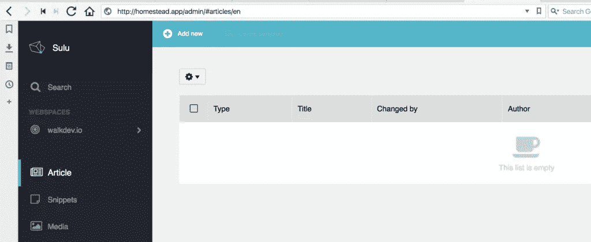

*注意:如果你在这个屏幕上看到加载器无限旋转，有可能你的 ElasticSearch 服务器关闭了，因为 VM 上缺少 RAM(缺少关于这个[的通知已经被报告为一个错误](https://github.com/sulu/SuluArticleBundle/issues/183))。ES 是非常资源密集型的，仅仅让它空闲运行[就会浪费大约 1.5GB 的 RAM](https://twitter.com/bitfalls/status/872447715782905858) 。解决方案是要么用更多的 RAM 启动机器，要么用`sudo service elasticsearch start`重启 ES 实例。你可以随时用`sudo service elasticsearch status`检查它是否在运行。*

试着写一个 Hello World post 的例子并发布它。如果标题为`Hello World`，它应该出现在 url `/articles/hello-world`处。

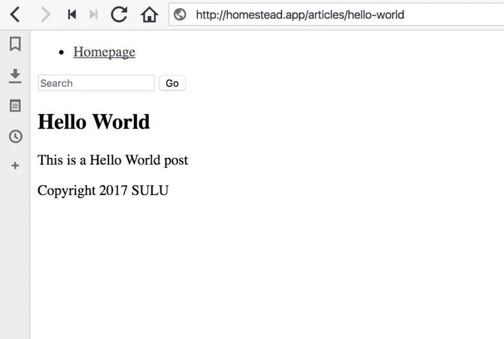

### URL 方案

如前面的`config.yml`所示，默认的路线设置是物品的`articles/{object.getTitle()}`。果然，当生成时，我们的文章有这个 URL 方案。但是如果我们想要像`/blog/06/2017/my-title`这样的东西呢？这很容易改变。修改`config.yml`，使`route_schema`从:

```
/articles/{object.getTitle()} 
```

到

```
/blog/{object.getCreated().format('m')}/{object.getCreated().format('Y')}/{object.getTitle()} 
```

花括号之间的路由片段正在被[求值](https://www.sitepoint.com/the-delicious-evils-of-php/)，句号被解释为方法访问器，所以，例如，`object.getCreated().format('Y')`变成了`object->getCreated()->format('Y')`。

如果我们现在尝试保存一个新帖子，并将`resource locator`字段留空(这样它会自动生成)，我们会很好地生成新的路由格式:

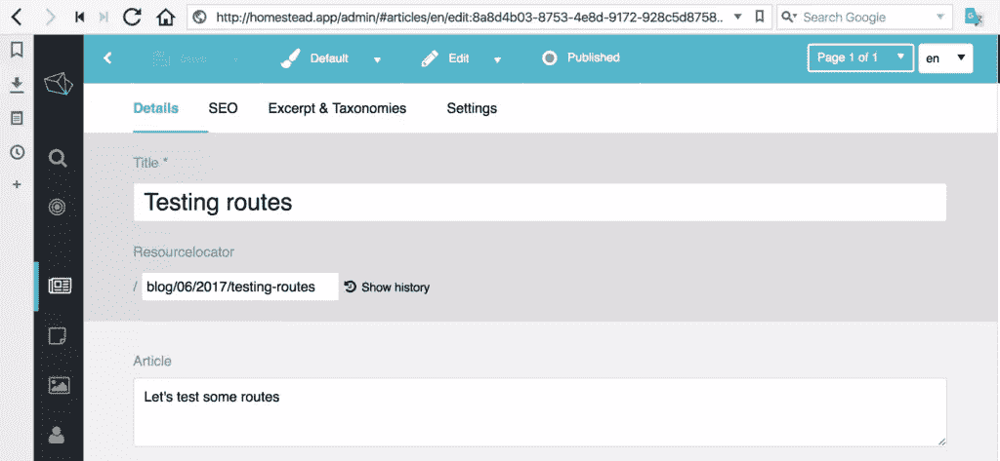

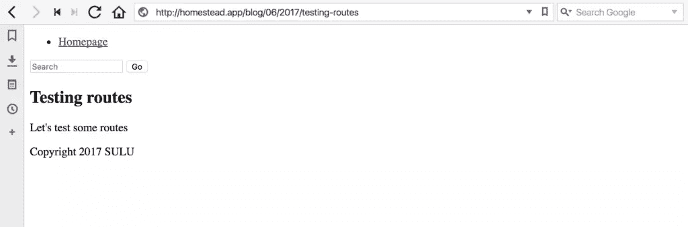

## 现场

现在让我们为我们的网站设置一种不同的语言——我们希望覆盖更广泛的市场，所以我们将在适用的时候用两种语言构建我们的 UI 和内容。为了添加新的语言，我们在`app/Resources/webspaces`中编辑 webspace 文件。在`localizations`下，我们需要做的就是添加一个新的语言环境:

```
 <localizations>
        <localization language="en" default="true"/>
        <localization language="hr"/>
    </localizations> 
```

HR 是 Hrvatski 的意思，是克罗地亚语的当地名称。

刷新管理用户界面现在会在语言选择器中显示一个新选项:

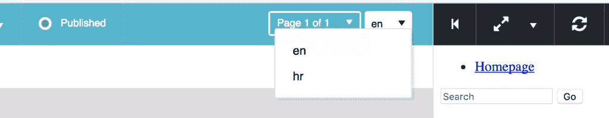

在使用它之前，我们必须允许当前用户管理该区域设置。默认情况下，不允许每个现有用户使用任何区域设置。要让当前用户编辑该区域设置，我们进入“联系人”->“用户”->“权限”，在“区域设置”下选择新的区域设置，然后保存并重新加载管理 UI。

* * *

### 一句警告

完成后，我们**必须**运行以下控制台命令:

```
php bin/adminconsole sulu:document:initialize 
```

这将为新的语言环境初始化 PHPCR 文档。这个**不能在你已经为新的地区创建了内容之后再做**,否则事情会被破坏。

> **记住在每次与语言环境相关的 web 空间更改后运行`sulu:document:initialize`命令！**

如果您忘记并最终在添加了一个区域设置之后但在初始化命令运行之前创建了内容，下面的命令将删除与该区域设置相关的所有内容(因此要小心使用！)并允许您重新启动语言环境(用您自己的语言环境标识符替换命令中的`hr`)。

```
php bin/adminconsole doctrine:phpcr:nodes:update --query "SELECT * FROM [nt:base]" --apply-closure="foreach(\$node->getProperties('i18n:hr-*') as \$hrNode) {\$hrNode->remove();};"
php bin/websiteconsole doctrine:phpcr:nodes:update --query "SELECT * FROM [nt:base]" --apply-closure="foreach(\$node->getProperties('i18n:hr-*') as \$hrNode) {\$hrNode->remove();};"
php bin/adminconsole sulu:document:initialize 
```

关于如何在用户界面上最好地警告人们这一点的讨论正在进行中。

* * *

现在回到文章。当在一篇已有的文章上时，切换区域设置会弹出一个窗口，让你用这种语言创建一篇新的空白文章，或者用另一种语言的内容创建一篇新的文章(在我们的例子中是`en`)。我们选后者吧。

由此产生的文章将是我们之前的草稿。

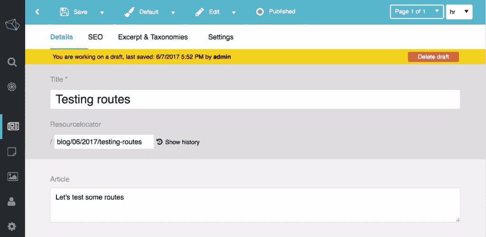

你会注意到这篇文章的网址和它的英文版是一样的。这意味着我们不能在浏览器中访问它，除非我们切换区域设置，但我们没有任何类型的区域设置切换器。

### 网络空间和区域设置

如果您再次查看 webspace 文件，您会注意到底部有`portals`。门户就像网络空间的子站点。在大多数情况下，门户和 web 空间将具有 1:1 的关系，但是我们使用门户来为不同的环境定义 URL 路由。默认情况下，通过一个属性设置一种特定的语言，并将所有 URL 的根定义为仅仅是`{host}`。因此，我们在上面的截图中得到`homestead.app`，后面加上类似`/articles/something`或`/hello-world`的东西。

为了让我们不同的语言呈现，我们需要改变这一部分。将每个`<url language="en">{host}</url>`替换为`<url>{host}/{localization}</url>`。这将产生以`homestead.app/en/hello-world`形式的 URL。

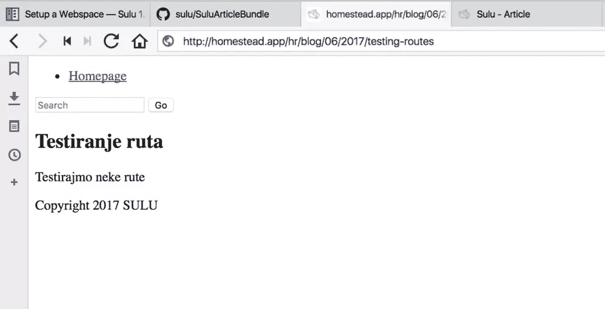

果不其然，我们现在可以通过在所有 URL 前添加区域标识符来手动切换区域。不过，如果我们能在页面上按一下文字开关，那就更容易了，不是吗？

### 区域设置的主题

让我们修改我们的布局，以便我们在屏幕上有一个实际的语言选择器，我们可以用来改变网站的语言。

在`app/Resources/views/master.html.twig`中，我们将做如下修改。在表格的正上方，我们将这样写:

```
 <div>
            
                
                <a href="{{ sulu_content_path((url|replace({(extra): ""})?:'/'),request.webspaceKey,locale) }}">{{ locale }}</a>
                &nbsp;|&nbsp;
            
        </div> 
```

如果我们查看[文档](http://docs.sulu.io/en/latest/book/twig.html)，我们会注意到有一个`urls`变量。`urls`变量是来自 webspace 配置的关联数组，包含所有 locale 的 URL，locale 作为键，URL 作为值，所以我们遍历它们。因为我们只为每个环境定义了一个，所以 Sulu 会自动生成尽可能多的语言环境，将它们与在`url`键中定义的 URL 模式混合在一起。

URL 包含语言前缀(目前是一个 bug)，所以我们需要去掉它。我们在 Twig 中将这部分定义为`extra`(`"/"~request.locale`的意思是“合并`/`和`request.locale`”)。

然后，我们使用来自`vendor/sulu/sulu/src/Sulu/Bundle/WebsiteBundle/Twig/Content/ContentPathTwigExtension.php`的`sulu_content_path`助手函数来提供当前的 URL，去掉我们在上面一行定义的`extra`内容。其他参数包括 webspace 键，这样它就知道在哪里查找要生成的路由值，以及在返回新路径时要添加到内容路径前面的区域设置。不要被`?:'/'`部分所迷惑——如果没有`url`，那么只是一个作为参数沿着根路径发送的[三元值(`/`)。](https://www.sitepoint.com/premium/screencasts/using-shorthand-if-else-conditionals-in-php-to-make-code-more-succinct)

最后，我们检查这是否是 for 循环中的最后一个元素，如果是，我们**不**回显管道字符，从而创建一个分隔符直到最后一个元素。

我们现在在我们的主布局中有一个语言切换器，可以轻松地在英语和克罗地亚语之间切换。

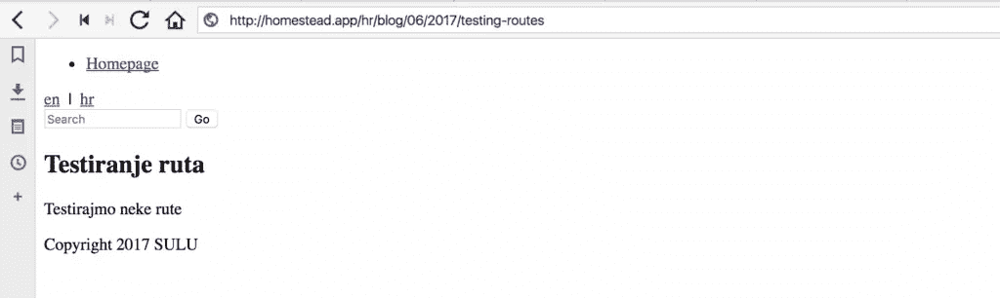

使用同样的方法，语言可以变成下拉菜单或任何其他想要的格式。

### 我们在暗处做什么

最后，我们需要对缺少的页面翻译做些什么。如果我们在`hr`地区访问主页，Sulu 将抛出 404 错误，因为该页面在克罗地亚语中不存在。因为一些页面可能没有翻译，所以我们希望在访问它们时从第二语言加载一个替代语言——受众可能是双语的，仅仅因为我们还没有匹配的内容就歧视他们是可耻的。

我们用苏禄的*阴影页*做这个。要将我们的克罗地亚版主页转换为阴影页面，我们需要执行以下操作:

*   当区域设置为英语时，进入管理用户界面*的主页编辑屏幕*
*   切换区域设置并在弹出菜单中选择“空白页面”
*   转到这个新页面的“设置”，选择“启用阴影”，并选择“en”作为获取内容的区域设置。

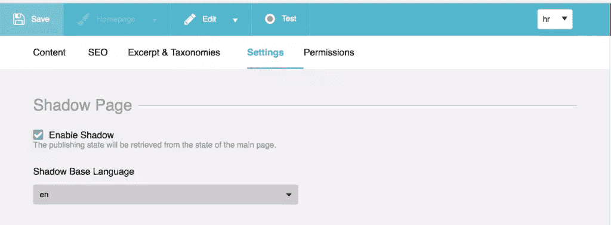

如果我们现在在`hr`地区访问主页，它应该产生`en`主页，而我们的博客文章将在`hr`和`en`版本之间切换。试试吧！

## 结论

在本教程中，我们解释了一些基本的 Sulu 术语，在我们的 Sulu 安装中安装了一个定制包，并对内容进行了处理。最后，我们用语言选择器建立了一个基本的多语言新闻站点。

到目前为止需要注意的一点是，Sulu 是一个运行起来非常昂贵的 CMS 仅仅是 ArticleBundle [的弹性搜索需求就将我们服务器的 RAM 需求](https://twitter.com/bitfalls/status/872447715782905858)提高到了 2-3GB，这不再是一个小机器，而且`vendor`文件夹本身已经有几百兆字节了。但苏禄将在未来的帖子中展示其价值——我呼吁耐心等待。

在这一点上，苏鲁应该开始感觉越来越熟悉，你应该为更高级的内容做好准备。这正是我们在下一部分要关注的。

## 分享这篇文章