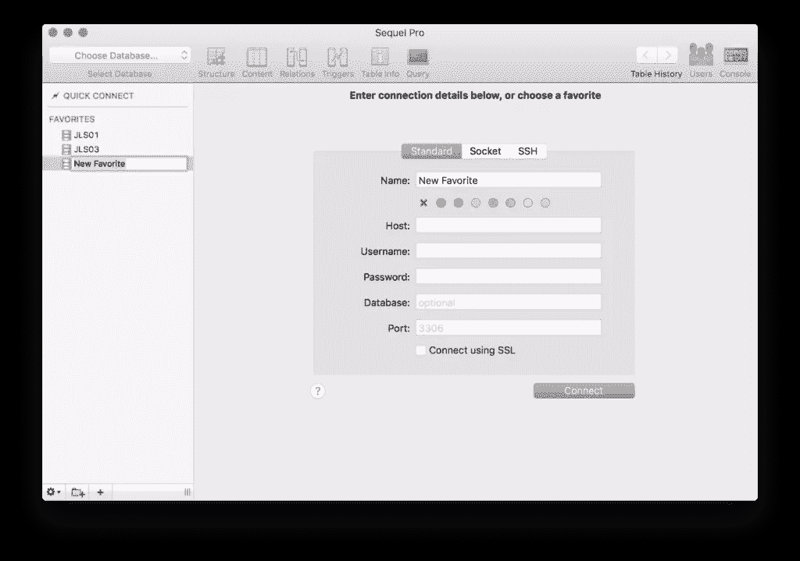
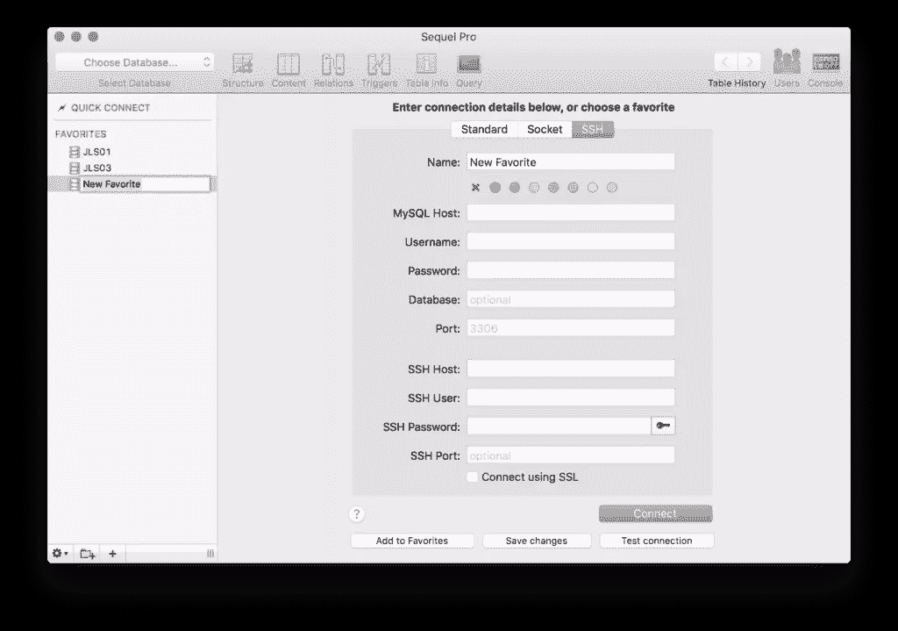
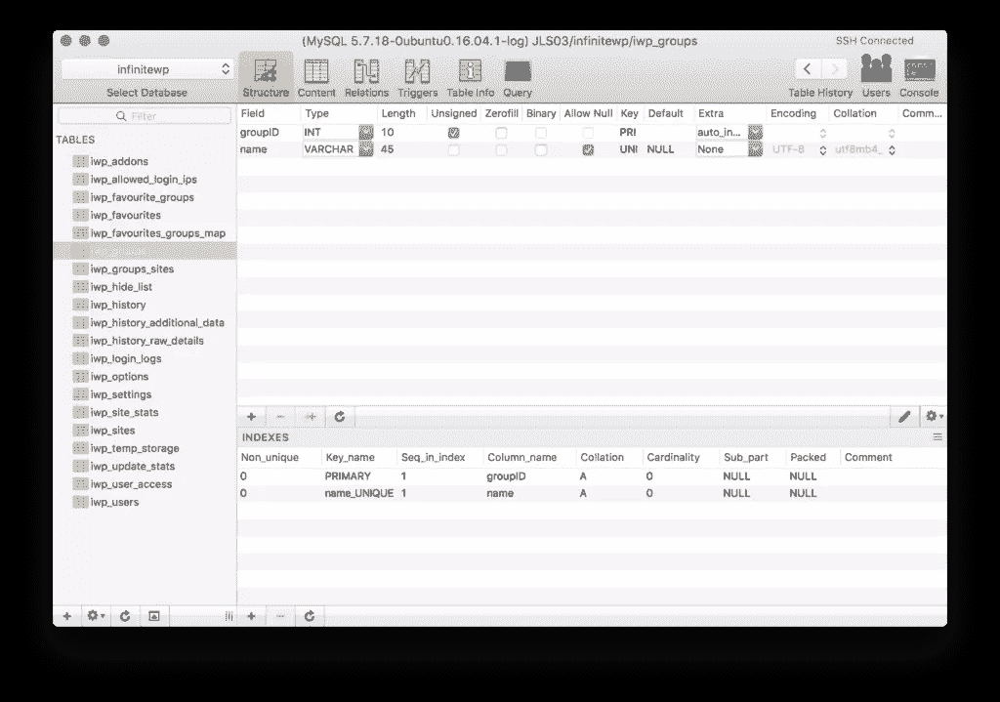
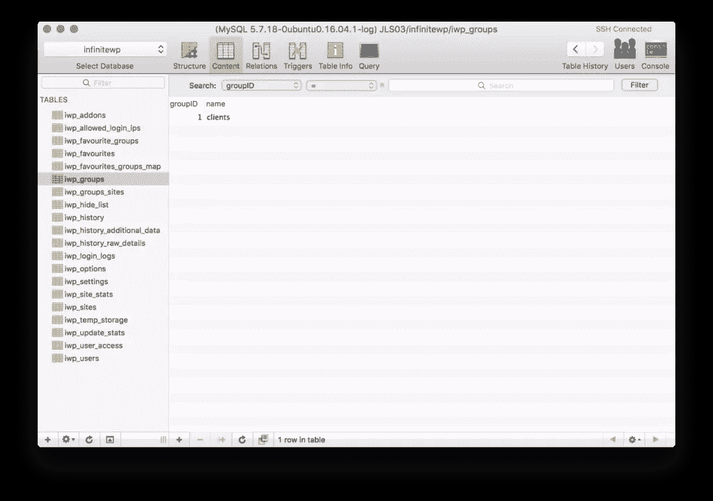
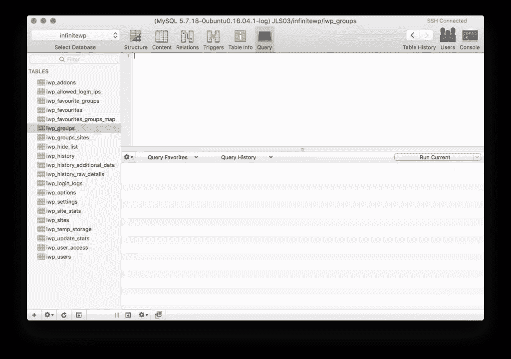
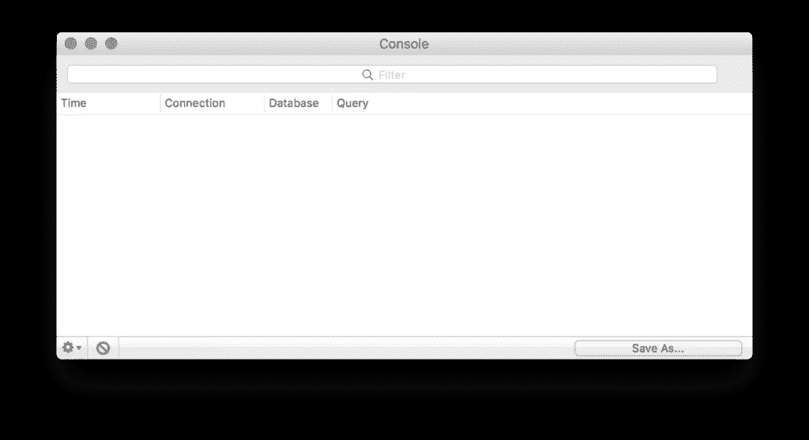

# 如何在 macOS 上使用 Sequel Pro 管理 MySQL 数据库

> 原文：<https://www.sitepoint.com/sequel-pro-manage-mysql-databases/>

本文是与 SiteGround 合作创作的系列文章的一部分。感谢您对使 SitePoint 成为可能的合作伙伴的支持。

许多在数据库中使用 MySQL 的开发人员可能是从命令行管理 MySQL 数据库的专家，但是其他人确实需要一个可视化工具，一个带有图形界面的工具，在管理数据库时使用。似乎最常用的工具之一就是 [phpMyAdmin](https://www.phpmyadmin.net/) 。这是一个基于 web 的工具，安装在您的 web 服务器上。用户可以访问特定的地址和端口，以数据库用户的身份登录，并可视化地管理该服务器上的数据库。虽然这很有用，但本质上是不安全的，为 MySQL 用户提供了一个 web 界面。

另一个选择是 [MySQL Workbench](https://www.mysql.com/products/workbench/) ，这是一个可以下载在许多主要操作系统上使用的程序，可以远程连接到数据库进行管理和规划。然而，这篇文章将展示 macOS 用户第三种选择的使用: [Sequel Pro](https://www.sequelpro.com/)

。

Sequel Pro 是 macOS 的原生应用。您可以在收藏夹列表中设置任意数量的数据库连接，从而快速访问您需要重复访问的数据库。Sequel Pro 还提供了在应用程序中使用 SSH 密钥的选项，以便让您使用它来管理 SSH 上的数据库，使用密钥而不是用户名和密码。与要求用户仅使用 MySQL 用户和相应密码登录的方法相比，这提供了显著的安全优势。

## 使用 Sequel Pro

Sequel Pro 是一种在 macOS 上管理数据库的简单方法。入门是一个简单的过程；你下载应用程序，安装它，然后启动 Sequel Pro！

### 设置新的数据库连接

当你启动 Sequel Pro 时，如果你还没有设置数据库，你会看到一个屏幕，要求你创建一个新的服务器连接。

以上是标准数据库的连接信息，但是您也可以选择 SSH 选项卡来使用 SSH 连接到您的数据库，这取决于您的服务器的配置和安全性。

所要求的细节相对简单。

*   **主机**–用于访问数据库的 IP 或 URL
*   **用户名**–MySQL 用户的用户名(具有读取或写入数据库的正确权限的用户)
*   **密码**–MySQL 用户的密码(拥有读取或写入数据库的正确权限的用户)
*   **数据库**–您打算连接的特定数据库的名称
*   **端口**–连接到服务器的端口。标准 MySQL 连接的缺省值是 3306。

如果新连接的类型是 SSH，您还需要提供您的 SSH 主机、用户名、密码和端口(默认为 22)。如果您更喜欢使用 SSH 密钥，您可以点按密码栏旁边的密钥图标，以允许从 Mac 的文件系统中选择密钥文件。

一旦连接到数据库，就会出现结构视图。

### 结构视图

结构视图顾名思义就是允许您查看和修改数据库结构的视图。表格列在左侧，右侧窗格包含当前选定表格的字段列表及其各自的属性。在这里，您可以编辑字段，更改它们的名称，赋予它们默认值，更改它们的编码模式，更改它们的最大长度，或者使它们成为它们的表的键。您也可以在此视图中创建新字段。

### 内容视图

内容视图是您查看或修改数据库表中实际值的地方。您可以使用顶部的栏和过滤器运行搜索，根据任何字段的值进行搜索。记录被选中后可以修改，窗口底部的加号允许您添加新的记录。任何使用过另一个 GUI 进行编辑的人都很熟悉这里的编辑内容。这是一个比大多数桌面程序更好的界面，而且非常容易使用。

### 查询视图

查询视图为您提供了一个可以编写命令、手动运行 MySQL 查询来组织数据库、表、记录和其中的数据的地方。您还将能够查看查询历史，允许您快速方便地重复需要更频繁运行的查询，用于测试、维护、数据搜索、备份或其他类似的修复需求。这为您提供了附加到 GUI 的命令行功能，以备不时之需！

### 安慰

控制台让您可以查看 MySQL 操作的历史。这些日志可以帮助您回顾过去，找到错误或问题。您也可以将控制台日志保存为文件，以备后用。

## 结论

如果您使用 Mac 进行 web 开发，并且经常需要管理数据库，请尝试 Sequel Pro！你可以用它来连接共享主机或 VPS 环境中的多个数据库(如果你正在寻找优秀的主机，请查看我们的合作伙伴 SiteGround)。寻找一个好的基于 GUI 的数据库管理程序是值得的，而且是完全免费的。绝对是 macOS 开发工具包中的一个好工具！

## 分享这篇文章