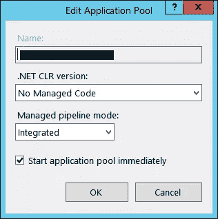

# 实施 ASP.NET 核心应用程序的常见陷阱

> 原文：<https://www.sitepoint.com/common-pitfalls-implementing-asp-net-core-apps/>

*特别感谢[马修·威尔金](https://www.sitepoint.com/author/mwilkin/)好心帮助[同行评审](https://www.sitepoint.com/introduction-to-sitepoints-peer-review/)这篇文章。*

近年来，微软已经将 ASP.NET 核心框架吹捧为 ASP.NET 的未来。微软的网络专业人士对 ASP.NET 核心很感兴趣。如果您在 Windows 上运行 web 应用程序，并且想要进行升级，有什么困难吗？向最新和最伟大的转变是否顺利？

在这次采访中，我想深入探讨一下当您升级到 ASP.NET 核心时可能会遇到的常见陷阱——假设您急于做出改变。作为开发人员，能够接触到让您的生活更轻松的闪亮新工具总是令人兴奋的。

对于本文，我将使用“ASP。NET classic”来引用遗留的 ASP.NET 框架。我将使用“ASP。NET Core”是指微软为 ASP.NET 开发者提供的标准框架。

微软在使 ASP.NET 核心跨平台方面取得了积极的进展。新工具可以在 Linux、macOS 和 Windows 上运行。知道您的后端代码现在可以在任何地方运行可能会令人欣慰。这将开发人员从在 Windows 机器上编码中解放出来。新的工具可以满足你的个人喜好。

来自 ASP.NET 经典，一个有效的假设是你在 Windows 平台上。对你来说，现在跨平台可能并不合适。到目前为止，ASP.NET 经典版一直是一等公民，只属于 Windows。当然，这种与 Windows 和 IIS 的紧密集成是福也是祸。

那么，ASP.NET 核心对 Windows Server 和 IIS 上的开发者意味着什么呢？现在 ASP.NET 核心是跨平台的，这意味着什么？

## 依赖地狱

与 IIS 分离的一个自然结果是依赖性的激增。ASP.NET 核心在 Kestrel 上运行，这是一个响应 HTTP 请求的独立进程。这意味着框架依赖于 IIS 曾经存在的一堆依赖项。这些依赖项是基本的 NuGet 包，您可以从互联网上下载。

对于 ASP.NET 核心，NuGet 是获取依赖项的标准方式。事实上，大多数工具现在是一个解耦的 NuGet 包，您可以将其作为依赖项添加。您安装在本地 dev box 上的工具只是一个垫片。目的是让你的应用程序和它所有的依赖项保持独立。ASP.NET 核心的大部分来自于即插即用的模块化 NuGet 包。

这是对紧密耦合到 IIS 的旧的整体框架的一个新的尝试。ASP.NET 核心是跨平台的，它的意思是。曾经依赖于巨大的 IIS 和 Windows 安装的东西现在被简化为一个 NuGet 包。这使得框架更加敏捷和灵活。改变一个小的 NuGet 依赖比在你的 web 服务器上安装模块更容易。

但是，通常情况下，还是有一些问题:

*   在本地开发机器上，团队看到了一个 NuGet packages 文件夹，其中包含 1GB 的依赖项。
*   如果您的构建服务器位于防火墙之后，您就要上传每个微小的依赖项——这是一个繁琐的过程。
*   默认情况下，工具会引入元包，元包可能会有额外的依赖关系。

元包的一个缺点是，如果你在 Windows 上，你会看到奇怪的依赖关系，比如:

将 Linux 和 macOS 运行时作为依赖项包含进来并不常见，因为您只希望在 Windows 上运行它。然而，如果你想通过建设，这是必要的。有一种方法可以减少你的依赖足迹，但是在企业环境中不太实用。很少有专业人士有时间去调整一系列微小的依赖关系。希望这个工具能做得更好，并在未来为您规范化依赖关系。

在您的构建服务器上获得成功的构建存在一定的挑战。我和我的团队感觉这就像经历了一场我们没有准备好的过山车。因为所有的依赖性，ASP.NET 核心团队的一个可爱的代号是“胖女人”。

这给我们留下了一个问题。如何将这个庞大的框架放入 web 服务器？

## 部署自动化

如果你的团队在 ASP.NET 经典上有工作部署，你会看到很多变化。ASP.NET 核心使用一套新的部署工具。

来自 ASP.NET 经典，希望部署是可重用的。在自动化中，有一组脚本用于将更改上传到 web 服务器。自动化中运行的脚本通常被称为部署管道。在 Windows 中，这意味着 PowerShell 脚本可以确保可靠和可预测的部署。拥有可重用的管道是确保一致部署的一种方式。

ASP.NET 核心工具使用一组独立的命令行工具来创建部署包。这其中的细微差别将迫使您创建一个新的部署管道。例如，MS Build 是 ASP.NET 经典部署的首选 CLI 工具。对于 ASP.NET 核心，有一个`dotnet publish`命令来创建一个包。两者之间的微妙差异将团队带入了一个新的渠道。不幸的是，许多现有的自动化不可重用。

ASP.NET 经典赛的自动化做出了不再有效的假设。对我们来说，目标是为一个好的部署收集最基本的必需品。这需要所有人全力以赴来充实所有必要的细节。

微软在最近发布的 ASP.NET 核心中增加了对 MS Build 的支持[。考虑到时间框架，我们对于这个声明来说有点太早了。一个想法是在深入研究 ASP.NET 核心之前审查部署需求*。调查现有管道的哪一部分是可重用的。*](https://docs.microsoft.com/en-us/aspnet/core/publishing/web-publishing-vs)

IIS 的情况基本相同:有很多变化。Windows Server 和 IIS 需要一个新的模块，ASP.NET 核心应用才能正常工作。一个好的解决方案是将 ASP.NET 核心应用与传统应用隔离开来。必要的 HTTP 模块可能会对 ASP.NET 经典有负面影响。在活动服务器上，确保应用最新的补丁，并在服务器停机时有时间解决任何问题。有[指南让你开始](https://docs.microsoft.com/en-us/aspnet/core/publishing/iis#install-the-net-core-windows-server-hosting-bundle)在 IIS 中设置 ASP.NET 核心。

现在胖女人(ASP.NET 核心)快乐地奔跑着，还有什么陷阱呢？

## 托管代码与非托管代码

对于自动化，一个常见的缺陷是将应用程序池设置为托管代码。在 ASP.NET 核心中，这是一项不能重用的配置。部署期间不断出现的一个问题是将应用程序池设置为错误的模式。如果这样做，您将看到一个带有 502 错误的流程失败。

可能引起混淆的是，ASP.NET 核心运行在标准框架之上。例如，ASP.NET 经典版在经典框架和托管代码中运行。在 ASP.NET 核心和 IIS 中，承载 web 应用程序的进程不在任何框架上运行。ASP.NET 核心在一个独立的进程中运行，与标准框架分离。

确保将应用程序池设置为非托管代码。双击应用程序池时，它应该是这样的:

IIS 通过反向代理将 ASP.NET 核心应用程序作为外部进程运行。这是因为它不再与 IIS 紧密集成，而是跨平台的。web 服务器使用 HTTP 模块来跟踪进程。ASP.NET 核心拥有发送 HTTP 响应所需的所有中间件，它不再依赖于 IIS。

## ASP.NET 经典依赖

任何不在 ASP.NET 核心上的依赖都会有后果。在您的依赖列表中，您可能会找到一个依赖于 ASP.NET 经典。任何依赖于 ASP.NET 经典的东西都需要整个遗留框架才能工作。

微软在实现无缝过渡方面取得了长足的进步。对于外部流行的依赖，你经常会发现与 ASP.NET 核心工作的软件包。ASP.NET 核心框架有许多您已经熟悉的相同的包。这使得升级更加实际可行。

例如，ASP.NET 核心有实体框架，Dapper 和 ADO.NET 的软件包。这些包裹就像他们在 ASP.NET 经典中的对应物。

对于内部依赖，情况完全不同。如果依赖项没有 ASP.NET 核心端口，您将需要 ASP.NET 经典。ASP.NET 核心和 ASP.NET 经典是唯一的。对于希望迁移到闪亮的新框架的团队来说，这通常是一个盲点。

一个好的方法是评估你的依赖列表，找出什么依赖于什么。找出依赖关系的层次结构，并深入研究依赖关系的依赖关系。这样你就能提前知道会发生什么。这个想法是为了减少部署过程中不可预测的意外情况。

如果由于依赖性，您仍然需要 ASP.NET 经典版，可以在遗留框架上运行 ASP.NET 核心。但是，[这给你的部署增加了更多的风险](https://blogs.msdn.microsoft.com/cesardelatorre/2016/06/28/running-net-core-apps-on-multiple-frameworks-and-what-the-target-framework-monikers-tfms-are-about/)，比如处理[认证 cookie](https://docs.microsoft.com/en-us/aspnet/core/security/data-protection/compatibility/cookie-sharing)。

一个问题是，您期望从依赖关系中得到的默认行为将会改变。当连接 ASP.NET 核心依赖项时，确保不要做任何假设。例如，[认证 cookie](https://docs.microsoft.com/en-us/aspnet/core/security/data-protection/compatibility/cookie-sharing) 有一组不同的默认设置。ASP.NET 核心在某些情况下是完全重写的，所以一个安全的假设是默认行为将会改变。不要做任何你在《ASP.NET 经典》中做过的假设。测试和验证你所有的依赖关系。

## 结论

总的来说，你用 ASP.NET 核心得到的新框架是相当光滑的。作为开发人员，您会发现更好的编码体验。该工具简化了框架，并且可以从 Visual Studio 外部访问。与 Windows 和 IIS 分离是朝着正确方向迈出的一步。

有了 ASP.NET 核心，你会发现一个更精简的框架。我发现 CLI 工具令人耳目一新，非常有效。例如，要运行所有单元测试，执行`dotnet test`并在不到一秒的时间内获得即时反馈。在 Visual Studio 中，没有必要点击鼠标来获得反馈。当您有一堆测试时，Visual Studio 中的反馈通常很慢。一般的编码体验来自极简主义的现代框架。

ASP.NET 核心 MVC 框架有所改进。Web API 和 MVC 现在是一个单一的框架。您从单个控制器继承来使用两者。在确定使用哪一个时没有混淆，这使得它更有效。

和所有新事物一样，一头扎进去是有后果的。我希望这篇文章指出了你至少想要考虑的常见陷阱。在开始这一新的冒险之前，最好知道你将会进入什么样的境地。

* * *

### SitePoint 上的更多资源:

*   书:[用 C# & VB，第四版](https://www.sitepoint.com/premium/books/build-your-own-asp-net-4-website-using-c-vb-4th-edition)建立自己的 ASP.NET 4 网站
*   文章:[用 Visual Studio 和 ASP.NET 在一个小时内完成一个网页游戏](https://www.sitepoint.com/build-a-web-game-in-an-hour-with-visual-studio-and-asp-net/)

## 分享这篇文章