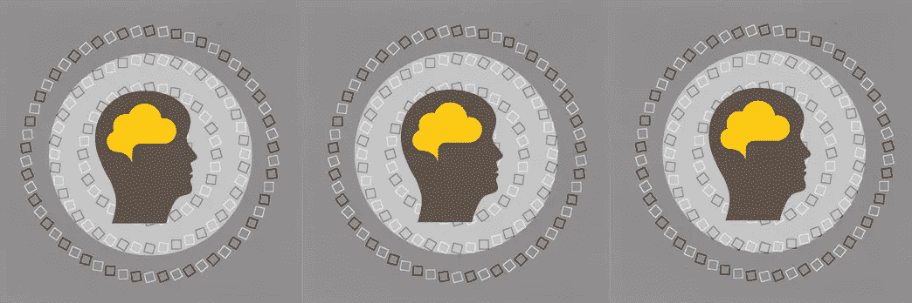
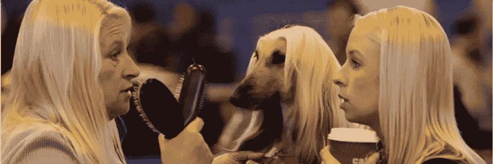
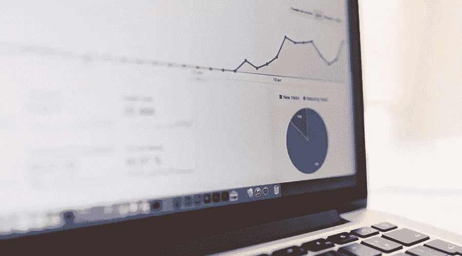
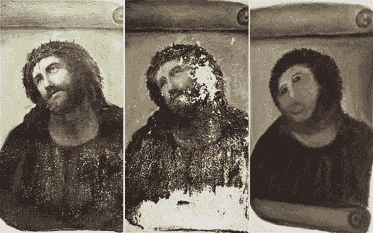

# 7 个被证实的认知偏差(以及它们如何影响你的设计)

> 原文：<https://www.sitepoint.com/7-proven-cognitive-biases-and-how-they-impact-your-design/>

“认知偏差”是人类思维中的一个错误，它会影响我们如何做决定——这是我们对世界理解的一个盲点。

尽管这些偏见会对我们的设计产生深远的负面影响，但众所周知，从内部很难注意到它们。意识到这些偏见将有助于你在设计产品时做出更明智、更客观的决定。他们甚至可以帮助你的设计。

### 7 个认知偏差

*   [1。宜家效应](#the-ikea-effect)
*   [2。注意力偏差](#attentional-bias)
*   [3。怪异效果](#the-bizarreness-effect)
*   [4。支持选择的偏见](#choice-supportive-bias)
*   [5。邓宁-克鲁格效应](#the-dunning-kruger-effect-overestimation-underestimation-effect)
*   [6。锚定效应](#the-anchoring-effect)
*   [7。框架效应](#the-framing-effect)

## 1.宜家效应

“宜家效应”被定义为[对你自己组装的物品赋予过高价值](http://www.hbs.edu/faculty/Publication%20Files/11-091.pdf)的趋势。

当然，这种偏见源自宜家著名的自我组装家具的商业模式。研究表明，当人们被要求对他们组装的宜家椅子和预组装的椅子进行价值评估时，他们总是更看重手工组装的椅子。

换句话说，人们倾向于对他们参与的项目投入过多的感情。附属于你曾参与的项目似乎是一件很自然的事情——尤其是如果你从一开始就在那里的话。如果是你提出了这个项目的想法，宜家的偏见会更加明显。

### 你如何战胜宜家效应？

虽然想要保护自己的想法是很自然的事情，但是这可以让你从队友那里得到有价值的反馈，这些反馈可能会改善甚至挽救项目。

放下你的自我，让你的想法成熟起来，与他人一起成长。

## 2.注意力偏差

注意力偏差指的是[专注于反复出现的想法](https://www.verywell.com/what-is-an-attentional-bias-2795027)的倾向。我们都有自己的爱好和兴趣，但有时它们会拖累我们。

例如，如果你是一个热衷于“时尚”的人，你可能会把这个世界看成一个延伸的时装秀。或者也许你痴迷于字体设计？你看到的每一个街道标志、页面和商店标牌都是由排印行距、字距和粗细组成的。俗话说，“对于拿着锤子的人来说，每个问题看起来都像钉子。”

有兴趣或者专注于你所做工作的某个方面当然没有错。然而，有时这会导致思维停滞。我们可能会忽略一个设计问题的奇妙的摄影解决方案，仅仅因为我们太专注于类型。

### 你如何战胜注意力偏差？

拓宽你视野的最好方法是主动去寻找你领域之外的信息——也就是大脑之外的信息。接触其他行业、领域或有其他兴趣的人。和他们讨论你的问题。

简而言之:你需要与你想法不同的人的意见和观点。尝试使用一个简单的用户测试服务，如 [Peek](http://peek.usertesting.com/) 来看看一个真实的人是如何浏览你的网站的。

## 3.怪异效应

奇怪效应是一种你可以利用的认知偏差。这是一种倾向，古怪或奇异的材料更容易让人记住或引起人们的注意。

有时，这可能就像正常页面上的一个小奇怪现象一样简单。海瑟薇杂志广告中的那位戴着眼罩的绅士就是一个很好的例子。

或者可能是一场古怪的海啸，就像大获成功的旧香料广告一样。一个以浴室为背景的标准古龙水广告突然开始打破所有的现实规则。

在营销和产品定价时，这也是一个有用的策略。大多数产品都有可预测的价格，如 99 美元、50 美元或 14.95 美元。这样的价格很常见。

但是，定价为 3.44 美元、57 美元或 2913 美元的产品很少见。Hostinger 在他们的定价策略中使用了怪异效应，将 2.15 美元/月作为起始价格。

### 给设计师的教训？

很容易陷入用默认值设计的*中，而没有真正考虑它们的真正价值。为了帮助顾客记住你的产品，混合一些奇怪的数字。一旦他们引起人们的注意，他们[会因为他们笨拙的天性而变得更加令人难忘。](http://www.copyblogger.com/cognitive-biases/)*

## 4.支持选择的偏见

支持选择的偏见是一种倾向，即记得做出了比你实际做出的更好的选择。你有没有问过别人在赌场玩得怎么样？通常答案是类似于“哦，我差不多不亏不赚了”。当然，赌场似乎做得很好，所以有人在输。

这种偏见很容易解释:没人想把精力放在回忆自己搞砸的事情上。

不幸的是，当涉及到产品设计时，这种偏见会对你未来的工作产生负面影响。这就是为什么依赖硬数据而不是“直觉”是至关重要的。无论您对数据的看法如何，数据都保持不变。数据是什么，由你决定。

### 你如何克服支持选择的偏见？

对项目和你的团队的进展做详细的记录，或者使用一些更定量的东西作为频繁的用户测试，就像前面提到的 *Peek* 。

## 5.邓宁-克鲁格效应(高估-低估效应)

当一个没有技能的人高估了他们的技能或者一个有技能的人低估了他们的技能时，就会出现[邓宁-克鲁格效应](http://rationalwiki.org/wiki/Dunning-Kruger_effect)。事实证明，在某项特定任务中最不称职的 ***人员往往对自己的技能评价最高*** 仅仅是因为他们太无知，不明白拥有这项技能意味着什么。

换句话说，他们*不知道*他们不知道的事情。

邓宁-克鲁格效应的一个经典例子发生在 2010 年，当时一位上了年纪的教堂信徒自作主张修复了一幅著名的教堂壁画，并毁掉了这幅壁画。

不幸的是，不进行自我评估就做出决定是很难避免的。不管怎样，重要的是要知道你在新手和专家之间的道路上处于什么位置。

### 如何避免邓宁-克鲁格效应？

对自己诚实。如果你的技能有限，在你不知道或不确定的事情上寻求帮助。这比做出错误或糟糕的决定要简单得多。拥有专业技能的人则相反。在这一点上，你应该知道你已经有足够的经验来做出一个好的决定，而不用再怀疑自己。

## 6.锚定效应

图片来源:盒子。

锚定是指[在做出决策时严重依赖第一条信息](http://disenthrall.co/3-examples-of-the-anchoring-rule-in-marketing/)的倾向，无论第一条信息是否与决策本身相关。

如果我让你从一副牌中挑选一张数字牌，然后让你对一件物品出价，如果你挑选的牌是正面较高的牌，你对该物品的出价会较高。反之亦然。第一条信息是你竞标的基础。

### 你是如何利用锚定效应的？

这种策略在营销和转化中很有用。例如，[框](https://www.box.com/pricing)通过使用不同的颜色和“最受欢迎”的社交标签来强调商业计划，第一次看到该商业计划的用户将会看到该商业计划最突出，并将成为锚。

## 7.框架效应

图片鸣谢:苹果。

[框架效应](https://en.wikipedia.org/wiki/Framing_effect_%28psychology%29)是一种技术，可以让人们从相同的信息中得出不同的结论——这取决于信息呈现的方式，或“框架化”。

这对产品销售、宣传、转化、营销甚至产品设计本身都至关重要。苹果公司因其营销活动和对产品信息的组织而闻名于世。

这里有一个例子:虽然 iPhone 非常纤薄，但它已经多年没有获得世界上最薄手机的称号了。然而，将 iPhone 宣传为“*世界第七薄智能手机*”并没有太多的头条新闻。

但是如果他们重新定义同样的事实呢？

> 最薄的 iPhone。永远不会。

是真的。手机突然看起来更有吸引力了，对吧？

本质上，他们只是“选择了一个他们完全控制的比赛”,然后向我们展示了他们的冠军奖牌。他们选择了一个更适合他们的框架。

正如我们所看到的，它从来都不是关于功能或产品，它总是关于客户的需求和愿望。

### 你如何利用框架效应？

用户如何与产品互动也是你应该如何向他们展示产品。视角可以帮助或阻碍客户的决策或体验。明智地选择你的框架。

### 结论

认知偏见当然没什么好羞愧的。它们是人类的一部分，我们都有。只有当我们没有注意到它们对我们设计决策的影响时，它们才会成为真正的问题。

希望今天我们已经能够关注这些常见的偏见，并给你一些工具来帮助减轻它们对你工作的负面影响。

为什么不把你学到的东西转化成一个响应迅速的网站呢？

## 分享这篇文章