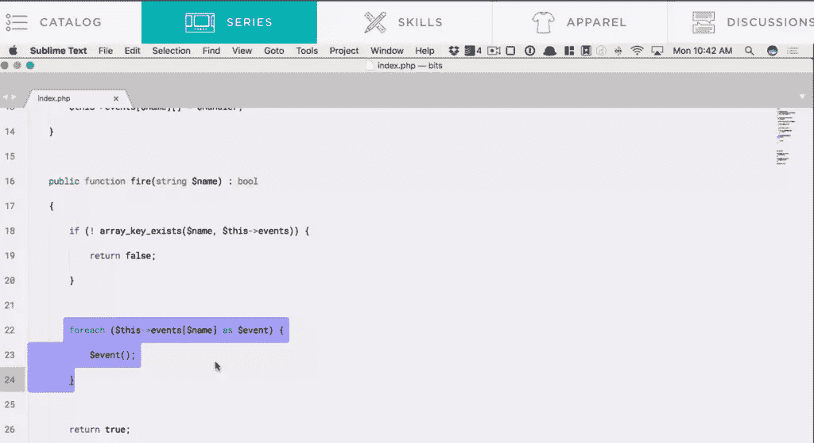

# PHP 中视觉和技术债务的平衡

> 原文：<https://www.sitepoint.com/balance-visual-technical-debt-php/>

*这是 2017 年 5 月 30 日 SitePoint PHP 时事通讯的一篇社论！*

* * *

Laracasts 最近发布了一个非常有趣的非 Laravel 视频，关于一个叫做*视觉债务*的东西。它只有 3 分钟长，所以请在进一步阅读之前花时间观看它。



完成了吗？好了，下面剧透。

* * *

在视频中，Jeff 从一些冗长的基于事件的代码开始，包括一些侦听器、fire 方法、各种类所基于的接口，以及许多类型和返回提示。

当他滚动代码时，他声称其中充满了*视觉债务*。Jeff 接着解释说，虽然 PHP 确实提供了类型和返回提示，但它们并不是必需的，并迅速从所有方法签名中删除它们以减少代码量。“没有他们，我们在很长一段时间里都过得很好”，他说。

然后他伸手去拿接口，也把它们拿掉了。他认为人们太频繁、太快地使用它们，给他们的代码增加了不必要的重量。

在看起来像是 *final* 的删减中，他从一个类中删除了“final”关键字，认为保护开发人员不受其害是愚蠢的，但是出乎意料的是，他甚至还删减了剩余方法前面的`public`关键字，让它们保留语言默认值(顺便说一下，这是一个隐含的`public`)。

最终结果？在这个简单的例子中，代码减少了大约 25%。但是*债*没了吗？

* * *

如果你在某种程度上关注过我的咆哮，你就会知道我非常反对遗产，并且支持长篇大论。因此，当 PHP 中出现合适的类型提示时，我非常激动。

我遇到的错误数量和我在处理其他人的代码时浪费的时间数量是巨大的，因为他们没有清楚地表明作为方法的输入或输出应该是哪种类型的值，对我来说，仅仅是能够完成良好的自动静态检查，以及在工作时正确、详细的 IDE 自动完成提示，就值得全面过渡到最新的 PHP 版本。

当在团队中工作时，对代码的更多控制意味着更少的人为错误，我完全同意这一点。时间是宝贵的，把时间浪费在可预见的错误上是彻头彻尾的罪恶。我不同意 Jeff 将这些从他的代码中删除。在很长一段时间里，我们没有它们也过得很好，但是没有很多现在让我们生活得更好的东西，我们也过得很好。对我来说，它们并不代表视觉上的债务——没有它们，我觉得欠了*的债*，因为我知道我可以从它们中受益，避免*的技术性债务*。

我同意他删除接口。在视频中的例子中，它没有提供任何实际的好处，尽管这可能是因为示例代码本身的原因。他选择事件作为例子，视频中描述的他的事件类实际上是相当不错的接口。

总的来说，我认为接口是可以接受的，如果你正在构建一个旨在作为某种东西的扩展或替代的东西，或者当你正在使用的包使用一个接口来确保签名匹配时，但否则它们会增加相当多的代码量。我记得我的旧 Zend Framework 1 天前，在框架目录结构的 20 层深处，核心接口没有主体——只有一个类和空括号。一句话，代码官僚主义。

移除`final`是完全正当的。阻止人们扩展一个类(这很容易绕过)看起来毫无意义，如果这意味着作为一种团队内部的预防措施来约束同事，它就像备忘录一样有效。有些人会[强烈反对](https://ocramius.github.io/blog/when-to-declare-classes-final/)，但我说打倒`final`。我不认为它的存在是视觉上的债务，也不认为它的不存在是技术上的债务——我只是看不到它的用处。

最后，移除了方法前面的`public`,例如:

```
public function fire( ... ) { ... } 
```

对此:

```
function fire ( ... ) { ... } 
```

我不能说我同意这一点。虽然它确实从文件中删除了一些字符，但我认为它弊大于利。首先，作为一个患有轻度强迫症的人，我会对其他方法有`protected`和`private`而`public`的方法是赤裸裸的这一事实感到难以置信的困扰。

```
function fire ( ... ) { ... }
protected function log ( ... ) { ... } 
```

其次，几乎所有地方的例子都使用了`public`关键字，尽管这是不必要的——他们这样做是为了教导那些刚刚开始学习 PHP 的人，并训练他们使用一种通用的方法。想象一下，如果每个人从第一天开始就被训练使用空间，我们会在哪里？第三，虽然现在不需要`public`声明，但是大多数人都在使用它，而且它很可能在将来成为强制性的，就像 PHP4 风格的构造函数直到 7.0 版本才出现，之后就不再出现了。这种感知*视觉债务*的去除留给你的是 ***技术债务*** 。

## 结论

总的来说，我会说我努力追求常识(不需要 final，或者在明显不需要接口的时候也不需要接口)并且**在冗长方面犯错**:静态类型提示，甚至在单独的项目中也是如此，在团队中冗长胜过视觉自由，因为冗长让事情对每个人都更清晰，减少误解。

总之，在这种情况下，我没有顽固的偏好。对于他的每一个论点，我的意见是肯定和否定的混合，但我完全同意他的最终观点:**质疑一切**–*甚至是那个让你质疑一切*的人。

知识的诅咒是强大的，来自权威的论证甚至更强大。不要仅仅因为冲浪板感觉安全，就让自己被感知的专业知识浪潮所携带。视觉债务和技术债务都存在，好的代码总是两者的平衡。

你对视频中呈现的视觉自由有何感受？哪些让你困扰，哪些你会领养？

## 分享这篇文章