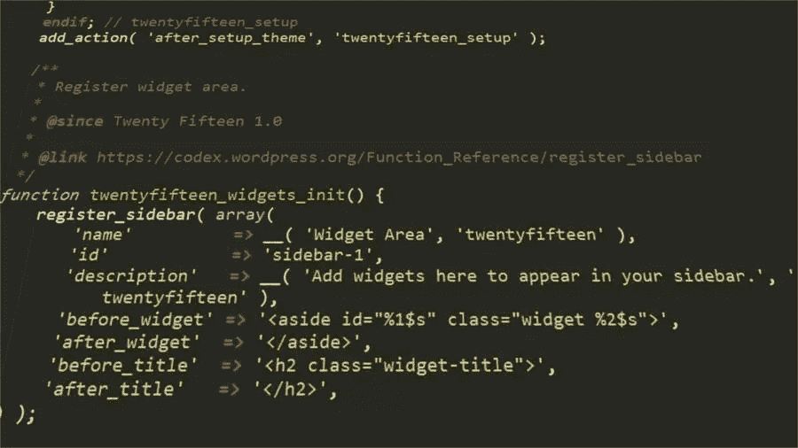

# 用内置的 WordPress 函数编写安全的主题

> 原文：<https://www.sitepoint.com/safe-wordpress-themes-validation-escaping-functions/>



本文是与 SiteGround 合作创作的系列文章的一部分。感谢您对使 SitePoint 成为可能的合作伙伴的支持。

随着 27%的网络用户使用 WordPress，对于任何在这个超级流行的开源平台上运行他们的网站的人来说，安全是首要考虑的问题。虽然 WordPress core 的安全性由一个专门的开发团队负责，但是成千上万的第三方插件和主题就不一样了，这些插件和主题扩展了 WordPress，让它可以做你想做的任何事情。仅仅一个易受攻击的插件或主题就可能代表着数百万网站的高风险。

除非你使用一个可靠的托管服务提供商，允许你的 WordPress 插件自动更新，并定期进行安全检查，比如我们的合作伙伴 [SiteGround](https://www.siteground.com/wordpress-hosting.htm) ，否则你网站的主题和插件安全完全由你决定。

在这篇文章中，我将介绍一些你可以在 WordPress 主题开发中应用的指南和 WordPress 函数，以确保你的产品以用户安全为核心。

## 注重安全性的开发人员的原则

对于专门的 WordPress 插件和主题开发者来说，在他们编写的每一行代码中，安全性都是他们考虑的首要问题。

编写安全 WordPress 主题的严肃的整体方法包括注意以下一般原则:

*   **认为所有数据都不安全**,直到证明并非如此
*   尽可能使用 WordPress 功能。大多数 WordPress APIs 都有内置的安全机制，这意味着使用它们会降低你的代码暴露于漏洞的风险
*   **用最新的技术和最佳实践保持您的代码最新**。

## 你需要注意什么

您需要注意的最常见威胁有:

*   **SQL 注入**:攻击者注入恶意的 SQL 代码来控制网站的数据库服务器
*   **跨站脚本(XSS)** :攻击者将恶意的 JavaScript 代码注入网页
*   **跨站点请求伪造(CSRF)** :攻击者强迫用户在经过身份验证的网站上执行不受欢迎的操作。

Web 安全总是在不断发展，因此了解最新的威胁非常重要。就 WordPress 而言， [Sucuri 博客](https://blog.sucuri.net/category/wordpress-security)是了解漏洞和攻击的好地方。

## 数据验证、净化和逃逸

在接受来自任何来源(例如，用户、web 服务、API 等)的任何输入数据之前。，您必须检查它是否是您所期望的，以及它是否有效。这个任务叫做*验证*。

例如，如果您通过网站上的一个表单收集用户的电子邮件，您的代码需要检查用户是否输入了一些文本输入(例如，不是一些数字或者根本没有输入)，并且在将数据输入到数据库之前，输入对应于一个有效的电子邮件地址。

您可能认为这种检查在主题中几乎不需要。事实上，使用插件比主题更能包含表单。然而，事实并非完全如此。例如，如果您计划通过[定制器](https://developer.wordpress.org/themes/customize-api/)添加主题选项，您可能需要对用户的输入执行一些数据验证。

净化包括过滤或清理来自用户、网络服务等的数据。它将被存储在数据库中。在此过程中，您可以从数据中删除任何有害或不需要的内容，例如 JavaScript 语句、特殊字符等。

*转义*在于确保数据可以安全显示，例如删除特殊字符、编码 HTML 字符等。这里推荐的做法是**尽可能晚的逃离**，就在屏幕上显示数据之前。

你需要在 WordPress 主题中做大量的净化和转义。事实上，为了安全起见，最好的办法是净化/转义所有动态数据，即任何没有在 HTML 源代码中硬编码的数据。

## WordPress 验证功能

您可以使用许多方便的 PHP 函数来执行基本的验证。

例如，要检查一个变量是否不存在或者其值是否设置为 *false* ，您可以使用 [`empty()`](https://secure.php.net/empty) 。

然而，为了使验证变得轻而易举，WordPress 提供了这些有用的功能。

*   您可以通过使用 [`is_email( $email )`函数](https://developer.wordpress.org/reference/functions/sanitize_email/)来检查数据是否为有效的电子邮件地址。

    例如:

    ```
    if ( is_email( 'test@domain.com' ) ) {
      echo 'valid email address.';
    }
    ```

*   为了检查有效的用户名，WordPress 提供了 [`username_exists( $username )`](https://developer.wordpress.org/reference/functions/username_exists/) :

    ```
    $username = 'testuser';
    if ( username_exists( $username ) ):
      echo "Username exists.";
    endif;
    ```

*   要确保标签、类别或其他分类术语存在，可以使用 [`term_exists( $term, $taxonomy = '', $parent = null )`](https://developer.wordpress.org/reference/functions/term_exists/) :

    ```
    //check if the category cats exists
    $term = term_exists('cats', 'category');
    if ($term !== 0 && $term !== null) {
      echo "The 'cats' category exists.";
    }
    ```

*   要确保文件路径有效(但如果存在则无效)，请使用 [`validate_file( $file, $allowed_files )`](https://developer.wordpress.org/reference/functions/validate_file/) :

    ```
    $path = 'uploads/2017/05/myfile.php';
    // returns 0 (valid path)
    return validate_file( $path );
    ```

## WordPress 净化/转义功能

使用内置的 WordPress 函数来净化和转义数据是最快和最安全的方法，因此把它们作为你的首选。

下面是我发现自己在开发 WordPress 主题时经常使用的功能。

*   [`sanitize_email( $email )`](https://developer.wordpress.org/reference/functions/sanitize_email/) 删除有效电子邮件地址中不允许的所有字符的数据。这里有一个取自[抄本条目](https://codex.wordpress.org/Function_Reference/sanitize_email)的例子:

    ```
    $sanitized_email = sanitize_email(' admin@example.com!  ');
    // will output: admin@example.com
    echo $sanitized_email;
    ```

*   [`sanitize_option( $option, $value )`](https://developer.wordpress.org/reference/functions/sanitize_option/) 根据选项的性质，对选项值进行清理，例如从定制器输入。这里有一个例子:

    ```
    sanitize_option( 'admin_email', 'admin@test.com!' );
    ```

*   [`sanitize_text_field( $str )`](https://developer.wordpress.org/reference/functions/sanitize_text_field/) 清除用户或数据库提供的字符串，但您可以使用它来清除任何您希望只是纯文本的数据:

    ```
    //Output: Heading Title
    echo sanitize_text_field('<h1>Heading Title</h1>');
    ```

*   [`sanitize_hex_color( $color )`](https://developer.wordpress.org/reference/functions/sanitize_hex_color/) 和 [`sanitize_hex_color_no_hash( $color )`](https://developer.wordpress.org/reference/functions/sanitize_hex_color_no_hash/) 在 WordPress 定制器的上下文中工作。

    当你的主题允许用户为各种网站元素选择颜色时，它们会非常方便。

    第一个函数验证以`#`符号为前缀的十六进制颜色条目，而第二个函数处理不带`#`的颜色数据。

    WordPress.org 代码参考示例:

    ```
    $wp_customize->add_setting( 'accent_color', array(
      'default' => '#f72525',
      'sanitize_callback' => 'sanitize_hex_color',
    ) );
    ```

*   [`wp_kses_post( $data )`](https://developer.wordpress.org/reference/functions/wp_kses_post/) 过滤内容只留下允许的 HTML 标签。这在定制器上下文中非常有用，如果您的主题允许用户输入一些 HTML 格式的文本:

    ```
    function yourtheme_sanitize_html( $input ) {
      return wp_kses_post( force_balance_tags( $input ) );
    }
    ```

*   [`esc_html( $text )`](https://developer.wordpress.org/reference/functions/esc_html/) 是一种简单的转义 HTML 块的方法。例如，如果您想在 HTML 标记中输出一些文本，以确保这些文本本身不包含任何 HTML 标记或其他无效字符，您可以编写:

    ```
    <h2><?php echo esc_html( $title ); ?></h2>
    ```

*   [`esc_url( $url )`](https://developer.wordpress.org/reference/functions/esc_url/) 是伟大的，当你想检查和清理一个网址，包括那些里面的`href`和`src`属性。例如:

    ```
    <a href="<?php esc_url( 'https://website.com' ); ?>">Awesome website</a>
    ```

*   [`esc_attr( $text )`](https://developer.wordpress.org/reference/functions/esc_attr/) 用在你的主题动态输出 HTML 属性的任何地方:

    ```
    <a href="<?php echo esc_url( home_url( '/' ) ); ?>" rel="home">
    ```

*   您可以使用 [esc_textarea( $text )](https://developer.wordpress.org/reference/functions/esc_textarea/) 来转义用户在 textarea 中键入的文本:

    ```
    <textarea><?php echo esc_textarea( $text ); ?></textarea>
    ```

## 资源

下面这些令人敬畏的资源对我真正掌握在 WordPress 主题中编写安全代码非常有价值:

*   [主题安全](https://developer.wordpress.org/themes/theme-security/)、WordPress.org 主题手册
*   安全主题写作指南，弗兰克·克莱恩
*   在 WordPress 中净化、转义和验证数据
*   主题:XSS 漏洞和安全编码实践，托尼·佩雷斯
*   用 WordPress 的方式编写安全的插件和主题。

或者，你可以在[我们为你准备的这个方便的对比](https://www.sitepoint.com/5-hosting-providers-wordpress-users-compared)中了解托管服务提供商如何在 WordPress 安全方面提供帮助。

如果你对主题开发感兴趣，你可以在 SitePoint 的[建立你的第一个 WordPress 主题](https://www.sitepoint.com/premium/courses/build-your-first-wordpress-theme-2953)课程中[学习从零开始创建一个基本主题](https://www.sitepoint.com/premium/courses/wordpress-theme-development-2931):

## 结论

安全性必须是所有 WordPress 开发者的首要任务。WordPress 提供了大量现成的功能，可以插入到你的主题中，这给了你一个很好的开端。

因此，使用 WordPress 验证和净化/转义功能是你开始编写安全可靠的 WordPress 主题的最简单的方法，你的用户将会学会信任这些主题。

在编写 WordPress 主题或插件时，你对安全性考虑了多少？您如何解决安全问题？

**点击下方评论框分享！**

## 分享这篇文章