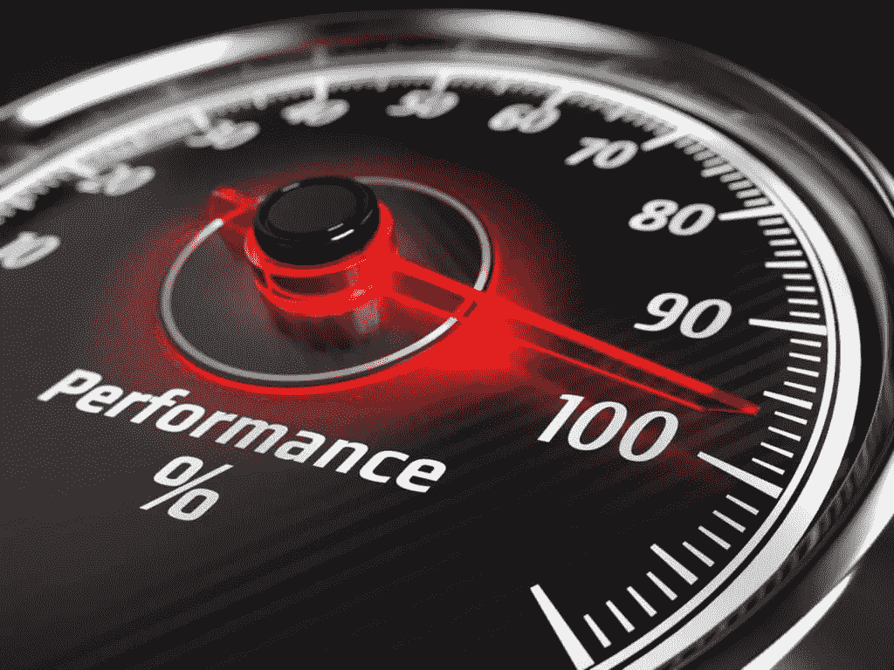

# 如何提高你的 WordPress 主题的性能

> 原文：<https://www.sitepoint.com/improve-wordpress-theme-performance/>



*本文是与 [SiteGround](https://www.siteground.com/go/article-sp) 合作创作的系列文章的一部分。感谢您对使 SitePoint 成为可能的合作伙伴的支持。*

平均[页重在 2017 年 5 月达到 2884 kb](http://httparchive.org/trends.php)。Google DoubleClick 的研究报告称，移动设备上的平均加载时间为 19 秒(T3)。然而，性能比以往任何时候都重要:

**用户沮丧**
用户不会等待。根据阿伯丁集团的[研究，每一秒钟的延迟都会导致:](http://www.aberdeen.com/research/5136/ra-performance-web-application/content.aspx)

*   页面浏览量减少 11%
*   用户满意度下降了 16%
*   转化率下降了 7%

**移动**
[移动访问占全部 web 流量的 55%](https://gs.statcounter.com/#desktop+mobile-comparison-ww-monthly-201704-201704-bar)。设备和带宽能力有所提高，但速度赶不上页面权重的增长。用户通常按字节收费。

**搜索引擎排名**
谷歌惩罚缓慢的重量级网站。

**托管费用**
由 [SiteGround](https://www.siteground.com/go/article-sp) 这样的公司托管将是合理的，但重量级网站使用的资源更多，成本也更高。

维护
你的网站需要的资产越多，维护的成本就越高。

最终，一个缓慢的网站会花费你和你的用户的钱。下次当你的老板要求一个轻薄的功能时，提醒他这个简单的事实！

理想情况下，您应该在编写第一行代码之前考虑性能。然而，您可能正在阅读这篇文章，因为您有一个展示性能问题的主题。幸运的是，有一些具有成本效益的选择来解决这个问题，而且没有负面影响。节省的每一毫秒都会降低您的成本，同时提高用户满意度、参与度和收入。

## 哪些因素影响业绩？

性能受以下因素影响:

1.  HTTP 请求的数量
2.  下载资产的大小
3.  页面的效率

HTTP 请求的数量取决于使页面工作所需的文件和 Ajax 调用的数量:HTML、CSS、JavaScript、图像、字体、数据和所有其他资产。HTTP/2 解决了这个问题，但是您的服务器和用户的浏览器都必须配置为启用支持。即使使用 HTTP/2，二十个文件请求仍然不如十个有效。

主要因素是每个文件的大小。具体来说，2，884kb 比最初版本的 [id Software's Doom](https://en.wikipedia.org/wiki/Doom_(1993_video_game)) 大 20%。诚然，我们正在将现代网页与 25 年前的游戏进行比较，但大多数页面都显示了几段内容，而 Doom 实现了 3D 引擎、多级、图形、音乐和声音效果。

即使是相对轻量级的页面也可能效率低下。例如，如果您的三页网站有一个 500kb 的 JavaScript 框架依赖项，则必须下载、解析并执行该代码，然后才能看到第一个字符。服务器渲染的 HTML 文件将在完全加载之前开始出现，即使资源总量超过 500kb。

最后，服务器速度、压缩和缓存是其他重要的考虑因素。

## 衡量绩效

测量性能以识别瓶颈并确保您的更新改进了页面是很重要的。以下工具提供了请求和响应时间的细分以及更新建议:

*   [Pingdom](https://tools.pingdom.com/)
*   [谷歌页面速度洞察](https://developers.google.com/speed/pagespeed/insights/)
*   [GTmetrix](https://gtmetrix.com/)
*   [网页测试](https://www.webpagetest.org/)

你的浏览器的开发者工具**网络**标签也提供了关于布局的信息和页面准备好用户事件之前所需的时间。

## 速赢

以下更新不会超过几分钟— *你没有借口！*

### 联系您的网络主机

一个好的虚拟主机会分析你的使用情况，并对服务、硬件和软件升级提出建议。这可以以最小的努力提供经济高效的性能提升。

我们的合作伙伴 SiteGround 有一个由 WordPress 专家组成的积极主动、知识渊博的支持团队，他们很乐意帮助你。SiteGround 提供了一系列专门针对 WordPress 的计划，对 SitePoint 用户提供高达 65%的折扣。

### 激活 GZIP 压缩

几乎有 30%的网站无法激活 GZIP 压缩。这通常可以在网络服务器设置或 WordPress 插件中启用，如 [WP HTTP 压缩](http://wordpress.org/plugins/wp-http-compression/)和 [W3 总缓存](http://wordpress.org/plugins/w3-total-cache/)。

### 激活 WordPress 缓存

有几个 WordPress 插件可以在第一次请求时呈现页面并存储在缓存中。后续请求从缓存中获取这些页面，而不是在模板中重新生成数据库内容。缓存插件包括 [W3 总缓存](http://wordpress.org/plugins/w3-total-cache/)、 [WP 超级缓存](http://wordpress.org/plugins/wp-super-cache/)、[超级缓存](http://wordpress.org/extend/plugins/hyper-cache/)、 [WP 最快缓存](https://en-gb.wordpress.org/plugins/wp-fastest-cache/)和[缓存使能器](https://en-gb.wordpress.org/plugins/cache-enabler/)。

您的主机提供商也许能够为您启用缓存。我们的合作伙伴，SiteGround，有一个定制的缓存工具，可以大大提高网站速度。

### 启用浏览器缓存

如果浏览器缓存了某项资产，用户不一定需要再次下载。简单的解决方案包括设置一个合适的 [Expires 头](https://www.w3.org/Protocols/rfc2616/rfc2616-sec14.html#sec14.21)、 [Last-Modified](https://www.w3.org/Protocols/rfc2616/rfc2616-sec14.html#sec14.29) 日期或者在 HTTP 头中采用 [ETags](http://en.wikipedia.org/wiki/HTTP_ETag) 。下面的`.htaccess`例子要求浏览器缓存一个月的图像:

```
<IfModule mod_expires.c>
ExpiresActive On

<FilesMatch "\.(jpg|jpeg|png|gif|svg)$">
ExpiresDefault "access plus 1 month"
</FilesMatch>

</IfModule>
```

### 禁用未使用的插件

大多数插件会在你的网站上添加代码，比如额外的 CSS 或 JavaScript，即使你没有使用它。WordPress 管理员可以从 WordPress 控制面板禁用插件，或者完全删除插件代码，如果他们确定永远不会使用它的话。

### 移除不必要的资产

你的模板真的需要十五种字体吗？你增加了七个分析系统吗？第三方插件有必要吗？有必要展示来自五十个广告网络的广告吗？你需要不止一个 JavaScript 库吗？你能用 CSS3 效果替换 JavaScript 动画吗？

清理一下，把你不需要的东西搬走。

### 替换社交网络按钮

你的页面上有脸书、Twitter、Google+和 LinkedIn 的分享按钮吗？尽管他们看起来很无辜，但他们可以在你的页面上添加几百 kb 的第三方 JavaScript 代码。这是一个膨胀的安全风险，对性能有负面影响。

第三方代码是不必要的——你可以用几行 HTML 代码在你的页面上添加无脂肪社交按钮。一点 JavaScript 可以增强使用弹出窗口的体验，或者通过谷歌分析中的[事件跟踪来记录使用情况。](https://www.sitepoint.com/google-analytics-track-javascript-ajax-events/?aref=cbuckler)

### 连接和缩小 JavaScript 和 CSS

在开发过程中把 JavaScript 和 CSS 文件拆分成独立的模块是很实用的。然而，在生产服务器上托管单个文件之前，应该将这些文件连接起来并缩小，以删除注释和空白。

(注意你的 WordPress style.css 文件必须在顶部保留主题的细节，否则它会被破坏！)

## 处理您的图像

图片是网站膨胀的最大原因。删除一张 500kb 的高分辨率图像可以减少 25%或更多的重量和下载时间。

### 删除或替换不必要的图像

我相信英雄形象是可爱的，品牌的，但它失去了你的顾客吗？有可能用 CSS3 渐变、边框、滤镜或其他效果来替换全部或部分内容。

### 使用正确的图像格式

始终使用合适的图像格式。总的来说:

*   将 SVG 用于矢量徽标和图表
*   使用 JPG 拍摄照片
*   使用 PNG 做其他事情
*   但是对于较小的、有限颜色的图像或带有动画的图像，可以考虑 GIF。

有替代格式，如 WebP，但浏览器支持有限。

如果有疑问，尝试所有合适的选项并选择最佳选项。但是请注意:

*   JPG 是一种有损格式，以较高的压缩率移除细节。为每个图像找到质量和文件大小之间的最佳折衷。
*   PNG 提供 256 位和 24 位颜色品种。256 色版本通常会生成较小的文件。
*   PNG 和 GIF 都提供透明度。尽可能关闭它以节省更多的字节。

### 调整大位图图像的大小

一个基本的相机或手机捕捉的图像太大，无法在任何设备上显示。WordPress 提供了调整大小的选项，但是为了获得最佳效果，编辑应该在上传之前进行裁剪和调整大小。

图像尺寸不应超过其容器的最大尺寸。那些使用高密度/视网膜显示器的人可能会欣赏更高分辨率的图像，但是您可以使用 [`img`标签`srcset`属性](https://www.sitepoint.com/how-to-build-responsive-images-with-srcset/?aref=cbuckler)来提供替代方案。

调整图像大小对页面权重有很大影响。将尺寸缩小 50%会将总面积减少 75%，从而相应地提高文件大小。

### 最大化图像压缩

您可以通过删除元数据、减少颜色深度和调整压缩因子来从根本上减小位图图像的大小。WordPress 插件如 [WP Smush](https://premium.wpmudev.org/project/wp-smush-pro/) 、 [EWWW 图像优化器](https://wordpress.org/plugins/ewww-image-optimizer/)、 [Imagify](https://imagify.io/) 、[北海巨妖图像优化器](https://kraken.io/)、 [ShortPixel 图像优化器](https://wordpress.org/plugins/shortpixel-image-optimiser/)和 [CW 图像优化器](http://wordpress.org/plugins/cw-image-optimizer/)可以为你处理这个过程。

为获得最佳效果，图像应在上传前进行处理。软件选项包括 [OptiPNG](http://optipng.sourceforge.net/) 、 [PNGOUT](http://advsys.net/ken/utils.htm) 、 [jpegtran](http://jpegclub.org/jpegtran/) 和 [jpegoptim](http://jpegoptim.sourceforge.net/) 。Windows 用户可以尝试神话般的 [RIOT](http://luci.criosweb.ro/riot/) 。或者，也有在线工具如 [TinyPNG / TinyJPG](https://tinypng.com/) 。

SVG 图像可以通过将值四舍五入到更少的小数位数、简化路径以及从 XML 中删除不必要的注释、属性和空白来压缩。你的 SVG 编辑器应该有压缩文件的选项，或者有像 [SVG 编辑器](http://petercollingridge.appspot.com/svg-editor)和 [SVGO](https://github.com/svg/svgo-gui) 这样的工具。您也可以将样式指令移动到 CSS 中。

### 实现延迟加载

最后，延迟加载技术确保图像仅在它们的包含框在视口中可见时才被下载。实现懒加载的 WordPress 插件有[懒加载](https://wordpress.org/plugins/lazy-load/)、 [jQuery 图片懒加载 WP](https://wordpress.org/plugins/jquery-image-lazy-loading/) 、 [BJ 懒加载](http://wordpress.org/plugins/bj-lazy-load/)、[火箭懒加载](https://wordpress.org/plugins/rocket-lazy-load/)、[揭开懒加载](https://wordpress.org/plugins/unveil-lazy-load/)和[视频懒加载](https://wordpress.org/plugins/lazy-load-for-videos/)。

其他资源:

*   [偷懒加载图片提升网站性能的五种技巧](https://www.sitepoint.com/five-techniques-lazy-load-images-website-performance/?aref=cbuckler)
*   [如何构建自己的渐进式图像加载器](https://www.sitepoint.com/how-to-build-your-own-progressive-image-loader/?aref=cbuckler)

## 更激进的解决方案

如果你的主题仍然是超重，你可以考虑更激进的节食方案…

### 采用构建过程

构建过程可以自动优化图像，并连接和缩小 CSS 和 JavaScript 文件。你可以为你的 WordPress 主题采用 [Gulp 构建过程，这样可以节省几个小时的工作，提高页面性能，让开发更有趣。](https://www.sitepoint.com/fast-gulp-wordpress-theme-development-workflow/)

### 考虑渐进式 Web 应用程序技术

进步的 web 应用程序技术允许 Web 应用程序通过缓存基本的和经常使用的资产来离线工作。虽然这通常用于应用程序，但也有可能[将你的网站改造成渐进式网络应用](https://www.sitepoint.com/retrofit-your-website-as-a-progressive-web-app/)，享受快速加载和离线操作的好处。

### 避免第三方代码

你会允许一个不知名的开发者无限制地访问你的网站代码吗？没有吗？那么为什么要相信社交媒体分享按钮和论坛等第三方小工具呢？虽然这些小部件很少危及安全性，但您应该检查它们正在加载哪些隐藏资源，并评估对性能的影响。

### 仔细评估 WordPress 主题

免费的和商业的 WordPress 主题在财务上是有意义的。当一个现成的主题只需几美元就能满足你的所有需求时，为什么还要雇佣一个开发者呢？但是要小心隐性成本。通用模板必须卖出数千份才能收回开发成本。为了吸引买家，开发者捆绑了许多你可能永远都不需要的功能。

检查一:*主题好看吗？*检查二:*该主题是否在各种设备和网络上表现良好*。参见:[高级 WordPress 主题](https://www.sitepoint.com/10-features-to-look-for-in-a-premium-wordpress-theme/?aref=cbuckler)的 10 个特色。

### 简化你的网站

更简单、更流畅、以客户为中心的网络体验是一种趋势。这可能比听起来更难，但向所有用户提供所有可能的功能的旧时代已经过去了。能不能说服老板/客户就是另一回事了！

### 改变你的发展生活方式

网页达到 2.8Mb 是谁的责任？我们是。网站如何或为什么变得臃肿并不重要——开发者让它发生了。

快速开发和削减成本仍然很重要，但如果导致一个没有人愿意使用的缓慢、笨拙的网站，整个过程就是徒劳的。你的客户/老板可能不理解技术问题，但你应该解释后果。

从一开始就考虑性能。就像内容、搜索引擎优化、可用性和可访问性一样，性能永远不应该是一个事后的想法！创建一个快速的 WordPress 主题是很难的，但是之后“增加”性能就相当困难和昂贵了。

进一步建议:

*   当您在 200Mbps 的高速连接上进行开发时，很容易忘记带宽。限制连接或尝试在接收信号差的区域加载您的网站。如果你感到沮丧，你的用户也一样！
*   考虑页面权重，质疑添加到主题中的每一项资产。考虑一个“计分”策略，例如，如果你要添加一个 20kb 的字体，你必须从其他地方保存 20kb。

表现不佳的网站已经成为一种流行病，但是很明显很少有开发者关心这个问题。那些关心的人将会得到更多的访问者，更高的转化率和更高的薪水！

## 分享这篇文章