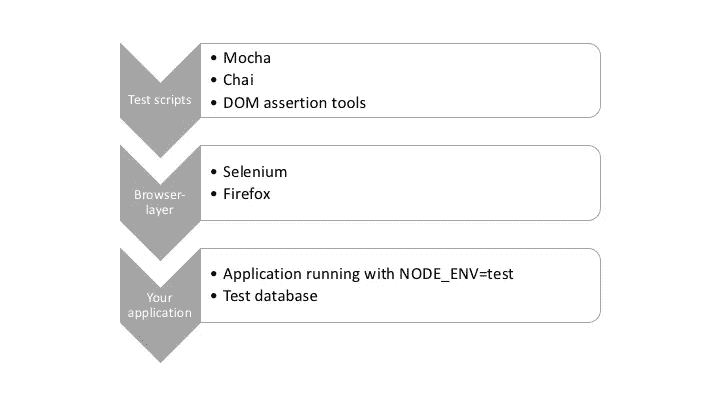
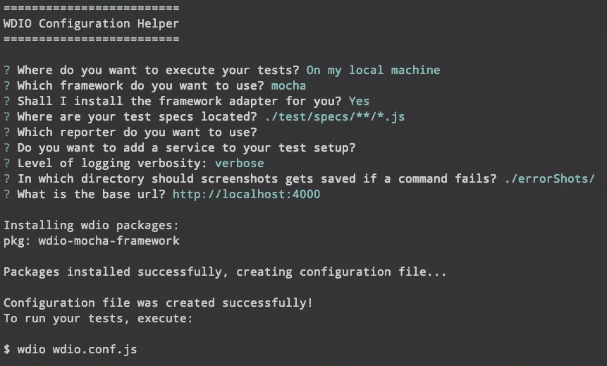
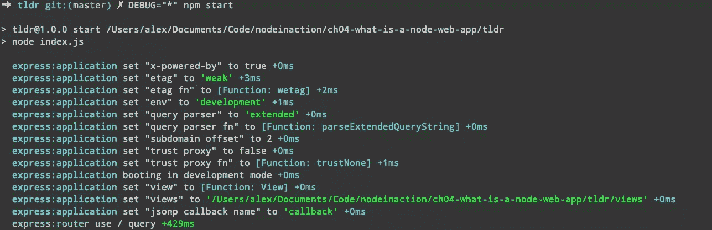

# 测试和调试节点应用程序指南

> 原文：<https://www.sitepoint.com/testing-node-applications/>

测试和调试节点应用程序的指南摘自 Manning 的 [Node.js in Action，第二版](https://goo.gl/SKCORz)。在其第二版彻底修订，这本书指导你通过所有的功能，技术和概念，你需要建立生产质量的节点应用程序。

## 功能测试节点应用

在大多数 web 开发项目中，功能测试的工作方式是驱动浏览器，然后根据用户特定的需求列表检查各种 DOM 转换。假设您正在构建一个内容管理系统。对图像库上传特性的功能测试是上传图像，检查它是否被添加，然后检查它是否被添加到相应的图像列表中。

功能测试节点应用程序的工具选择令人困惑。从高层次来看，它们分为两大类:无头测试和基于浏览器的测试。无头测试通常使用 PhantomJS 之类的东西来提供一个终端友好的浏览器环境，但是轻量级的解决方案使用 Cheerio 和 JSDOM 之类的库。基于浏览器的测试使用浏览器自动化工具，如 [Selenium](http://www.seleniumhq.org/) ，它允许你编写驱动真正浏览器的脚本。这两种方法可以使用相同的底层节点测试工具，您可以使用 Mocha、Jasmine 甚至 Cucumber 来驱动 Selenium 对抗您的应用程序。



### 硒

Selenium 是一个流行的基于 Java 的浏览器自动化库，可用于测试节点应用程序。借助特定于语言的驱动程序，您可以连接到 Selenium 服务器，并在真实的浏览器上运行测试。在本文中，您将学习如何使用节点 Selenium 驱动程序 [WebdriverIO](http://webdriver.io/) 。

让 Selenium 运行起来比纯节点测试库更棘手，因为您需要安装 Java 并下载 Selenium JAR 文件。首先，[为你的操作系统](https://www.java.com/en/download/help/download_options.xml)下载 Java，然后去 [Selenium 下载站点](http://docs.seleniumhq.org/download/)下载 JAR 文件。然后，您可以像这样运行 Selenium 服务器:

```
java -jar selenium-server-standalone-3.4.0.jar 
```

请注意，您确切的 Selenium 版本可能会有所不同。您可能还需要提供浏览器二进制文件的路径。例如，在将 Firefox 设置为 browserName 的 Windows 10 中，可以像这样指定 Firefox 的完整路径:

```
java -jar -Dwebdriver.firefox.driver="C:\path\to\firefox.exe" selenium-server-standalone-3.4.0.jar 
```

或者，您可能需要下载 mozilla 的 Gecko 驱动程序(将它放在与 selenium 可执行文件相同的文件夹中，并像这样启动它:

```
java -jar -Dwebdriver.gecko.driver=geckodriver selenium-server-standalone-3.4.0.jar 
```

确切的路径取决于 Firefox 在您机器上的安装方式。关于 Firefox 驱动的更多信息，请阅读 SeleniumHQ 文档。你可以找到 Chrome 和 Microsoft Edge 的驱动程序，它们的配置方式类似。

现在，随着 Selenium 服务器的运行，创建一个新的节点项目并安装 WebdriverIO:

```
mkdir -p selenium/test/specs
cd selenium
npm init -y
npm install --save-dev webdriverio
npm install --save express 
```

WebdriverIO 带有一个友好的配置文件生成器。要运行它，请运行 wdio config:

```
./node_modules/.bin/wdio config 
```

遵循问题并接受默认值。它应该是这样的:



使用 wdio 命令更新 package.json 文件，以允许使用 npm test 运行测试:

```
"scripts": {
  "test": "wdio wdio.conf.js"
}, 
```

现在在测试中加入一些东西。基本的 Express 服务器就足够了。该示例在后续的测试清单中使用。将此列表另存为`index.js`。

```
const express = require('express');
const app = express();
const port = process.env.PORT || 4000;

app.get('/', (req, res) => {
  res.send(` <html>
  <head>
    <title>My to-do list</title>
  </head>
  <body>
    <h1>Welcome to my awesome to-do list</h1>
  </body>
</html> `);
});

app.listen(port, () => {
  console.log('Running on port', port);
}); 
```

> 上面的片段使用的是 ES2015。如果你想在这方面复习一下，可以看看 SitePoint 的课程，“深入 ES2015 ”。

WebdriverIO 的好处是它为编写 Selenium 测试提供了一个简单、流畅的 API。语法清晰易学——你甚至可以用 CSS 选择器编写测试。下一个清单(在`test/specs/todo-test.js`中)显示了一个简单的测试，它设置了一个 WebdriverIO 客户端，然后检查页面上的标题。

```
const assert = require('assert');
const webdriverio = require('webdriverio');

describe('todo tests', () => {
  let client;

  before(() => {
    client = webdriverio.remote();
    return client.init();
  });

  it('todo list test', () => {
    return client
      .url('http://localhost:4000')
      .getTitle()
      .then(title => assert.equal(title, 'My to-do list'));
  });
}); 
```

连接 WebdriverIO 后，您可以使用客户端实例从您的应用程序中获取页面。然后，您可以在浏览器中查询文档的当前状态——本例使用`getTitle`从文档头获取 title 元素。如果想查询文档中的 CSS 元素，可以使用[。元素](http://webdriver.io/api/protocol/elements.html)取而代之。有几种操作文档、表单甚至 cookies 的方法。

这个测试可以在一个节点 web 应用上运行一个真实的浏览器。要运行它，请在端口 4000 上启动服务器:

```
PORT=4000 node index.js 
```

然后输入`npm test`。您应该看到 Firefox 打开，测试在命令行中运行。如果要使用 Chrome，打开 wdio.conf.js，更改 browserName 属性。

### 使用硒进行更高级的测试

如果您使用 WebdriverIO 和 Selenium 来测试一个使用 React 或 Angular 之类的更复杂的 web 应用程序，那么您会想要检查一下这些实用方法。有些方法会暂停测试，直到某些元素可用，这对于可能异步呈现文档的 React 应用程序来说非常好，可以根据远程数据的可用时间多次更新文档。看看`waitFor*`方法，比如 [waitForVisible](http://webdriver.io/api/utility/waitForVisible.html) 了解更多。

> 如果你想了解更多关于这种测试的知识，请使用 Nightwatch.js 查看 [JavaScript 功能测试](https://www.sitepoint.com/javascript-functional-testing-nightwatch-js/)

## 处理失败的测试

当你在一个已经建立的项目上工作时，总会有一个测试开始失败的时刻。节点提供了几个工具来获取失败测试的更多细节。我们来谈谈如何丰富调试失败测试时生成的输出。

当测试失败时，首先要做的是生成更详细的日志输出。下一节将演示如何使用`NODE_DEBUG`来实现这一点。

### 获取更详细的日志

当测试失败时，获得程序正在做什么的信息是有用的。Node 有两种方法可以做到这一点:一种用于 Node 的内部，另一种用于 npm 模块。要调试节点的核心模块，请使用 [NODE_DEBUG](http://www.juliengilli.com/2013/05/26/Using-Node.js-NODE_DEBUG-for-fun-and-profit/) 。

### 使用节点调试

为了了解 NODE_DEBUG 的工作原理，假设您有一个深度嵌套的文件系统调用，而您忘记了使用回调。例如，下面的示例引发异常:

```
const fs = require('fs');

function deeplyNested() {
fs.readFile('/');
}

deeplyNested(); 
```

堆栈跟踪只显示了有关异常的有限的详细信息，并且它不包括有关引发异常的调用站点的完整信息:

```
fs.js:60
    throw err;  // Forgot a callback but don't know where? Use NODE_DEBUG=fs
      ^

Error: EISDIR: illegal operation on a directory, read
    at Error (native) 
```

如果没有有用的注释，许多程序员会看到这样的跟踪，并指责 Node 造成了无益的错误。但是，正如评论指出的那样，`NODE_DEBUG=fs`可以用来获得关于`fs`模块的更多信息。改为像这样运行脚本:

```
NODE_DEBUG=fs node node-debug-example.js 
```

现在，您将看到一个更详细的跟踪信息，它有助于调试问题:

```
fs.js:53
    throw backtrace;
        ^

Error: EISDIR: illegal operation on a directory, read
    at rethrow (fs.js:48:21)
    at maybeCallback (fs.js:66:42)
    at Object.fs.readFile (fs.js:227:18)
    at deeplyNested (node-debug-example.js:4:6)
    at Object.<anonymous> (node-debug-example.js:7:1)
    at Module._compile (module.js:435:26)
    at Object.Module._extensions..js (module.js:442:10)
    at Module.load (module.js:356:32)
    at Function.Module._load (module.js:311:12)
    at Function.Module.runMain (module.js:467:10) 
```

从这个跟踪可以清楚地看出，问题出在我们的文件中，在第 4 行的一个函数中，这个函数最初是从第 7 行调用的。这使得调试任何使用核心模块的代码变得更加容易，它包括文件系统和网络库，比如 Node 的 HTTP 客户端和服务器模块。

### 使用调试

`NODE_DEBUG`的公共替代是`DEBUG`。npm 上的许多包都在寻找`DEBUG`环境变量。它模仿了`NODE_DEBUG`使用的参数样式，允许您指定要调试的模块列表，或者使用`DEBUG='*'`查看所有模块。



如果你想将`NODE_DEBUG`功能整合到你自己的项目中，使用内置的 [util.debuglog 方法](https://nodejs.org/api/util.html#util_util_debuglog_section)。

```
const debuglog = require('util').debuglog('example');
debuglog('You can only see these messages by setting NODE_DEBUG=example!'); 
```

要制作用`DEBUG`配置的定制调试记录器，需要使用 npm 的调试包】(https://www . NPM js . com/package/debug)。您可以创建任意数量的记录器。假设您正在构建一个 MVC web 应用程序。您可以为模型、视图和控制器创建单独的记录器。然后，当测试失败时，您将能够指定调试应用程序特定部分所必需的调试日志。下面的清单演示了如何使用调试模块。

```
const debugViews = require('debug')('debug-example:views');
const debugModels = require('debug')('debug-example:models');

debugViews('Example view message');
debugModels('Example model message'); 
```

要运行这个例子并查看视图日志，将`DEBUG`设置为`debug-example:views`，像这样`DEBUG=debug-example:views node index.js`

调试日志记录的最后一个功能是，您可以在调试部分前面加上连字符，以便将其从日志中删除:

```
DEBUG='* -debug-example:views' node index.js 
```

隐藏某些模块意味着您仍然可以使用通配符，但是从输出中省略不需要的或有干扰的部分。

### 获得更好的堆栈跟踪

如果您正在使用异步操作，并且包括您使用异步回调或承诺编写的任何东西，那么当堆栈跟踪不够详细时，您可能会遇到问题。在这种情况下，npm 上的包可以帮助您。例如，当回调异步运行时，Node 不会保留操作排队时的调用堆栈。为了测试这一点，创建两个文件，一个名为`async.js`的文件定义了一个异步函数，另一个名为`index.js`的文件需要`async.js`。

这个片段叫做`aync.js`:

```
module.exports = () => {
  setTimeout(() => {
    throw new Error();
  })
}; 
```

而`index.js`需要要求`async.js`:

```
require('./async.js')(); 
```

现在，如果您用`node index.js`运行`index.js`，您将得到一个简短的堆栈跟踪，它不显示失败函数的调用者，只显示抛出异常的位置:

```
throw new Error();
    ^

Error
    at null._onTimeout (async.js:3:11)
    at Timer.listOnTimeout (timers.js:92:15) 
```

为了改进这种报告，安装[跟踪包](https://www.npmjs.com/package/trace)并使用 node -r trace index.js 运行它。`-r`标志告诉 node 在加载任何其他东西之前需要跟踪模块。

堆栈跟踪的另一个问题是它们可能过于详细。当跟踪包含太多关于节点内部的细节时，就会发生这种情况。要清除你的堆栈痕迹，使用[澄清](https://www.npmjs.com/package/clarify)。同样，您可以使用`-r`标志运行它:

```
$ node -r clarify index.js
    throw new Error();
    ^

Error
    at null._onTimeout (async.js:3:11) 
```

如果您想在 web 应用程序的错误警告电子邮件中包含堆栈跟踪，Clarify 特别有用。
如果你在 Node 中运行面向浏览器的代码，可能作为同构 web 应用的一部分，那么你可以通过使用 [source-map-support](https://www.npmjs.com/package/source-map-support) 获得更好的堆栈跟踪。这可以用`-r`来运行，但是它也适用于一些测试框架:

```
node -r source-map-support/register index.js
mocha --require source-map-support/register index.js 
```

下一次当您在处理异步代码生成的堆栈跟踪时，请寻找 trace 和 clarify 之类的工具，以确保您充分利用了 V8 和 Node 所能提供的功能。

## 摘要

所以你有它。在本文中，我们研究了使用 Selenium 的功能测试节点应用程序，以及处理失败测试的一些技巧和诀窍。如果你喜欢这篇文章，你可以访问这本书的主页并[下载 Node.js in Action 的第一章，第二版](https://goo.gl/SKCORz)或者购买整本书。

## 分享这篇文章