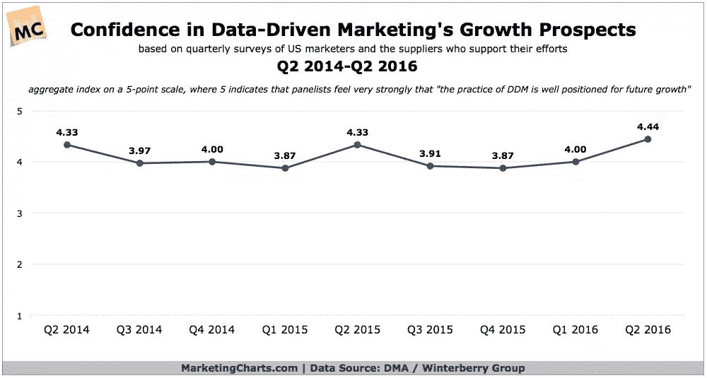
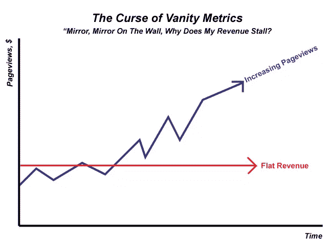
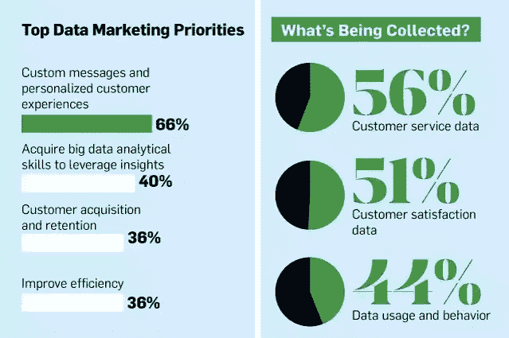
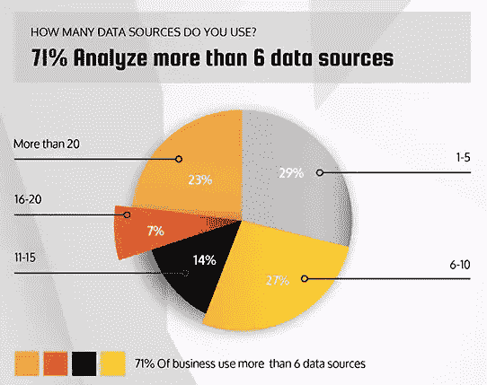

# 你的下一个营销策略依赖于复杂的数据分析

> 原文：<https://www.sitepoint.com/your-next-marketing-strategy-depends-on-complex-data-analytics/>

快速思考。你如何衡量你的营销策略的成功？如果你需要花超过两秒的时间来理解这个问题，那么你的营销策略很有可能是基于不可量化的指标。

营销人员在分析和评估我们的成功和失败时只能依赖少量数据的日子已经一去不复返了。技术进步了，数字营销也朝着同样的方向前进。

精通数据的营销人员比那些只凭直觉的人更有可能成功。原因如下。

## 越来越重视数据驱动的营销

就在几年前，数据驱动营销还被认为只是一个新奇的故事，可能是永远不会有结果的东西。如今，该行业的态度已经发生了很大的变化。分析已经成为所有营销决策不可或缺的一部分，从媒体购买到信息传递到整体战略。与过去不同的是，营销人员意识到需要 [*数据驱动的营销*](http://www.marketingcharts.com/online/confidence-in-data-driven-marketings-growth-prospects-reaches-new-high-70530/) 策略。

根据数据驱动营销协会全球联盟的一份报告，大约 69%的营销人员打算在未来一年增加数据驱动营销的预算。此外，77%的数字营销人员对数据驱动的方法充满信心。大约 49%的营销人员认为，就战略实施而言，数据驱动的营销可以最大限度地提高有效性。还有 20%的人认为，数据驱动的营销是符合消费者偏好的不可或缺的一部分。

*[图片来源](http://www.marketingcharts.com/online/confidence-in-data-driven-marketings-growth-prospects-reaches-new-high-70530/)*

数据驱动的营销战略要求从业者在公司运营和受众参与方面发展全面、明确的端到端知识。反过来，今天的营销人员强调大量数据，以确保他们的营销努力以最小的成本取得最大的成果。

## 衡量最相关数据的重要性

关注错误的指标太容易了。有时候，在你看来是品牌或业务健康的标志，结果却完全无关紧要。

举个假设的例子，假设你注意到你的新中文网站的流量在二月初下降了。你开始怀疑你的搜索广告表现不如预期，并把问题归咎于另一个搜索引擎算法的改变。

就在你准备停止广告活动的时候，你意识到流量下降的原因是中国农历新年发生在二月的前两周，在这段时间里，你预期的访问者中很少有人活跃在网络上。你保持你的广告活动在适当的位置，很快，随着庆祝活动的结束，你的网站流量回到你预期的水平。

*[图片来源](https://blog.kissmetrics.com/throw-away-vanity-metrics/)*

有时，社交媒体关注者数量、电子邮件列表大小和文章页面浏览量等“虚荣指标”同样会产生误导。虽然这样的 KPI 可以给那些过度关注表面上“令人印象深刻”的高管留下深刻印象，但它们很少与任何类型的真正商业成功相关联。

从这个意义上说，衡量你的广告活动成功与否的一个更可靠的指标可能是[平均会话持续时间或每次会话的页数](https://www.sitepoint.com/5-key-ways-to-improve-engagement-metrics-for-your-content/)。与网站流量不同，这种类型的内容参与数据可能是更有效的潜在客户转化预测指标。

另一方面，当你过于关注你的“网站分析”，以牺牲你更广泛的分析数据为代价时，你就不必要地限制了你对营销业绩的理解。网站分析只允许你测量网站性能的某些方面，所以它们有内在的局限性。

保持这些孤岛同样会削弱您准确衡量您的有效性并确定要关注和优化的关键指标以确保持续成功的努力。

问题是，当你专注于一个分析“红鲱鱼”时，你可能并不总是知道。重要的是要不断问自己，你的营销衡量工作是否反映了实际情况，或者你只是在欺骗自己。

## 网站分析太有限了

请记住，这里的主要目标是随着您的受众规模和参与度水平同时增加收入。当你深入挖掘并[发掘相关指标](http://www.forbes.com/sites/theyec/2016/02/08/why-vanity-metrics-are-killing-your-business/#5429971c7615)如转化率、保留率和客户终身价值，而不是停留在虚荣心上，你的收入将会增加，你将会看到哪些营销渠道和活动实际上推动了最佳业绩。

只有当你理解了在你业务的每一个阶段的趋势和模式时，你才可能进行这种类型的分析，这需要复杂的分析。在这种情况下，复杂性意味着更深入地挖掘您的指标，而不是专注于少量数据。复杂的指标包括来自多个来源的数据集，这些数据集可能符合也可能不符合标准化的数据结构。

反过来，处理复杂的分析依赖于获得正确的工具。新一代数据分析平台使您能够整理来自多个来源的数据，并通过由以前不相关的指标组成的混合仪表板视图将它们并置在一起(因此称为“混合视图”)。

*[图片来源](http://www.adweek.com/news/technology/infographic-what-data-driven-marketing-looks-2015-163607)*

随着数据孤岛的消失，您将拥有开始使用自定义 KPI 公式和确定“一个重要的指标”(OMTM)所需的一切。这可能是字面上的单一指标，也可能是基于特定 KPI 共同揭示绩效的指标的一个子集。

了解你的 OMTM 有助于[让你的团队](https://www.sitepoint.com/how-to-build-a-self-sustaining-content-marketing-engine/)专注于最有可能为你的成功做出有意义贡献的活动。有各种方法可以找到您的 OMTM，但是在缺少数据的混合视图的情况下，很少有方法是有效的。只有当社交媒体、CRM 实用程序、营销自动化、网站分析和其他数据源被集体使用时，你才能看到全局。

不过，值得庆幸的是，您可以利用越来越多的数据源来获得更深入的见解。Aberdeen [最近代表商业智能平台 Sisense](https://www.sisense.com/blog/the-state-of-complex-data-in-january-2016-infographic/) 进行的研究发现，当代公司经常依赖于越来越多的复杂来源的数据。

*[图片来源](https://www.sisense.com/blog/the-state-of-complex-data-in-january-2016-infographic/)*

下一代营销分析需要更深入地挖掘潜在客户在转化过程中采取的关键行动，但这只有在数据的复杂性没有压倒你的情况下才有可能。这是通过使用当今最先进的分析平台释放出来的价值，如 [Datapine](https://www.datapine.com/) 、 [Birst](https://www.birst.com/) 和 [Databox](https://databox.com/) 。

## 唯一有用的数据是可操作的

最小化数据孤岛有许多好处，因此您可以使用当今更高级的分析工具。它们使营销人员能够创建复杂数据的强大混合视图，以最短的延迟分析数据，并提供可操作的见解。结果是能够做出更快、更明智的决策和更有效的团队。

超越简单的网络分析。数字营销分析是您实现可持续增长和持续成功的关键。度量和洞察力之间有很大的区别。

假设您设置了正确的测量基础设施，那么很容易检查某个影响者活动推荐您的网站的访问量。但是这种交通有多繁忙呢？这些访客中有多少人最终下了订单？多少钱？他们还回来要更多吗？

这些绩效参数与您最近几个月开展的其他影响者活动相比如何？与你的其他营销活动相比，他们的投资回报率如何？下个季度你应该做哪些不同的事情？

这些类型的见解非常强大，因为它们是可操作的。通过查看重要的指标并将它们放在一起以展示完整的画面，您可以最大化营销影响和效率。

## 包扎

这里的底线是，依赖简单的网站分析不会推动你的成功。只有利用您对数据的更广泛访问的复杂数据分析才能让您对您的活动的有效性有一个更清晰、更全面的了解，并帮助您确定一个重要的指标。

有了这些知识，您将能够更好地应对动态市场的挑战，并在制定真正有效的下一代营销战略方面处于有利地位。

*为了更好地介绍如何使用分析来改善你的产品和结果，请阅读我们的书《T1:研究 UX:分析。*

## 分享这篇文章