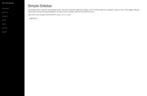
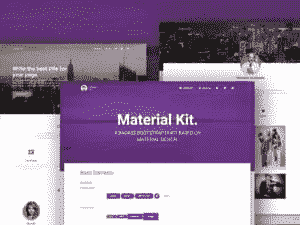
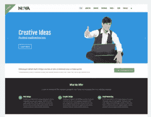
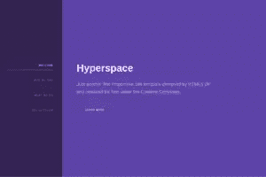
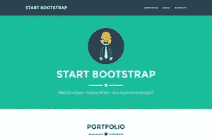
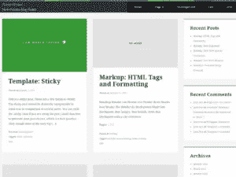
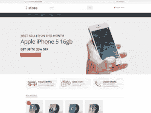
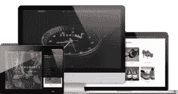
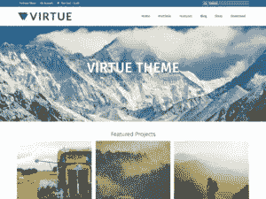
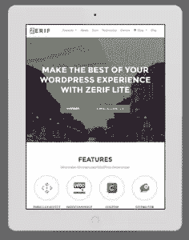

# 10 大免费手机自举主题

> 原文：<https://www.sitepoint.com/top-10-free-bootstrap-themes-mobile/>

有成千上万的引导主题，它们都是有响应的。然而，尽管理论上它们可以在任何尺寸的设备上显示，其中一些主题比其他的更适合移动优先的网站。

这就是为什么我收集了一篇文章，其中有 10 个我认为特别适合移动优先网站的免费引导主题。其中大多数都是简单、干净、整洁的引导主题，在几乎任何尺寸的设备上都看起来很合适。

我不喜欢带有大量图片的引导主题，因为移动流量仍然非常昂贵，你也不想用大量图片掏空访问者的口袋。以下是我的 10 大免费自举主题。

## 1.一个简单的侧边栏引导主题

如果你正在寻找一个简单的侧边栏主题，特别是针对小屏幕尺寸的响应性非画布导航，请尝试这个主题。与许多其他响应主题不同——无论是否自举——这个主题是专门为手机和其他小屏幕设备创建的。如果你认为它对你的目的来说太简单了，你可以随时添加更多的东西，但是注意不要弄乱它——极简主义是它的魅力所在。

## 2.材料工具包

对于那些对[材料设计](https://www.sitepoint.com/10-essential-material-design-resources-and-tutorials/)感兴趣的人来说，这个[材料工具包](https://www.creative-tim.com/product/material-kit)是一个祝福。该工具包遵循谷歌的材料设计原则，它提供了 60 个手工制作的组件，2 个定制插件，3 个示例页面等。该工具包有免费版和付费版。

## 3.nova–多用途网站模板

这个引导主题是一个多用途的站点模板。它既不是最近才出现的(使用 Bootstrap 2.3.x)，也不像其他的那样简单，但它是一个相当普遍的主题，这也是我决定包含它的原因。它提供了 16 个以上的页面，大部分适用于公司/商业网站，但你也可以在其他地方使用它们。

## 4.超空间

如果你主要对小公司、机构或自由职业者网站的主题感兴趣，请查看这个主题。超空间有一个干净简单的设计，边上有导航，在屏幕的其余部分有一个巨大的内容区域。主题带有许多预定义的元素，如文本、标题、列表、按钮、表格、表单、图像等。

## 5.一页自由职业者免费自举主题

尽管这个主题主要针对自由职业者的网站，它也可以用于其他类型的小型商业网站。这是一个单页主题，有很多功能，如平面图标，编译的 CSS，导航项目上的 Scrollspy，自定义轮廓按钮样式，带有浮动表单标签的移动友好联系人表单等。它还包括一个 PHP 文件，您可以为联系人表单页面进行编辑。

## 6.Housepress 网格 WordPress 主题

Bootstrap 不仅适用于静态 HTML/CSS 网站，也可以用于动态网站。这就是为什么我也为最流行的内容管理系统提供了一些免费的引导模板。

第一个免费的自举 WordPress 主题是 [Housepress](https://wordpress.org/themes/housepress/) 。尽管它的安装数量很少(只有 200 多个)，但这对于一个移动引导站点来说是一个很好的主题。Housepress 是一个三栏主题，菜单在顶部。它特别适合内容较多的网站，如博客或迷你杂志网站。

## 7.jstore(联合发行商)

Jstore 也没有一百万的安装量，但这很可能是因为这个主题没有被我们很多人注意到，而不是因为它是一个不合格的主题。相反，它是 WooCommerce 插件的一个不错的 WordPress 主题。如果你正在用 WooCommerce 插件运行一个在线商店，这个主题是一个首选。它很小，但是你卖的产品有很大的曝光率——对于一个在线商店来说，这是最重要的，不是吗？

## 8.购物岛-免费 WordPress 电子商务主题

ShopIsle 是 WordPress 的一个单页引导主题，也是我个人的最爱之一。我真的很喜欢它干净简洁的布局，把产品放在中间。它的一个独特之处是它带有一个视频带。此外，它可以很容易地本地化，这是伟大的，如果你运行的网站是在一个不同于英语的语言。

## 9.美德主题

如果你真的需要一个有更多图片的自举 WordPress 主题，但仍然是手机友好的，看看这个。虚拟是一个功能丰富的主题，有很多定制选项(布局，滑块，字体等。).你可以将它用于商业或个人网站，或用于在线商店，因为它与 WooCommerce 兼容。主题使用了 Schema 微数据，这对 SEO 有很大的帮助。此外，根据安装数量，美德是一个非常受欢迎的主题(70，000+)。

## 10.zerif Lite–单页 WordPress 主题

现在回到简单和最小的 WordPremes 主题，使用 Zerif Lite。这是一个一页的免费自举主题，最适合“网络机构，数字工作室，公司，产品展示，个人和商业投资组合”。你也可以把它用于网上商店，因为它支持的众多 WordPress 插件中有 WooCommerce。主题也很容易翻译和搜索引擎友好。

## 结论

尽管这些引导主题很棒，但我不得不说，无论一个特定的主题对移动设备多么友好，都不能保证它对你有用，所以要经常检查你的目标设备。当然，你不能在今天存在的每一个品牌和型号上检查它，但是请至少检查今天市场上的主要设备类型、品牌和型号。

## 分享这篇文章