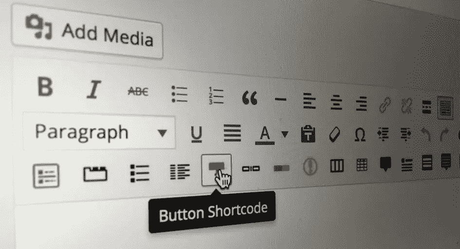

# 如何为你的编辑器创建自定义的 WordPress 简码

> 原文：<https://www.sitepoint.com/create-custom-wordpress-shortcodes/>



本文是与 SiteGround 合作创作的系列文章的一部分。感谢您对使 SitePoint 成为可能的合作伙伴的支持。

理想情况下，WordPress 作者永远不需要编辑原始 HTML。您应该启用插件和自定义元框，允许用户根据需要配置页面。不幸的是，有些情况下提供 UI 工具很困难或不切实际，例如:

*   小部件提供了许多配置选项
*   类似的小部件可以在页面的任何位置出现多次
*   小部件可以互相嵌套，比如一个按钮覆盖在侧边栏的视频上
*   小部件的实现发生变化，例如，您从一个视频托管平台切换到另一个平台。

WordPress 短代码非常适合这些情况。shortcode 允许作者使用文本片段，如`[mywidget]`，它将 HTML 组件放置在呈现的页面中，而不需要编码。

## 在哪里创建短代码

创建短代码通常是为了帮助自定义插件的使用，所以你应该把它们放在插件代码中。但是，您也可以将短代码定义放在主题的`functions.php`文件中。创建一个单独的`shortcodes.php`文件，然后使用语句将它包含在`functions.php`中，这可能更实用:

```
include('shortcodes.php');
```

## 你的第一个“你好，世界”短代码

短码定义包括:

1.  返回 HTML 代码字符串的函数，以及
2.  对 [WordPress `add_shortcode()` hook](https://codex.wordpress.org/Function_Reference/add_shortcode) 的调用，它将短代码文本定义绑定到该函数。

最基本的例子:

```
<?php
// "Hello World" shortcode
function shortcode_HelloWorld() {
  return '<p>Hello World!</p>';
}
add_shortcode('helloworld', 'shortcode_HelloWorld');
```

*(如果文件顶部已经有一行，可以省略`<?php`行。)*

保存文件，然后在页面或帖子中输入`[helloworld]`。访问那个页面，你会看到它已经被一个“你好，世界！”段落。

## 短代码参数

短码可以有可选参数，例如

```
[sitemap title='Web pages', depth=3]
```

参数作为数组传递给 shortcode 函数作为第一个参数。生成页面层次结构站点地图的完整代码:

```
// sitemap shortcode
function shortcode_GenerateSitemap($params = array()) {

  // default parameters
  extract(shortcode_atts(array(
    'title' => 'Site map',
    'id'    => 'sitemap',
    'depth' => 2
  ), $params));

  // create sitemap
  $sitemap = wp_list_pages("title_li=&depth=$depth&sort_column=menu_order&echo=0");
  if ($sitemap) {
    $sitemap =
      ($title ? "<h2>$title</h2>" : '') .
      '<ul' . ($id? '' : " id="$id"") . ">$sitemap</ul>";
  }

  return $sitemap;
}
add_shortcode('sitemap', 'shortcode_GenerateSitemap');
```

[`shortcode_atts()`](https://codex.wordpress.org/Function_Reference/shortcode_atts) 功能在需要时为参数分配默认值。然后， [PHP `extract()`](http://php.net/manual/en/function.extract.php) 函数将每个数组值转换成实变量`$title`、`$id`和`$depth`。

*(注意`array(...)`可以用更短的`[...]`语法替换，如果你使用的是 PHP5.4 或更高版本。)*

为任何帖子或页面添加一个`[sitemap]`短代码，并可选择更改参数，例如`[sitemap depth=5]`。

## 嵌套 BBCode 短码

[BBCode](https://en.wikipedia.org/wiki/BBCode) (公告板代码)是一种轻量级的标记格式，像标准的短代码一样，使用[方括号]来表示命令。这允许短代码包含文本内容或相互嵌套。

假设你的页面需要引用和通用的号召按钮。创建单个短代码是不切实际的，尤其是当按钮可以单独使用或嵌入到报价中时。我们可能需要 HTML，例如:

```
<blockquote>
  <p>Everything we do is amazing!</p>
  <p><a href="/contact-us/" class="cta button main">Call us today</a></p>
</blockquote>
```

当编辑非常熟悉 HTML 时，它可能会出错。幸运的是，短码提供了一个更简单的路径

```
[quote]
  Everything we do is amazing!
  [cta type='main']Call us today[/cta]
[/quote]
```

标记之间的内容作为第二个参数传递给 shortcode 函数。我们可以创建两个短码函数:

```
// [quote] shortcode
function shortcode_Quote($params = array(), $content) {

  // default parameters
  extract(shortcode_atts(array(
    'type' => ''
  ), $params));

  // create quote
  return
    '<blockquote' .
    ($type ? " class=\"$type\"" : '') .
    '>' .
    do_shortcode($content) .
    '</blockquote>';
}
add_shortcode('quote', 'shortcode_Quote');

// [cta] shortcode
function shortcode_CallToAction($params = array(), $content) {

  // default parameters
  extract(shortcode_atts(array(
    'href' => '/contact-us/',
    'type' => ''
  ), $params));

  // create link in button style
  return
    '<a class="cta button' .
    ($type ? " $type" : '') .
    '">' .
    do_shortcode($content) .
    '</a>';
}
add_shortcode('cta', 'shortcode_CallToAction');
```

注意 [`do_shortcode($content)`](https://developer.wordpress.org/reference/functions/do_shortcode/) 函数的使用，当内容存在时，该函数将进一步应用短代码。

短码易于实现，并且可以快速更改或增强。我建议创建一个带有示例的简短代码清单，这样当需要复杂的功能时，编辑人员就有了参考。

如果你已经想好了你的短代码，正在寻找一个托管你的 WordPress 站点的地方，看看我们的合作伙伴，SiteGround。他们提供托管 WordPress 主机，一键安装，暂存环境，WP-CLI 界面，预装 Git，自动更新，等等！

## 分享这篇文章