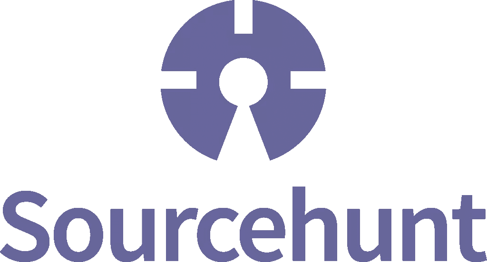
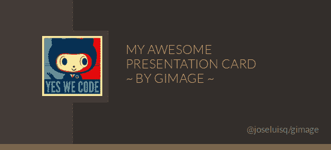

# 可以用这些包搭建一个 CLI 图像绘制 Laravel App 吗？

> 原文：<https://www.sitepoint.com/can-you-build-a-cli-image-drawing-laravel-app-with-these-packages/>

是时候让我们的[每月寻找新的开源库来使用并贡献给](https://www.sitepoint.com/sourcehunt-open-source-week-edition/)了！

如果您是 Sourcehunt 的新手，这是我们的月度帖子，旨在推广那些有趣或有前途的开源项目，并在 Github stars 或 pull 请求方面提供帮助。

这是我们回馈社会的方式——推广我们使用(或可能使用)的项目，以便它们获得足够的曝光率来吸引更广泛的受众、强大的社区以及可能的新贡献者或赞助商。



* * *

### [lar academy/interactive-make](https://github.com/laracademy/interactive-make)[216★]

Laravel Interactive Make 是一个插件，它可以让你交互地使用 Laravel 的 Make 命令，而不必详细说明你想要生成什么，如下图所示:


该工具将询问您有关命令和子命令的信息，直到您对生成的内容满意为止。不再需要查找`make`命令！

有一些[问题](https://github.com/laracademy/interactive-make/issues)需要处理，所以开始帮忙吧！

* * *

### [摩擦辊/拉威尔自验证](https://github.com/reibengu/laravel-auto-validation)【45】

这个包将让你从 [Laravel](https://www.sitepoint.com/premium/courses/laravel-5-2930?aref=bskvorc) 控制器中移除所有的手动验证，取而代之的是依赖于自动验证，当一个给定的控制器和方法被调用时，自动验证立即生效——你需要做的就是在一个控制器中使用这个包的特征，并设置服务提供者。然后，您像这样定义规则:

```
$rules = [
    'UserController' => [
        'register' => [
            'name'     => 'required|max:255',
            'email'    => ['required', 'email', 'max:255', Rule::unique('users')->where('status', 1)],
            'password' => 'required|min:6|confirmed',
            'gender'   => 'required|in:male,female',
            'birthday' => 'required|date_format:Y-n-j',
        ],
        'update' => function ($request) {
            return [
                'name'     => 'required|max:255',
                'email'    => 'required|email|max:255|unique:users,email,'.$request->user()->id,
                'gender'   => 'required|in:male,female',
                'birthday' => 'required|date_format:Y-n-j',
            ];
        },
    ],
];

return ['rules' => $rules]; 
```

该过程的其余部分是自动的，如果验证失败，请求会自动重定向回它来自的页面，有关验证的错误消息会闪现到会话中。

该项目没有未解决的问题或拉动请求，但为什么不添加一些呢？这里有一个想法:让定制这些错误消息变得非常容易，并将它们与 Laravel 的翻译器集成在一起。

* * *

### [delight-im/PHP-privacy policy](https://github.com/delight-im/PHP-PrivacyPolicy)[26★]

在一个有点奇怪的例子中，PHP-PrivacyPolicy 是一个工具，它以编程的方式为应用程序和数字工具和资源生成隐私政策和相关文档，以人类可读和面向机器的形式(T2)提供。

继续添加您认为某一天可能需要的另一个或两个段落，或者甚至将其转换为 SaaS，让人们在线生成政策。

* * *

### [ozh/git 分数](https://github.com/ozh/git-score)【7】

受基于 Python 的 [git-score](https://github.com/msparks/git-score) 的启发，这个可命令行安装的工具可以在您机器上的克隆 repos 中执行，以计算关于贡献者的信息，并给所有相关人员分配分数。

下面是一个输出示例，摘自他们的自述文件:

```
$ git score
name              commits  delta    (+)    (-)  files
Ozh                  2230  47906  66188  18282    500
Léo Colombaro         145   1038  15438  14400     84
lesterchan             43    553   1366    813     24
Nic Waller             13    322    434    112      5
BestNa.me Labs         12     10     21     11      4
Preovaleo              11     -5     28     33      7
Clayton Daley           9     13     29     16      2
Diftraku                8      0     16     16      8
Audrey                  4     10     21     11      4 
```

没有突出的问题或 PRs，但用一些额外的统计数据来跟踪它可能会很有趣——例如，一个基于控制台的每个用户的活动呈现，类似于 Github.com 的活动图会很酷。

* * *

### 巴纳戈/普洛伊

尽管 PHPloy 已经是一个相当受欢迎的软件包，但在这里还是值得一提。PHPloy 解决了通过(S)FTP 部署时一个非常熟悉的痛点，用户很少知道*确切地*他们更改了哪些文件，所以他们经常选择重新上传整个项目。在开始时，这并不重要，但是随着项目的增长，增量更新的复杂性也随之呈指数增长，当使用 Git 的现有功能来做这件事如此容易时，为什么还要在这上面浪费时间呢？

PHPloy 检测提交之间的更改，并且只将更改的文件在线推送。它支持多个服务器、子模块和回滚。

* * *

### [Jose Luis sq/gimme](https://github.com/joseluisq/gimage)【112】

Gimage 是另一个免费的 PR 包，是一个用 PHP 和原生 GD 库(扩展)流畅构建图像的工具。

Gimage 为编辑和绘制图像提供了一个流畅的接口，它只不过是围绕 GD 的本地方法的一个听起来非常自然的人类可读的抽象。

例如，下面是如何画一个绿色椭圆:

```
use GImage\Figure;

// Setting ellipse sizes
$ellipse = new Figure(500, 300);
$ellipse
    // Set ellipse type
    ->isEllipse()
    // Setting a green RGB color
    ->setBackgroundColor(170, 188, 147)
    // Creating the figure
    ->create()
    // Outputting image (PNG Figure by default) on the browser.
    ->output(); 
```

下面是如何绘制这个图像:



```
<?php

use GImage\Image;
use GImage\Text;
use GImage\Figure;
use GImage\Canvas;

$avatar_image = new Image();
$avatar_image
    ->load('http://www.gravatar.com/avatar/205e460b479e2e5b48aec07710c08d50?s=100.jpg')
    ->setTop(60)
    ->setLeft(70);

$about_text = new Text("MY AWESOME PRESENTATION CARD GENERATED WITH GIMAGE");
$about_text
    ->setSize(16)
    ->setWidth(300)
    ->setLeft(210)
    ->setTop(75)
    ->setColor(204, 164, 116)
    ->setFontface('fonts/Lato-Light.ttf');

$twitter_text = new Text('@username');
$twitter_text
    ->setSize(11)
    ->setWidth(70)
    ->setLeft(450)
    ->setTop(210)
    ->setColor(130, 127, 125)
    ->setFontface('fonts/Lato-Regular.ttf');

$canvas_figure = new Figure(550, 250);
$canvas_figure
    ->setBackgroundColor(47, 42, 39)
    ->create();

$avatar_box = new Figure($avatar_image->getWidth() + 16, $avatar_image
    ->getHeight() + 17);
$avatar_box
    ->setBackgroundColor(63, 56, 52)
    ->setLeft($avatar_image->getLeft() - 7)
    ->setTop($avatar_image->getTop() - 8)
    ->create();

$avatar_box2 = new Figure($avatar_image->getWidth() + 3, $avatar_image
    ->getHeight() + 19);
$avatar_box2
    ->setBackgroundColor(79, 72, 67)
    ->setLeft($avatar_image->getLeft() + 7)
    ->setTop($avatar_image->getTop() - 9)
    ->create();

$avatar_box3 = new Figure(120, 240);
$avatar_box3
    ->setBackgroundColor(63, 56, 52)
    ->create();

$line_vertical = new Figure(600, 10);
$line_vertical
    ->setBackgroundColor(119, 99, 77)
    ->setTop(240)
    ->create();

$line_horizontal = new Figure(1, 240);
$line_horizontal
    ->setBackgroundColor(79, 72, 67)
    ->setLeft(120)
    ->create();

$canvas = new Canvas($canvas_figure);
$canvas
    ->append([
      $line_horizontal,
      $avatar_box2,
      $avatar_box3,
      $avatar_box,
      $avatar_image,
      $about_text,
      $twitter_text,
      $line_vertical
    ])
    ->toPNG()
    ->draw()
    ->save('./card.png'); 
```

进一步的例子可以在[这里](https://github.com/joseluisq/gimage/tree/master/examples)看到。

该库需要更多的用法示例，所以开始吧！

* * *

五月到此为止。找到你能咬进去的东西了吗？

和往常一样，请把你的链接和 [#sourcehunt](https://twitter.com/search?q=#sourcehunt) 标签一起扔给我们！如果您用我们提到的项目构建了一些东西，或者如果您提交了一个您想要谈论的详细的拉请求，请向我们大喊一声，我们将确保全世界都知道它！

就像上次的，(顺便说一句，这个挑战仍然无人问津——如果你完成了，就有 500 美元奖励给你！)，我们正在使用上面的包来获得灵感，以创建一两个潜在有用的应用程序:

**应用+每月指导创意:**

*   一个应用程序，使用 interactive make 添加一个新的“绘制图像”命令，并使用 Gimage 交互式地询问用户要绘制的图像类型。应该用自动验证来验证用户的输入。
*   或者，一个让人们通过 PHP-PrivacyPolicy 交互生成隐私策略的应用程序，并与 PHPloy 一起部署——围绕所有这些的教程。

[联系](mailto:bruno.skvorc@sitepoint.com)了解这些对我们来说值多少钱！

编码快乐！

## 分享这篇文章