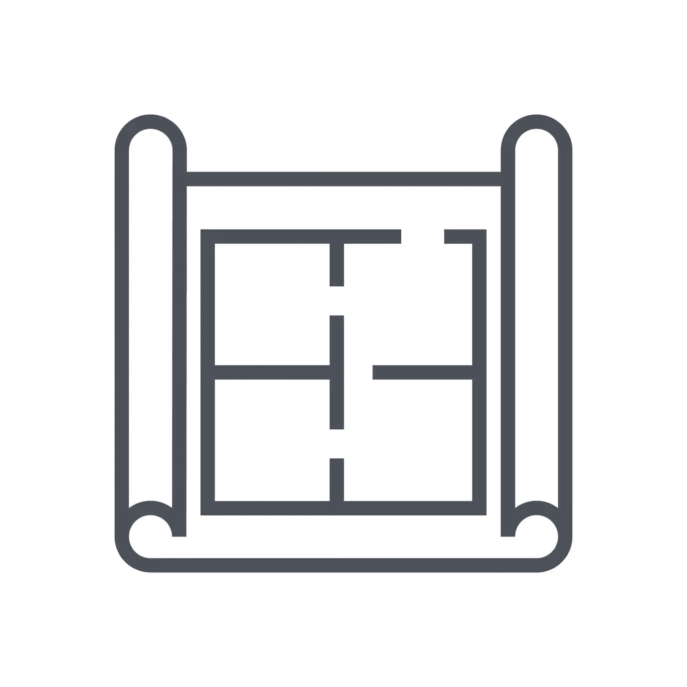
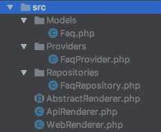
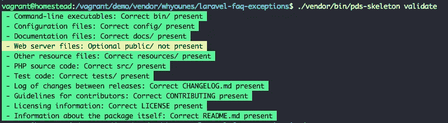

# PDS 框架示例:文件和文件夹结构的标准

> 原文：<https://www.sitepoint.com/pds-skeleton-by-example-a-standard-for-file-and-folder-structure/>

查看 [Packagist](http://packagist.org/) 注册表，我们可以看到大多数包都遵循一种模式，进行一些小的修改来满足他们的需求，而其他的包则有一个奇怪的文件夹结构，需要时间来理解。

这个问题被不同的人用不同的方式解决了。一些框架对如何构建类和资产有自己的建议，而另一些框架有一个框架，你可以把它作为一个起点。在本文中，我们将探索 [php-pds/skeleton](https://github.com/php-pds/skeleton) 并使用它来构建一个小的包作为演示。

*注:PDS 代表包开发标准*。



## 我们正在建造的东西

想法是有一种方法将 FAQ 页面(或任何其他页面)映射到由我们的 Laravel 应用程序抛出的异常。这将作为我们的用户解决问题的起点。

你可以在 [GitHub](https://github.com/Whyounes/laravel-faq-exceptions) 上找到最终代码。随时发送拉请求来改进它或建议修复！(如果你的 Git 生疏了，我们有[的优质课程](https://www.sitepoint.com/premium/courses/introduction-to-git-2902?aref=bskvorc)

## PDS 框架

PDS 框架认识到在 Packagist 上发布的开发人员已经在使用一些广泛的实践。在使用 Packagist 的 API 探索常见的文件夹结构之后，作者提出了一个有趣的[摘要](https://github.com/php-pds/skeleton_research#addendum)。

当我们公开发布一些东西时，它必须遵守一些共同的规则，如测试、记录、格式化等。下一步是有一个通用的文件夹结构来帮助开发人员和贡献者理解代码流。

想必你以前听说过 PHP 联盟。如果你想为联盟贡献一个包，你必须使用他们的[骨骼](https://www.sitepoint.com/starting-new-php-package-right-way/)以及一些其他需要遵守的规则。我认为让整个社区拥有相同的东西将有助于提高所有公开发布的软件包的可读性和一致性。

## 构建包

由于这是一个 Laravel 包，我将遵循[这个工作流程](https://www.sitepoint.com/laravel-package-building-workflow/)。继续下载 PDS 框架包。

```
cd vendor
mkdir whyounes # this is my author namespace
curl -LOk https://github.com/php-pds/skeleton/archive/1.0.0.zip # Download file
unzip 1.0.0.zip
mv 1.0.0 laravel-faq-exceptions
rm 1.0.0.zip 
```

我们需要更新我们的`composer.json`文件，以便它可以在加载依赖项时被 Composer 发现。现在让我们保持简单！

```
{
    "name": "Whyounes/laravel-faq-exceptions",
    "type": "library",
    "description": "Laravel package for mapping exception FAQ pages.",
    "homepage": "https://github.com/Whyounes/laravel-faq-exceptions",
    "license": "MIT",
    "require": {
        "laravel/framework": "~5.3"
    },
    "require-dev": {
        "pds/skeleton": "~1.0"
    },
    "autoload": {
        "psr-4": {
            "Whyounes\\FaqException\\": "src/"
        },
        "classmap": [
            "tests"
        ]
    },
    "autoload-dev": {},
    "bin": []
} 
```

您可能已经注意到,`require-dev`部分包含了`pds/skeleton`包。这有两个好处。

1.  它有助于跟踪谁在使用这个框架，开发人员可以检查它来查看命名规则。
2.  它包括命令行助手来生成和验证我们的框架。

现在我们有了一个起点，我们可以初始化 repo 并添加 Git remote。

```
git init
git add .
git commit -m "first commit"
git remote add origin git@github.com:Whyounes/laravel-faq-exceptions.git
git push -u origin master 
```

自然地，用你自己的 repo 的 URL 替换远程 URL。

默认情况下，该框架包含一些类作为演示，所以请继续清理这些目录。

### 比较选择方案

还有一种方法可以生成框架，而不需要下载 zip 文件并将其解压缩。

```
composer require --dev pds/skeleton
./vendor/bin/pds-skeleton generate 
```

这将生成所有丢失的文件和文件夹。

### 配置

通常，在决定做什么时，一个包有一些配置文件可以依赖。PDS 框架为此有一个名为`config`的目录。

> 如果包为配置文件提供了一个根级目录，它必须被命名为`config/`。
> 本出版物没有另外定义目录的结构和内容。

我们现在只有一个配置文件。我们可以把它放在那里，我们将在我们的服务提供者中引用它(稍后将详细介绍)。

### 资源

我们的包需要有一些数据库访问，以便能够将异常映射到 FAQ 页面。这意味着我们需要为此创建一个迁移。

PDS 框架有一个`resources`目录，描述为:

> 如果这个包为其他资源文件提供了一个根级目录，那么它必须被命名为`resources/`。
> 本出版物没有另外定义目录的结构和内容。

这些规则没有定义底层结构应该是什么样子。目前，我们将使用它来存储我们的`migrations`和`views`。它也可以用来存储种子，语言文件等。

```
// resources/migrations/2014_10_12_000000_create_faq_table.php

class CreateFaqTable extends Migration
{
    /**
     * Run the migrations.
     *
     * @return void
     */
    public function up()
    {
        Schema::create('whyounes_faq', function (Blueprint $table) {
            $table->increments('id');
            $table->text('exception');
            $table->string('codes');
            $table->text('url');
        });
    }

    /**
     * Reverse the migrations.
     *
     * @return void
     */
    public function down()
    {
        Schema::dropIfExists('whyounes_faq');
    }
} 
```

我们还需要一个视图文件来显示抛出的异常:

```
// resources/views/faq.blade.php

<!DOCTYPE html>
<html lang="en">
<head>
    <meta charset="utf-8">
    <meta http-equiv="X-UA-Compatible" content="IE=edge">
    <meta name="viewport" content="width=device-width, initial-scale=1">

    <title>Laravel</title>

    <!-- Fonts -->
    <link href="https://fonts.googleapis.com/css?family=Raleway:100,600" rel="stylesheet" type="text/css">

    <!-- Styles -->
    <style>
        html, body {
            background-color: #fff;
            color: #636b6f;
            font-family: 'Raleway', sans-serif;
            font-weight: 100;
            height: 100vh;
            margin: 0;
        }
    </style>
</head>
<body>
<div class="flex-center position-ref full-height">
    <div class="content">
        <div class="links">
            An error has occured: {{ $exception->getMessage() }}
            @if(!is_null($faq))
                <br>You can get more details about the problem <a href="{{ $faq->url }}">here</a>.
            @endif
        </div>
    </div>
</div>
</body>
</html> 
```

### 源文件

好了，现在我们来看实际的包逻辑。该框架有一个`src`目录，在文档中描述为:

> 如果包为 PHP 源代码文件提供了根级目录，必须命名为`src/`。
> 本出版物没有另外定义目录的结构和内容。

目录显然是我们存储包源代码的地方，和以前一样，规范没有描述底层结构。



实际的源代码在 repo 中，但是让我们简单地讨论一下这些类。

*   `src/Models/Faq.php`:这是与我们的 DB 表交互的模型类。我们在这里将模型分组在同一个目录下。
*   `src/Providers/FaqProvider.php`:提供商将持有我们套餐的服务提供商。我们用它来发布资产(如视图、迁移、配置)、注册 IoC 绑定、路由等。
*   这是一个与我们雄辩的模型互动的仓库。我更喜欢将它们与模型目录分开。

我们在`src`目录的根目录下也有一些类。这并不违反骨骼的任何规则。事实上，某些类位于名称空间的根中是有意义的。

### 软件包是如何工作的？

用户将根据应用程序类型使用其中一个渲染器。`WebRenderer`类将使用`faq.blade.php`模板呈现异常。`ApiRenderer`将返回一个包含异常细节的 JSON 响应。

典型的用法如下所示:

```
// app/Exceptions/Handler.php

class Handler extends ExceptionHandler
{
    // ...
    public function render($request, Exception $exception)
    {
        if ($request->expectsJson()) {
            $renderer = App::make(ApiRenderer::class);
        } else {
            $renderer = App::make(WebRenderer::class);
        }

        return $renderer->render($exception);
    }
    // ...
} 
```

### 试验

这个框架还包含一个`tests`文件夹，我们将用它来测试我们的包。

> 如果包为测试文件提供了一个根级目录，它必须被命名为`tests/`。
> 本出版物没有另外定义目录的结构和内容。

这里我们要测试的类是`WebRenderer`、`ApiRenderer`和`Models/Faq`。即使规范没有指定`tests`文件夹的底层结构，我还是建议您让它与您的`src`文件夹相同，这使得搜索和定位测试变得容易和可预测。

我认为这应该是 skeleton spec 推荐的最佳实践。大多数软件包都这样做，这似乎是合乎逻辑的。

你可以在 GitHub 上查看 [repo](https://github.com/Whyounes/laravel-faq-exceptions/tree/master/tests) 来查看实际的测试代码。

### 公共

我们的包没有任何需要用户访问的公共资产。但如果你有一些在你的，确保把它们放在这里。

> 如果这个包为 web 服务器文件提供了一个根级目录，那么它必须被命名为`public/`。
> 本出版物没有另外定义目录的结构和内容。

这里令人困惑的部分是使用`/resources`目录还是`/public`目录。这里的答案是“看情况”。如果我们正在为一个像 Laravel 这样的框架构建一个包，我们有权指定由框架发布到框架自己的`/public`文件夹中的资产。然而，如果我们使用完整应用程序的框架，我们可以使用`/public`文件夹作为 web 根目录。

### 箱子

一些包提供可执行文件来完成任务。在这种情况下，`/bin`目录可能会有用。例如，像 [PHP 代码嗅探器](https://github.com/squizlabs/PHP_CodeSniffer)这样的包是理想的选择(但是在这种情况下，开发者选择将文件夹命名为`scripts` \_(ツ)_/)

### 证明文件

文档是每个应用程序/包的重要组成部分。对于软件消费者和开发者来说，这是一个了解事情如何工作以及他们做错了什么的好去处。

> 如果包为文档文件提供了一个根级目录，它必须被命名为`docs/`。
> 本出版物没有另外定义目录的结构和内容。

PDS 框架为文档提供了一个单独的目录，我们可以按照自己的意愿构建它。在我看来，最好的方法是把它分成不同的主题，放在不同的目录中。在 API 的情况下，我们可以把它分成端点。

### 自述文件

自述文件非常重要，但不是`/docs`的正式部分。它向用户概述了如何安装和集成您的代码，以及一些其他的一般细节。我们的自述文件看起来像这样[。](https://github.com/Whyounes/laravel-faq-exceptions/blob/master/README.md)

您可以看到这个文件只包含了关于这个包的一些细节；只是一个概述，没必要做太长。`docs`目录应该包含其余的深入信息。

### 许可证

我们中没有多少人关心包许可，但它仍然是发布任何东西之前的重要一步。有人可能想以意想不到的方式使用这个包，他们需要知道这个操作是否被允许。

这个[网站](https://choosealicense.com/licenses/)对不同的可用许可证有一个非常好的概述。对于我们的包，我们将使用麻省理工学院的许可证。

### 贡献的

另一个经常被开发人员忽略的部分是贡献指南。应用程序*必须*有一个干净的过程，让其他开发者贡献特性和修复。

***注意:**当有人发出新的拉取请求时，GitHub 会自动链接到这个文件。*

我们不需要从头开始创造一个。我们可以选择一个适合我们的需要，并复制它。该文件应包括:

*   如何提交错误报告和修复。
*   如何提交安全补丁？
*   使用哪种编码风格。

可能会包括其他内容，但这应该足以让贡献者开始。

```
Thanks for choosing to contribute to this package.

## Bug Fixes

Bug fixes for a specific release should be sent to the branch containing the bug. You can also submit a failing test showing where the bug occurs.

## Security Fixes

Security fixes may be sent as a PR or via email to mymail@example.com

## Coding Standard

This package follows the PSR-2 coding standard and the PSR-4 autoloading standard. 
```

### 变更日志

changelog 文件用于跟踪不同版本之间的更改和错误修复。查看文件比滚动 Git commits 来查看发生了什么更容易。一个例子可能是这样的:

```
# Changelog

## 1.0.37 - 2017-03-22

### Fixed

* Space escaping for Pure-FTPd in the FTP adapter.

## 1.0.36 - 2017-03-18

### Fixed

* Ensure an FTP connection is still a resource before closing it.
* Made return values of some internal adapters consistent.
* Made 0 a valid FTP username.
* Docblock class reference fixes.
* Created a more specific exception for when a mount manage is not found (with BC).

## 1.0.35 - 2017-02-09

### Fixed 

* Creating a directory in FTP checked whether a directory already existed, the check was not strict enough.

## 1.0.34 - 2017-01-30

### Fixed

* Account for a Finfo buffer error which causes an array to string conversion.
* Simplified path handling for Windows.

// ... 
```

上面的片段摘自 PHPLeague 的 flysystem 包。

## 确认

我们可以使用`validate`命令来查看我们的结构是否遵守 PDS 规则。

```
./vendor/bin/pds-skeleton validate 
```



## 结论

使用文档化的框架不仅可以帮助你组织你的文件，还可以帮助其他人预测东西在哪里或者应该在哪里。PDS 框架并不是唯一存在的框架，但是其他的框架，如[PHPLeague 框架](https://www.sitepoint.com/starting-new-php-package-right-way/)已经被大量的开发者采用，并且默认情况下它是 PDS 兼容的。这意味着它遵守相同的规则，并且在根据验证器进行检查时被认为是有效的。

当创建一个新的应用程序或包时，你使用框架吗？你认为我们也应该有一个广泛适用的标准吗？请在评论中告诉我们！

## 分享这篇文章