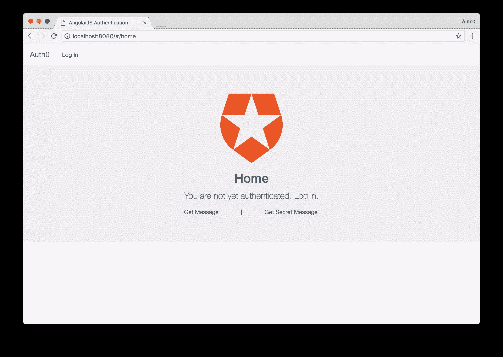
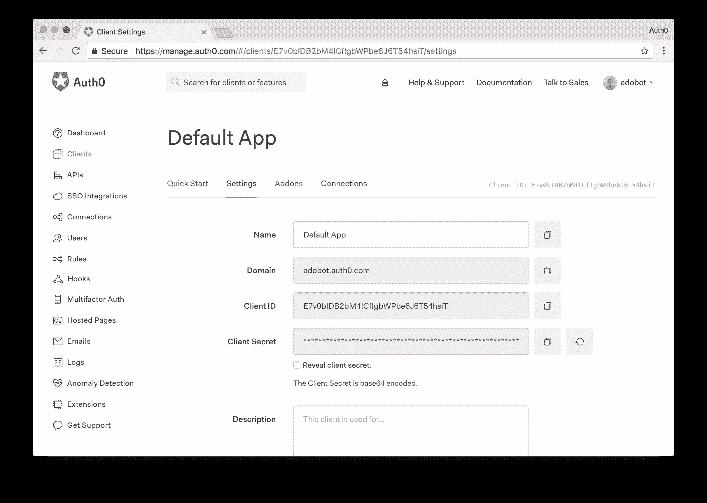
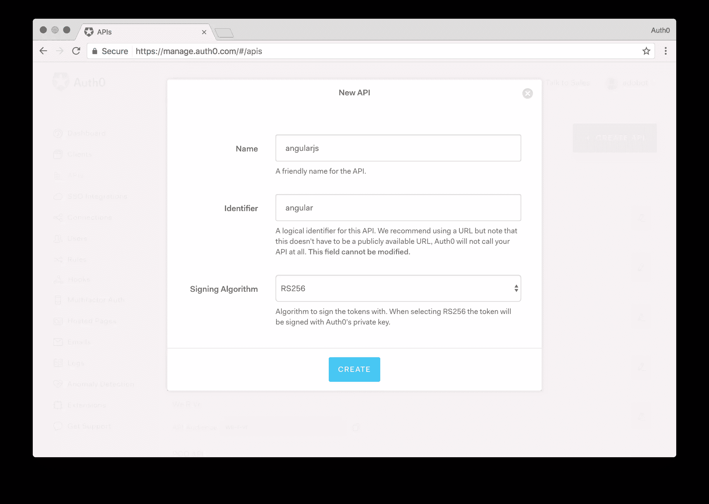
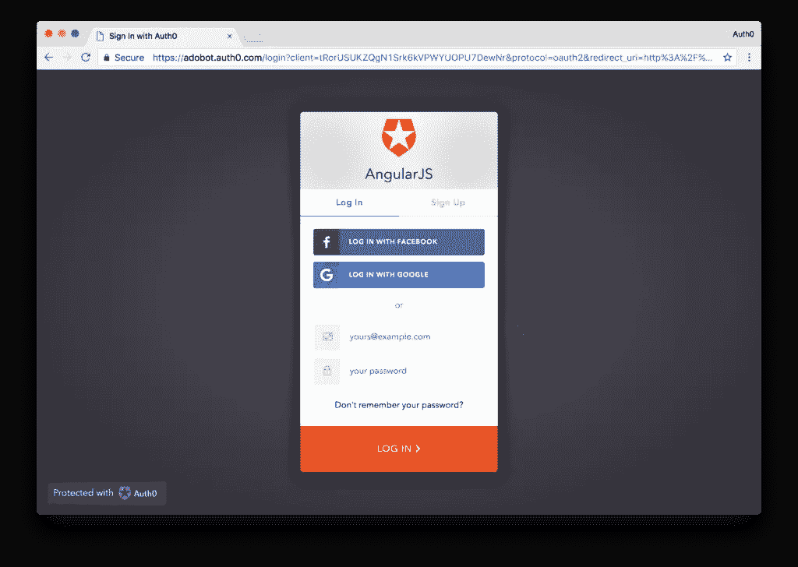
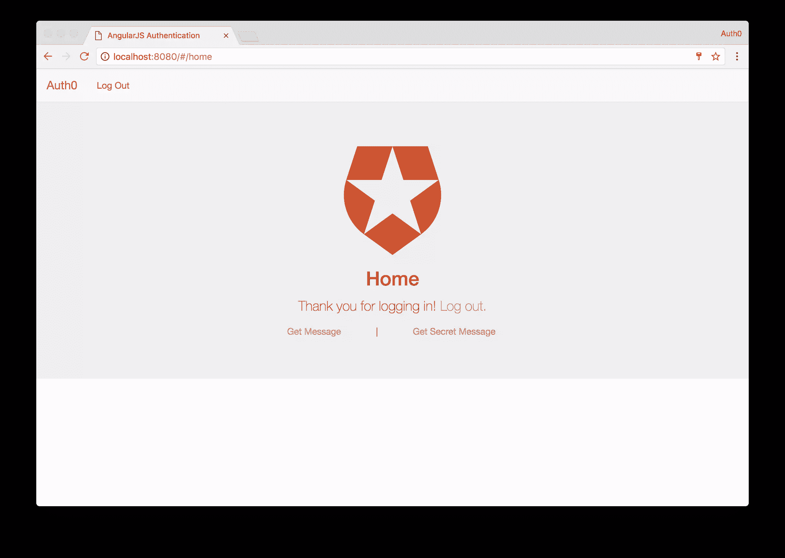
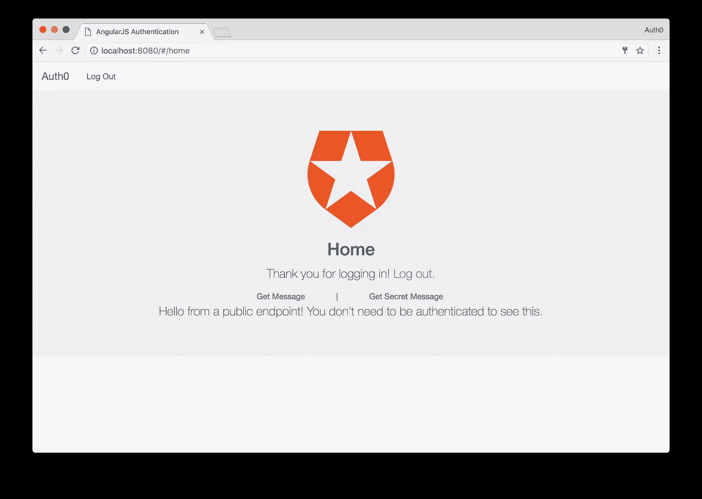
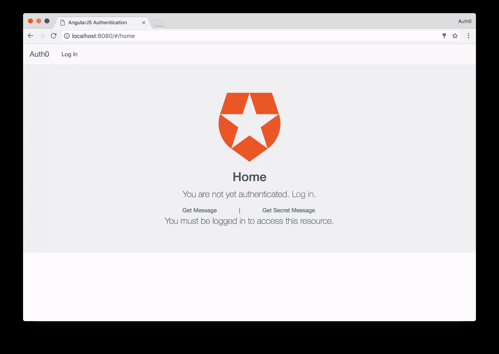

# 使用 Auth0 实现简单的 AngularJS 身份验证

> 原文：<https://www.sitepoint.com/easy-angularjs-authentication-with-auth0/>

本文于 2017 年 5 月 11 日更新，以反映 Auth0 的 API 的重要变化。

单页应用的认证可能是一件棘手的事情。在许多情况下，SPA 架构包括一个带有类似 AngularJS 的框架的隔离前端应用程序，以及一个作为数据 API 的独立后端来为前端提供数据。在这些情况下，在大多数往返应用程序中完成的传统的基于会话的身份验证是不够的。基于会话的认证对于这种架构有很多问题，但可能最大的问题是它将**状态**引入到 API 中，而 [REST](https://en.wikipedia.org/wiki/Representational_state_transfer) 的原则之一是事物保持**无状态**。另一个需要考虑的问题是，如果您想将相同的数据 API 用作移动应用程序的后端，基于会话的身份验证将不起作用。

## JSON Web 令牌

为了绕过这些限制，我们可以使用 [JSON Web 令牌(JWT)](http://jwt.io/introduction) 为我们的单页面应用程序添加身份验证。JWT 是一个开放的标准，为我们提供了一种方法来验证从我们的前端 AngularJS 应用程序到我们的后端 API 的请求。然而，jwt 不仅仅是一个象征。JWTs 最大的优势之一是它们包含了一个数据负载，这个数据负载可以包含我们定义的**声明**形式的任意 JSON 数据。由于 jwt 是用一个保存在服务器上的秘密进行数字签名的，所以我们可以放心，在到达后端之前，它们不会被篡改，有效载荷中的数据也不会被更改。

## Angular 应用的身份验证

jwt 是为我们的 AngularJS 应用程序添加身份验证的完美解决方案。从我们的 API 访问安全端点所需要做的就是将用户的 JWT 保存在本地存储中，然后在我们发出 HTTP 请求时将其作为`Authorization`头发送出去。如果用户拥有无效的 JWT 或者根本没有 JWT，他们访问受保护资源的请求将被拒绝，并且他们将得到一个错误。

不幸的是，这只是在 AngularJS 应用中处理认证的最低要求。如果我们真的关心用户体验，我们还需要做一些其他的事情来确保我们的应用程序像预期的那样运行。我们需要:

*   根据用户是否拥有有效的 JWT，有条件地显示或隐藏某些元素(例如:*登录*和*注销*按钮)
*   保护某些未经验证的用户不能访问的路由
*   当用户状态改变时，如果他们的 JWT 过期或当他们注销时，更新用户界面

在本文中，我们将在 AngularJS 应用程序中从头到尾实现身份验证，我们甚至将创建一个小型 NodeJS 服务器来查看如何对受保护的资源进行请求。关于建立用户数据库和发布 jwt 有很多细节，所以我们不会自己做，而是使用 [Auth0](https://auth0.com/?utm_source=sitepoint.com&utm_medium=post&utm_campaign=angular_authentication) (我工作的公司)为我们做。Auth0 为多达 7，000 名活跃用户提供了一个[免费计划](https://auth0.com/pricing/?utm_source=sitepoint.com&utm_medium=post&utm_campaign=angular_authentication)，这在许多现实世界的应用程序中给了我们足够的空间。我们还将看到如何轻松添加一个登录框，甚至使用 Auth0 进行社交认证。

在我们开始之前，如果你想复习 AngularJS，请在 SitePoint Premium 上查看[用 AngularJS](https://www.sitepoint.com/premium/courses/building-an-app-with-angularjs-2841) 构建应用程序。

要查看本教程的所有代码，请查看 [repo](https://github.com/sitepoint-editors/angular-auth) 。



## 注册 Auth0

本教程首先需要一个 Auth0 帐户。当[注册](https://auth0.com/signup/?utm_source=sitepoint.com&utm_medium=post&utm_campaign=angular_authentication)账户时，你需要给你的应用一个域名，以后不能更改。由于你可以在同一个账户下有多个应用，如何命名你的域名将取决于你的情况。在大多数情况下，最好用与您的组织相关的名称来命名，例如您公司的名称。如果有意义，你也可以使用你的应用程序的名字——这由你决定。您的 Auth0 域采用模式`your-domain.auth0.com`,并在配置 Auth0 工具时使用，我们将在下面看到。

一旦你注册了，你会被询问你的应用程序需要什么样的认证。保持默认值不变是很好的，因为您以后可以更改它们。

在你注册后，去你的[仪表盘](https://manage.auth0.com/)查看一下。如果你点击左边栏中的*客户端*链接，你会看到你的账户被创建了一个*默认应用*。单击默认应用程序查看您的凭据和其他详细信息。



我们应该马上填写我们的*允许的来源*和*允许的回调 URL*。此字段用于告诉 Auth0 允许哪些域请求对用户进行身份验证，以及在进行身份验证后我们可以重定向到哪些域。在本教程中，我们将使用 [http-sever](https://www.npmjs.com/package/http-server) ，它的默认原点是`http://localhost:8080`。

接下来，因为我们正在构建一个将与 API 后端对话的单页面应用程序，所以让我们也构建一个 API 客户端。点击主菜单中的*API*链接。从这里，点击*创建 API* 按钮，你会看到一个对话框，要求你填写一些关于你的 API 的信息。你只需要提供一个*名*和*标识符*。记下*标识符*，因为这是将用作 API 的*受众*标识符的值。将*签名算法*保留为 *RS256* 。



通过 Auth0 的免费计划，我们可以使用两个社交身份提供商，如谷歌、Twitter、脸书和许多其他公司。我们需要做的就是打开开关，这可以在[仪表盘](https://manage.auth0.com/)的*连接* > *社交*链接中完成。

## 安装依赖项并配置 Auth0

我们需要这个应用程序的一些软件包，其中一些是由 Auth0 作为开源模块提供的。如果您已经分叉了 [GitHub repo](https://github.com/sitepoint-editors/angular-auth) ，您可以简单地运行`bower install`来安装所有需要的依赖项。一旦安装了依赖项，您将希望全局安装`http-server`模块。为此，请输入以下命令:

```
# To serve the app (if not already installed)
npm install -g http-server 
```

最后，要启动并运行应用程序，只需从终端或命令行界面执行`http-server`命令。

接下来，让我们设置我们的`app.js`和`index.html`文件来引导应用程序。此时，我们可以让 Angular 知道我们需要从我们安装的依赖项中访问哪些模块。

```
// app.js

(function () {

  'use strict';

  angular
    .module('app', ['auth0.auth0', 'angular-jwt', 'ui.router'])
    .config(config);

  config.$inject = ['$stateProvider', '$locationProvider', 'angularAuth0Provider', '$urlRouterProvider', 'jwtOptionsProvider'];

  function config($stateProvider, $locationProvider, angularAuth0Provider, $urlRouterProvider, jwtOptionsProvider) {

    $stateProvider
      .state('home', {
        url: '/home',
        controller: 'HomeController',
        templateUrl: 'components/home/home.html',
        controllerAs: 'vm'
      })

    // Initialization for the angular-auth0 library
    angularAuth0Provider.init({
      clientID: AUTH0_CLIENT_ID, // Your Default Client ID
      domain: AUTH0_DOMAIN, // Your Auth0 Domain
      responseType: 'token id_token',
      redirectUri: AUTH0_CALLBACK_URL, // Your Callback URL
      audience: AUTH0_API_AUDIENCE, // The API Identifier value you gave your API
    });

    // Configure a tokenGetter so that the isAuthenticated
    // method from angular-jwt can be used
    jwtOptionsProvider.config({
      tokenGetter: function() {
        return localStorage.getItem('id_token');
      }
    });

    $urlRouterProvider.otherwise('/home');

    // Remove the ! from the hash so that
    // auth0.js can properly parse it
    $locationProvider.hashPrefix('');

  }

})(); 
```

在这里，我们用仪表板上的凭证配置了来自 [auth0-angular](https://github.com/auth0/auth0-angular) 的`authProvider`。当然，您会希望用自己的凭证替换示例中的值。让我们也创建一个`app.run.js`文件并粘贴以下代码:

```
// app.run.js
(function () {

  'use strict';

  angular
    .module('app')
    .run(function ($rootScope, authService) {

      // Put the authService on $rootScope so its methods
      // can be accessed from the nav bar
      $rootScope.auth = authService;

      // Process the auth token if it exists and fetch the profile
      authService.handleParseHash();
    });

})(); 
```

一旦用户成功通过身份验证，这个功能将解析散列来提取回调函数返回的`access_token`和`id_token`。在现实世界的应用程序中，你可能有一个特定的路径来处理这个问题，比如`/callback`，但是对于我们的简单演示来说，只要应用程序被刷新，它就会运行。

`access_token`将被发送到您的后端 API，这个令牌将被验证以确保正确的访问。另一方面,`id_token`用于前端客户端，保存客户端的用户数据。

```
<!-- index.html -->
<html>
  <head>
    <title>AngularJS Authentication</title>

    <!-- Viewport settings-->
    <meta name="viewport" content="width=device-width, initial-scale=1.0, maximum-scale=1.0, user-scalable=no" />

    <!-- Basic style -->
    <link href="bower_components/bootstrap/dist/css/bootstrap.css" rel="stylesheet" />
      <style> .navbar{
        margin-bottom: 0;
        border-radius: 0;
      } </style>
  </head>
  <body>
    <div ng-app="app">
      <nav class="navbar navbar-default">
        <div class="container-fluid">
          <div class="navbar-header">
            <a class="navbar-brand" ui-sref="home">Auth0</a>
          </div>
          <div id="navbar" class="navbar-collapse collapse">
            <ul class="nav navbar-nav">
              <li ng-if="!auth.isAuthenticated()"><a ng-click="auth.login()">Log In</a></li>
              <li ng-if="auth.isAuthenticated()"><a ng-click="auth.logout()">Log Out</a></li>
            </ul>
          </div>
        </div>
      </nav>

      <div ui-view></div>
    </div>

    <script type="text/javascript" src="auth0-variables.js"></script>
    <script type="text/javascript" src="bower_components/angular/angular.js"></script>
    <script type="text/javascript" src="bower_components/angular-ui-router/release/angular-ui-router.js"></script>
    <script type="text/javascript" src="bower_components/auth0.js/build/auth0.js"></script>
    <script type="text/javascript" src="bower_components/angular-auth0/dist/angular-auth0.js"></script>
    <script type="text/javascript" src="bower_components/angular-jwt/dist/angular-jwt.js"></script>
    <script type="text/javascript" src="app.js"></script>
    <script type="text/javascript" src="app.run.js"></script>
    <script type="text/javascript" src="components/home/home.controller.js"></script>
    <script type="text/javascript" src="components/auth/auth.service.js"></script>
  </body>
</html> 
```

现在我们有了应用程序设置的基础。我们在页面顶部有一个简单的工具栏，允许用户登录。您会注意到底部有一堆我们尚未创建的导入。我们将在下一节开始构建这些内容。

## 创建主页

我们可以在应用程序的几个地方放置认证控件。我们可以使用侧边导航、导航条、模态导航，甚至是这三者的混合。为了简单起见，我们已经在工具栏中放置了一个登录按钮，但是为了更好的用户体验，让我们也将它添加到我们的主视图中。如果我们查看我们的`app.js`文件，我们会看到我们的 home 组件将位于`components/home`目录中，所以接下来用一个`home.controller.js`文件和一个用于 UI 的`home.html`文件创建这个目录。我们的用户界面将如下所示:

```
 <!-- home.html -->
<div class="jumbotron">
  <h2 class="text-center"></h2>
  <h2 class="text-center">Home</h2>
  <div class="text-center" ng-if="!vm.auth.isAuthenticated()">
    <p>You are not yet authenticated. <a href="javascript:;" ng-click="vm.auth.login()">Log in.</a></p>
  </div>
  <div class="text-center" ng-if="vm.auth.isAuthenticated()">
    <p>Thank you for logging in! <a href="javascript:;" ng-click="vm.auth.logout()">Log out.</a></p>
  </div>
  <div class="text-center">
    <a ng-click="vm.getMessage()">Get Message</a> <span style="padding: 0 50px;">|</span>
    <a ng-click="vm.getSecretMessage()">Get Secret Message</a>
    <br />
    <p>{{vm.message}}</p>
  </div>
</div> 
```

对于我们的`home.controller.js`文件，我们将有以下代码:

```
 // home.controller.js
(function () {

  'use strict';

  angular
    .module('app')
    .controller('HomeController', homeController);

  homeController.$inject = ['authService', '$http'];

  function homeController(authService, $http) {

    var vm = this;
    vm.auth = authService;

    vm.getMessage = function() {
      $http.get('http://localhost:3001/api/public').then(function(response) {
        vm.message = response.data.message;
      });
    }

    // Makes a call to a private endpoint.
    // We will append our access_token to the call and the backend will
    // verify that it is valid before sending a response.
    vm.getSecretMessage = function() {
      $http.get('http://localhost:3001/api/private', {headers : {
        Authorization: 'Bearer ' + localStorage.getItem('access_token')
      }}).then(function(response) {
        vm.message = response.data.message;
      }).catch(function(error){
        vm.message = "You must be logged in to access this resource."
      });
    }

  }

})(); 
```

从我们的家庭控制器，我们将调用我们的 API 服务。我们将有两个 API 调用，一个用于任何人都可以访问的公共 API 路由，另一个用于只有登录用户才能成功访问的受保护路由。如果有些代码还没有意义，那也没关系。当我们创建身份验证服务时，我们将在下一节中更深入地探讨。

## 创建身份验证服务

到目前为止，我们已经多次引用了身份验证服务，但是还没有真正构建它。接下来我们来处理这个问题。认证服务将负责用户登录、管理认证状态等等。创建一个名为`auth`的新目录，其中有一个文件`auth.service.js`。我们的身份验证服务将如下所示:

```
// auth.service.js
(function () {

  'use strict';

  angular
    .module('app')
    .service('authService', authService);

  authService.$inject = ['$state', 'angularAuth0', 'authManager'];

  function authService($state, angularAuth0, authManager) {

    // When a user calls the login function they will be redirected
    // to Auth0's hosted Lock and will provide their authentication
    // details.
    function login() {
      angularAuth0.authorize();
    }

    // Once a user is successfuly authenticated and redirected back
    // to the AngularJS application we will parse the hash to extract
    // the idToken and accessToken for the user.
    function handleParseHash() {
      angularAuth0.parseHash(
        { _idTokenVerification: false },
        function(err, authResult) {
        if (err) {
          console.log(err);
        }
        if (authResult && authResult.idToken) {
          setUser(authResult);
        }
      });
    }

    // This function will destroy the access_token and id_token
    // thus logging the user out.
    function logout() {
      localStorage.removeItem('access_token');
      localStorage.removeItem('id_token');
    }

    // If we can successfuly parse the id_token and access_token
    // we wil store them in localStorage thus logging the user in
    function setUser(authResult) {
      localStorage.setItem('access_token', authResult.accessToken);
      localStorage.setItem('id_token', authResult.idToken);
    }

    // This method will check to see if the user is logged in by
    // checking to see whether they have an id_token stored in localStorage
    function isAuthenticated() {
      return authManager.isAuthenticated();
    }

    return {
      login: login,
      handleParseHash: handleParseHash,
      logout: logout,
      isAuthenticated: isAuthenticated
    }
  }
})(); 
```

认证服务非常简单。我们有一些函数来处理应用程序的登录和注销，以及检查用户是否登录。我们的应用程序现在应该可以工作了。让我们继续访问 [localhost:8080](http://localhost:8080) 来看看我们的应用程序的运行情况。

如果一切顺利，您应该看到 Angular 应用程序加载完毕，您将处于注销状态。


底部的两个链接目前不工作，因为我们还没有部署服务器。我们很快就会这样做，但为了确保我们的应用程序正常工作，让我们尝试登录。单击导航栏或页面主要内容中的登录链接，您将被重定向到 Auth0 域的登录页面。



在这里，你可以用你设置的任何连接登录，甚至注册一个新帐户。以你想要的方式登录，你将在`localhost:8080`被重定向回你的 AngularJS 应用程序，但这次你将处于登录状态。



非常好。对于演示的最后一部分，让我们编写一个简单的节点服务器来处理我们的 API 调用。

## 创建 NodeJS 服务器

现在让我们快速设置一个 NodeJS 服务器，这样我们就可以发出请求了！创建一个名为`server`的新目录，然后安装一些依赖项。

```
mkdir server && cd server
npm init
npm install express express-jwt cors jkws-rsa 
```

安装完成后，创建一个使用 [express-jwt 中间件](https://www.npmjs.com/package/express-jwt)的 [express](https://www.npmjs.com/package/express) app。您将需要您的 Auth0 API 信息。因为我们之前已经创建了 API，进入你的[仪表板](https://manage.auth0.com/)，找到 API，复制它的受众价值。看看下面的实现:

```
// server/server.js

var express = require('express');
var app = express();
var jwt = require('express-jwt');
var jwks = require('jwks-rsa');
var cors = require('cors');

app.use(cors());

var authCheck = jwt({
    secret: jwks.expressJwtSecret({
      cache: true,
      rateLimit: true,
      jwksRequestsPerMinute: 5,
      jwksUri: "https://{YOUR-AUTH0-DOMAIN}.auth0.com/.well-known/jwks.json"
    }),
    audience: '{YOUR-AUTH0-API-AUDIENCE}', // Paste your API audience here.
    issuer: "https://{YOUR-AUTH0-DOMAIN}.auth0.com/",
    algorithms: ['RS256']
});

app.get('/api/public', function(req, res) {
  res.json({ message: "Hello from a public endpoint! You don't need to be authenticated to see this." });
});

// For the private call we are using the authCheck middleware to validate the token
app.get('/api/private', authCheck, function(req, res) {
  res.json({ message: "Hello from a private endpoint! You DO need to be authenticated to see this." });
});

app.listen(3001);
console.log('Listening on http://localhost:3001'); 
```

express-jwt 中间件用于保护端点不被访问，除非发送有效的 jwt。然后，我们只需要将中间件应用于我们想要保护的任何路由，方法是将它作为第二个参数传入，就像我们在这里对`private`路由所做的那样。

### 发出 API 请求

使用命令`node server.js`在新的控制台窗口/选项卡中启动服务器

现在，如果我们现在进入 AngularJS 应用程序，并单击 *Get Message* 按钮，我们将看到一条消息显示“Hello from the public endpoint…”。单击下一步的*获取秘密消息*按钮，您应该会看到显示的“你好，来自私有端点…”消息。这是因为我们之前登录过，而您仍处于登录状态。



让我们看看当你没有登录并尝试访问秘密消息时会发生什么。从导航栏或主内容中点击*注销*按钮。一旦您注销，点击*获取秘密消息*按钮，这一次您将看到一条不同的消息，说明您必须通过身份验证才能访问端点。



## 关于 Auth0 的更多信息

Auth0 还让我们可以轻松地将其他现代认证功能添加到我们的应用程序中，包括[单点登录](https://auth0.com/docs/sso/single-sign-on/?utm_source=sitepoint.com&utm_medium=post&utm_campaign=angular_authentication)、[无密码登录](https://auth0.com/passwordless/?utm_source=sitepoint.com&utm_medium=post&utm_campaign=angular_authentication)和[多因素认证](https://auth0.com/docs/multifactor-authentication/?utm_source=sitepoint.com&utm_medium=post&utm_campaign=angular_authentication)。

我们也不局限于使用 NodeJS 作为我们的后端。还有许多其他的 SDK，包括:

*   拉勒维尔
*   [Ruby on Rails](https://auth0.com/docs/quickstart/backend/rails/?utm_source=sitepoint.com&utm_medium=post&utm_campaign=angular_authentication)
*   [出发](https://auth0.com/docs/quickstart/backend/golang/?utm_source=sitepoint.com&utm_medium=post&utm_campaign=angular_authentication)
*   [Python](https://auth0.com/docs/quickstart/backend/python/?utm_source=sitepoint.com&utm_medium=post&utm_campaign=angular_authentication)

还有一些 SDK 可用于移动开发，以简化身份验证:

*   [iOS](https://auth0.com/docs/quickstart/native-mobile/ios-objc/no-api/?utm_source=sitepoint.com&utm_medium=post&utm_campaign=angular_authentication)
*   [安卓](https://auth0.com/docs/quickstart/native-mobile/android/no-api/?utm_source=sitepoint.com&utm_medium=post&utm_campaign=angular_authentication)
*   [离子型](https://auth0.com/docs/quickstart/native-mobile/ionic/no-api/?utm_source=sitepoint.com&utm_medium=post&utm_campaign=angular_authentication)
*   [科尔多瓦](https://auth0.com/docs/quickstart/native-mobile/cordova/no-api/?utm_source=sitepoint.com&utm_medium=post&utm_campaign=angular_authentication)

## 包扎

向 API 添加身份验证并从 AngularJS 应用程序向其发送经过身份验证的请求相对容易，但要确保用户体验是正确的，需要几个步骤。Auth0 为我们完成了身份验证的重任，因为我们不需要担心保存自己的用户数据库，也不需要放入自己的登录框。

根据我的经验，在 Angular 2 应用中实现身份验证要容易得多，因为我们需要担心的事情更少。如果你对 Angular 2 感兴趣，你可以看看这个关于如何构建一个带认证的工作应用的示例，也可以看看[的 Auth0 文档](https://auth0.com/docs/quickstart/spa/angular2/no-api/?utm_source=sitepoint.com&utm_medium=post&utm_campaign=angular_authentication)。

## 分享这篇文章