# 面向前端开发人员的 20 多份文档和指南(第 12 位)

> 原文：<https://www.sitepoint.com/20-docs-guides-front-end-developers-12/>

又到了该学习的时候了！和以前一样，我收集了许多不同的学习资源，包括指南、文档和其他有用的网站，以帮助您快速了解前端开发的不同领域。

因此，请欣赏我们的文档和指南系列第十二期，不要忘记在任何其他人的评论中告诉我我还没有包括的内容。

## [1。反应位](https://vasanthk.gitbooks.io/react-bits/)

React 模式、技术、技巧和诀窍的汇编。包括关于设计模式、ant 模式、性能技巧和样式的部分。对于那些想要深入研究 React 的人来说，这看起来是一个很好的参考。

[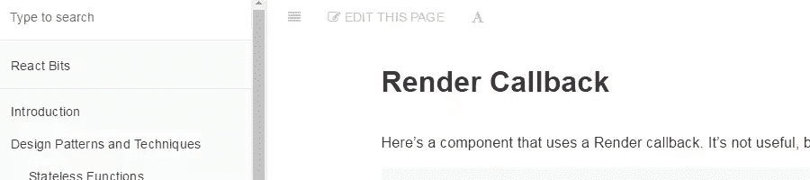](https://vasanthk.gitbooks.io/react-bits/)

## [2。Vue.js 完整的 API 备忘单](https://vuejs-tips.github.io/cheatsheet/)

该备忘单以简单的 PDF 格式提供，包含不同功能的快速参考，或者作为完全交互式的指南。交互式指南作为官方 Vue.js 文档的快捷方式，在一个覆盖的 iframe 中打开每个链接。

[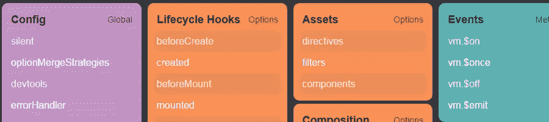](https://vuejs-tips.github.io/cheatsheet/)

## [3。CSS 网格备忘单](https://alialaa.github.io/css-grid-cheat-sheet/)

自从浏览器支持得到改进以来，W3C 新的网格布局模块特性真的越来越流行了。这个互动指南是一个非常复杂的小应用程序，有大量的选项。对于初学者来说，这可能不是一个很好的指南，但是对于那些已经熟悉网格布局基础的人来说，这可能是一个不错的选择。

[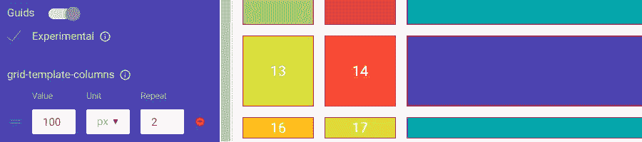](https://alialaa.github.io/css-grid-cheat-sheet/)

## [4。Flexbox 备忘单](http://yoksel.github.io/flex-cheatsheet/)

flexbox(CSS 布局中的另一个热点)在这个备忘单中有所体现。据我所知，这个版本使用了与规范相同的描述性信息，但是使用了一些交互式代码示例来帮助可视化不同的特性。

[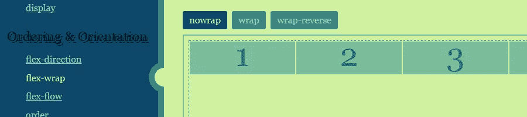](http://yoksel.github.io/flex-cheatsheet/)

## [5。包含组件](https://inclusive-components.design/)

从技术上来说，这个站点是一个博客，但是作为一个模式库和一个可访问站点的极好例子，它工作得很好。到目前为止，只有两个条目发布在“图书馆”中，但两者都详尽地涵盖了它们的主题，所以有很多内容需要了解，如果你担心可访问性(你应该担心！).

## [6。A11y 风格指南](http://a11y-style-guide.com/style-guide/)

“A11Y 风格指南带有预填充的可访问组件，包括相关工具、文章和 WCAG 指南的有用链接，使您的网站更具包容性。这些组件还可以作为 HTML 标记和 SCSS/CSS 代码的指南，在网站创建的每个阶段为设计师、前端和后端开发人员提供信息。”部分包括表单、媒体、导航等。

[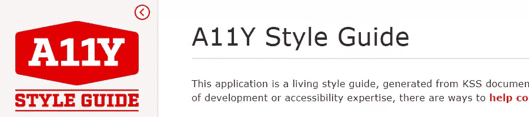](http://a11y-style-guide.com/style-guide/)

## [7。前端加工配方](https://voorhoede.github.io/front-end-tooling-recipes/)

一组通用的预配置前端工具设置。这些非常固执己见，但可能适合你未来的工作。

[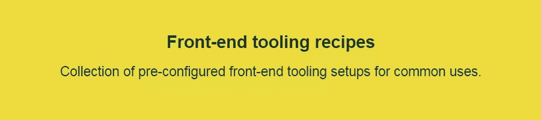](https://voorhoede.github.io/front-end-tooling-recipes/)

## 8.ES6 功能

这个世界需要 ES6 特性的另一个列表吗？也许不是，但这一篇的解释似乎非常专业，我相信许多转向 JavaScript 的有经验的程序员会喜欢。每个特性都有很多交互式代码示例。

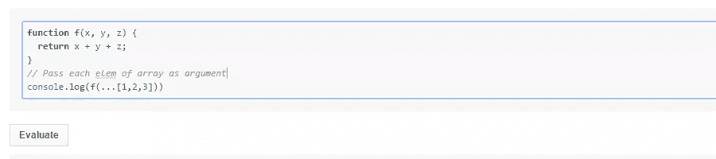

## [9。CSS 网格完全指南](https://tympanus.net/codrops/css_reference/grid/)

来自 Codrops CSS 参考，这是一个详尽的参考，讨论了新的网格布局规范的所有特性。许多漂亮的图表和干净的代码示例。

[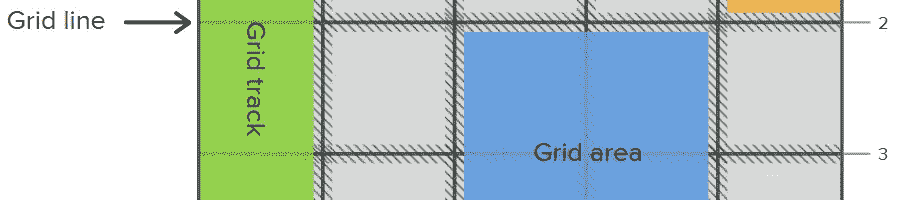](https://tympanus.net/codrops/css_reference/grid/)

## 10。HTML 参考

一个免费的 HTML 指南，包括所有的元素和属性。每个 HTML 特性都包括大量的代码示例，您可以通过元、内联和块来过滤特性。

## [11。HTML5 机器人](http://html5bot.webflow.io/)

如果你对 HTML 有点陌生，并且不知道在什么情况下使用哪个元素，这个快速的互动网站会在你回答几个问题后给你正确的元素。

## [12。CSS 触发器](https://csstriggers.com/)

变异 CSS 属性的渲染影响的参考。也就是说，您将发现属性是否会触发重画、布局或合成，以及这些是否会在默认或后续更新中发生。

[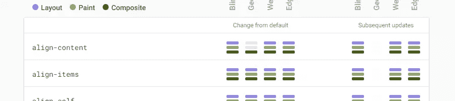](https://csstriggers.com/)

## 13。CSS 属性语法 cheatsheet

如果您曾经阅读过其中一个规范中对 CSS 属性的描述，您可能会看到一个类似如下的值:`Value: nowrap | wrap | wrap-reverse`。其他值可能更复杂。这个快速参考解释了这个符号是怎么回事。

## [14。HTML5 模式](http://html5pattern.com/)

HTML 现在允许输入类型在`pattern`属性中包含正则表达式，以允许在客户端验证值。这个站点有许多预先构建的模式，包括密码、信用卡、邮政编码、电话号码、电子邮件等等。

[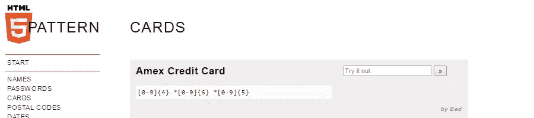](http://html5pattern.com/)

## 15。2016 JavaScript 新星

通过对比过去 12 个月 GitHub 上添加的星星，这个页面用数字告诉你哪些 JavaScript 项目在 2016 年获得了关注。这可能是评估哪些库、框架或其他工具最值得学习的好方法。

## 16。今天网络能做什么

如果你正在考虑用 native 还是 web 来构建你的下一个应用程序(或者两者都用)，这个网站会给你一个 HTML5 特性的概述，这些特性试图在不同的设备上模仿 native 特性。这应该给你一个好主意，是否在 web 上构建，取决于你想要使用什么特性。

[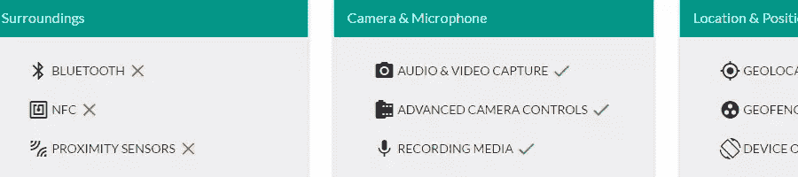](https://whatwebcando.today/)

## [17。移动到 HTTPS 指南](https://movingtohttps.com/)

“一个帮助网站所有者通过简单的测试过程迁移到 HTTPS 的社区网站。允许你根据多个平台(WordPress、Magento 等)、托管环境(cPanel、Apache 等)以及你对网站的控制/访问级别来过滤计划。”

## 18。WAI-ARIA 创作实践 1.1

“本文档让读者了解如何使用 WAI-ARIA 1.1 [WAI-ARIA]来创建可访问的富互联网应用程序。它描述了大多数作者仅从 WAI-ARIA 规范可能不明显的注意事项，并推荐了使用 WAI-ARIA 角色、状态和属性使小部件、导航和行为可访问的方法。”

[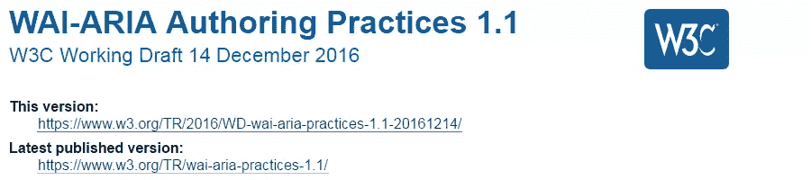](https://www.w3.org/TR/wai-aria-practices-1.1/)

## [19。网格“后退”和覆盖](https://rachelandrew.co.uk/css/cheatsheets/grid-fallbacks)

快速参考，了解网格布局特性如何与其他布局方法交互，以及如何在不为旧浏览器构建完全不同的“分叉”版本代码的情况下提供良好的回退。

[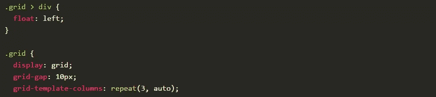](https://rachelandrew.co.uk/css/cheatsheets/grid-fallbacks)

## 20。柔性盒

这是一个互动平台，让您重温不同的 flexbox 特性。包括一些预设的布局以及深度链接到实验中已保存状态的能力，这很酷。

[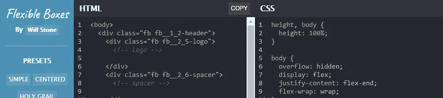](http://flexible-boxes.wstone.io/)

## 精英中的精英

*   [终极社交&数字广告尺寸指南](https://www.adjelly.com/size-guide)
*   [开发者文档](https://chrome.google.com/webstore/detail/d2-developer-documentatio/pcndaioeajanljljbjglanbmnmhgdjln) (Chrome 扩展)
*   [iOS 的 CSS 参考](https://itunes.apple.com/us/app/css-reference-free/id1212942426)
*   [CSS 光标](http://csscursor.info/)
*   [从旧的 508 部分转移到 WCAG 2.0 AA](https://github.com/mgifford/section508-to-wcag2aa)
*   [Polyfills 和网络的发展](https://w3ctag.github.io/polyfills/)
*   [学习可访问性](https://developer.mozilla.org/en-US/docs/Learn/Accessibility) (MDN)
*   [函数式编程行话](https://github.com/hemanth/functional-programming-jargon)

## 建议你的

如果你已经为前端开发人员建立或知道另一个学习资源，请在评论中提出来，我会在以后的帖子中考虑它。

同时，以下是本系列之前的帖子:

*   [20 份前端开发者文档和指南(第一期)](https://www.sitepoint.com/20-docs-guides-front-end-developers/)
*   [20 份前端开发者文档和指南(第二期)](https://www.sitepoint.com/20-more-docs-guides-front-end-developers/)
*   [20 份前端开发者文档和指南(第三期)](https://www.sitepoint.com/another-20-docs-guides-front-end-developers/)
*   [20 份前端开发者文档和指南(第 4 期)](https://www.sitepoint.com/20-docs-guides-front-end-developers-4/)
*   [20 份前端开发者文档和指南(第 5 期)](https://www.sitepoint.com/20-docs-guides-front-end-developers-5/)
*   [20 份前端开发者文档和指南(第 6 期)](https://www.sitepoint.com/20-docs-guides-front-end-developers-6/)
*   [20 份前端开发者文档和指南(第 7 期)](https://www.sitepoint.com/20-docs-guides-front-end-developers-7/)
*   [20 份前端开发者文档和指南(第 8 期)](https://www.sitepoint.com/20-docs-guides-front-end-developers-8/)
*   [20 份前端开发者文档和指南(第 9 期)](https://www.sitepoint.com/20-docs-guides-front-end-developers-9/)
*   [20 份前端开发者文档和指南(第 10 期)](https://www.sitepoint.com/20-docs-guides-front-end-developers-10/)
*   [20 份前端开发者文档和指南(第 11 期)](https://www.sitepoint.com/20-docs-guides-front-end-developers-11/)

## 分享这篇文章