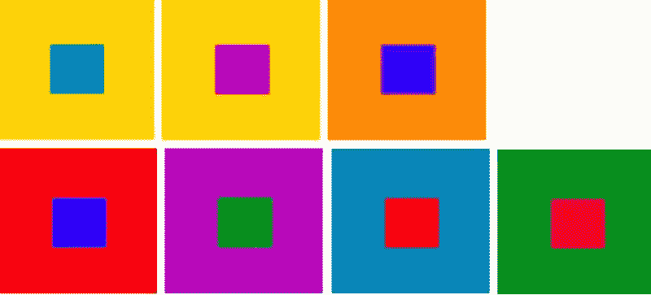
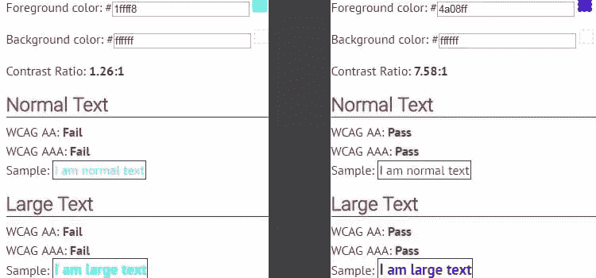
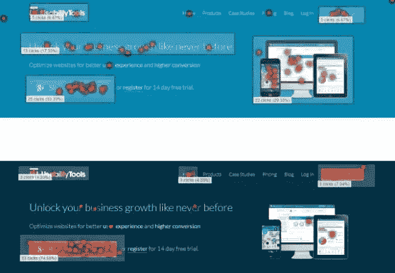
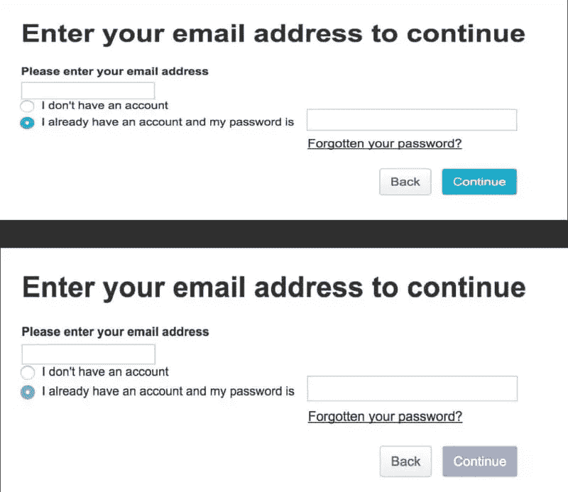
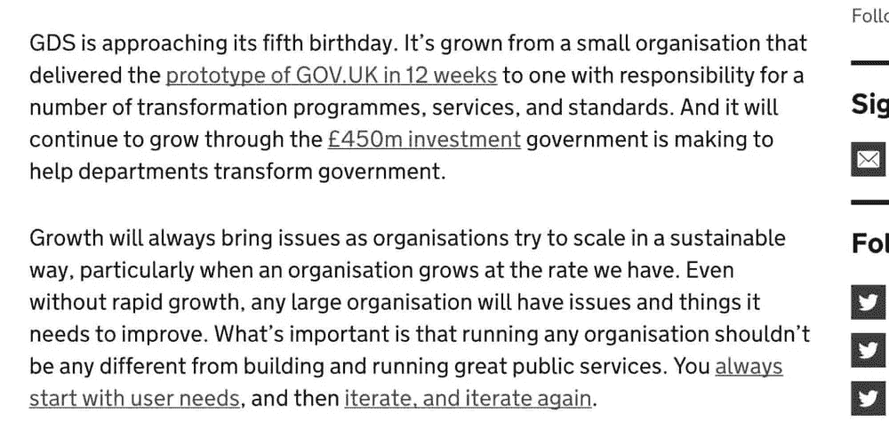
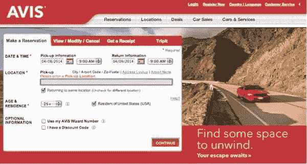
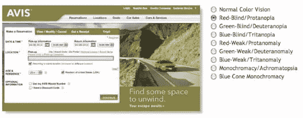
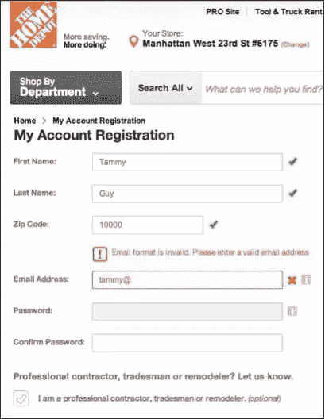

# 如何通过智能颜色选择提高可用性

> 原文：<https://www.sitepoint.com/how-to-boost-usability-with-intelligent-color-choices/>

颜色在我们的生活中起着至关重要的作用；从区分物体，到理解交通信号，到正确使用工具。

更有意思的是颜色对我们的认知和心情的巨大影响。最近我读了一篇简短的研究文章，它解释了不同的人如何看待颜色以及颜色对他们的情绪和情感的影响。他们引用了一项研究，在这项研究中，提起漆成*黑色*的箱子的工人抱怨箱子太重——但当同样的箱子漆成*绿色*时，他们感觉更轻。

同样，对于网站来说，颜色会对用户的可用性和认知产生重大影响。虽然每个设计元素都有助于网站的可用性，但设计师在选择使用何种颜色时需要格外小心。

让我们看一看。

## 糟糕的颜色组合如何影响可读性

屏幕/网页上的背景和前景元素必须是不同的颜色。当两者相同时，很难马上识别前景元素。很明显，对吧？是的，但是还有更多。

并不是所有的前景色和背景色的组合都适合使用，但是考虑到这一点，我们怎么知道选择哪种颜色呢？回答:选择相互对比很好的颜色。

来源:[色彩交互和色彩效果](http://www.dsource.in/course/visual-design-colour-theory/colour-interaction-and-color-effects)

在上图中，尽管背景方块上使用的颜色与前景方块上使用的颜色*非常*不同，尽管对比度很高，但看起来还是非常不舒服。如果前景是文本，它将是不可读的和不舒服的，并且同样适用于当有*低*对比度时。

有甜区吗？

是的，有——继续读下去。

## 寻找对比最佳点

解决办法是选择**对比度**足够的颜色组合。根据 [WCAG 2.0 指南](https://www.w3.org/TR/WCAG20/)，文本的对比度至少应为 4.5:1。例如，如果对比度为 1.26:1，阅读文本会相当困难；然而，如果对比率是 7.58:1，它将更清晰和可读。

有没有工具可以帮你检查 app 和网站的背景色和前景色的对比度？是啊！ [WebAIM 工具](http://webaim.org/resources/contrastchecker/)。

## 为醒目的 CTA 选择最佳颜色

当你需要将用户的注意力转移到一个特定的元素上时，颜色对比也很重要，比如一个行动号召按钮(也称为 [CTA](https://www.sitepoint.com/cta-buttons-that-work/) )。

[在实验](http://blog.usabilitytools.com/color-vs-contrast/)中，创建了网页的两个 A/B 变体。第一个版本是蓝色背景，并使用不同的蓝色作为行动号召，另一个版本是海军蓝背景，带有橙色 CTA。用户被要求点击最能吸引他们注意力的元素。橙色 CTA 比蓝色 CTA 收到了更多的点击，因为橙色-海军蓝的对比度高于第一个变体。

蓝色背景的变化具有 1.39:1 的对比度，略低于“最佳点”。在第二个变体中，对比度是 4.73:1，这意味着橙色-海军蓝组合的对比度比另一个版本更好。

在为行动号召选择颜色时，我们需要选择一种与背景颜色形成鲜明对比的颜色。但是我们怎么知道哪种颜色能产生最大的反差呢？为此，我们可以使用[色轮](http://paletton.com/#uid=13R0u0kllll6fK4dNtbsTdvIi5E)来寻找“相反的颜色”。例如，在上述案例研究中，橙色与车轮上的海军蓝相反，因此对比鲜明(即更有效)。

## 如何让 CTA 更容易使用

作为个体，我们都以不同的方式体验颜色。我们中的一些人患有视觉缺陷，称为色盲，这被描述为无法区分某些颜色(最常见的是红色和绿色，或者蓝色和黄色)。事实上，据估计，12 名男性中有 1 名，200 名女性中有 1 名患有这种类型的失明。

色盲用户将难以感知某些颜色。例如，*蓝色* CTA 可能会显示为不饱和的蓝色，这可能会导致 CTA 和背景之间的对比度显得非常低，这反过来会使 CTA 不太引人注意。

这里有一个使用[色盲模拟器](http://www.color-blindness.com/coblis-color-blindness-simulator/)查看的登录屏幕的例子。

解决方法还是**对比**。通过使用高对比度的颜色，无论实际使用的是什么颜色，你都可以使 CTA 易于使用！

色盲用户在使用链接时也会遇到同样的麻烦。默认情况下，可点击的文本显示为蓝色，但是对于色盲的人来说，除非有下划线，否则很难注意到可点击的文本。

下图显示了色盲者如何看待一段文字内容。注意到可点击和不可点击的文本几乎是一样的吗？如果链接没有下划线，色盲的人几乎不可能发现可点击的链接。

有时，彩色文本被用来在网站上传达一个特殊的信息。通常，*红色*用于显示错误或警告用户，而*绿色*文本用于显示肯定消息。例如，当您在填写表单时出错时，需要更正的字段上方会显示红色文本。

这种对颜色的依赖对于色盲用户来说是一个巨大的障碍。或者，为了突出错误/显示警告，您可以将红色与适当的背景色结合起来以提高对比度，还可以使用[微妙的动画](https://www.sitepoint.com/how-to-lift-your-ux-out-of-the-pack-with-micro-interactions/)来进一步阐明警告。永远不要依赖单一的设计技术来提供卓越的用户体验。

一些种类的失明会降低用户察觉动作的能力，在这种情况下，颜色是最有用的 T2，动画是最没用的 T4。

让我们探索更多的例子。

上图描绘了色盲者如何看到网页。请注意输入字段上方的警告是如何难以察觉的？这里的解决方案是使用不同的视觉元素来传达这样的信息。例如，一些表单使用文本和图标来显示错误。这是因为图标很容易被注意到，即使对于一个色盲的人。通常，X 或感叹号与文本一起使用，以显示表单上的重要警告。这是另一个例子:

## 外卖

因此，正如我们所知，颜色会极大地影响可用性。当决定在应用程序或网站设计中使用调色板时，重要的是要明白网站不仅要*看起来*好，还应该适用于你所迎合的不同人群，甚至是隐藏的人群，比如有某些残疾的人。

这不仅适用于网站，也适用于手机 app。不为自己设计，不为客户设计，**为用户设计**。

## 分享这篇文章