# 快速提示:如何使用 Jetpack 自动发布社交媒体

> 原文：<https://www.sitepoint.com/quick-tip-automate-social-media-posting-jetpack/>

在这篇文章中，你将学习如何使用 Jetpack 的社交媒体功能来扩充你的 WordPress 站点。根据你从哪里获得 WordPress 的拷贝，Jetpack 可能是安装的一部分，也可能不是。这篇文章将介绍如何设置 Jetpack，如果你的安装中没有它的话，然后将社交媒体帐户链接到它，以便在你的网站上发布新的博客条目时自动向他们发布。

*请注意，这不是对众多社交媒体插件的解释，也不是对如何[制作自己的](https://www.sitepoint.com/premium/screencasts/create-a-simple-widget-for-your-wordpress-theme)的解释，而是当你在自己的网站上发表博客文章时，使用 Jetpack 在自己的账户上创建社交媒体帖子。*

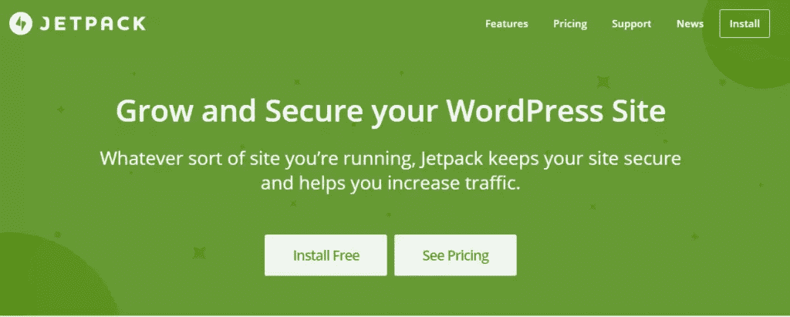

首先，去 Jetpack.com。如你所见，有两种选择，免费安装或定价。在本教程中，你会看到免费安装。

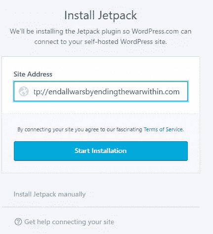

当你点击免费安装按钮时，上面的屏幕出现。输入你的 WordPress 站点的完整 URL。当您这样做时，会出现蓝色的开始安装按钮。点击它开始安装 Jetpack。

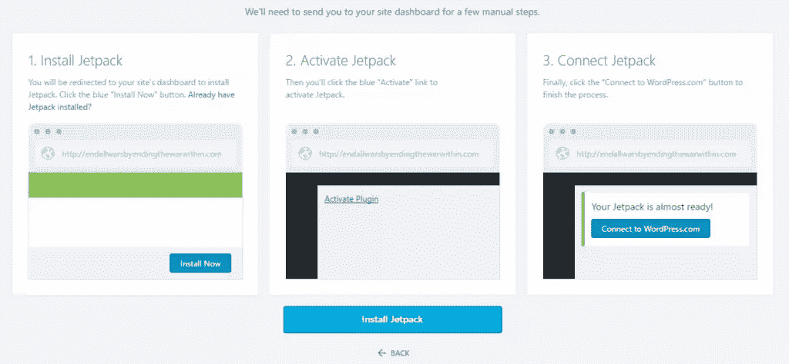

在上面的屏幕上，单击安装 Jetpack。

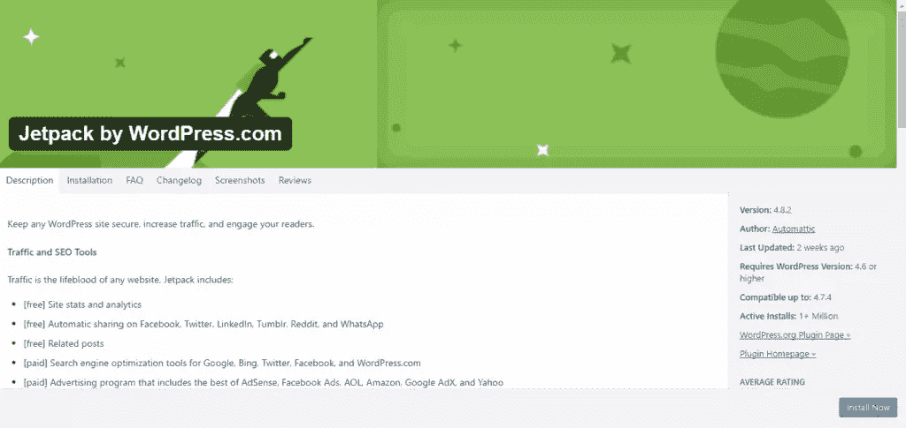

这将带您进入另一个屏幕。点击右下角蓝色的立即安装按钮。

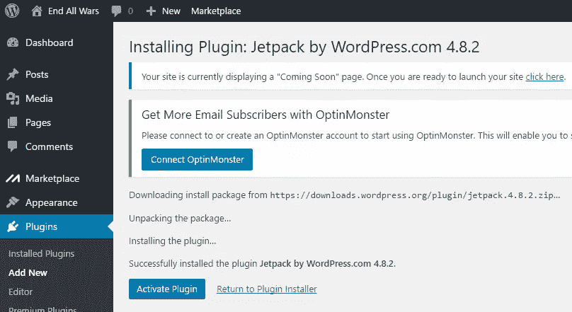

这会将你重定向回 WordPress，在这里你会被告知 Jetpack 已经成功安装。点击蓝色的激活插件按钮来激活 Jetpack。

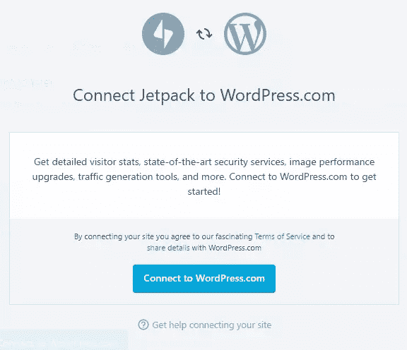

此时，您将看到一个类似上面的屏幕。这将允许您将 Jetpack(通过 WordPress.com)连接到您的安装。

当你点击连接按钮时，你需要登录 WordPress 的一个账户(或者注册一个)来连接 Jetpack 和你的 WordPress 安装。

一旦你点击蓝色按钮来连接你的帐户，你将被重定向回你的安装，你应该在侧边栏点击 Jetpack。

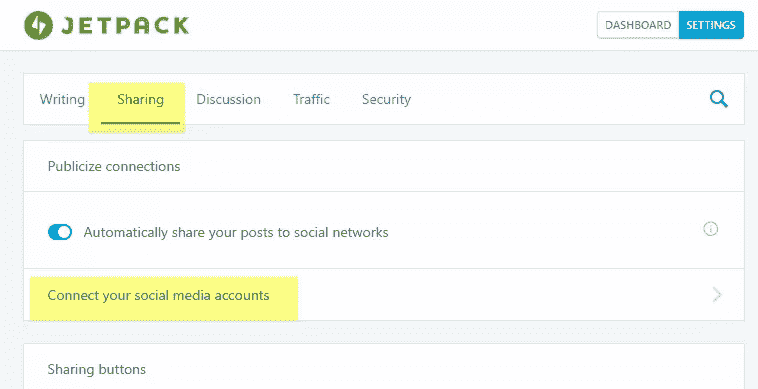

这会将您带到 Jetpack 页面。单击共享选项卡，在共享页面上，单击连接您的社交媒体帐户链接。

这将打开上面的发布你的帖子页面，在这里你可以连接多达六个社交媒体账户。请注意，您需要已经设置好想要连接的社交媒体帐户，否则连接过程将会失败。

每个社交媒体账户的流程会有所不同。

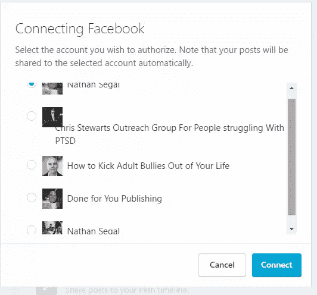

这是脸书的情况。正如您在说明中看到的，选择您想要授权的帐户。请注意，您的帖子将自动共享到选定的帐户。一旦该过程完成，您的脸书帐户将被连接。

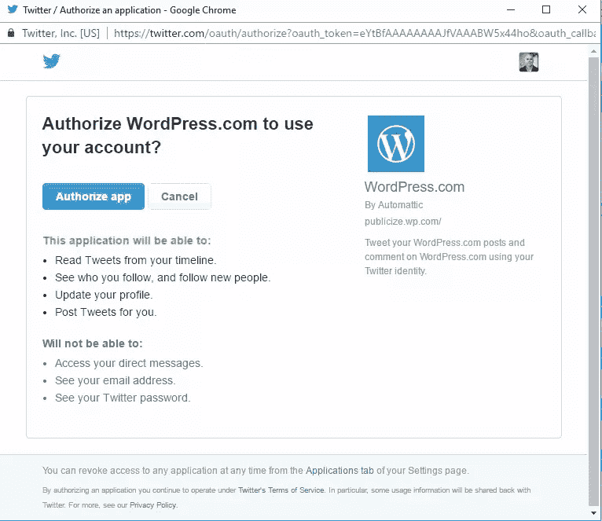

以下是 Twitter 的流程。当你点击授权应用程序按钮时，它会迅速将 Jetpack 连接到你的 Twitter feed。

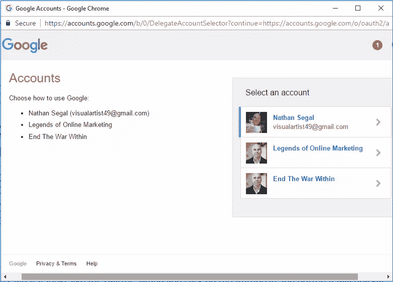

我们再来看一个，Google+。这就是上面的连接屏幕。当你点击一个账户时，会弹出一个屏幕要求你离线访问。点击允许。这将带你回到 Jetpack，并会有另一个连接屏幕。点击连接按钮。

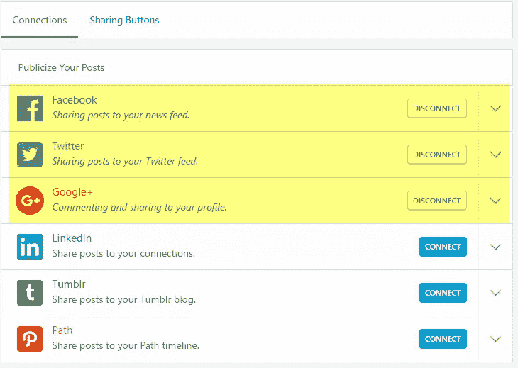

这是三个社交媒体帐户连接后的“连接”选项卡的外观。

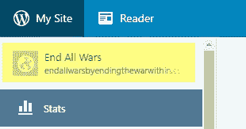

当您对已连接的站点数量感到满意时，单击左上角的站点名称。这将带您到您的网站网站显示。转到左上角，在你看到你的网站名称的地方，点击它。在出现的下拉菜单中，选择 Dashboard，你将返回到你的 WordPress 站点的后端。

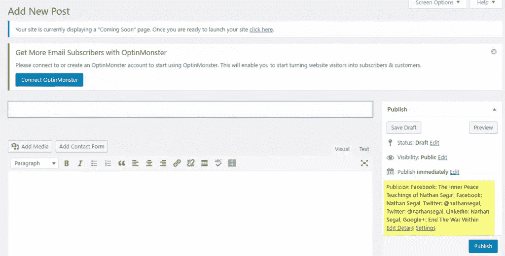

在那里，转到帖子并点击添加新的。虽然你现在可以发表文章了，但是在这个页面上最重要的是“立即发布”标题下最右边的设置。这些是你社交媒体账户的各种 Jetpack 链接。在这里，您可以看到每个帐户，在这一部分的底部，您可以看到标题、编辑详细信息和设置。这些允许您控制如何发布。例如，根据帖子的不同，您可能不想发布到所有的社交媒体渠道。

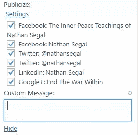

如果是这种情况，请单击编辑详细信息链接。你会看到上面的选项，你可以选择你想发布文章的地方。

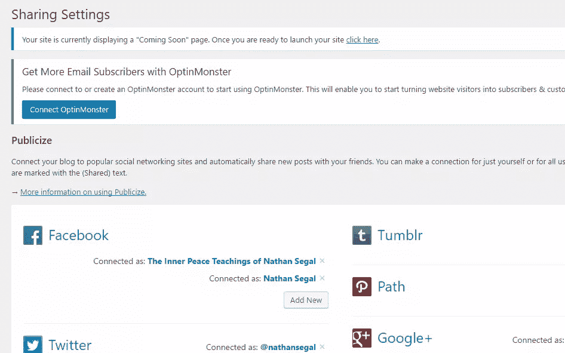

如果您决定添加或断开任何社交媒体帐户，请单击设置链接。这将带您到共享设置部分，您可以相应地更改您的设置。

就是这样！现在，当有新帖子添加到您的博客时，您就可以自动发布到社交媒体了！

## 分享这篇文章