# 通过一个信号在你的 ionic 应用中推送通知

> 原文：<https://www.sitepoint.com/push-notifications-in-your-ionic-app-with-onesignal/>

*本文更新于 2017 年 5 月 3 日，针对 Angular 4 和 Ionic 3。*

## 推送通知简介，它们是什么，如何工作

推送通知是从您的服务器发送给应用程序用户的消息。它们通知用户新的内容，即使用户没有使用你的应用程序。它们增加了用户在你的应用中的参与度和留存率。WhatsApp“whistle”就是一个例子，它会通知你收到了新消息。在本教程中，我们将深入到使用 OneSignal 集成推送通知。

## 推送通知的工作原理

推送通知从应用服务器发送到移动操作系统的推送通知平台之一。苹果面向 iOS 的推送通知服务和谷歌面向 Android 的云消息服务。这些推送通知服务将消息中继到适当的设备。

您可能想知道，您的服务器& GCM 如何知道将通知发送到哪个设备？您的应用程序将包含向您的服务器注册其唯一设备令牌的代码。

在您的服务器上跟踪这些设备令牌是乏味的。但是有一些很好的服务可以简化这个过程。一种这样的服务是 OneSignal。

## 第一步:安装离子

首先，你需要在你的机器上安装 Ionic。您使用节点包管理器 **npm** 安装它；

```
If you do not have **npm** installed, follow the instructions in the references section to install it.

## Step 2: Start a new project

Next, start a new ionic project by running either one of the following commands based on your target version of Ionic;

**Ionic 1** 
```

$ ionic start PushDemo 侧菜单"`

**离子 2/3**

```
The above command creates a new project in the current directory. The project folder will be called *‘PushDemo’* and it will use the *sidemenu* template. 
```

$ CD push demo & & ionic serve-lab " `

上面的代码导航到您的项目文件夹，并在浏览器窗口中打开您的应用程序进行测试。

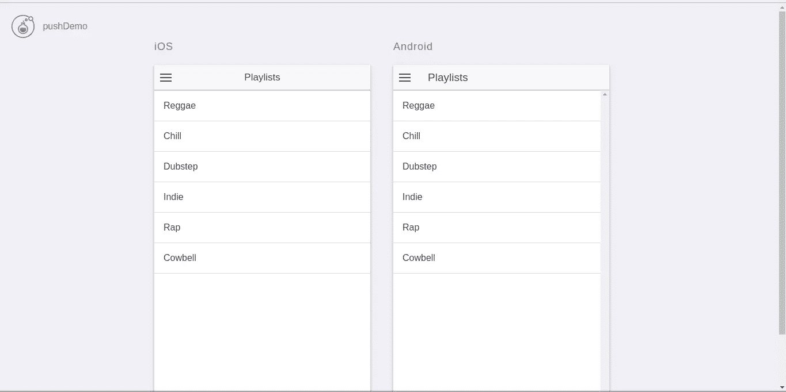

## 第三步:在谷歌云消息(GCM)上注册

访问 Firebase 控制台并登录您的 Google 帐户:

https://firebase.google.com/

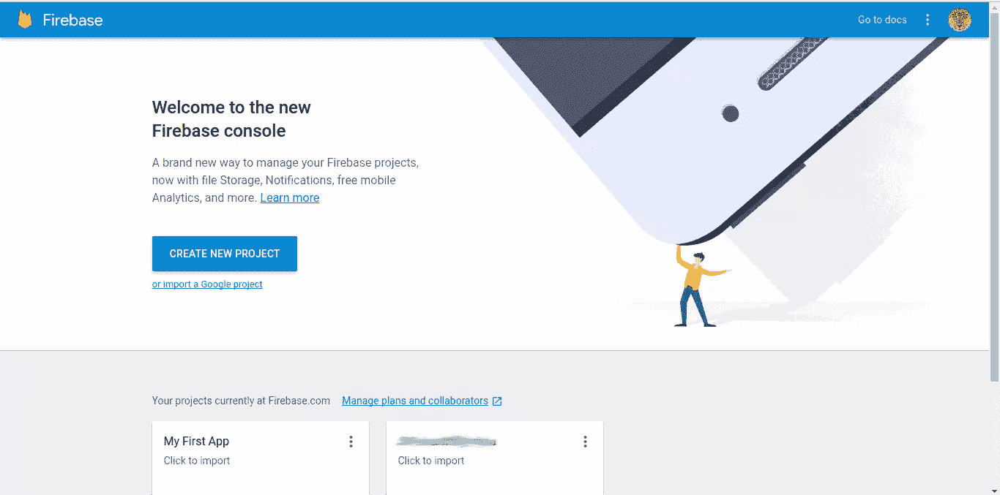

创建一个新项目，给它一个名字，并输入您的国家。

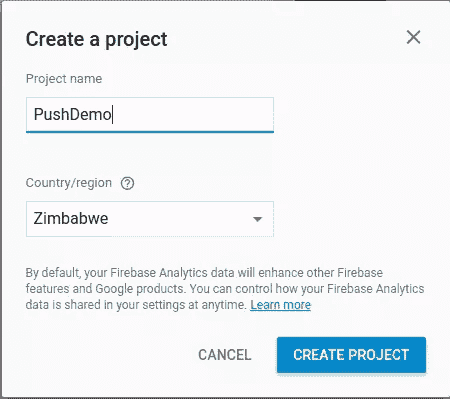

点击左上角的齿轮图标，选择*项目设置*->-*云消息*

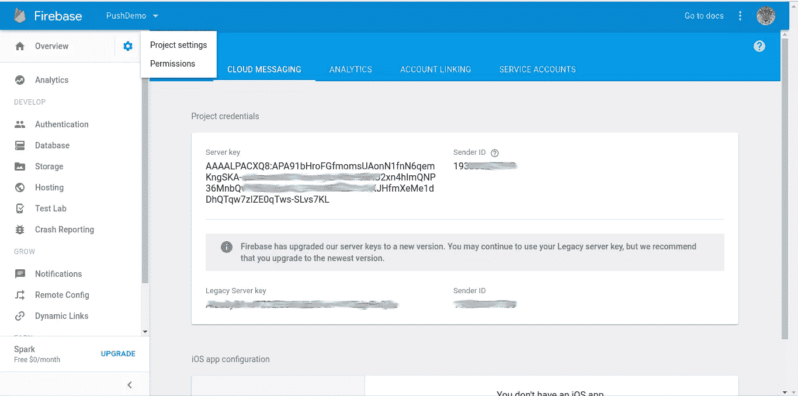

请注意图像中突出显示的两个值。**服务器密钥**，也被称为**谷歌服务器 API 密钥**和**发送者 ID** ，也被称为**谷歌项目编号**。

## 步骤 4:创建一个单一信号账户

浏览到 https://www.onesignal.com 并创建一个帐户。

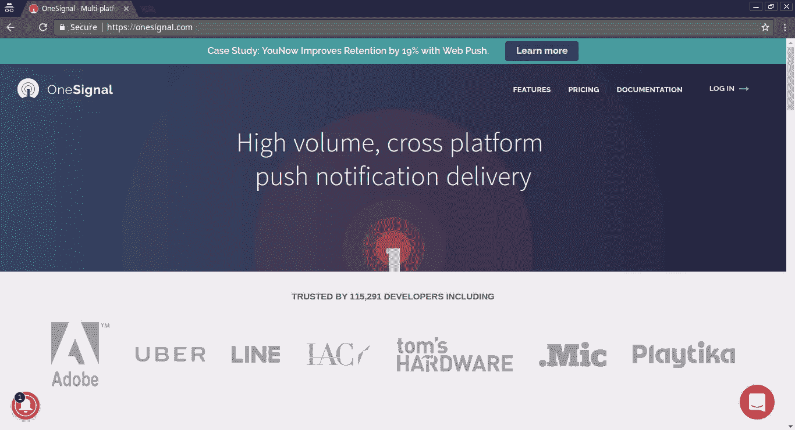

确认您的电子邮件地址并登录

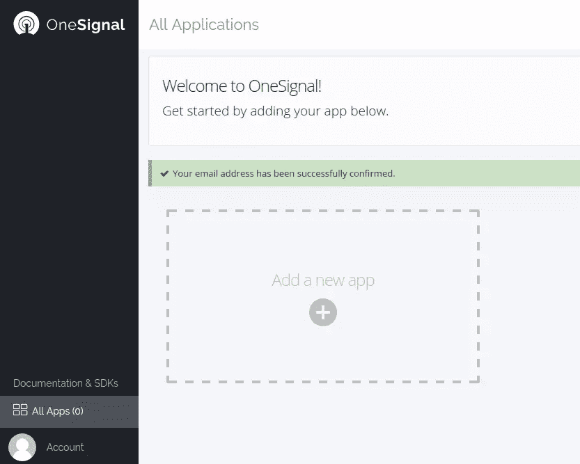

点击*添加新应用*并随意命名。我建议你给它起一个和你的 ionic 项目一样的名字。

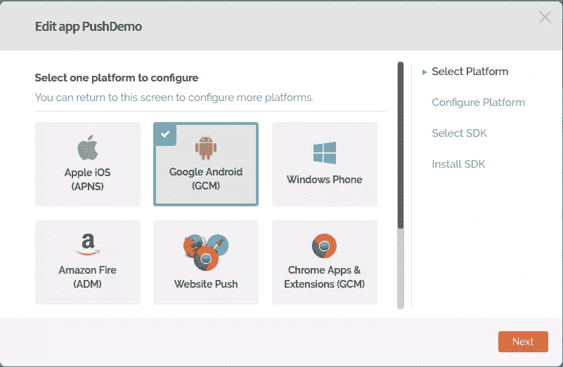

接下来，选择您想要配置单信号推送通知的平台。在本教程中，我将为 Android 配置推送通知。

输入你的**谷歌服务器 API 密钥**和**谷歌项目编号**。这些是你在**第三步**中从 Firebase 控制台得到的细节。

接下来，为您的应用程序选择目标 SDK。在我们的例子中，我们正在制作一个 Ionic 应用程序，因此您可以选择*“PhoneGap、Cordova、Ionic、英特尔 XDK”*

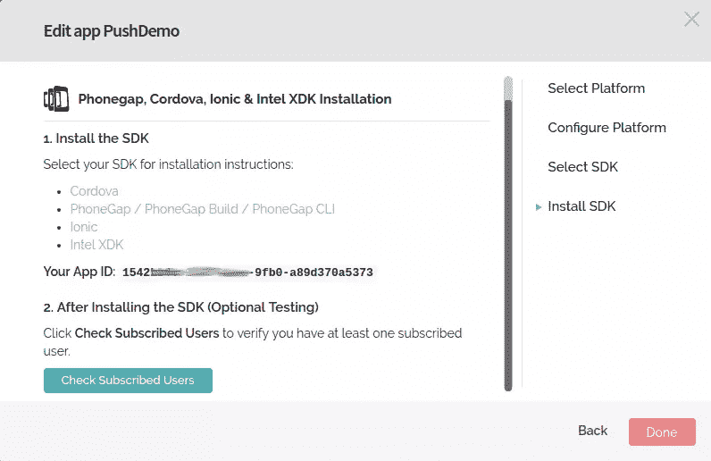

记下您的 **OneSignal App ID** 。在将 OneSignal 集成到您的应用程序代码中时，您将需要它。

## 步骤 5:将 OneSignal 集成到您的 ionic 项目中

返回命令行窗口，从项目目录中运行；

```
This will add the OneSignal plugin to your ionic project. This plugin gives our ionic app an API to access Push notifications. Otherwise, they would be unavailable to hybrid apps.

### Step 5a: Integrating OneSignal into Ionic 1

Next, navigate to your main ```app.js``` file *[project-directory]/www/js/app.js*


Add the following code to your ```$ionicPlatform.ready()``` function as above 
```

//单信号推送通知设置
//启用调试问题。
//window . plugins . one signal . setlog level({ log level:4，visual level:4 })；
var notificationOpenedCallback = function(JSON data){
console . log(' didReceiveRemoteNotificationCallBack:'+JSON . stringify(JSON data))；
}；

window . plugins . one signal . init("<app id="">"，
{ Google project number:"<sender id="">" }，
notificationOpenedCallback)；</sender></app>

//当用户在您的应用程序中时，如果收到通知，则显示警告框。
window . plugins . one signal . enableinappalertnotification(true)；

```
Make sure you enter your **App ID** and **Google Project Number**. Save the file.

### Step 5b: Integrating OneSignal into Ionic 2/3

Navigate to your ```app.component.ts``` file *[project-directory]/src/app/app.component.ts*


Add the following code to your ```this.platform.ready()``` function as above 
```

//启用以调试问题。
//window[" plugins "]. one signal . setlog level({ log level:4，visual level:4 })；

var notification opendca back = function(jsondata){
console . log(' notification opendca back:'+JSON . stringify(jsondata))；
}：

窗口["插件"]。一个信号
。start init(“<app id="">”、“<google project="" number="">”)
。
。end init()；</google></app>

```
Make sure you enter your **App ID** and **Google Project Number**. Save the file.

That's it! That's all you have to do to integrate the OneSignal code into your Ionic 1 or 2/3 app.

Next, connect your android testing device to your computer via USB cable.

Then compile and install the PushDemo app with the following command: 
```

$ ionic build Android & & ADB install-r<path to="" project-dir="">/platforms/Android/build/outputs/apk/Android-debug . apk " `</path>

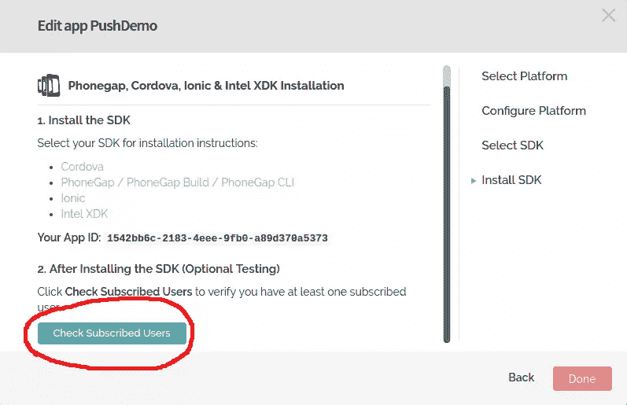

接下来，在您的设备上运行该应用程序，以便它向 OneSignal 服务器注册。然后点击*查看订阅用户*。

## 第六步:测试

点击 *pushdemo app*

点击*新推送通知*

创建测试通知，然后点击*预览*。接下来，点击*发送*。

您将立即在设备上收到推送通知。

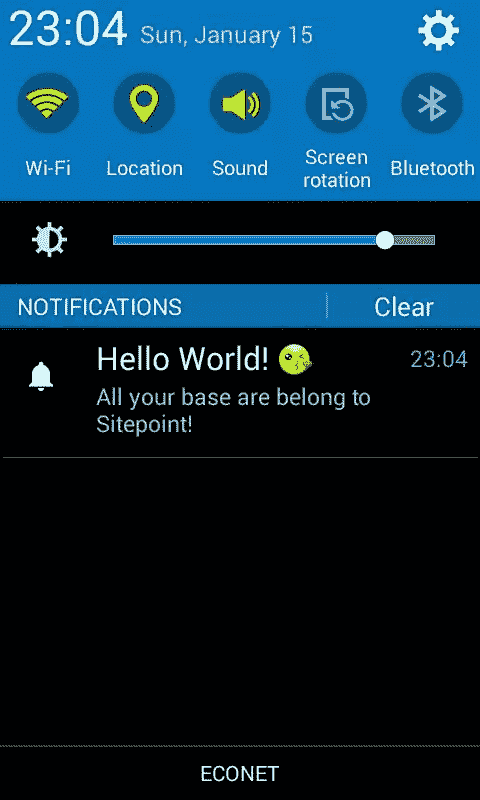

## 单信号额外功能

OneSignal 还有许多其他的优秀特性，您应该进一步探索；

*   通知中的表情符号
*   预定通知
*   通知模板
*   实时分析
*   用户群
*   自动消息

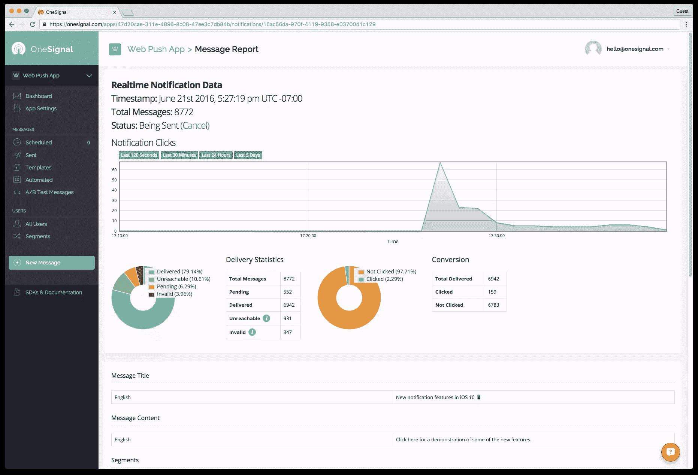

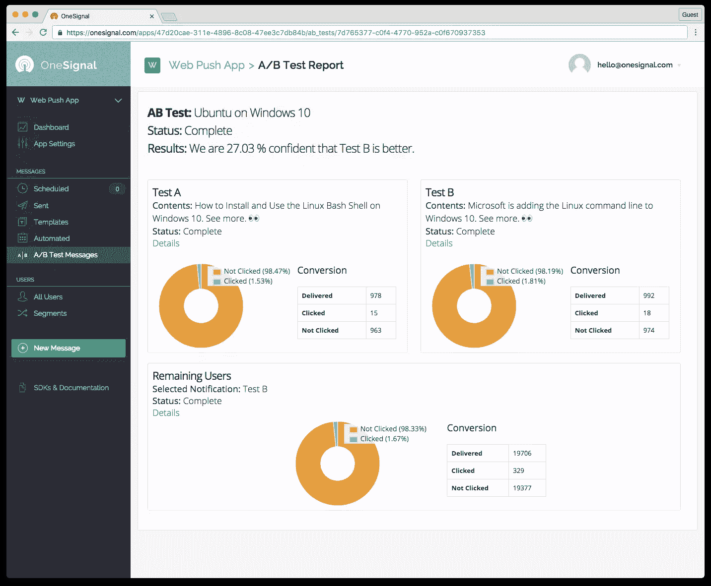

## 参考

*   安装 NPM-
    https://www . site point . com/初学者指南-节点-包-管理器/

*   代码库-https://github.com/chmod-777/pushDemo

*   离子框架文件——https://ionicframework.com/docs/

*   单一信号文件——https://documentation.onesignal.com/

## 分享这篇文章