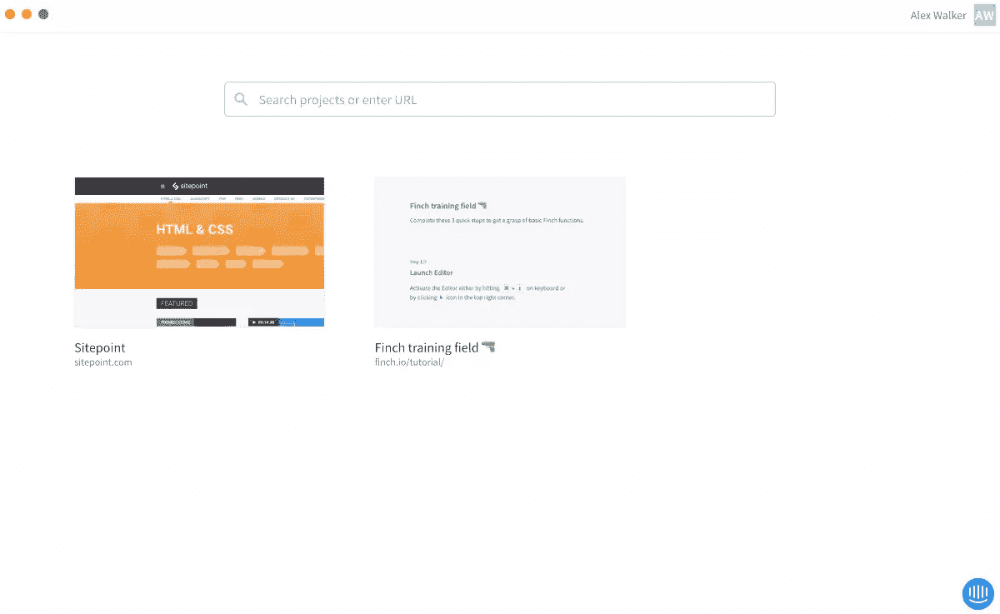
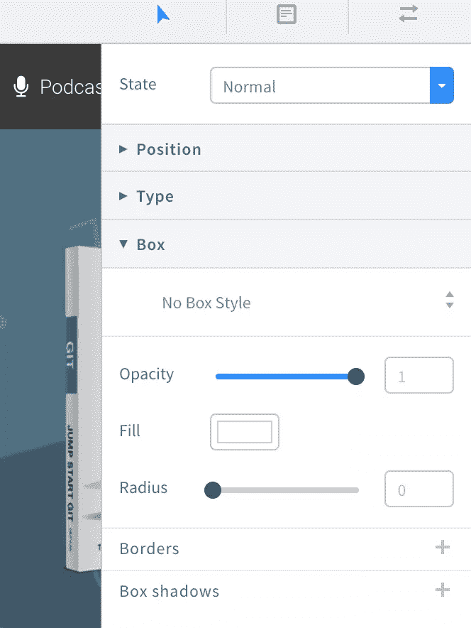
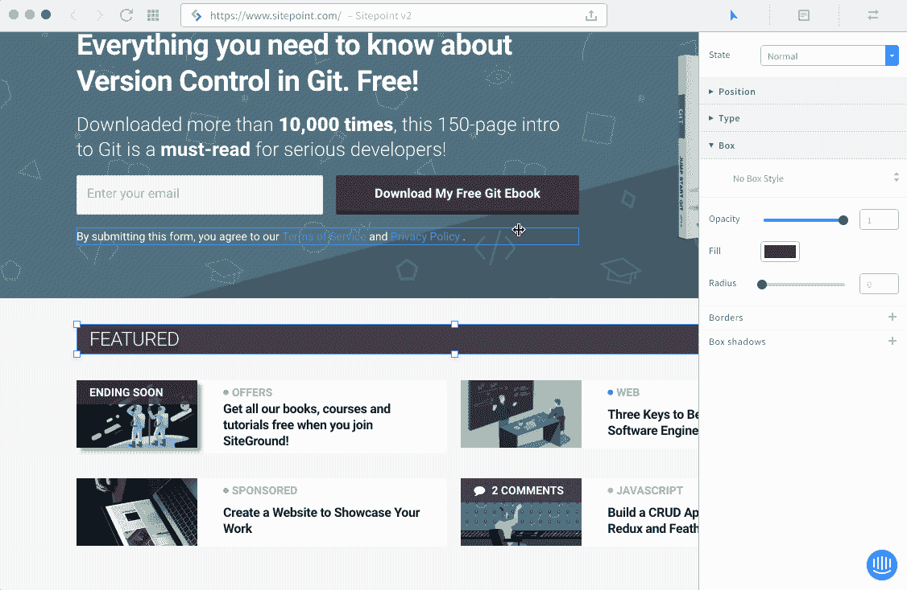
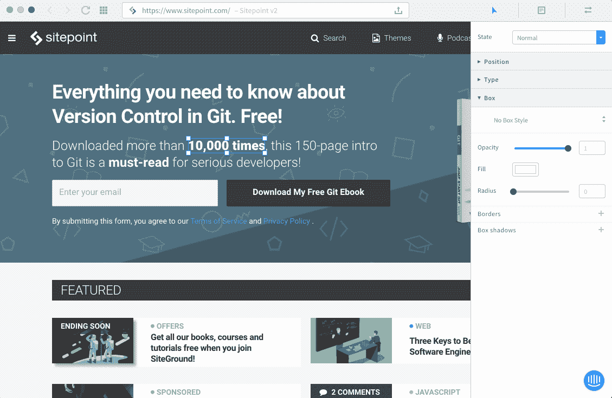

# Finch.io:一个寻找和修复设计缺陷的可视化工具

> 原文：<https://www.sitepoint.com/finch-io-a-visual-tool-for-finding-and-fixing-design-bugs/>

当你开始一个全新的设计项目时，你可能每次都从同一个地方开始。

*   在白纸和铅笔上…
*   或者可能是一个线框/模型工具

草图变成了线框。线框变成原型。原型变成了充实的设计。

但是在项目的最后 10%会发生什么呢？该网站工作正常，但页边距、填充、文本对齐、字体和颜色都需要修复和调整。这提出了一个好问题。

### 如何将小的设计变更传达给现有的设计？

*   用箭头来回发截图吗？
*   你开始一张新的特雷罗卡吗？
*   你会在开发人员的显示器上贴黄色便利贴吗？
*   你会提交新一期的 Github 吗？

让我们明确一点:我们不是在谈论迷人的、摇滚明星式的设计变化。这些调整是赋予产品最终吸引力的上光层。

*   增加标题下边距。
*   H2 是错误的字体。
*   将副标题放大到 2em。

它们都很小，但通常是重要的错误修复和调整，而且通常有很多。它们是如何实现的？

今天，我们将看看一种新工具，它采用了一种非常不同的方法来应对这一挑战。

## 什么是 Finch.io？

[Finch.io](http://Finch.io) 是一个应用程序，它可以导入一份你的 *live* 页面，并提供一个“类似草图”的用户界面，让你对你看到的内容进行修改。当你完成后，它让你与你的开发人员/团队分享你的修改/编辑。

让我们试驾一下。

## 入门指南

开场 [Finch.io](http://Finch.io) 没什么好看的。没有工具和很少的用户界面选项，只有一个搜索框和一个演示项目。

Finch 项目视图

在搜索栏中输入一个 URL，你就会看到你的网站加载完毕。那么……嗯……这只是一个网络浏览器吗？

但是开始点击页面，事情会变得更有趣。所有页面元素都会对光标做出反应，变成可点击的。单击一个项目，一个“类似草图”的属性编辑器面板将从屏幕右侧弹出。

## 进行编辑

正如您可能猜到的那样，单击页面元素使其可编辑——通过属性面板或直接拖动手柄并调整大小。您现在正在使用一个实时可视化编辑器。UI 面板被整齐地组织成三个主要部分:位置、类型和框。

芬奇我是 UI

## 添加注释

单击注释图标会将您切换到注释模式。单击任何页面元素都允许您(或任何其他登录人员)为您的更改附加解释性注释或说明。

添加注释

## 列出您的更改

这是有趣的一点。单击最右边的图标，您将看到页面编辑的详细列表。

*   单击一个列表项以跳转到并突出显示该更改。
*   单击“眼睛”图标在原始元素和您的更改之间切换。

## 有用吗？

对于设计上的调整来说，的确如此。Finch.io 是一种不同的应用程序，所以我花了一点时间来理解它。重要的是要理解 Finch 是一个设计用来处理 CSS 的工具，所以我不认为有任何方法可以做出需要 HTML 标记变更的设计改变。

然而，我认为这是一种非常快速有效的方法，可以在项目启动前的最后阶段，甚至是项目启动后的阶段，对设计调整进行分类和传递。

Finch.io 目前处于有限的测试阶段，预计将于 8 月份发布。这是一个很酷的概念。留意一下。

## 分享这篇文章