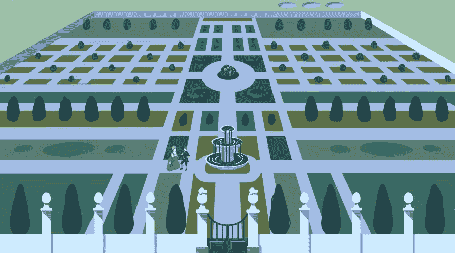
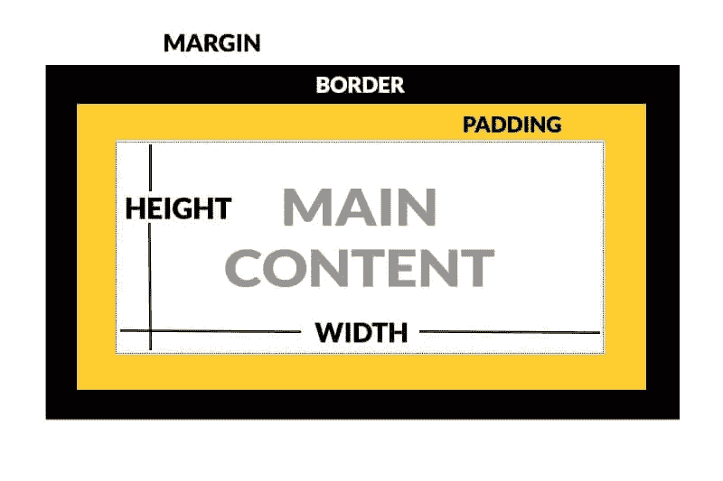

# 如何设置 CSS 边距和填充(以及很酷的布局技巧)

> 原文：<https://www.sitepoint.com/set-css-margins-padding-cool-layout-tricks/>

当我刚开始学习 CSS 时，边距和填充属性总是让我感到困惑。它们看起来非常相似，在某些情况下似乎产生了相同的结果。在本教程中，您将了解 CSS 边距和填充之间的区别，以及这些属性如何影响网页上元素之间的间距。我们还将讨论边距折叠，即创建响应性网站时使用不同单位的效果，并总结一些可以用 CSS 边距和填充来做的布局技巧。

## 盒子模型

CSS 中的元素表示为一个**矩形框**。这个矩形框的大小由元素的:

*   内容
*   填料
*   边境
*   边缘

元素的**内容**区域位于元素的**中间。**填充包围了元素的内容**。**边框依次包围填充**。元素的**边距**是其**外层**，即位于元素之外。**

下图应该会使安排更清楚。

从图中可以明显看出，元素的填充是从元素内容的**外边缘延伸到其边框**的**内边缘的层。此属性用于控制元素边框和主要内容之间的间距。应用在元素**上的**填充**会影响**在网页上的**大小**。它**不影响网页上不同元素**之间的距离。**

当你想增加或减少元素之间的空间时，你应该使用边距属性。应用于元素的边距对其大小没有任何影响。

关于盒子，你应该记住的一件重要事情是，网页上所有盒子的**大小取决于所使用的盒子型号**。有两种不同的箱式模型:

*   W3C 盒子模型
*   传统箱式模型

在 [CodePen](http://codepen.io) 上通过 SitePoint ( [@SitePoint](http://codepen.io/SitePoint) )看笔[选盒模型](http://codepen.io/SitePoint/pen/EmjXWe/)。