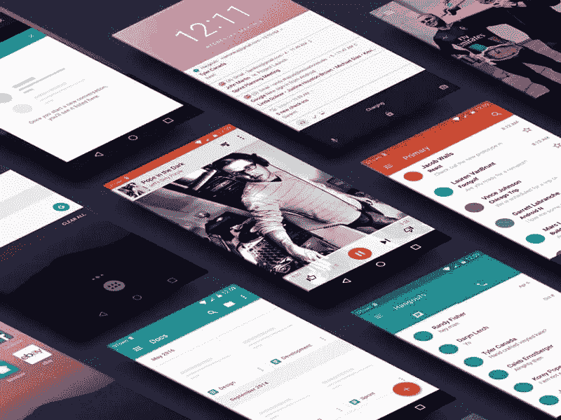
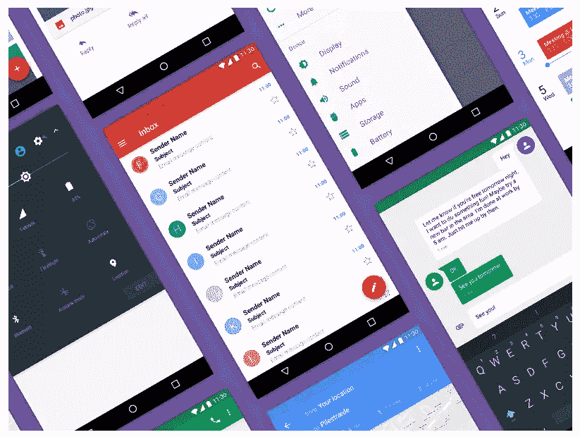
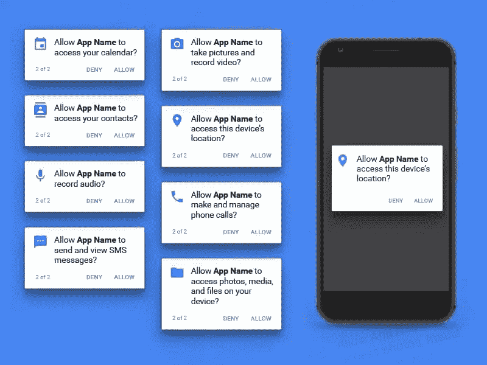
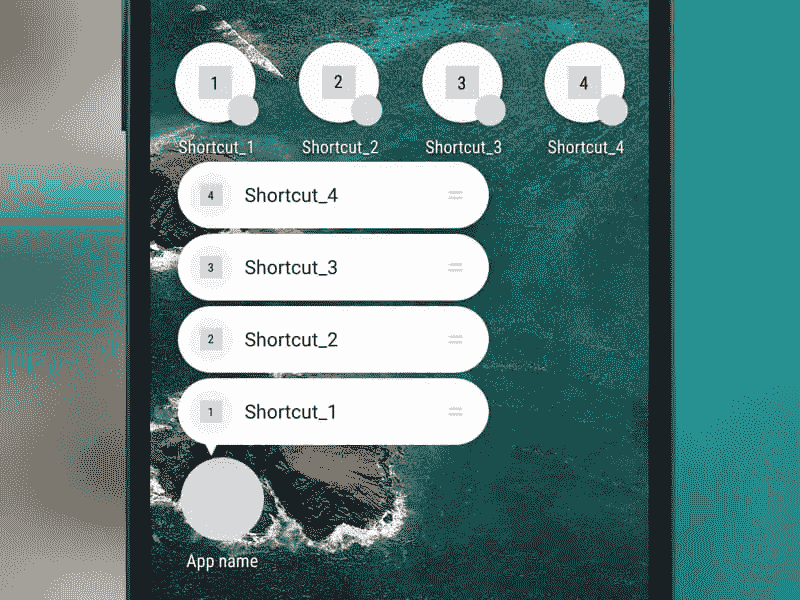
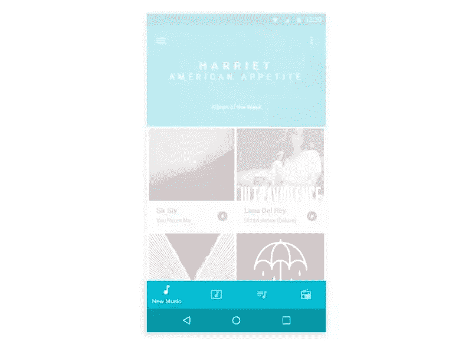
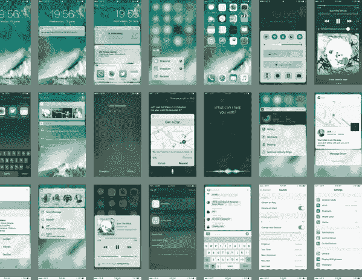
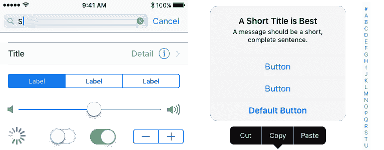
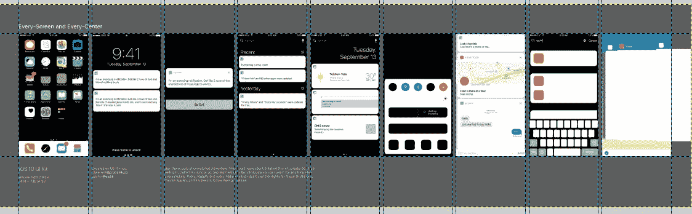
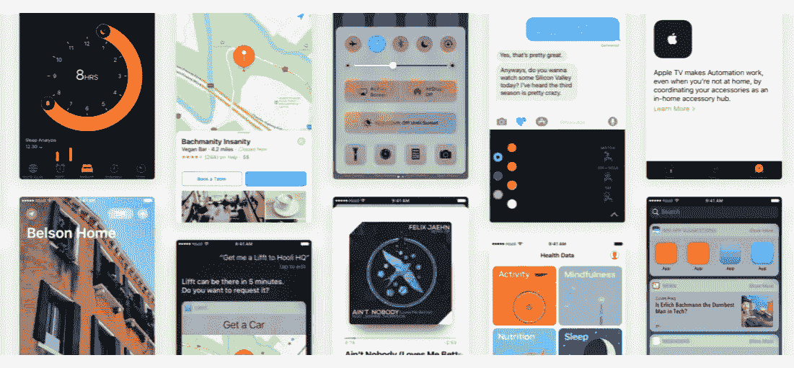
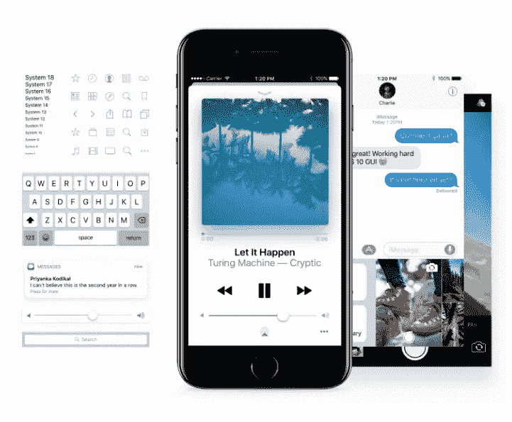

# Android 牛轧糖和 iOS 10 的 10 个免费 UI 套件

> 原文：<https://www.sitepoint.com/10-free-ui-templates-android-and-ios/>

*使用我们的 leson 在[手机](https://www.sitepoint.com/premium/screencasts/shared-element-transitions-effects-in-mobile)中共享元素过渡效果，为您的应用增添趣味。当你从一个视图切换到另一个视图时，让用户关注你的资产。*

Android 和 iOS 的每一个新版本都需要设计师和开发者更新他们的应用。如果你正在寻找(大部分)免费的 Android 和 iOS 最新版本的 UI 套件，即 Android 7，也被称为 Nougat，和 iOS10，这里有一些套件可以考虑。

即使 Android N 在半年多前发布，也没有多少专门为它设计的套件或设计资源。有了棒棒糖，情况就不同了，有更多的 UI 套件可供选择。有了 iOS10，有了更多的选择，所以如果你主要是为 iOS 设备设计，这对你来说是个好消息。

## 1.Android N GUI 套件草图资源

[这款安卓牛轧糖 GUI 套件)是素描用的。为了使用这个工具包，你需要 Sketch 3.8.2 和 Roboto，谷歌的 Android 系统字体。](https://www.sketchappsources.com/free-source/2038-android-n-gui-kit-sketch-freebie-resource.html)

该套件包括最受欢迎的 Android N 屏幕的 25 个矢量。有些屏幕不是新的，但它们仍可用于牛轧糖。新屏幕是 Android N 风格的通知屏幕和设置，以及电子邮件、音乐播放器、日历、视频等。基本上，你已经拥有了一个典型应用程序所需的所有屏幕。如果你找不到一个可以直接使用的屏幕，只要对现有的屏幕稍加修改，你就可以创建你想要的。

## 2.适用于 Photoshop 的 Android 牛轧糖 UI 套件

如果 Photoshop 是你的设计程序选择，并且你不介意花几块钱买一个很棒的 UI 套件，你会喜欢这个 [Android N UI Photoshop 套件](https://applypixels.com/template/android-nougat-ui-kit/)。与列表中的其他资源不同，它不是免费的，但它非常好(免费工具包的选择非常有限，尤其是针对 Photoshop 的)，所以我决定将它列入列表。

这是一个矢量工具包，有大量的界面元素、控件、形状、容器和图标。你可以在其中找到一些屏幕，比如设置、收件箱、日历、谷歌地图等等。

## 3.Android 权限对话框草图资源

Android Marshmallow 中引入了权限对话框，但在 Nougat 中，它们经历了视觉上的变化。如果你想符合他们的新外观，试试这个[草图权限对话框](https://www.sketchappsources.com/free-source/2328-android-permissions-dialog-templates-sketch-freebie-resource.html)。

## 4.Android-N 快捷方式模板草图资源

应用程序快捷方式是 Android N 的新功能之一。由于应用程序快捷方式，应用程序可以快速访问选定的屏幕和功能。如果这些选项需要符号，
[这个草图模板](https://www.sketchappsources.com/free-source/2345-android-n-shortcut-template-sketch-freebie-resource.html)包含了它们。请注意，一些功能，如 Google Now 启动器(和 Pixel 启动器)仅在 Android 7.1 和更高版本上支持应用程序快捷方式。

## 5.Android N 底部导航草图资源

如果你的底部导航遵循材料设计的原则，这里有一个对你有用的资源。 [Android N 底部导航草图资源](https://www.sketchappsources.com/free-source/1914-android-n-bottom-navigation-sketch-freebie-resource.html)近日发布，它应用了所有最新最棒的材质设计理念。

## 6.免费矢量 iOS10 GUI 套件

[这个免费的矢量 iOS10 GUI 套件](http://ios10.greatsimple.io/)对于任何 iOS 设计师来说都是一个巨大的资源集合。它是为 iPhone 6(即 375x667px 像素)制作的，我最后一次检查时，它没有更新的版本，但它仍然是最好的套件之一。它需要 SF UI 字体。

该套件提供了 62 个 iOS 10 屏幕和您在设计中需要的所有核心组件。屏幕和组件都是命名的、分层的和完全可定制的。该工具包可用于 Sketch、Craft Library、Figma、Adobe Photoshop、Adobe XD 和 Adobe Illustrator。

## 7.苹果用户界面设计资源

没有苹果自己的项目，iOS10 UI 资源列表就不完整。这个来自苹果的 [UI 套件不仅仅是一个套件。它附带了大量视频和文本教程，举例说明了 iOS GUI 设计的核心原则。如果您不熟悉这些原则，请先阅读它们，然后再进行设计。](https://developer.apple.com/ios/human-interface-guidelines/resources/)

该工具包包含 UIKit 控件、视图和字形。Photoshop 和 Sketch 都有。

## 8.iOS 10 UI 套件

不要被[这个伟大套件](http://ozzik.co/freebies/ios8kit)的网址所迷惑。
尽管网址上写着 iOS8，但这是针对 iOS10 的。我猜他们没有重命名网址，这样他们就可以利用现有的流量到旧版本的页面。

这不是一个矢量套件，但它有多种尺寸，以匹配 iPhone 5/SE，iPhone 6/7 和 iPhone 6 Plus/7 Plus 的屏幕。该工具包可用于素描和 Photoshop。为了正确使用这个工具包，你需要 SF 字体。该套件包含设计 iOS10 应用所需的一切，如系统屏幕、通知、导航和标签栏、键盘、pickers、动作表等。

## 9.iOS 10 用户界面

也许到目前为止列出的 iOS10 资源比你设计 iOS10 应用所需的更多，但有更多的选择也无妨。这个所谓的[非官方设计工具包](http://puzzles.design/)是一个大规模的屏幕、应用、图标、效果和其他你可以在 iOS 10 GUIs 中使用的东西的集合。您可以找到符号、小部件、通知模板等。我真正喜欢这个工具包的是，它是矢量和开源的。

## 10.iOS 10 图形用户界面(iPhone)

iOS 10 GUI 套件，也被称为脸书 iOS 10 Light，是另一个你不想错过的巨大资源。它有很多屏幕和组件，你可以在 iOS 10 的公开发布中找到。该工具包可用于 Photoshop、Sketch、Figma 和 XD。并非所有的组件都是可扩展的，但其中许多是可扩展的，所以即使你是为其他设备设计，而不仅仅是 iPhone，你仍然可以使用这些资源。

## 结论

如果我在文章中包括的 5 个 iOS 10 套件不够用，你需要更多的话，[查看这个列表](http://sketchhunt.com/list-current-ios-10-ui-kits-sketch-copy/)了解更多。它经常更新新的资源，但它们只是草图。至于关于 Android 牛轧糖的额外资源，我留下的好资源没有 iOS 的多。也许将来会有更多的套件发布，但目前的选择，尤其是免费的 Android 牛轧糖 UI 套件，非常非常有限。

*使用我们的 leson 在[手机](https://www.sitepoint.com/premium/screencasts/shared-element-transitions-effects-in-mobile)中共享元素过渡效果，为您的应用增添趣味。当你从一个视图切换到另一个视图时，让用户关注你的资产。*

## 分享这篇文章