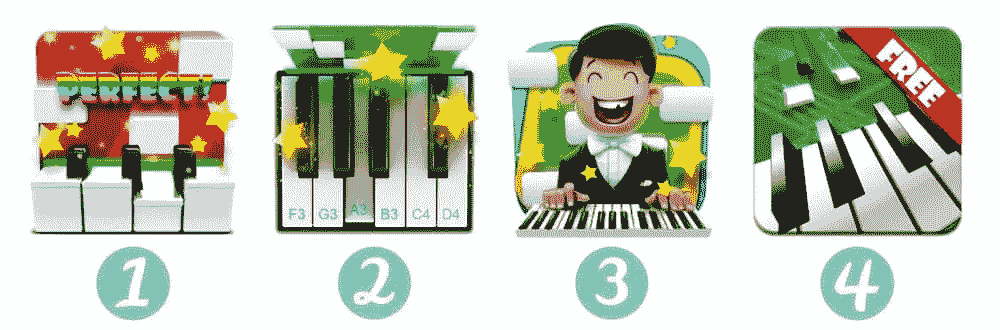
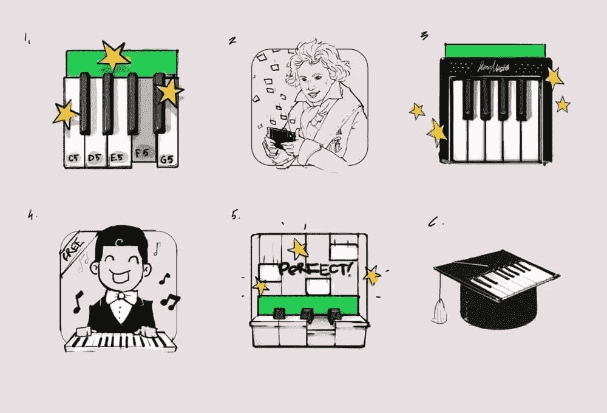
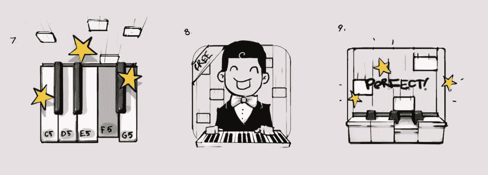
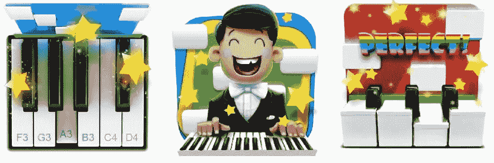
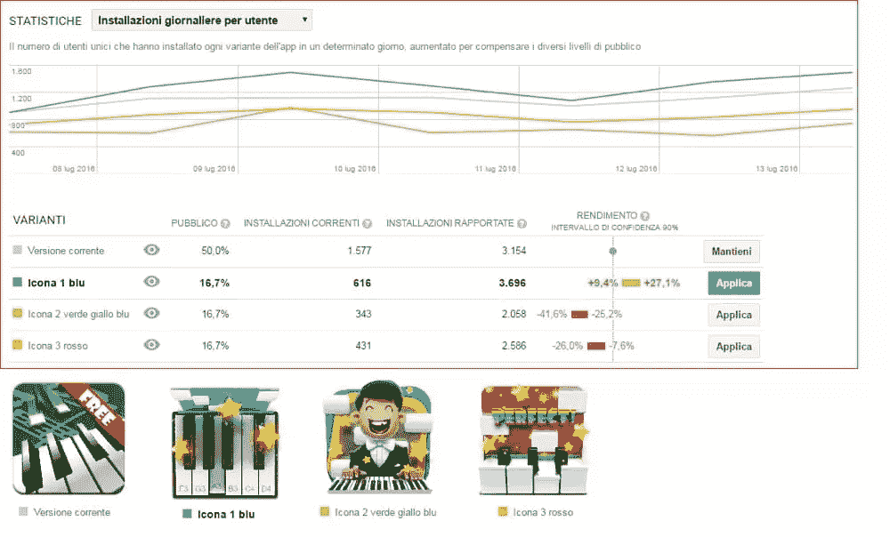
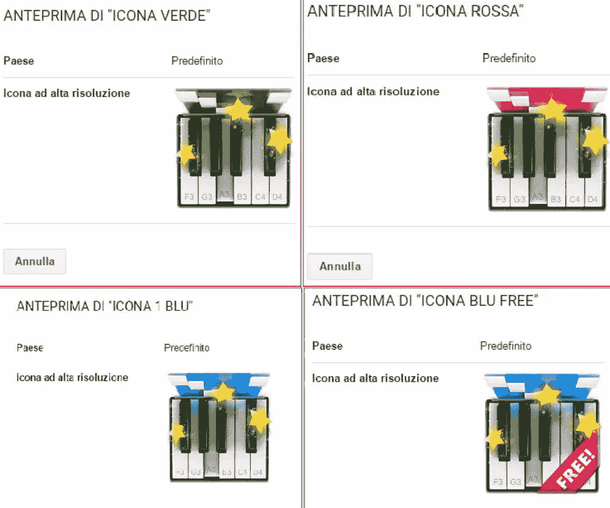
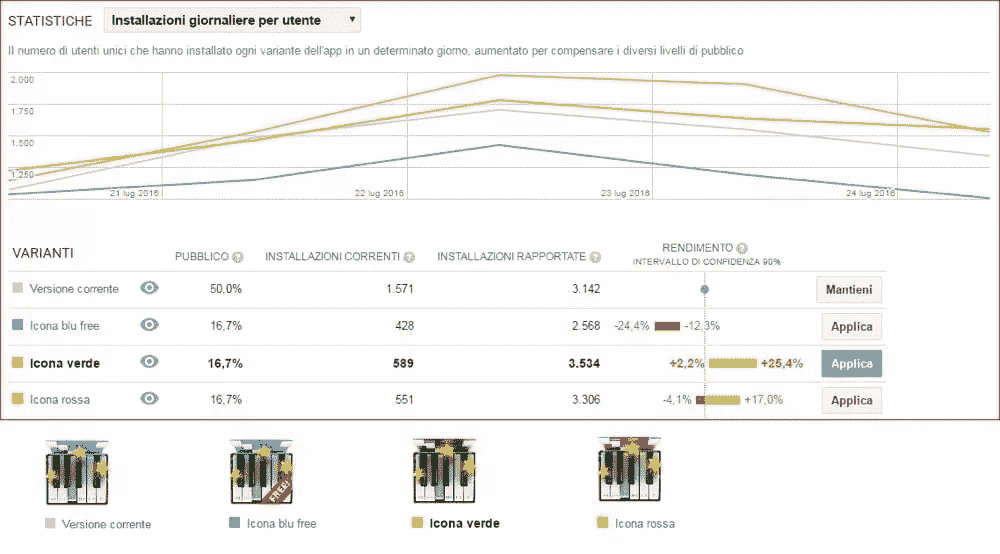

# 如何通过 A/B 测试图标提高应用下载量

> 原文：<https://www.sitepoint.com/how-to-boost-app-downloads-by-ab-testing-icons/>

如何判断哪个应用程序图标会导致最多的 app store 下载？回答:单纯靠看，不行。即使是一个有经验的设计师也不能肯定地回答这个问题，然而，有一个解决方案——**A/B 测试**。

[A/B 测试](https://www.sitepoint.com/designers-guide-a-b-testing/)并不是一个*新的*概念，然而，当试图增加下载/转换时，许多人犯了修改应用程序界面的错误，而忽略了**首先**用户看到的是应用程序图标⏤！此外，所有应用商店都有一个仪表板，营销人员可以在那里衡量不同测试的成功与否。

请继续阅读，了解 A/B 测试是如何工作的，以及它如何帮助我们将应用商店的下载量提高了 34 %( T1)。

## 我们对这 4 个图标进行了 A/B 测试

首先仔细看看这些图标:

你能猜出哪一个导致了最多的 app store 下载量吗？剧透:是#2。我将向您展示我们如何通过对不同概念进行 A/B 测试来得出这一结论。

## 问题是

[钢琴大师 2](https://play.google.com/store/apps/details?id=it.b77.pianomasterfree) 是一个应用程序，如果你按下钢琴键，一个小砖块就会掉下来。通过这样做，您可以弹奏一段先前选择的旋律。它看起来像一个游戏，但它实际上对那些想学习如何弹一架真正的钢琴的人非常有用。

这个应用程序曾经独一无二，但现在它有许多竞争对手的应用程序。这就是为什么我们的客户想要创造一个新的图标，使游戏能够在竞争中脱颖而出。

这是应用程序图标之前的样子:

客户填写了一份申请表，我们同意为 Google Play 商店设计三个独特的图标，并对它们进行 A/B 测试，看看哪个会带来更多的应用程序下载。

随后，我们开始设计三个独特概念的第一次迭代。让我们看一下简报。

## 项目简介

第一个图标概念必须是严肃和古典的(二维钢琴键，音符落在上面)。其他图标是明亮的，动态的，有点抽象。此外，客户希望至少在一个图标概念上有星星(因为当你弹钢琴时，你可以在游戏中眼冒金星)。客户发给我们[这张图片](https://www.dreamstime.com/royalty-free-stock-photo-girl-play-piano-image15193085)作为视觉参考:

## 步骤 1:迭代和反馈

我们向客户发送了这六份草稿:

客户喜欢概念 5、4 和 1(按此顺序)。唯一关心的是我们直接从游戏中得到的绿色条；客户让我们把绿条做得窄一点。

接受反馈后，我们重申了三个选择的概念，它们看起来像这样:

在我们的第二轮反馈中，客户告诉我们，其中一个概念上的“免费”一词是不必要的，因为该应用的*付费*版本已经不存在，只有免费版本仍然存在。我们有点担心，如果我们用带有“免费”字样的旧图标来测试我们不带字样的新概念*，这个实验会不公平，然而，客户坚持要把它去掉。这些设计随后得到了批准，这是我们添加一些颜色后的最终结果:*

## 第二步:第一次 A/B 测试(选择设计)

然后，我们在 Google Play 应用商店测试了这三个概念，我们意识到获胜的图标使应用程序下载量增加了 **27.1%** 。令人惊讶的是，这是客户最不喜欢的概念！

从上面这张取自客户仪表盘的图中，我们还推断出第二好的表现者是最初的图标，我们暗自怀疑这是因为“免费”这个词。尽管如此，我们还是进行了第二次 A/B 测试，暂时把这种怀疑放在一边。

## 第三步:第二次 A/B 测试(选择颜色)

既然客户不再怀疑该采用哪种设计，我们需要为它选择一种颜色。在接下来的实验中，我们 A/B 测试了 3 种颜色变化的获胜概念，其中客户预计蓝色图标将获胜，由于我们仍然担心“免费”一词的影响，客户同意包括第四种颜色变化，即蓝色并带有“免费”标签。

令我们惊讶的是，没有“免费”标签的绿色图标**领先了。事实上，标签为的图标*似乎是最没有影响力的，这让我们的假设非常错误(两次！).***

## 结论

客户最不喜欢的图标是最成功的图标，其中最佳和最差图标之间的转化率相差**四倍**——这意味着如果客户选择了他们喜欢的图标*(没有 A/B 测试不同的概念)，他们最终的有机下载量比最成功的概念少四倍！*

 *那么这告诉我们什么呢？它告诉我们，图标设计可以极大地影响应用程序下载的数量，A/B 测试是比较一个设计的多种变化的一个很好的方式。A/B 测试可以应用于几乎任何设计工作流程，所以下次你需要比较/决定各种概念时，不要基于零推理选择你最喜欢的想法，使用 A/B 测试来提供防弹证据！

另外，正如我们今天所看到的，你的直觉会欺骗你！* 

## *分享这篇文章*