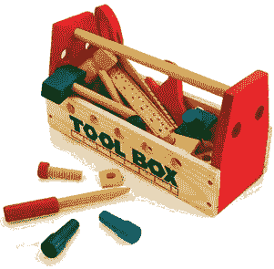
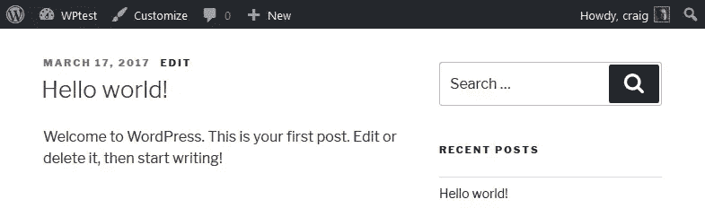
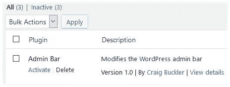
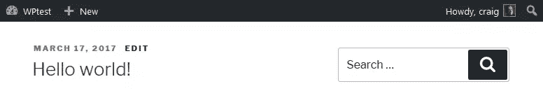
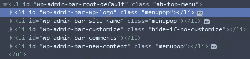
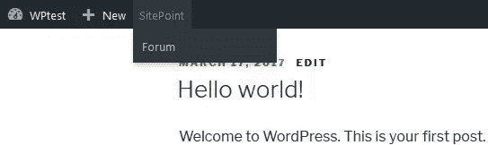

# 如何定制 WordPress 工具栏

> 原文：<https://www.sitepoint.com/customize-wordpress-toolbar/>



*本文是与 [SiteGround](https://www.siteground.com/sitepoint-recommended?afcode=97a975da3502771c04e59cbae092b1dd&campaign=customize-toolbar) 合作创作的系列文章的一部分。感谢您对使 SitePoint 成为可能的合作伙伴的支持。*

我对 WordPress 3.3 中引入的深灰色工具栏又爱又恨。(在 WordPress 3.1 中，它以前被命名为[管理栏，这个名字被许多人使用——包括 API 作者*！*)。从积极的方面来看，当您查看管理面板或实时网站时，工具栏提供了一组一致的快速链接。也就是说，这可能会在创建主题时造成问题，或者让认为每个人都可以看到它的网站编辑感到困惑。](https://codex.wordpress.org/Toolbar)



幸运的是，改变工具栏很容易。我们将使用一个定制的 WordPress 插件来实现它，但是你也可以考虑给你的主题的**functions.php**文件添加相同的代码。

## WordPress 管理栏 API

[WP_Admin_Bar](https://codex.wordpress.org/Class_Reference/WP_Admin_Bar) 类提供了以下方法:

*   [add_node()](https://codex.wordpress.org/Function_Reference/add_node) —在工具栏上创建新的菜单项(或子菜单项)
*   [remove_node()](https://codex.wordpress.org/Function_Reference/remove_node) —从工具栏中删除菜单项
*   [add_group()](https://codex.wordpress.org/Function_Reference/add_group) —允许将工具栏项目分组到不同的部分
*   [get_node()](https://codex.wordpress.org/Function_Reference/get_node) —返回具有单个工具栏项目属性的工具栏对象。

我们将在新插件中使用`add_node()`和`remove_node()`…

## 创建新插件

在 WordPress**WP-content/plugins/**文件夹中创建一个名为【admin-bar.php】T2 的新文件，然后添加以下插件标题:

```
<?php
/*
Plugin Name: Admin Bar
Plugin URI: https://www.sitepoint.com/
Description: Modifies the WordPress admin bar
Version: 1.0
Author: Craig Buckler
Author URI: http://twitter.com/craigbuckler
License: MIT
*/
```

你现在可以在 WordPress 管理面板中激活这个插件。它不会做任何事情，但你可以添加，保存，然后刷新，以查看更新。



## 移除整个工具栏

将下面一行添加到插件代码中，以删除工具栏:

```
// remove admin bar
add_filter('show_admin_bar', '__return_false');
```

保存，然后刷新，以检查它走了！

## 移除工具栏项目

假设您没有删除工具栏，您可以使用 [remove_node()](https://codex.wordpress.org/Function_Reference/remove_node) 方法删除现有的项目。为此，我们需要创建一个名为`update_adminbar()`的新函数，向它传递一个 [WP_Admin_Bar](https://codex.wordpress.org/Class_Reference/WP_Admin_Bar) 对象(`$wp_adminbar`)。当`admin_bar_menu`动作钩被激活时，该函数被调用:

```
// update toolbar
function update_adminbar($wp_adminbar) {

  // remove unnecessary items
  $wp_adminbar->remove_node('wp-logo');
  $wp_adminbar->remove_node('customize');
  $wp_adminbar->remove_node('comments');

}

// admin_bar_menu hook
add_action('admin_bar_menu', 'update_adminbar', 999);
```

在本例中，我们将删除:

*   帖子编辑很少需要的“关于 WordPress”菜单
*   “自定义”主题编辑器，以及
*   “评论”链接(可能是因为我们禁用了评论)。

保存**admin-bar.php**，然后刷新以验证其工作正常。



您可以通过将 ID 传递给`remove_node()`方法来移除任何项目。该 ID 可以在 HTML 源代码中找到:



找到 HTML ID，然后从字符串的开头删除“wp-admin-bar-”，得到工具栏菜单 ID 名称。

## 添加新的工具栏项目

上面我们调用的`add_action()`钩子设置了 999 的优先级。我们在`update_adminbar()`中定义的任何新菜单将出现在工具栏的右端，在所有其他项目之后。您可以设置较低的优先级来使用不同的位置。WordPress 徽标的优先级为 10，每增加一个工具栏项，总优先级就会增加 10。因此，使用优先级 11 会在 WordPress 标志的右边添加项目，例如

```
add_action('admin_bar_menu', 'update_adminbar', 11);
```

我们将优先级保留为 999，因为我们正在删除必须在删除之前添加的项目！

接下来，我们将添加两个新的菜单项，链接到 [SitePoint 主页](https://www.sitepoint.com/)和 [SitePoint 社区论坛](https://www.sitepoint.com/community/)。`add_node()`方法接受定义单个工具栏项目的关联数组:

*   `id` —工具栏项目 ID(必填)
*   `title` —工具栏项目文本。HTML 标签也是允许的。
*   `parent` —父节点的 ID(如果项目是子菜单的一部分)
*   `href` —链接`href`属性
*   `group` —使节点成为一个组(布尔)。组节点在工具栏中不可见，但添加到其中的节点是可见的。
*   `meta` —进一步链接属性的数组:`class`、`rel`、`onclick`、`target`、`title`和`tabindex`。一个特殊的`html`值可以设置用于节点的 HTML。

因此，我们可以在插件的`update_adminbar()`功能中添加 SitePoint 主菜单和论坛子菜单项:

```
// update toolbar
function update_adminbar($wp_adminbar) {

  // remove unnecessary items
  $wp_adminbar->remove_node('wp-logo');
  $wp_adminbar->remove_node('customize');
  $wp_adminbar->remove_node('comments');

  // add SitePoint menu item
  $wp_adminbar->add_node([
    'id' => 'sitepoint',
    'title' => 'SitePoint',
    'href' => 'https://www.sitepoint.com/',
    'meta' => [
      'target' => 'sitepoint'
    ]
  ]);

  // add Forum sub-menu item
  $wp_adminbar->add_node([
    'id' => 'spforum',
    'title' => 'Forum',
    'parent' => 'sitepoint',
    'href' => 'https://www.sitepoint.com/community/',
    'meta' => [
      'target' => 'sitepoint'
    ]
  ]);

}

// admin_bar_menu hook
add_action('admin_bar_menu', 'update_adminbar', 999);
```

*注意:`[]`在 PHP 5.4 及以上版本中声明数组。如果您使用的是以前的版本，请用`array()`替换它。*

保存**admin-bar.php**然后刷新以查看新工具栏:



你现在应该能够为每个项目创建完美的 WordPress 工具栏了！

## 分享这篇文章