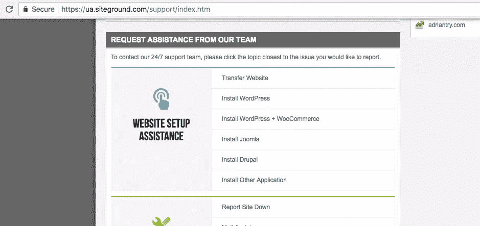
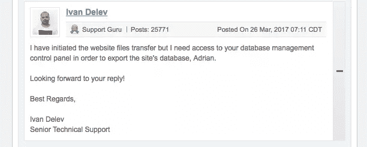
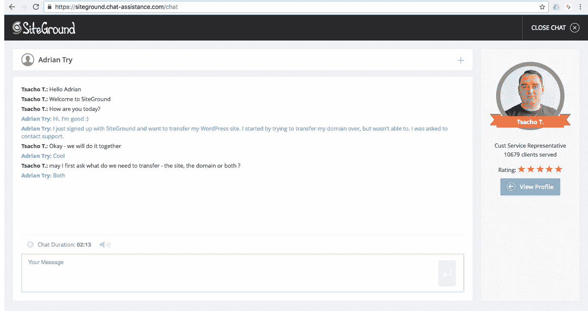

# SiteGround 迁移服务综述

> 原文：<https://www.sitepoint.com/review-sitegrounds-migration-service/>

*本文是与 [SiteGround](https://www.siteground.com/go/article-sp) 合作创作的系列文章的一部分。感谢您对使 SitePoint 成为可能的合作伙伴的支持。*

据说搬家可能是你一生中遇到的压力最大的事件之一。将你的网站转移到一个新的主机提供商包括类似的步骤:选择一个新家，计划和准备，以及搬迁本身。有没有可能做到毫无压力？我决定找出答案。

在我们的上一篇文章[将你的 WordPress 站点迁移到一个新的主机提供商](https://www.sitepoint.com/migrate-wordpress-site-new-hosting-provider/)中，我们展示了如何通过使用插件来简化网站迁移的过程。

但是这个过程听起来仍然令人生畏。毕竟你不是每天都迁移一个网站。通过将这项工作交给有经验的专业人士，你可以避免 WordPress 迁移所涉及的时间和精力，以及潜在的失误或灾难。

SitePoint 最近与 SiteGround 合作，成为我们的官方推荐主机，他们也提供这样的服务。他们有一个支持团队，每天为 T2 迁移网站，随时准备提供帮助。事实上，他们会免费迁移你的第一个网站。

听起来这个提议太好了，不能错过，所以我决定试试。事情是这样的。

## SiteGround 为您提供网站迁移服务

登录到您的 SiteGround 帐户，然后单击转到支持页面。沿着页面往下走一部分，你会发现一个链接，可以转到一个网站。

填写表格，要求他们转移你的网站，给他们你的主机凭证以及他们需要的任何细节。特别是，如果你有一个以上的网站，确保你清楚地解释你要求他们转移的是哪一个。

哦，在提交机票之前，最好先为你的网站创建一个备份。

## 他们会澄清出现的任何问题

提交表格后不久，SiteGround 团队将开始工作。事实上，接下来你可能会听到网站转移已经成功完成。

但是问题可能会出现，并且可能需要做出决定。别担心，你会参与所有的决定。当支持团队需要您提供一些信息时，我们会通过电子邮件通知您，该流程会一直等到您通过票务系统做出响应。

这种情况在我身上发生过几次。当我回答每个出现的问题时，不同的支持代表会捡起球，把事情向前推进。我发现他们知识渊博，乐于助人，而且看到与我打交道的员工的名字和照片感觉很棒。

以下是在我的站点迁移过程中澄清的问题:

1.  要求我采取行动。发现了一些被感染的文件，需要在我的 WordPress 安装被复制到 SiteGround 的服务器之前清理掉。我的一个网站最近遭到黑客攻击，一些恶意软件仍然潜伏在周围，尽管不在我正在迁移的文件夹中。
2.  关于登录详细信息的说明。我最初只给了我的 FTP 凭证来复制文件。数据库迁移需要 mySQL 或 cPanel 的登录详细信息。
3.  关于数据库的说明。有些事情似乎不太对劲，好像数据库属于不同的域。我们意识到来自不同 WordPress 安装的数据库已经被迁移，这很快被纠正。

## 一旦所有问题得到澄清，该网站被转移

在回答了 SiteGround 的问题后不久，我被告知迁移已经成功完成。那很简单！总共花了多长时间？几天。

如果这听起来很慢，那是因为大部分时间都在原地等我，而不是相反。如果我们用一个象棋时钟来计算迁移时间，SiteGround 的移动时间不到 11 个小时，而我的移动时间超过两天半。

处理出现的问题是必要的，但需要时间。

*   如果我一开始就提交 cPanel 证书，我会节省一些时间。
*   花了几天时间来清理受感染的文件，这是一个繁忙的一周。

对于没有任何问题的迁移，我认为转移只需要几个小时。

## 也转让你的域名

除了将我的主机转移到 SiteGround，我还想转移我的域名——由一家公司负责所有事情很方便。这需要 14.95 美元，其中包括额外一年的域名注册，并包括向注册服务商的迁移费。

SiteGround 非常乐意在聊天过程中支持我。不到一分钟，客户支持代表 Tsacho 就帮助了我。我解释了我想做的事情，他回答说，“好的，我们一起做。”

他耐心地引导我完成整个过程，并用幽默逗我笑。38 分钟后，转移完成。“这是我的荣幸。享受你的工作日，我会尽力去做的。还有 6 个小时。；)"

## 下一次迁移的摘要和有用提示

我对最终结果很满意。我的站点转移得很快，很成功，而且没有压力。

以下是我根据自己的经验可以传授的一些技巧:

*   预先提供您的 cPanel 用户名、密码和 URL。支持人员需要问你的问题越少，你的迁移就越快。
*   如果您有多个网站，在描述要迁移哪个网站时，请尽可能给出详细信息。
*   开始迁移之前，请备份您的所有网站。抱最好的希望，做最坏的打算。

最后，不要拖延。没有理由再推迟一天。经验丰富的支持专家随时为你迁移你的网站。无压力。

## 分享这篇文章