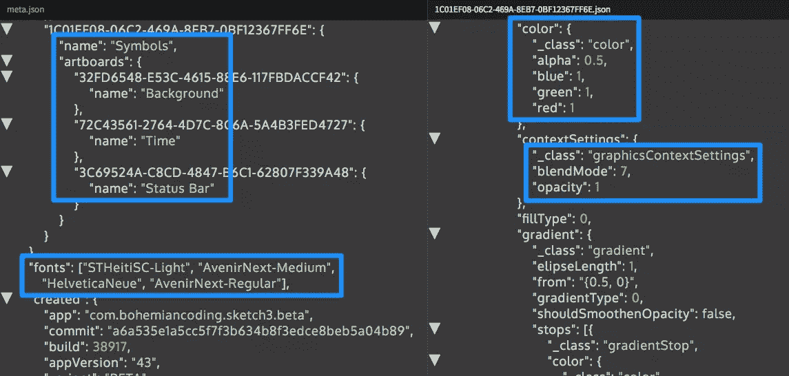
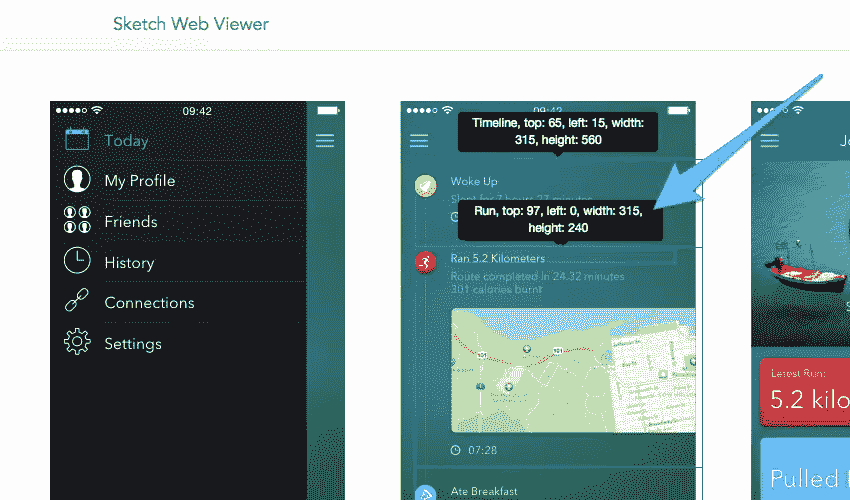

# 为什么你需要了解 Sketch 的新文件格式

> 原文：<https://www.sitepoint.com/need-know-sketchs-new-file-format/>

Sketch 43 最近推出了一个相当有趣的更新。sketch”文件格式，使它在代码编辑器中打开时更容易被人阅读(我的意思是我们实际上可以阅读。草图文件并查看代码格式的图层和样式的详细信息)。

*“嗯？什么？你为什么要这么做？”*

嗯，你不会——这种新的文件格式被设计成可以被网络浏览器读取，这样我们就可以构建解释的应用程序。草图文件(想想:**更好的设计移交**、 **Git 式版本控制**，甚至可能是**草图→ HTML/CSS 自动化**)。

## 文件格式:草图 42 与草图 43

在版本 43 之前。草图文件格式是用二进制写的(*你不需要知道那是什么意思，只需要知道它是不可读的*)。现在它是用 JSON 编写的，不仅可读，而且可以被网络浏览器阅读，甚至被*解析*。

您可以亲自阅读，亲眼见证 web 浏览器将如何阅读这种新的文件格式。毫不夸张地说，您可以深入到. sketch 文件的代码中，编辑 JSON 代码本身，然后打开。sketch 中的 Sketch 文件，并查看对我们的设计所做的更改(不要担心，设计师仍然希望使用 Sketch GUI 进行设计，这次更新不会改变这一点)。

这是怎么做的。

## 解压缩和编辑草图文件

*   首先，将 *yourfile.sketch* 重命名为 *yourfile.zip*
*   解压缩压缩的 zip 文件
*   编辑 JSON 代码(例如，改变一些样式)
*   再次重新压缩文件
*   将 *yourfile.zip* 重命名回 *yourfile.sketch*
*   打开文件草图查看更改！

## 下一步是什么？

而编辑的想法。带代码的草图文件很酷，这不是新格式的初衷。有了这个新的更新，web 浏览器可以读取。草图文件格式就像我们能做的一样(使用上面的方法)，这意味着我们可以使用 Github(或类似的)将版本控制引入我们的设计工作流程，很快。

此外，我们可能会看到像 InVision、漫威和 Sympli 这样的工具将设计移交提升到一个全新的水平(想象一下:在层/对象名称中添加关键字，如“`<h2>`”或“`<header>`”,以便您的设计可以自动翻译成`HTML`代码)。

我们所需要的是有人来建立这样的应用程序！

我们上周提到的[自动布局插件](https://www.sitepoint.com/responsive-design-in-sketch-its-finally-here/)的开发者 [AnimaApp](https://www.animaapp.com/) 已经构建了一个 [Sketch 43 Web Viewer](https://github.com/AnimaApp/sketch-web-viewer) 来测试新的文件格式——试着上传你的。草图文件到 Web 查看器，然后悬停在图层上以查看样式是如何解释的。

如果我告诉你这花了一天时间建造，你会相信吗？

## 分享这篇文章