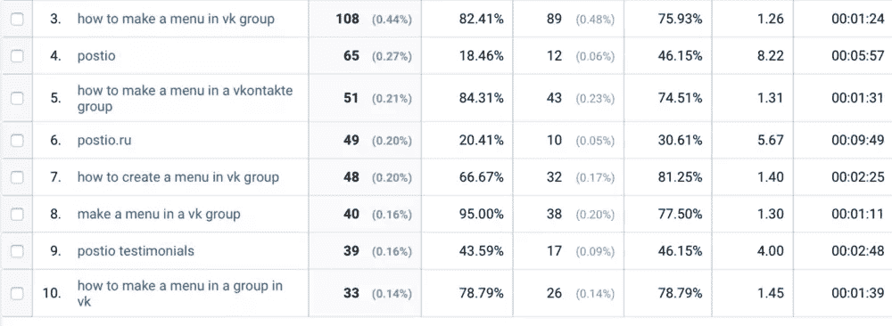
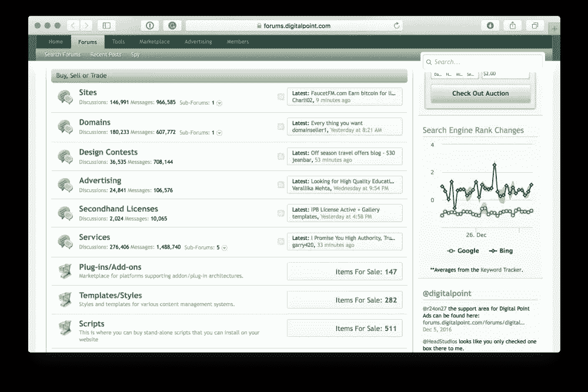
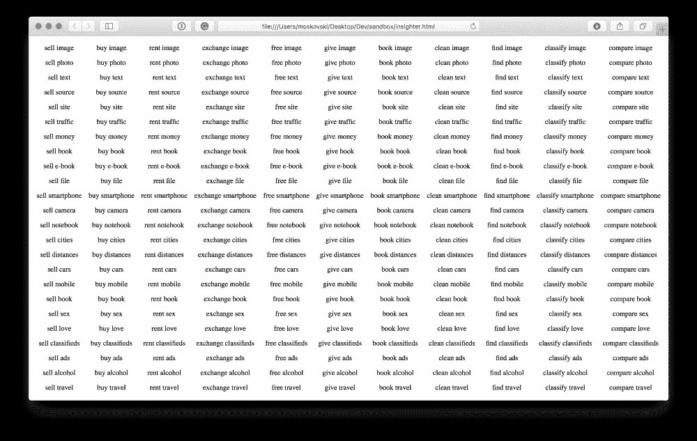
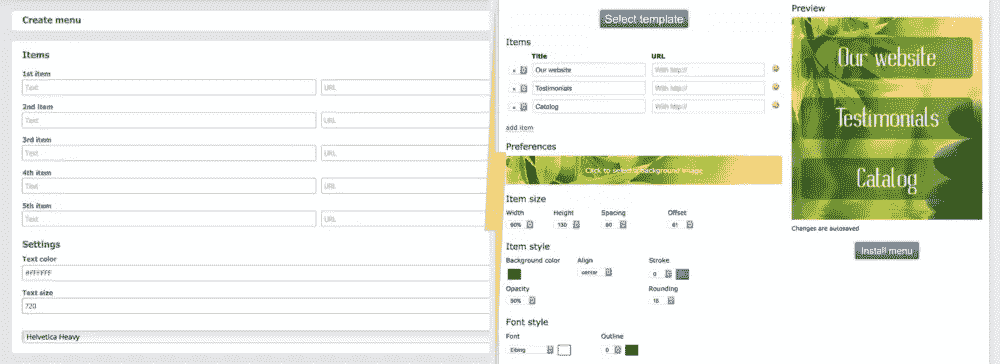
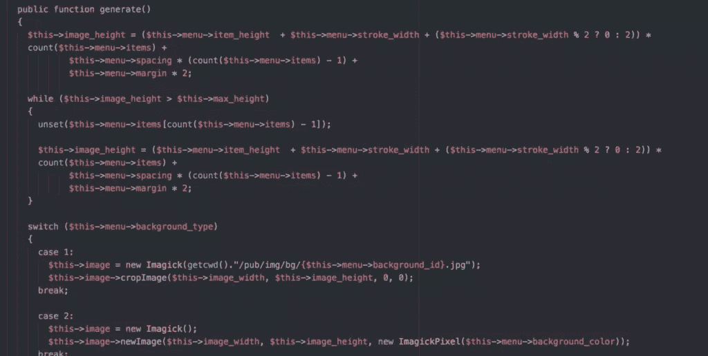
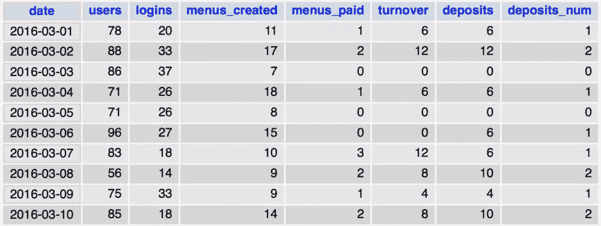
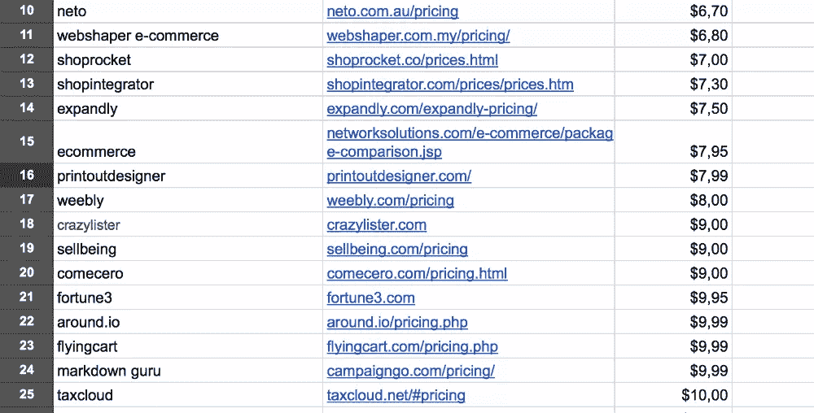
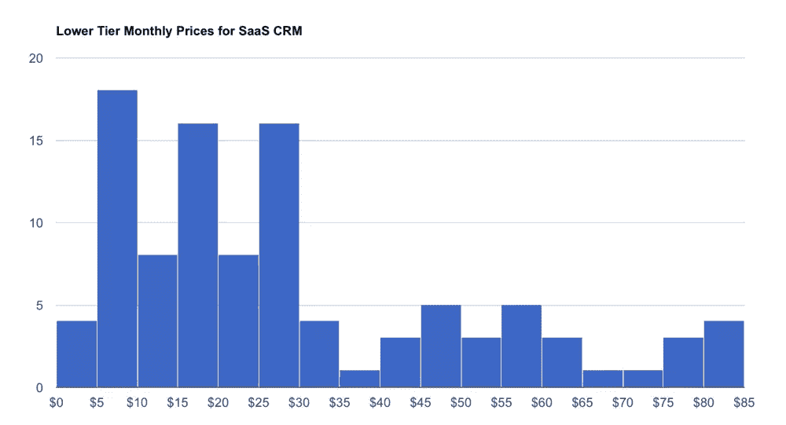
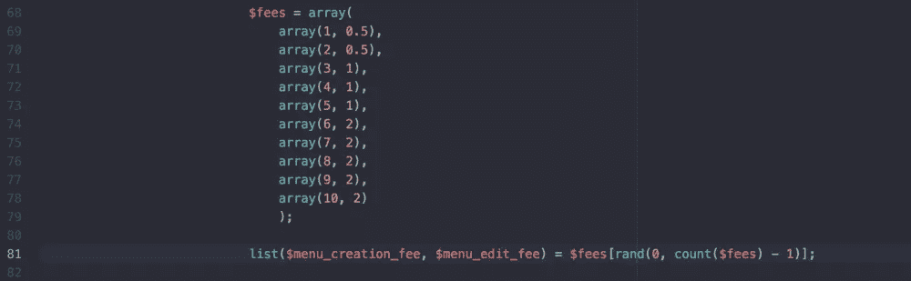
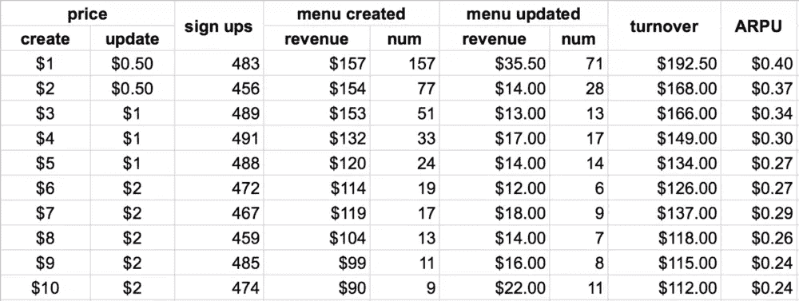

# 如何找到一个利基和验证早期阶段的定价

> 原文：<https://www.sitepoint.com/find-niche-validate-early-stage-pricing/>


**编者按:**
在过去的几个月里，我询问了一些创业者在早期科技创业的几个关键领域取得的成功。这包括建立一个[最小可行产品](https://www.sitepoint.com/how-i-made-2000-in-1-5-months-starting-with-a-google-form-based-mvp/)、[市场验证](https://www.sitepoint.com/we-quit-facebook-and-google-to-build-a-childrens-book-startup/)和[转化率优化](https://www.sitepoint.com/how-asking-visitors-one-question-boosted-our-conversion-rate-by-27/)。

但是对你们中的许多人来说，要克服的最大障碍是验证你的 MVP 或优化你的转换率。

那道坎是:找到一个合适的位置。

在这篇文章中，Alex Moskovski——软件制造商和货币化者——将解决这个问题，并向我们简要介绍如何找到合适的利基市场，验证您的 MVP，并通过动态测试模型获得正确的早期定价。

***边注:*** 欣赏到此为止的文章？通过[电子邮件](mailto:daniel.graziano@sitepoint.com?subject=Your%20Entrepreneurship%20Articles)或[推特](https://twitter.com/digigraziano)告诉我你在自己的项目中遇到了什么困难。

* * *

我最近写了一篇关于我在俄罗斯市场的小 SaaS 实验的文章，这篇文章给我带来了每月 1000 美元的稳定收入。

那篇文章火了。许多人问了很多关于建造过程细节的问题，以及他们需要做些什么来复制这一成功。

下面是对最有趣和最复杂的部分的详细跟进，加上一些关于如何找到利基和验证早期阶段定价的技巧。

**目录:**

1.  用 3 个简单的策略找到你的位置
2.  启动精益 MVP
3.  借助这一技术堆栈快速发货
4.  用两个简单的策略确定早期定价

## 找到利基市场的三个简单策略

你如何找到你的下一个想法并确认需求？

毕竟你不想浪费时间去打造一个没人要的 MVP。

第一个也是最显而易见的方法是获得一些识别痛点的统计数据。

### 策略 1:导致棘手问题的数据

在我第一篇文章的[中的 SaaS 例子中，我使用了谷歌分析数据，这些数据是关于人们用来找到我的另一家初创公司](https://hackernoon.com/how-i-made-a-saas-webservice-earning-1000-monthly-profit-6d2b782b95c8#.b9fhgk7b2) [Postio](https://postio.ru/) 的关键词。

我创建 Postio 是为了让人们更容易找到内容并发布到他们的社交账户和群组。作为其营销策略的一部分，我购买并发表了十几篇针对 web 服务受众的各种主题的文章，以获得一些额外的流量。

突然之间，Postio 开始从 Google 和 Yandex(一个俄罗斯搜索引擎)获得大量的流量，这些关键词与 Postio 本身无关。

**关键字数据如下:**



很明显，人们对这个菜单有很大的问题。

我有两个选择:

1.  在现有项目中构建它
2.  开始分拆

我选择了后者，因为这将更容易实现搜索引擎优化策略和品牌。

此外，菜单生成的概念与 post publishing 的概念完全不同，Postio 是建立在 post publishing 的基础上的。

回到发现想法。

### 战术 2:铺路

你可以遵循下面的方法，即使你没有任何现有的项目或统计数据。

我称之为**铺路**。

你所要做的就是去任何一个利基论坛，开始分析人们在那里做什么，以及他们试图利用社区解决哪些问题。

例如，既然我们现在在 SitePoint 上，让我们考虑一下他们的姐妹网站， [Flippa](https://flippa.com/) 。

大多数网站管理员论坛遵循一个共同的趋势:他们都有一个市场部分。

这种网上买卖的方式，非常不方便，风险也很大。

这条路只是要求被铺平。Flippa 已经优雅而高效地做到了这一点，它创建了一个围绕实现网站和域名无缝交易的分拆。

我在俄罗斯市场也观察到了这一趋势，我相信来自其他当地市场的人也能讲述同样的故事。



去利基社区，听听人们的意见，每当你看到一个问题，问问自己:*我如何利用我掌握的技术来优化它？*

作为一个心理过程，鼓励这种态度是非常有价值的。我知道这很难做到，因为从学校开始，我们就被教导去解决问题，而不是去发现问题。

你不会总是被给予问题去解决。在工作场所和你的个人项目中，逆向工程过程是一项有价值的技能。

### 策略 3:我的特定领域洞察工具

好的，第三种方法。它相当混乱，但我经常用它来重新点燃我的大脑，并将其设置为正确的情绪。我编写了一个简单的脚本，生成一个实体和相应动词的表，以便于发现新的连接。

这里有一个例子:



请记住，您需要微调这个脚本，以匹配您试图深入了解的利基。而且不一定是动词和实体；你可以尝试任何事情。重点是尽可能多的获取相关交集。

**下面是我在这个例子中使用的代码:**

```
<?
$entities = array('image', 'photo', 'text', 'source', 'site', 'traffic', 'money', 'book', 'e-book', 'file', 'smartphone', 'camera', 'notebook', 'cities', 'distances', 'cars', 'mobile', 'book', 'sex', 'love', 'classifieds', 'ads', 'alcohol', 'travel');
$verbs = array('sell', 'buy', 'rent', 'exchange', 'free', 'give', 'book', 'clean', 'find', 'classify', 'compare');

echo '<table style="width: 100%">';

foreach ($entities as $entity)
{
    echo '<tr>';
    foreach ($verbs as $verb)
        echo "<td style='font-size: 14px; padding: 5px; text-align: center'>$verb $entity</td>";
    echo '</tr>';
}

echo '</table>';
?> 
```

找到一个好主意还有很多技巧，但我们现在不要专注于它们，因为我们需要进入创业的下一步。

## 构建精益 MVP 并验证它

当我为 Menumake 构建 MVP 时，我试图去掉所有可以在以后添加的东西。

首先，这是 MVP 的菜单创建界面，与 Menumake 现在的菜单创建界面相比:



大多数时候，人们问我他们应该在 MVP 中放些什么，他们往往高估了一些特性的重要性。

考虑删减以下内容:

*   **认证。**您的用户真的需要一个独立的身份来解决他们的问题吗？
*   **专用支持界面。在早期阶段，在页脚的某个地方放一封电子邮件就足够了。**
*   **支付网关。**您可以手动收款。条纹可以等。
*   **精巧的设计。**这可以在验证之后进行。首先，Bootstrap 可以很好地完成这项工作。
*   强大的基础设施。现在，这可能有些棘手。我并不是说您应该编写不可读的代码，但是也许可伸缩性问题可以在以后解决。当然，如果你能快速组装一个可扩展的基础设施，使用一个可疑的堆栈是没有意义的。此时，我们其他人不应该花太多时间纠结于指数增长的快乐问题。

## 你的技术是什么？

我使用一个简单的 LAMP 堆栈，其中混合了 Codeigniter 和 jQuery，用于我的所有 web 服务。当任务要求很高时，我会考虑去。

差不多就是这样。

我选择我最喜欢的，能让我快速出货的。

这就是一天结束时的不同之处。**反正用户看不到你的栈。**

考虑正在讨论的 web 应用:*我们不能忽略的最重要的功能是什么？*

让我们更进一步，问一个更大胆的问题:*我们的潜在用户期望从我们这里得到什么，他们为什么在这里？*

它不是为了注册表单、支持和简洁的设计。甚至连菜单创建界面都还引不起他们的兴趣。

他们想要一份菜单。在他们组。就现在。

这是我们应该努力实现的解决方案，消除用户道路上的任何障碍。我们需要的只是一个简单的生成器和如何安装菜单的说明。

是的，我知道，我没有按照我自己的建议使用 Menumake 的 MVP，而是内置了一些额外的功能，如身份验证和一些用户帐户 UI。我负担得起，因为这不是我在利基的第一个项目，所以我有很多模板，可以快速设置一切。

回到菜单生成器。

再说一次，我没有用任何花哨的东西，只是用简单的数学魔法做了一个很好的旧图像魔术。



在构建了整个菜单图像后，它被切割成几块，并提供下载，上面有关于如何将它放入组中的简要说明。

这个简单的过程给我带来了大约 50 美元，验证了这个想法。



让我再强调一次:我从来不认为自己是专业开发人员。当谈到像软件工程中的现代方法这样复杂的东西时，我很糟糕。所以我不得不抄近路。如果你从第一天开始就乐于构建可扩展的基础设施，**你就比像我这样的人更有优势**。

只是现在不要纠结于此。大多数时候，这与让你的宝宝起步没有任何关系。

## 为您的 MVP 定价

定价很难。

更糟糕的是，这里没有太多猜测的空间，因为从长远来看，即使是最小的错误也很容易让你损失金钱。我们需要停止将定价视为一种艺术形式，而是采用一种更加数据驱动的方法。

通常，我分两步解决这个问题:估计和微调。

### 步骤 1:评估

首先，我们需要四处看看，并试图了解利基市场的平均价格。

如果你的 SaaS 在一个成熟的市场，你可以使用像 Capterra 或 [GetApp](https://www.getapp.com/) 这样的目录来了解价格的分布。

你可以自己收集竞争对手的原始数据，但我建议外包给别人。毕竟，这不是最令人兴奋的事情。



收集完数据后，我把它显示在图表上。

大部分时候是钟形曲线。

如果不是，或者有不止一个钟(就像下面的截图)，你可能已经从几个利基市场而不是一个利基市场获取了数据，你需要排除不属于你所在细分市场的来源。



我们从图表中需要的是两个价格，一个在钟的开始，另一个在钟的结束。

这些是最低和最高价位。

通常，超出这个范围是没有意义的，但每个案例都是不同的，在决定是否测试外围价格时，你需要考虑很多变量。

通常我会推迟对这些价格的分析，直到在下面第二步提到的微调之后，我有了一些真实的统计数据。

有时无法估计价格范围，因为市场还不存在。Menumake 就是这种情况。

所以我们必须找到另一种方法来计算出用户愿意为我们的产品支付的最高价格。同样，这里没有什么灵丹妙药，但对于 Menumake，我通过观察专业设计师对这项工作的收费来估算最高价格。(我认为他们现在的期望值要低得多。)

### 第二步:微调

是时候调整我们的价格估计了。尽管我们认为我们现在已经了解了我们的利基市场的定价，但我们并不了解。真正算出最有利可图的价格的唯一方法是测试每一个价格。

在 Menumake 中，我是通过在注册后给每个用户分配一个随机价格来做到这一点的——从我在步骤 1 中估计的范围。

抱歉，这次没有复杂的人工智能算法:



请注意，我同时测试了两个价格——创建菜单和更新菜单。

但是如果用户意识到我们对他们进行的不公平的分割测试会怎么样呢？

告诉他们真相。

告诉他们你正试图估算你产品的真正价值。

如果他们仍然对价格不满意，但愿意协商，给他们一个折扣。

就我个人而言，我无法相信我的客户对价格如此放松。当然，我这里那里都有一些愤怒的顾客，但是没有任何问题不能通过提供一个坚实的折扣来解决。

确保你的测试时间足够长。

记住，你越早找到最有效的价格，长期来看你赚的就越多。

哦，不要忘记为受到不公平的大价格标签影响的用户重新调整价格。打个小折扣就可以了。

为了让你知道在测试期结束时你应该有什么，看看我为 Menumake 收集的数据:



这些数据告诉了我们什么？相当有趣的东西:

*   创建菜单的 1 美元、2 美元和 3 美元以及更新菜单的 0.5 美元是最有利可图的价格。
*   $1 的菜单创建数量是$2 的两倍，是$3 的三倍。
*   就 <abbr title="Average revenue per user">ARPU</abbr> 而言，1 美元/0.50 美元的组合最有利可图。
*   尽管 2 美元的价格对于同样的收入来说似乎没那么麻烦，但我还是决定坚持 1 美元。我想让用户创建尽可能多的菜单，因为每个菜单都有一个小小的病毒机制。

是的，这些结论仍然不完善，还有很大的改进空间。但至少我们现在更接近现实了。

我希望这篇文章和我的上一篇文章已经阐明了构建一个简单的 SaaS 网络应用程序的一些要点——尽管还有很多事情我想提及。

## 分享这篇文章