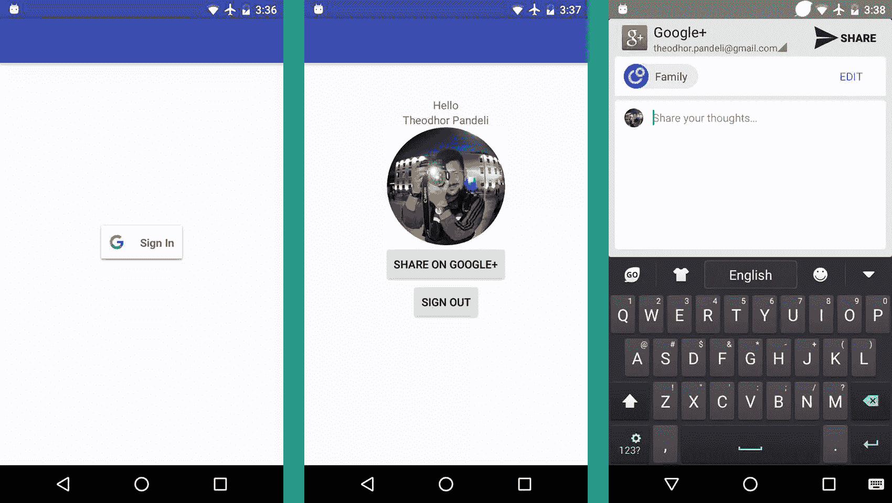

# 使用 Google+ API 在 Android 中进行身份验证和共享

> 原文：<https://www.sitepoint.com/authentication-and-sharing-in-android-with-the-google-api/>

*本教程于 2017 年 4 月更新为 Google Play 服务的 10.2 版本*

在本教程中，我将展示如何将您的 Android 应用程序连接到 Google Plus API，并使用它来登录、获取和共享数据。

在 [GitHub](https://github.com/sitepoint-editors/Android-Google-Plus) 上找到完成的项目。

## 创建 Android 项目

打开 Android Studio，创建一个*新项目*，随意命名。点击*下一步*，选择*最低 API 等级 18* ，再次点击*下一步*。选择*空白活动*作为第一个活动，命名为 *LoginActivity* ，点击*完成*。

## 设置 gradle

打开 *build.gradle (Module)* ，在文件末尾添加`apply plugin: 'com.google.gms.google-services'`。在`dependencies`内添加这些行:

```
 compile 'com.google.android.gms:play-services-auth:10.2.0'
    compile 'com.google.android.gms:play-services-identity:10.2.0'
    compile 'com.google.android.gms:play-services:10.2.0' 
```

现在打开 *build.gradle (Project)* ，在`dependencies`中添加这一行:

```
 classpath 'com.google.gms:google-services:3.0.0' 
```

下一步是将文件`google-services.json`添加到您的项目中。该文件包含连接到 Google API 客户端的开发人员凭证和配置设置。你可以在这里下载这个文件[，把它移到你项目的 *app* 文件夹里，然后*同步* gradle。](https://raw.githubusercontent.com/sitepoint-editors/Android-Google-Plu/master/app/google-services.json)

## 布局

在项目的*布局*文件夹中，删除 *content_login.xml* 文件。

在 *activity_login.xml* 中，删除`<include layout="@layout/content_login"/>`并用以下代码行替换浮动操作按钮代码。在这个布局中，我们唯一需要的是登录按钮:

```
<RelativeLayout
    android:layout_width="fill_parent"
    android:layout_height="match_parent"
    android:layout_weight="1">

    <com.google.android.gms.common.SignInButton
        android:id="@+id/sign_in_button"
        android:layout_width="wrap_content"
        android:layout_height="wrap_content"
        android:layout_centerInParent="true"
        android:visibility="visible"
        tools:visibility="gone" />

    <LinearLayout
        android:id="@+id/sign_out_and_disconnect"
        android:layout_width="fill_parent"
        android:layout_height="wrap_content"
        android:layout_centerInParent="true"
        android:orientation="horizontal"
        android:paddingLeft="16dp"
        android:paddingRight="16dp"
        android:visibility="gone"
        tools:visibility="visible">

        <Button
            android:id="@+id/sign_out_button"
            android:layout_width="0dp"
            android:layout_height="wrap_content"
            android:layout_weight="1"
            android:text="Sign Out"  />

    </LinearLayout>

</RelativeLayout> 
```

打开 *LoginActivity* 类，删除`onCreate()`方法中的浮动动作按钮代码。

确保您的`public class LoginActivity extends AppCompatActivity`和`implements GoogleApiClient.OnConnectionFailedListener, View.OnClickListener{`

在`onCreate()`方法之前添加以下代码:

```
private static final String TAG = "LoginActivity";
private static final int SIGN_IN_CODE = 9001;
private GoogleApiClient mGoogleApiClient;
private GoogleSignInAccount account; 
```

在`onCreate`方法中，在右括号之前，添加以下几行来建立到 Google API 的连接，并将它们绑定到一个登录按钮:

```
findViewById(R.id.sign_in_button).setOnClickListener(this);
        findViewById(R.id.sign_out_button).setOnClickListener(this);

GoogleSignInOptions gso = new GoogleSignInOptions.Builder(GoogleSignInOptions.DEFAULT_SIGN_IN)
                .requestEmail()
                .build();

        mGoogleApiClient = new GoogleApiClient.Builder(this)
                .enableAutoManage(this, this)
                .addApi(Auth.GOOGLE_SIGN_IN_API, gso)
                .build();

        SignInButton signInButton = (SignInButton) findViewById(R.id.sign_in_button);
        signInButton.setSize(SignInButton.SIZE_STANDARD); 
```

在`onCreate()`方法之后，我们将实现被覆盖的方法。第一个是`onStart()`和`onConnectionFailed`方法的占位符。将它们添加到`LoginActivity`类中:

```
@Override
    public void onStart() {
        super.onStart();
        OptionalPendingResult<GoogleSignInResult> optPenRes = Auth.GoogleSignInApi.silentSignIn(mGoogleApiClient);
        if (optPenRes.isDone()) {
            Log.e(TAG, "Yayy!");
            GoogleSignInResult result = optPenRes.get();
            handleSignInResult(result);
        } else {
            optPenRes.setResultCallback(new ResultCallback<GoogleSignInResult>() {
                @Override
                public void onResult(GoogleSignInResult googleSignInResult) {
                    handleSignInResult(googleSignInResult);
                }
            });
        }
    }

@Override
public void onConnectionFailed(ConnectionResult connectionResult) {
} 
```

不要担心您可能会看到的错误，因为我们稍后将实现这些方法。

第二个被覆盖的方法是`onActivityResult()`。在添加最后一个方法后添加它。代码如下:

```
@Override
    public void onActivityResult(int requestCode, int resultCode, Intent data) {
        super.onActivityResult(requestCode, resultCode, data);
        if (requestCode == SIGN_IN_CODE) {
            GoogleSignInResult result = Auth.GoogleSignInApi.getSignInResultFromIntent(data);
            handleSignInResult(result);
        }
    }} 
```

接下来在`onActivityResult()`方法之后添加`handeSignInResult()`方法:

```
private void handleSignInResult(GoogleSignInResult result) {
        Log.e(TAG, "handleSignInResult:" + result.isSuccess());
        if (result.isSuccess()) {
            account = result.getSignInAccount();
            Log.e(TAG,account.getDisplayName());
            Log.e(TAG,account.getEmail());
            Log.e(TAG,account.getId());
            updateUI(true);
        } else {
            updateUI(false);
        }
    } 
```

现在我们将添加`signIn()`和`signOut()`方法:

```
private void signIn() {
        Intent signInIntent = Auth.GoogleSignInApi.getSignInIntent(mGoogleApiClient);
        startActivityForResult(signInIntent, SIGN_IN_CODE);
    }

 private void signOut() {
        Auth.GoogleSignInApi.signOut(mGoogleApiClient).setResultCallback(
                new ResultCallback<Status>() {
                    @Override
                    public void onResult(Status status) {
                        updateUI(false);
                    }
                });
    } 
```

接下来的方法是`updateUI()`。如果用户登录了，那么它会改变登录和退出按钮的可见性，并创建一个新的名为`main`的`Intent`，它代表我们成功登录后打开的下一个活动。下一个活动是`MainActivity`。在我们切换活动之前，我们应该传递一些作为帐户信息接收的额外数据。我们将`displayname`和`imageurl`字符串作为额外的内容传递给新的意图。

```
private void updateUI(boolean signedIn) {
        if (signedIn) {
            findViewById(R.id.sign_in_button).setVisibility(View.GONE);
            findViewById(R.id.sign_out_and_disconnect).setVisibility(View.VISIBLE);
            Intent main = new Intent(this, MainActivity.class);
            main.putExtra("displayname", account.getDisplayName());
            main.putExtra("imageurl", account.getPhotoUrl().toString());
            startActivity(main);
            finish();
        } else {
            findViewById(R.id.sign_in_button).setVisibility(View.VISIBLE);
            findViewById(R.id.sign_out_and_disconnect).setVisibility(View.GONE);
        }
    } 
```

我们需要在我们的`LoginActivity`类中实现的最后一个方法是`onClick(View v)`:

```
@Override
    public void onClick(View v) {
        switch (v.getId()) {
            case R.id.sign_in_button:
                signIn();
                break;
            case R.id.sign_out_button:
                signOut();
                break;
        }
    } 
```

`LoginActivity`类现在已经完成。

## 主要活动类别

我们需要另一个类来显示用户信息和个人资料图片，并放置一个谷歌加共享按钮。从创建一个新类开始，在你的包(例如:com . example . theodhor . Google plus integration)上右击，选择*新建*->-*活动* - > *空白活动*。保留 *MainActivity* 的默认名称，点击*完成*。

删除 *content_main.xml* 文件，因为我们不需要它。

打开 *activity_main.xml* ，将`<include layout="@layout/content_main"/>`替换为:

```
<LinearLayout
  android:layout_width="match_parent"
  android:layout_height="match_parent"
  android:orientation="vertical"
  android:paddingTop="100dp">

  <TextView
      android:layout_width="wrap_content"
      android:layout_height="wrap_content"
      android:text="Hello"
      android:id="@+id/textView"
      android:layout_gravity="center_horizontal"/>

  <TextView
      android:layout_width="wrap_content"
      android:layout_height="wrap_content"
      android:text="New Text"
      android:id="@+id/nameSurnameText"
      android:layout_gravity="center_horizontal"/>

  <ImageView
      android:layout_width="150dp"
      android:layout_height="150dp"
      android:id="@+id/imageView"
      android:layout_gravity="center_horizontal"/>

  <Button
      android:id="@+id/share_button"
      android:layout_width="wrap_content"
      android:layout_height="wrap_content"
      android:text="Share on Google+"
      android:layout_gravity="center_horizontal"/>

  <Button
      android:id="@+id/sign_out_button"
      android:layout_width="wrap_content"
      android:layout_height="wrap_content"
      android:text="Sign Out"
      android:visibility="visible"
      android:layout_gravity="center"/>

</LinearLayout> 
```

删除浮动操作按钮代码，因为我们不会使用它。

现在打开`MainActivity`类，我们将添加代码使其工作。

首先确保该类扩展并实现我们将使用的类:

```
public class MainActivity extends AppCompatActivity implements GoogleApiClient.OnConnectionFailedListener, View.OnClickListener { 
```

在`onCreate()`方法之前添加这两行代码:

```
GoogleApiClient mGoogleApiClient;
private static final int SIGN_IN_CODE = 9001; 
```

在`onCreate()`方法中，用以下代码行替换浮动操作按钮代码:

```
findViewById(R.id.sign_out_button).setOnClickListener(this);

GoogleSignInOptions gso = new GoogleSignInOptions.Builder(GoogleSignInOptions.DEFAULT_SIGN_IN)
  .requestEmail()
  .build();

mGoogleApiClient = new GoogleApiClient.Builder(this)
  .enableAutoManage(this , this)
  .addApi(Auth.GOOGLE_SIGN_IN_API, gso)
  .build(); 
```

这里我们创建了 sign out 按钮，并构建了一个新的`GoogleApiClient`来设置我们的应用程序将使用哪个 API。在这种情况下，我们将使用 Google 身份验证，因为我们正在执行 Google Plus 登录。

在相同的方法中，添加以下几行:

```
Intent intent = getIntent();
  String nameSurname = intent.getStringExtra("displayname");
  String imageUrl = intent.getStringExtra("imageurl");
  TextView displayName = (TextView)findViewById(R.id.nameSurnameText);
  displayName.setText("" + nameSurname); 
```

在这里，我们创建一个意图，并使用它来获取从最后一个活动发送的额外内容，即`displayname`和`imageurl`字符串。

接下来，我们应该添加创建共享按钮的代码:

```
Button shareButton = (Button) findViewById(R.id.share_button);
shareButton.setOnClickListener(this); 
```

由于`View.OnClickListener`是在这个类中实现的，我们需要为它重写方法。将其添加到`onCreate()`方法之后:

```
@Override
public void onClick(View v) {
  switch (v.getId()) {
      case R.id.sign_in_button:
          signIn();
          break;
      case R.id.sign_out_button:
          signOut();
          break;
      case R.id.share_button:
          Intent shareIntent = new PlusShare.Builder(this)
                  .setType("text/plain")
                  .getIntent();
          startActivityForResult(shareIntent, 0);
          break;
  }
} 
```

这个类剩下的方法是`signIn()`、`signOut()`和一个被覆盖的方法`onConnectionFailed()`:

```
@Override
public void onConnectionFailed(ConnectionResult connectionResult) {
}

private void signOut() {
  Auth.GoogleSignInApi.signOut(mGoogleApiClient).setResultCallback(
          new ResultCallback<Status>() {
              @Override
              public void onResult(Status status) {
                  Intent login = new Intent(MainActivity.this, LoginActivity.class);
                  startActivity(login);
                  finish();
              }
          });
}

private void signIn() {
  Intent signInIntent = Auth.GoogleSignInApi.getSignInIntent(mGoogleApiClient);
  startActivityForResult(signInIntent, SIGN_IN_CODE);
} 
```

从`LoginActivity`开始，我们接收`displayname`和`imageurl`作为字符串。第一秒将使用`TextView`显示为文本，但第二秒需要显示为图像。让我们创建另一个类，它使用我们的`imageurl`字符串来下载和显示位图图像。

通过*右击*你的包并选择*New*->*Java Class*来创建一个新类。我把它叫做`DownloadImageTask`，它的代码如下:

```
public class DownloadImageTask extends AsyncTask<String, Void, Bitmap> {
  ImageView bmImage;

  public DownloadImageTask(ImageView mImage) {
      this.bmImage = mImage;
  }

  protected Bitmap doInBackground(String... urls) {
      String url = urls[0];
      Bitmap mBitmap = null;
      try {
          InputStream in = new java.net.URL(url).openStream();
          mBitmap = BitmapFactory.decodeStream(in);
      } catch (Exception e) {
          Log.e("Error", e.getMessage());
          e.printStackTrace();
      }
      return mBitmap;
  }

  protected void onPostExecute(Bitmap result) {
      bmImage.setImageBitmap(result);
  }
} 
```

要在我们的`MainActivity`类中调用它，请在`onCreate()`方法中添加这行代码:

```
new DownloadImageTask((ImageView) findViewById(R.id.imageView)).execute(imageUrl); 
```

## 启用 Google Play 服务

最后一项任务是将我们的应用程序连接到 Google APIs。点击[此处](https://developers.google.com/mobile/add?platform=android&cntapi=signin&cnturl=https:%2F%2Fdevelopers.google.com%2Fidentity%2Fsign-in%2Fandroid%2Fsign-in%3Fconfigured%3Dtrue&cntlbl=Continue%20Adding%20Sign-In)浏览谷歌服务页面。

添加您的应用程序名称和包名称，然后单击*继续*。

在下一个视图中添加你的 SHA-1 指纹键。如果你不知道如何做到这一点，谷歌的[帮助页面](https://developers.google.com/android/guides/client-auth)是最好的信息来源。

点击*继续*生成我们需要的配置文件，下载 *google-services.json* 文件并移动到你的 *YourProjectName/app/* 或 *mobile/* 目录下。

现在您可以运行应用程序了。



## 结论

在本教程中，我展示了将 Google Plus 集成到 Android 应用程序中进行身份验证和内容共享的一些基本步骤。这种集成可以实现更多功能，例如社交图信息、深度链接和无线安装。

*我很乐意倾听您的任何疑问、问题和想法*。

## 分享这篇文章