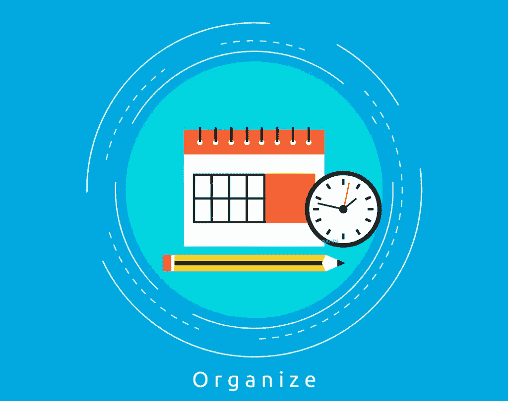
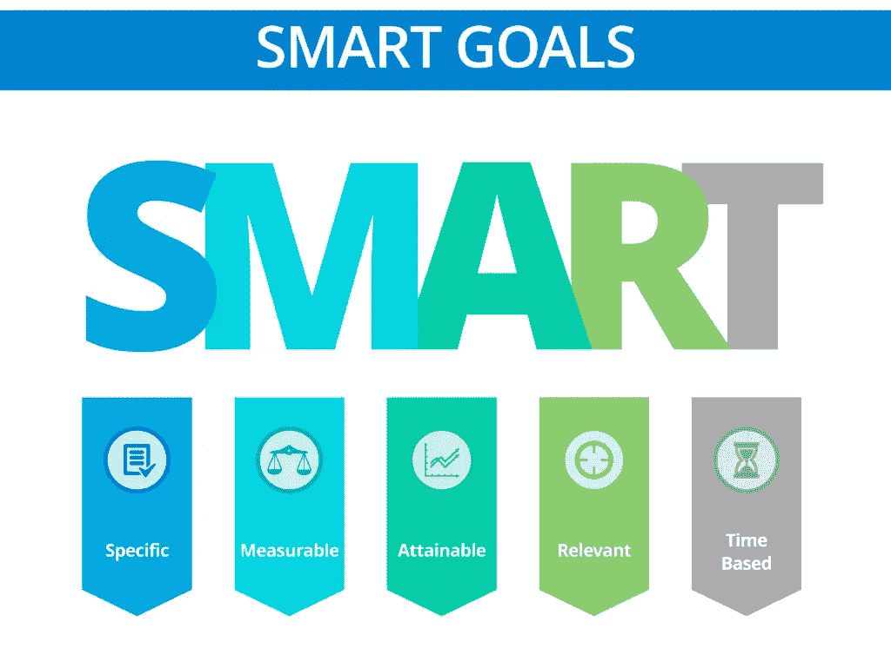
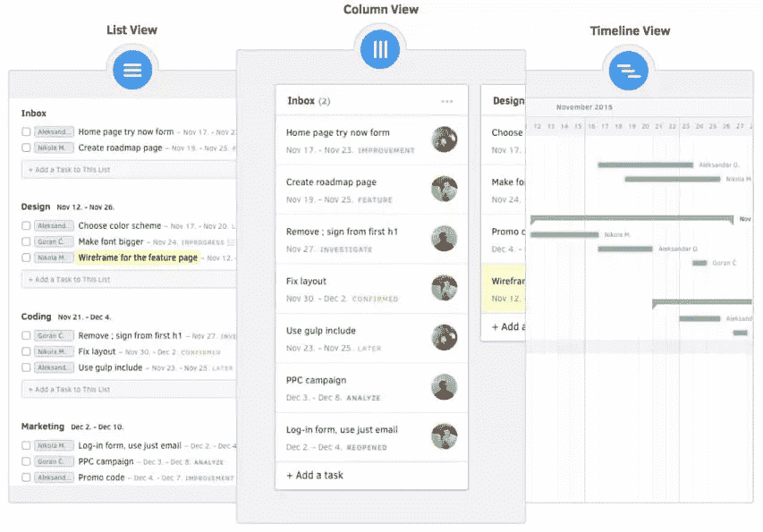

# 如何组织你的营销活动

> 原文：<https://www.sitepoint.com/how-to-keep-your-marketing-campaigns-organized/>

许多企业主或营销人员认为你的产品发布是开展营销活动的唯一时机，你是其中之一吗？你和你的团队应该把每一个营销行为都看作是一次营销活动。

通常，成功的关键是一致性——保持组织性并分析所有结果，以确保你从营销品牌的每一项努力中获得最大收益。

## 创建内容日历

您将希望开始记录您对内容活动的所有想法和计划，以简化您的集思广益过程，并在需要之前安排内容。

Excel 是一个简单的工具，它完全能够处理一个基本的设计来帮助你跟踪你的计划。跟踪公司即将举办的活动(假期、产品发布会、会议等)。)，以及你具体打算发布什么内容。你可以将你的一些内容创意聚焦在即将到来的影响目标受众的季节或事件上。如果你不想创建自己的日历，有很多免费的内容日历模板。

## 设定 S.M.A.R.T .目标

加州多米尼加大学对企业、组织和专业人士的一项研究发现，当他们明确写下并跟踪他们的努力时，70%的参与者报告成功实现了他们的目标(相比之下，那些将目标留给自己而不写下的人只有 35%的成功率)。

设定最后期限和具体目标，确保你达到自己的期望。与您的团队分享它们，以保持项目以正确的速度向正确的方向发展。写下 S.M.A.R.T .的目标将有助于你坚持下去:

具体——用数字和百分比来准确定义你想要改善或增加的内容。包括您计划使用的格式和平台。不要使用“增加关注者”或“放置更多客座博文”这样的通用目标。相反，定义具体的目标，比如“通过每天发布 X 次，在 X 周内增加 15%的脸书关注”

可衡量——你想在活动结束时知道你是否达到了目标，或者你是否需要投入更多的努力，然后才能将任务标记为完成。如果您在指定目标时没有使用任何度量标准，那么几乎不可能得出项目成功的明确结论。

可实现的——每一个目标都应该集中在你能实际控制或影响的事情上。

现实主义——如果你总是高估自己的能力，那么你和你的团队很可能会因为持续的失败而沮丧。你的预算和截止日期也应该是现实的。

最后期限将有助于将每项活动和任务限制在特定的一周、一个季度、一个部分或一年，给你一个具体的时间点，你应该在这个时间点检查你的分析并评估你的努力。对于更大的目标，用里程碑来划分你的时间，以保持你的团队在正轨上，并增加成功结果的可能性。一些项目管理工具具有[能力，可以创建具有不同视图的任务列表](https://activecollab.com/blog/project-management/2014/12/29/task-views)，例如，指定任务以确保您满足您的里程碑(并最终满足您的大项目期限):

## 使用项目管理工具

2014 年，77%的受访公司表示他们正在使用某种项目管理工具。在高绩效公司中， [87%的公司报告使用了项目管理工具](http://www.informationweek.com/whitepaper/it-strategy/data-centers/research-2014-enterprise-project-management-survey/159383?gset=yes)。

有了任务管理工具，杂耍任务变得更加简单。一个好的项目管理工具将帮助你跟踪你的团队交流、任务、日程表和进度。通过一个简单的仪表板来跟踪您的目标和更新，您将能够更好地确定优先级和重点。

您甚至可以[添加您的客户](https://activecollab.com/blog/project-management/2016/07/15/how-to-work-with-client)，这样他们就可以看到您的活动。这是一种通过提高透明度来建立信任的好方法，有助于沟通特定任务的微小变化。

根据[项目管理协会](http://www.pmi.org/learning/thought-leadership/pulse/capturing-the-value-of-project-management)的调查，高绩效组织重视项目管理(89%)，57%的组织致力于使其项目与总体业务战略保持一致。

## 促进合作

渥太华大学发现，三分之一的商业项目失败是因为缺乏高层管理人员的参与。

当你有多个项目，不同的团队成员参与时，如果你想避免任何混乱或失误，你需要有可靠的沟通。一个好的协作工具将通过团队聊天和内部社交平台等功能使沟通更容易、更快、更直观，以帮助您跟上团队的更新。多个项目乘以多个任务乘以多个里程碑可能会导致相当数量的更新，否则是不可能跟踪的。

您的团队甚至能够根据分配的角色和授予的权限进行编辑或注释。此外，您可以使用项目管理工具来跟踪每个参与者在给定项目上花费的时间，帮助您更准确地开出账单和发票。

## 跟踪结果

你会希望跟踪你的活动，让自己更好地了解什么实际有效，什么无效，跟踪你的 ROE(努力的回报)。你不想花太多精力去策划无效的活动。您可能希望跟踪具体情况，例如:

*   活动开始日期
*   平台
*   参与协作团队
*   主题
*   状态(进行中、开始、完成、计划等。)
*   主题行或标题
*   联系人
*   目标受众/细分市场/角色
*   形象
*   个性化注释
*   社交分享统计
*   链接

了解这些细节将有助于您在活动后更好地了解您的指标。继续追踪你的努力，希望能认识到一种模式，你可以在未来调整。跟踪您记录的结果，了解不同的活动类型和细节将如何影响您的最终目标:

*   发送的电子邮件数量
*   点击率
*   跳出率
*   开放率
*   产生新的销售线索

当你决定好活动后，别忘了打扫房间。保持你的电子邮件、短信和关注者都减少到那些关心的人，将有助于你的营销活动在合格的线索中着陆。

## 分割你的列表

MailChimp 发现，总体而言，[细分广告活动](https://mailchimp.com/resources/research/effects-of-list-segmentation-on-email-marketing-stats/)比非细分广告活动表现更好(与非细分广告活动相比，打开率高出 14%，点击率高出 53%)。通过了解谁在您的联系人列表中，进一步组织您的活动。这将帮助你制作未来的内容，并通过有针对性的营销获得更高的转化率。

不要被不断变化的行业不断增长的营销需求所淹没。你保持得越有条理，你就能越熟练地处理你的品牌需求和观众期望，同时适应未来的营销变化。

## 分享这篇文章