# 轻松将现有用户迁移到 Auth0

> 原文：<https://www.sitepoint.com/easily-migrate-existing-users-auth0/>

用户迁移是一项可怕的、有时不可避免的任务，对开发人员来说很困难，对用户来说不方便，对企业主来说很昂贵。将用户从一个服务或平台迁移到另一个服务或平台的需求可能源于多种原因:您当前使用的身份提供者正在关闭、您的组织不再希望自己管理用户、语言或框架的变化以及许多其他原因。

Auth0 旨在为开发人员提供简单易用的最佳认证和身份管理平台。Auth0 平台的一个关键特性是能够将用户从任何现有的数据源迁移到 Auth0，而不会因为需要更改密码而给用户带来不便。

在本教程中，我们将看看如何做到这一点。Stormpath 是一家提供身份验证服务的公司，最近被 T2 Okta 收购。Okta 宣布 Stormpath 产品将于 2017 年 8 月关闭，客户必须在此之前找到新的提供商。让我们看看如何轻松地将现有的 Stormpath 用户迁移到 Auth0 中。

## Auth0 简化了用户迁移

Auth0 允许客户使用[自定义数据库连接](https://auth0.com/docs/connections/database/mysql?utm_source=sitepoint&utm_medium=gp&utm_campaign=migration)功能连接到任何自定义数据存储。顾名思义，这个特性允许 Auth0 验证存储在 Auth0 之外的用户凭证。外部数据存储可以是 MySQL 之类的数据库、Stormpath 之类的服务或您自己的定制实现。这些外部数据源是通过 Auth0 仪表板中编写的脚本来访问的。自定义数据库连接特性还允许开发人员将使用自定义数据库凭证登录的用户自动导入 Auth0。此功能可通过扳动开关来启用。

为了在将 Stormpath 用户迁移到 Auth0 的上下文中实现该特性，我们将设置一个自定义数据库连接，并使用 Stormpath API 将其连接到现有的 Stormpath 帐户。当您的用户第一次登录时，他们将输入他们现有的 Stormpath 凭据，如果验证成功，我们将自动将该用户帐户从 Stormpath 迁移到 Auth0。您的用户将不必更改他们的密码或跳过任何额外的关卡，您可以决定从 Stormpath 传输哪些数据。下次用户登录时，Auth0 将检测到他们已被迁移，并使用他们的 Auth0 帐户对他们进行身份验证。

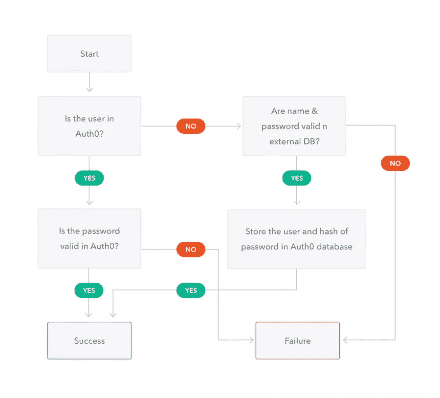

首先，[注册一个免费的 Auth0 帐户](https://auth0.com/signup?utm_source=sitepoint&utm_medium=gp&utm_campaign=migration)。我们假设您已经拥有一个想要迁移的用户的有效 Stormpath 帐户。**即使您没有使用 Stormpath，您也可以按照本教程进行操作，并连接到不同的数据存储。**

## 使用用户导入功能设置自定义数据库连接

创建好您的帐户后，让我们建立一个自定义数据库连接。在您的 Auth0 [管理仪表板](https://manage.auth0.com/?utm_source=sitepoint&utm_medium=gp&utm_campaign=migration)中，导航到[数据库连接](https://manage.auth0.com/#/connections/database?utm_source=sitepoint&utm_medium=gp&utm_campaign=migration)部分。

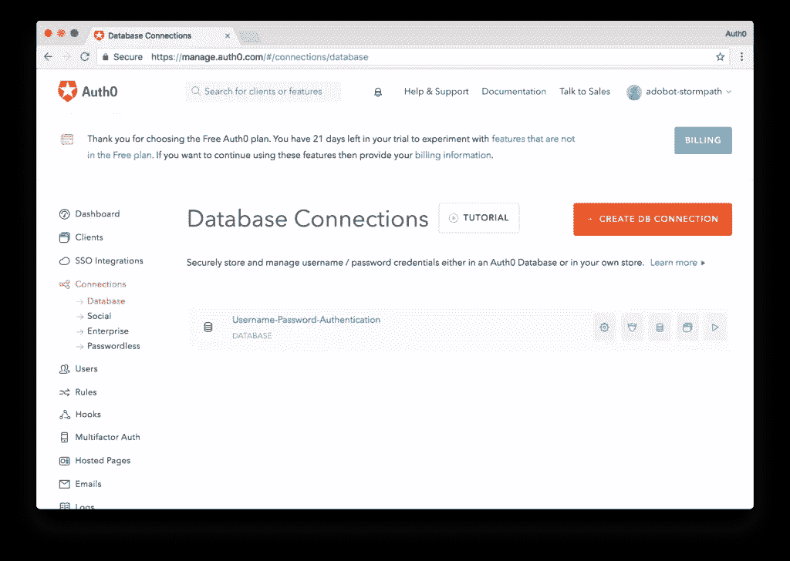

点击**创建数据库连接**按钮创建一个新的数据库连接。您可以随意命名您的连接。暂时保留所有默认设置，点击**创建**按钮创建连接。

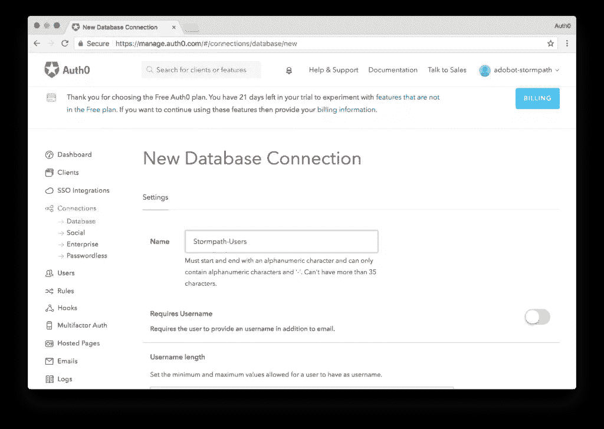

接下来，让我们进入这个数据库连接，并将其连接到我们的 Stormpath 帐户。点击您新创建的连接并导航到**自定义数据库**选项卡。翻转标题为**“使用我自己的数据库”**的开关，数据库动作脚本部分现在将被启用。我们将在这里编写代码，以连接到您现有的 Stormpath 用户数据存储。

我们将需要编写两个脚本:**登录**和**获取用户**。**登录**将代理登录过程，而**获取用户**将在用户试图重置其密码时管理帐户查找。

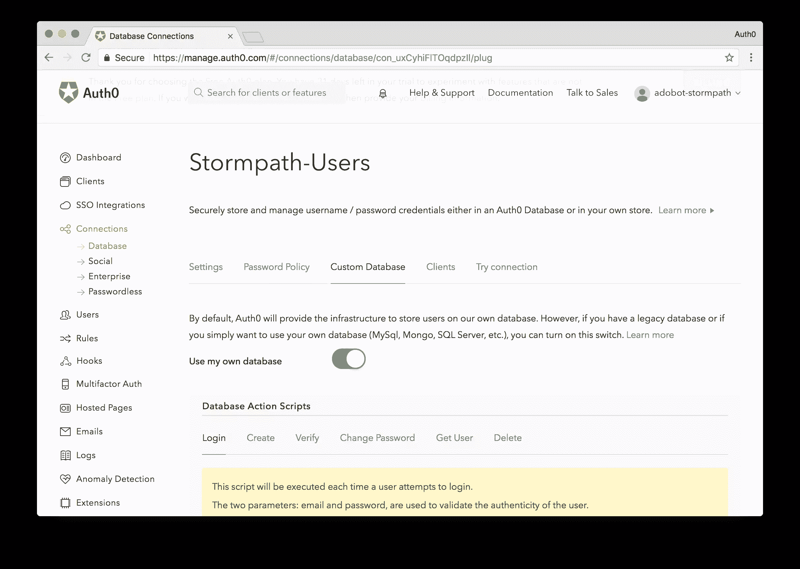

打开自定义数据库特性后，让我们启用导入功能。默认情况下，自定义数据库连接将允许我们使用外部数据库进行身份验证，并且不会将用户导入 Auth0。如果我们想将用户从外部平台迁移到 Auth0，我们只需要简单地切换一个开关。转到连接的**设置**选项卡，拨动标题为**“导入用户到 auth 0”**的开关，就大功告成了。

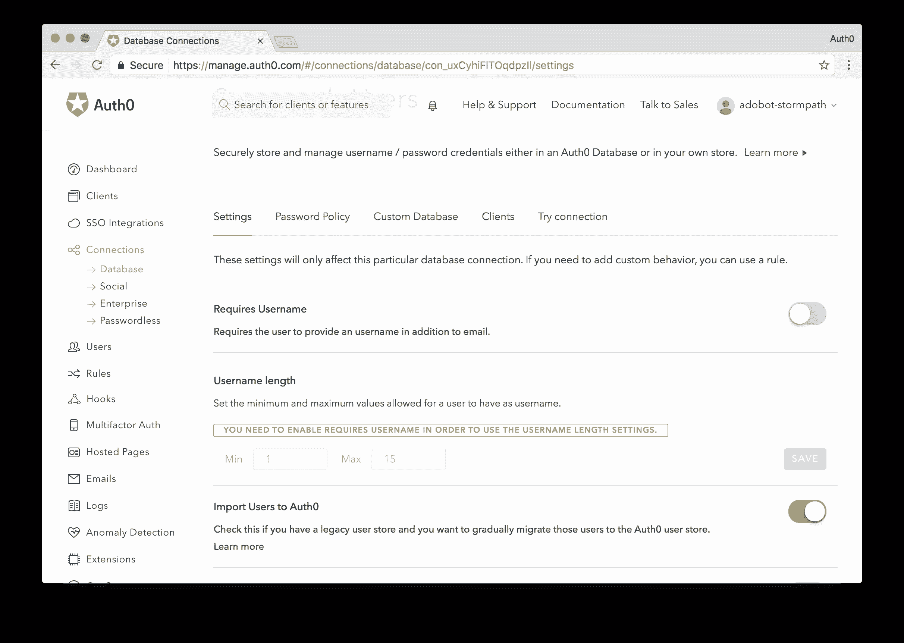

在实现我们的脚本之前，我们要做的最后一步是为我们的默认客户机启用这个连接。在您的数据库连接中导航到**客户端**选项卡，并翻转开关以启用该客户端的**默认连接**。*如果您已经有一个现有的 Auth0 帐户，连接名称可能会不同。*

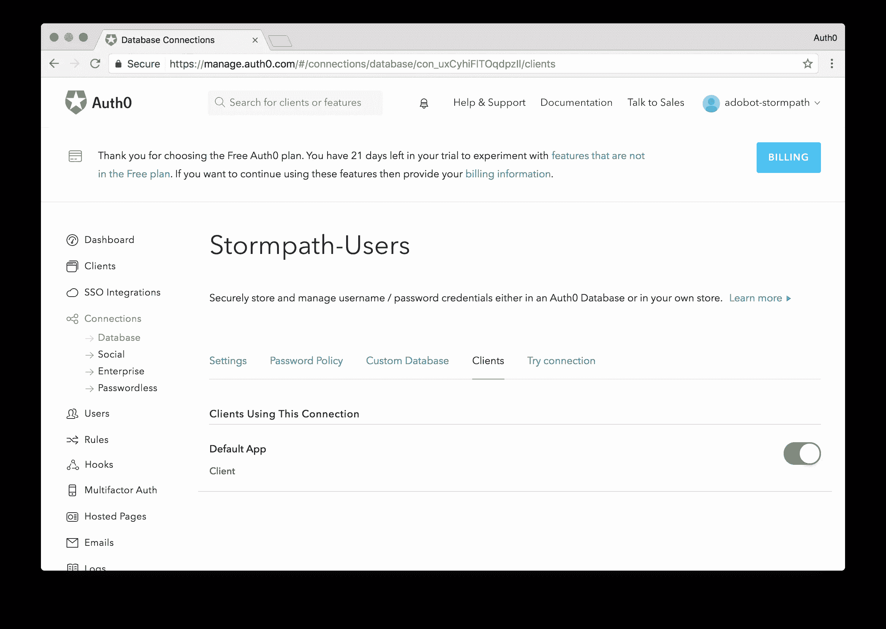

### 注册

当用户试图登录，但在 Auth0 数据库中找不到他们的帐户时，就会执行**登录**脚本。这里，我们将实现将提供的用户凭证传递给 Stormpath 用户数据存储的功能，并查看该用户是否有效。Auth0 提供了 MongoDB、MySQL、SQL Server 等很多常用数据库的模板，还有 Stormpath。这些模板提供了一个很好的起点，您可以按照自己想要的方式定制它们，或者从头开始编写自己的模板。

数据库动作脚本运行在 [Webtask](https://webtask.io?utm_source=sitepoint&utm_medium=gp&utm_campaign=migration) 沙箱中，是 Node.js 脚本。由于我们的教程侧重于将 Stormpath 用户迁移到 Auth0，下面显示的脚本将适合使用 Stormpath REST API，但是如果您从不同的提供者迁移用户，您将在这里编写您的实现或者使用提供的其他模板之一。

让我们看看登录脚本的实现，看看它是如何工作的。我们将利用 Stormpath 的 REST API 来认证用户。

```
function login(username, password, callback) {
  // Replace the YOUR-STORMPATH-CLIENT-ID with your Stormpath ID
  var url = 'https://api.stormpath.com/v1/applications/{YOUR-STORMPATH-CLIENT-ID}/loginAttempts';
  // Add your Stormpath API Client ID and Secret
  var apiCredentials = {
    user : 'YOUR-STORMPATH-API-ID',
    password: 'YOUR-STORMPATH-API-SECRET'
  }

  // Stormpath requires the user credentials be passed in as a base64 encoded message
  var credentials = new Buffer(username + ':' + password).toString('base64');

  // Make a POST request to authenticate a user
  request({
    url: url,
    method: 'POST',
    auth: apiCredentials,
    json: {
      type: 'basic',
      // Passing in the base64 encoded credentials
      value: credentials
    }
  }, function (error, response, body) {
    // If response is successful we'll continue
    if (response.statusCode !== 200) return callback();
    // A successful response will return a URL to get the user information
    var accountUrl = body.account.href;

    // Make a second request to get the user info.
    request({
      url: accountUrl,
      auth: apiCredentials,
      json: true
    }, function (errorUserInfo, responseUserInfo, bodyUserInfo) {
      // If we get a successful response, we'll process it
      if (responseUserInfo.statusCode !== 200) return callback();

      // To get the user identifier, we'll strip out the Stormpath API
      var id = bodyUserInfo.href.replace('https://api.stormpath.com/v1/accounts/', '');

      // Finally, we'll set the data we want to store in Auth0 and migrate the user
      return callback(null, {
        user_id : id,
        username: bodyUserInfo.username,
        email: bodyUserInfo.email,
        // We set the users email_verified to true as we assume if they were a valid
        // user in Stormpath, they have already verified their email
        // If this field is not set, the user will get an email asking them to verify
        // their account. You can decide how to handle this for your use case
        email_verified: true
        // Add any additional fields you would like to carry over from Stormpath
      });
    });
  });
} 
```

### 获取用户

当用户试图重置密码，但在 Auth0 数据库中找不到他们的帐户时，将执行 **Get User** 脚本。Get User 脚本与 Stormpath 数据存储接口，并检查那里是否存在用户。如果用户确实存在，他们的数据将被发送回 Auth0，在那里用户将被迁移，并从 Auth0 发送一封密码重置电子邮件。一旦用户确认重置，他们就可以开始访问你的应用程序了。后续登录将根据 Auth0 数据库进行身份验证，因为用户的配置文件现在存储在 Auth0 中。

如果您没有从 Stormpath 迁移您的用户，那么 Get User 脚本也将是您自己的实现。让我们看看 Stormpath 的 Get 用户脚本的模板实现:

```
function getByEmail(email, callback) {
  // Replace the YOUR-STORMPATH-CLIENT-ID with your Stormpath ID
  var url = 'https://api.stormpath.com/v1/applications/{YOUR-STORMPATH-CLIENT-ID}/accounts';
  // Add your Stormpath API Client ID and Secret
  var apiCredentials = {
    user : 'YOUR-STORMPATH-API-ID',
    password: 'YOUR-STORMPATH-API-SECRET'
  };

  // Make a GET request to find a user by email
  request({
    url: url,
    method: 'GET',
    auth: apiCredentials,
    qs: { q: email },
    json: true
  }, function (error, response, body) {
    if (response.statusCode !== 200) return callback();

    var user = body.items[0];

    if (!user) return callback();

    var id = user.href.replace('https://api.stormpath.com/v1/accounts/', '');

    return callback(null, {
      user_id: id,
      username: user.username,
      email: user.email,
      email_verified: true
      // Add any additional fields you would like to carry over from Stormpath
    });
  });
} 
```

有了这两个脚本，我们就有了用户迁移设置并准备就绪。为了测试它并确保我们的代码工作，让我们构建一个简单的应用程序，允许用户登录并通过 API 请求受保护的资源。我们将用 [Angular](https://angular.io) 构建前端，用 [Spring](https://projects.spring.io/spring-boot/) 驱动后端。

## 构建前端

我们将用 Angular 2 构建我们的前端。我们将使用 [Auth0 Angular 2 Quickstart](https://github.com/auth0-samples/auth0-angularjs2-systemjs-sample/tree/master/01-Login?utm_source=sitepoint&utm_medium=gp&utm_campaign=migration) 快速启动并运行。我们的源代码可以在[这里](https://github.com/auth0-blog/migrate-stormpath-users-to-auth0/tree/master/frontend?utm_source=sitepoint&utm_medium=gp&utm_campaign=migration)找到。Auth0 为许多流行的语言和框架提供了一套全面的快速入门、SDK 和指南。在这里看到他们所有的。

下载完项目后，我们需要设置我们的 Auth0 凭据。我们将在 auth.config.js 文件中这样做。打开文件并将值更改为如下所示:

```
"use strict";
exports.myConfig = {
    // Your Auth0 ClientID.
    clientID: '{AUTH0-CLIENT-ID}',
    // Your Auth0 Domain
    domain: '{YOUR-AUTH0-DOMAIN}.auth0.com'
}; 
```

这两个值都可以在您的 Auth0 [管理仪表板](https://manage.auth0.com/?utm_source=sitepoint&utm_medium=gp&utm_campaign=migration)中找到。在仪表板中，只需点击主菜单中的**客户端**链接，并选择您注册时创建的默认客户端。*如果您已经有一个 Auth0 帐户，请选择启用了与自定义数据库的数据库连接的客户端。*

配置好这些值后，保存文件并运行`npm install`。一旦 npm 安装了所有需要的依赖项，通过执行`npm start`来运行项目。导航到 localhost:3000 查看应用程序的运行情况。

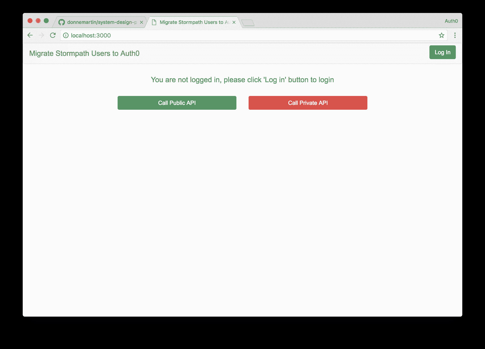

点击**登录**按钮，登录您的应用程序。点击**登录**按钮将弹出认证[锁定窗口](https://auth0.com/lock?utm_source=sitepoint&utm_medium=gp&utm_campaign=migration)，并要求用户提供他们的电子邮件和密码。在这里，用户将提供他们的 Stormpath 电子邮件和密码凭据，如果正确，他们将登录。如果您还没有可以登录的 Stormpath 用户帐户，请进入您的 Stormpath 仪表板并创建一个帐户。现在使用您的 Stormpath 用户凭据登录。

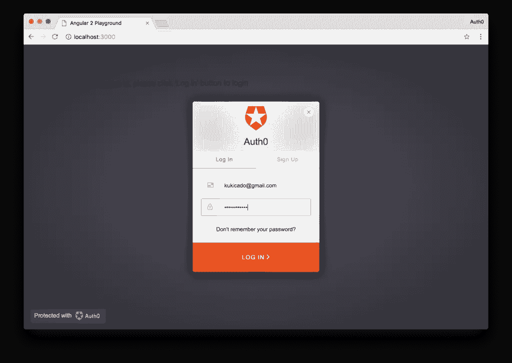

请注意，您会立即登录。如果我们查看来自事务的响应数据，我们将看到用户来自 Stormpath-Users 连接以及我们导入的其他数据。让我们确保该用户也被迁移到 Auth0。为了检查这一点，我们将导航到 Auth0 控制面板的[用户](https://manage.auth0.com/#/users?utm_source=sitepoint&utm_medium=gp&utm_campaign=migration)部分，现在我们将看到我们登录时使用的用户。

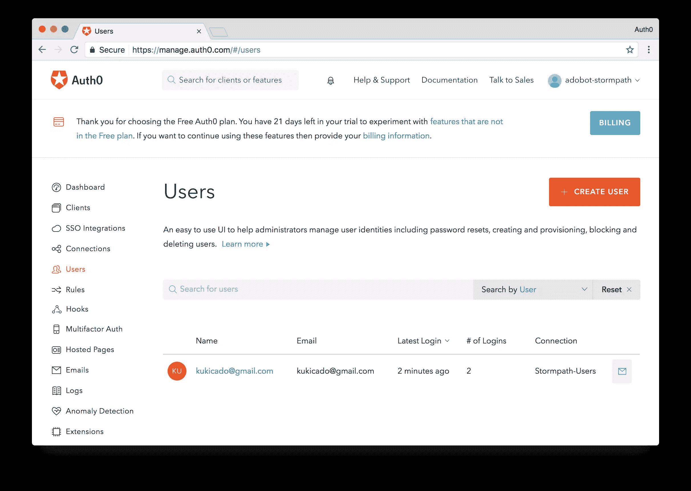

这意味着我们的迁移是成功的。此用户现已迁移至 Auth0。下次他们登录应用程序时，我们将根据 Auth0 的数据库检查他们的凭证，而不是额外调用 Stormpath。下面的工作流程图再次说明了这一过程。

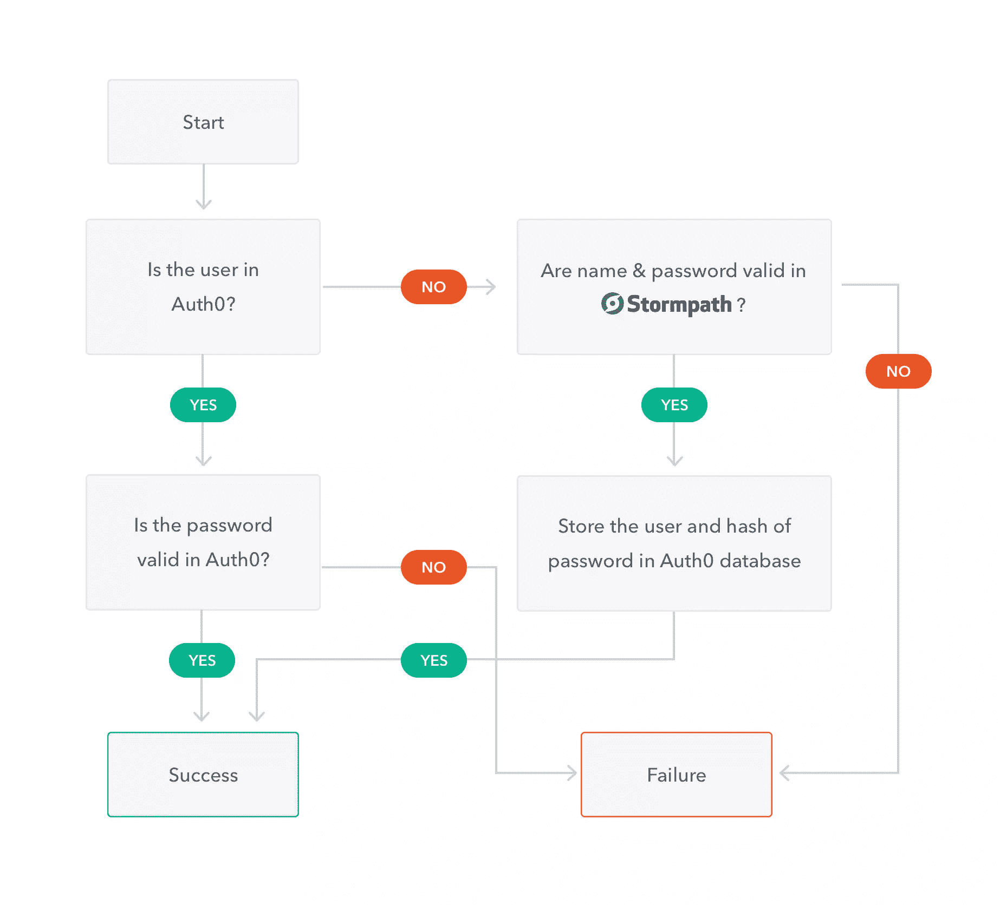

现在你可能注意到了两个按钮，**调用公共 API** 和**调用私有 API** 。让我们构建一个简单的后端，当这些链接被点击时，它将返回数据。我们接下来会这么做。

## 构建后端

对于我们的后端，我们将构建一个简单的 Spring Boot 应用程序，它公开了一个 RESTful API。您可以在这里获得示例应用程序[的代码。要设置应用程序，您只需用您的凭证更新应用程序。存储凭证的文件称为 auth0.properties，可以在`src/main/resources/`目录中找到。](https://github.com/auth0-blog/migrate-stormpath-users-to-auth0/tree/master/backend?utm_source=sitepoint&utm_medium=gp&utm_campaign=migration)

编辑文件，如下所示:

```
auth0.domain: {YOUR-AUTH-DOMAIN}.auth0.com
auth0.issuer: https://{YOUR-AUTH0-DOMAIN}.auth0.com/
auth0.clientId: {YOUR-AUTH0-CLIENT-ID}
auth0.securedRoute: NOT_USED
auth0.base64EncodedSecret: false
auth0.authorityStrategy: ROLES
auth0.defaultAuth0ApiSecurityEnabled: false
auth0.signingAlgorithm: HS256 
```

有了这个更新，您应该能够通过运行以下命令来构建应用程序:

```
mvn spring-boot:run -Drun.arguments="--auth0.secret=YOUR_SECRET_KEY" 
```

如果应用程序构建成功，您将能够在 localhost:4000 访问 API。这个应用程序公开的两条路由是/public 和/secure。每个人都可以访问/public 路由，而只有当用户通过身份验证并传递了正确的凭据时,/secure 路由才会返回成功的响应。

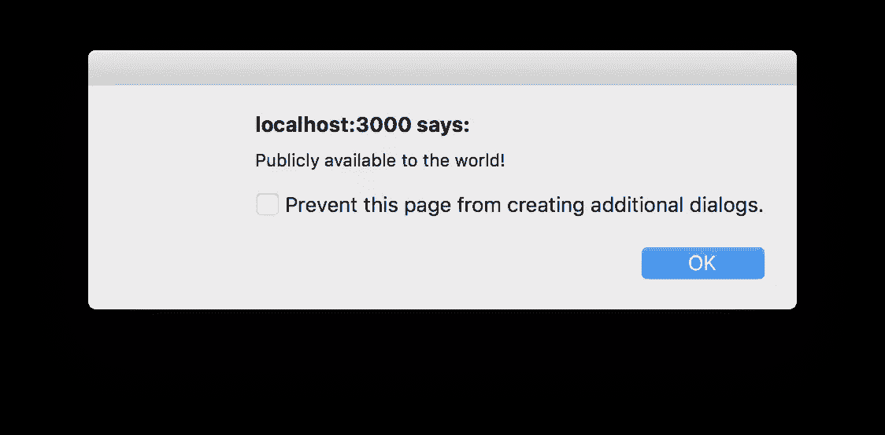

一旦你的后端启动并运行，回到你的前端应用程序，试着点击两个链接，**调用公共 API** 和**调用私有 API** 。即使没有登录，您也可以访问公共 API。对于私有 API，您需要登录来调用路由并获得适当的响应。

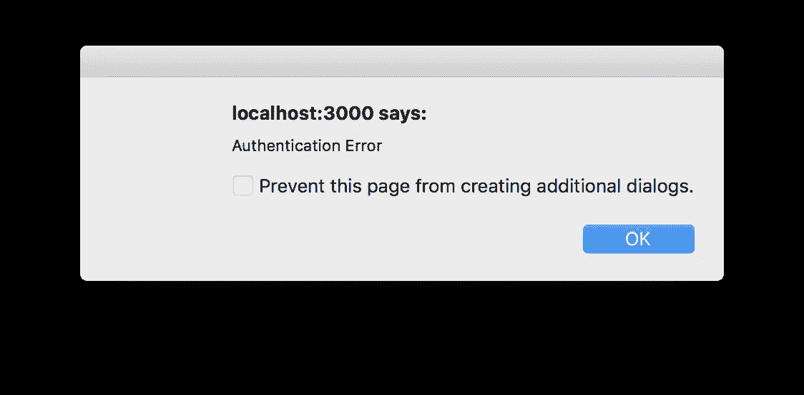

我们还使用 Angular 2 添加了一些动态类。因此，如果用户已登录，我们会将两个按钮都设置为绿色，以表示可以单击它们。

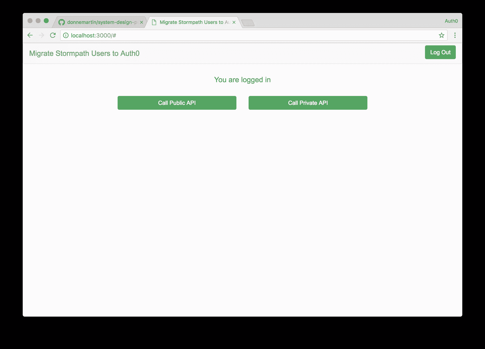

## 使用 Auth0 更进一步

我希望我在本文中展示的用户迁移功能对您的用例有所帮助。这种渐进的迁移非常有效，因为它对您的最终用户是透明的。如果您不能进行渐进的迁移，您可以[将您现有的用户数据存储库](https://auth0.com/docs/tutorials/bulk-importing-users-into-auth0?utm_source=sitepoint&utm_medium=gp&utm_campaign=migration)批量导入到 Auth0 中。此外，由于我们已经编写了 Get User 脚本，您可以向您的用户发送大量电子邮件，让他们知道他们需要更改密码，通过单击电子邮件中的链接，他们的帐户将被迁移到 Auth0。

既然您的迁移问题已经解决了，那么让我们简单地讨论一下 Auth0 除了身份验证、授权和用户迁移之外还带来了什么。Auth0 提供的许多功能可以通过拨动开关来实现。[多因素认证](https://auth0.com/multifactor-authentication?utm_source=sitepoint&utm_medium=gp&utm_campaign=migration)就是这样一个特性。您可以使用我们的内部 MFA 解决方案 [Guardian](https://auth0.com/multifactor-authentication?utm_source=sitepoint&utm_medium=gp&utm_campaign=migration) 启用 MFA，只需轻轻一按开关。

如果您已经在使用第三方 MFA 解决方案或拥有自己的自定义解决方案，您也可以继续使用它。auth 0[Rules](https://auth0.com/docs/rules?utm_source=sitepoint&utm_medium=gp&utm_campaign=migration)extensibility platform 允许您控制授权工作流。在这里，您可以配置任意数量的事件，例如触发第三方 MFA、执行渐进式分析等等。

Auth0 提供传统的[用户名和密码](https://auth0.com/docs/connections/database?utm_source=sitepoint&utm_medium=gp&utm_campaign=migration)认证、[社交连接](https://auth0.com/docs/identityproviders#social?utm_source=sitepoint&utm_medium=gp&utm_campaign=migration)到超过 50 个社交网络，包括谷歌、脸书和 Twitter，以及[企业连接](https://auth0.com/docs/identityproviders#enterprise?utm_source=sitepoint&utm_medium=gp&utm_campaign=migration)通过 Active Directory、SAML、谷歌应用程序等等。

## 结论

自定义数据库连接和导入用户功能为开发人员提供了一种将现有用户迁移到 Auth0 的简单方法。无论这些用户是使用 Stormpath 还是不同的提供商，只需要实现两个脚本来连接到数据存储。即使您的用户正在缓慢迁移，您也可以利用 Auth0 提供的所有其他功能，如多因素身份验证、异常检测等。

如果您受到 Stormpath 新闻的影响，或者出于不同的原因正在寻求迁移您的用户，并且希望轻松完成，请[尝试 auth 0](https://auth0.com/signup?utm_source=sitepoint&utm_medium=gp&utm_campaign=migration)，注册一个免费帐户，并立即开始。

## 分享这篇文章