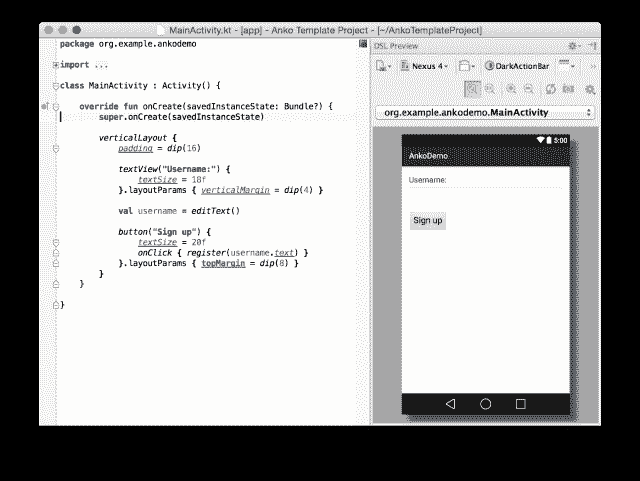
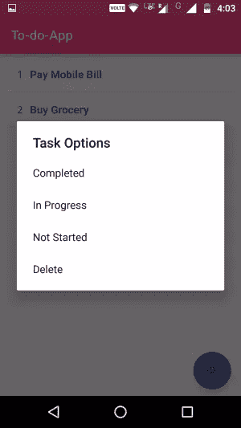

# 用 Kotlin 和 Anko 构建 UI

> 原文：<https://www.sitepoint.com/building-a-ui-with-kotlin-and-anko/>

自从 Android 开发开始以来，使用 UI 一直是 XML 的事情。虽然从理论上讲，UI 可以用 Java 编程，但它并没有多大用处。不久前，JetBrains 推出了 Kotlin，这是一种针对 JVM 的现代语言，可以为 Android 服务。

Jetbrains [宣布](https://blog.jetbrains.com/kotlin/2015/04/announcing-anko-for-android/) Anko 是 Android 中一种更快更简单的开发方式。Kotlin 提供了作为 DSL(领域特定语言)的 [Anko](https://github.com/Kotlin/anko) 库来设计 Android 屏幕。一个简单的例子:

下面是一个普通的 Android UI，由一个`imageView`和一个`Button`组成。


这是它的 Anko 代码:

```
verticalLayout{
        imageView(R.drawable.anko_logo).
                lparams(width= matchParent) {
                    padding = dip(20)
                    margin = dip(15)
        }
        button("Tap to Like") {
                onClick { toast("Thanks for the love!") }
        }
    } 
```

这里我们定义了一个垂直的线性布局，它充当了*图像*和*按钮*的容器。使用`lparams()`定义了视图在布局中的位置。而且，由于 Kotlin 内联函数，按钮点击时发生的事情也在 UI 定义中定义。

#### [](#advantages-of-using-anko)利用安科的优势

*   我们可以在源代码中嵌入 UI 布局，从而使其类型安全。
*   因为我们不是用 XML 编写，所以它增加了效率，因为不需要浪费 CPU 时间来解析 XML。
*   经过 UI 的程序化转换，我们可以将一个 Anko DSL 片段放入一个函数中。从而便于代码重用。
*   很明显，代码更加简洁，可读性更好，更容易理解。

现在，让我们使用 Anko Layout 和 Kotlin 构建一个列出任务的待办事项应用程序。

你可以在 [GitHub](https://github.com/ankul09jain/To-doApp) 上找到这个待办事项应用的存储库

### [](#adding-anko-library-to-android-studio)向 Android Studio 添加 Anko 库

看看[用 Kotlin](https://www.sitepoint.com/streamline-android-java-code-with-kotlin/ "streamline-android-java-code-with-kotlin") 精简 Android Java 代码，了解如何将 Kotlin 添加到您的 Android 项目中。除了 Kotlin，我们还需要在`app/build.gradle`中添加 Anko 依赖项，以便我们能够编译项目:

```
compile 'org.jetbrains.anko:anko-sdk15:0.8.3'
//sdk19, 21 and 23 are also available 
```

可以根据应用程序的目标`minSdkVersion`来添加这种依赖关系。上面的例子描述了它的目标是 15 < = `minSdkVersion` < 19。你可以在 Anko 的 [GitHub](https://github.com/Kotlin/anko#which-anko-libraries-are-available-and-1which-do-i-need) 库上查看你可能需要的其他 Anko 库。
我们也将使用以下库:

```
compile 'org.jetbrains.anko:anko-design:0.8.3'
compile 'org.jetbrains.anko:anko-appcompat-v7:0.8.3' 
```

### [](#calling-anko-layout-in-activity)呼唤安科在活动中布局

我们不再编写 XML 布局，所以我们不需要调用 XML 视图，也不需要使用`findViewById()`方法。假设我们的 Anko UI 类是`MainUI`，那么我们可以用 MainUI 将我们的活动内容设置为:

```
var ui = MainUI()           //MainUI class replaces the XML layout
ui.setContentView(this)     //this refers to the Activity class 
```

现在创建一个新的 Kotlin 文件`MainActivity.kt`，并向其中添加以下代码:

```
import android.os.Bundle;
import android.support.v7.app.AppCompatActivity;
import org.jetbrains.anko.*;
import java.util.*

class MainActivity : AppCompatActivity() {

    val task_list = ArrayList<String>()         //list consisting of tasks

    override fun onCreate(savedInstanceState: Bundle?) {
        super.onCreate(savedInstanceState)
        savedInstanceState?.let {
            val arrayList = savedInstanceState.get("ToDoList")
            task_list.addAll(arrayList as List<String>)
        }
        var adapter=TodoAdapter(task_list)      //define adapter
        var ui = MainUI(adapter)                //define Anko UI Layout to be used
        ui.setContentView(this)                 //Set Anko UI to this Activity

    }
    override fun onSaveInstanceState(outState: Bundle?) {
        outState?.putStringArrayList("ToDoList", task_list)
        super.onSaveInstanceState(outState)
    }
} 
```

`task_list`是`ArrayList`，它将在我们的待办事项应用程序中填充列表视图的`TodoAdapter`。`MainUI(adapter)`是我们的 Anko UI 文件，它以一个`TodoAdapter`类的适配器作为参数。所以，接下来让我们创建`TodoAdapter`类。

### [](#building-adapter-for-listview)为 ListView 构建适配器

TodoAdapter 类有一个类型为`ArrayList<String>`的成员字段`list`，并扩展了`BaseAdapter`。因此，我们需要覆盖以下 4 个成员函数:

```
public int getCount()
public Object getItem(int i)
public long getItemId(int i)
public View getView(int i, View view, ViewGroup viewGroup) 
```

在`getView()`方法中，我们将使用 Anko 设计列表项的布局。

```
override fun getView(i : Int, v : View?, parent : ViewGroup?) : View {
    return with(parent!!.context) {
        //taskNum will serve as the S.No. of the list starting from 1
        var taskNum: Int = i +1

        //Layout for a list view item
        linearLayout {
            lparams(width = matchParent, height = wrapContent)
            padding = dip(10)
            orientation = HORIZONTAL

            //Task Number
            textView {
                id = R.id.taskNum
                text=""+taskNum
                textSize = 16f
                typeface = Typeface.MONOSPACE
                padding =dip(5)
            }

            //Task Name
            textView {
                id = R.id.taskName
                text=list.get(i)
                textSize = 16f
                typeface = DEFAULT_BOLD
                padding =dip(5)
            }
        }
    }
} 
```

*   在这个函数中，我们返回一个包含列表项的视图，它是一个`horizontalListView`布局。这是使用 Kotlin 的`with`语法完成的，它允许我们一次调用一个对象实例上的许多方法。
*   每个列表项包含两个`textview`，用于显示任务编号和任务名称。
*   `linearLayout`、`textView`为扩展函数。扩展给了我们启用任何具有新功能的类的能力。
*   `text`、`textSize`、`typeface`在`android.widget.TextView`类中定义了它们的 getter 和 setter 方法。`padding`是 Anko 中定义的扩展属性。

接下来，我们需要为列表定义操作函数。因此，我们在`TodoAdapter`类中有`add(String)`和`delete(Int)`函数。`add(String)`将要添加的任务名称作为参数。该项的位置作为`delete(Int)`函数中的参数，如下所示:

```
//function to add an item to the list
fun add(text: String) {
    list.add(list.size, text)
    notifyDataSetChanged()          //refreshes the underlying dataset
}

//function to delete an item from list
fun delete(i:Int) {
    list.removeAt(i)
    notifyDataSetChanged()          //refreshes the underlying dataset
} 
```

所以，现在我们已经设计了列表，我们还可以在列表中添加和删除项目。这就完成了这个适配器类的代码:

```
import android.graphics.Typeface
import android.graphics.Typeface.DEFAULT_BOLD
import android.view.View
import android.view.ViewGroup
import android.widget.BaseAdapter
import android.widget.LinearLayout.HORIZONTAL
import org.jetbrains.anko.*
import java.util.*

class TodoAdapter(val list: ArrayList<String> = ArrayList<String>()) : BaseAdapter() {
    override fun getView(i : Int, v : View?, parent : ViewGroup?) : View {
        return with(parent!!.context) {
            //taskNum will serve as the S.No. of the list starting from 1
            var taskNum: Int = i +1

            //Layout for a list view item
            linearLayout {
                id = R.id.listItemContainer
                lparams(width = matchParent, height = wrapContent)
                padding = dip(10)
                orientation = HORIZONTAL

                textView {
                    id = R.id.taskNum
                    text=""+taskNum
                    textSize = 16f
                    typeface = Typeface.MONOSPACE
                    padding =dip(5)
                }

                textView {
                    id = R.id.taskName
                    text=list.get(i)
                    textSize = 16f
                    typeface = DEFAULT_BOLD
                    padding =dip(5)
                }
            }
        }
    }

    override fun getItem(position : Int) : String {
        return list[position]
    }

    override fun getCount() : Int {
        return list.size
    }

    override fun getItemId(position : Int) : Long {
        //can be used to return the item's ID column of table
        return 0L
    }

    //function to add an item to the list
    fun add(text: String) {      
        list.add(list.size, text)
        notifyDataSetChanged()
    }

    //function to delete an item from list
    fun delete(i:Int) {
        list.removeAt(i)
        notifyDataSetChanged()
    }

} 
```

注意，我们必须导入`org.jetbrains.anko.*`才能在我们的类文件中使用 Anko DSL。

### [](#designing-to-do-screen)设计待办屏幕

Anko 为我们提供了在单独的 Kotlin 类中为活动提供 UI 的便利。因此，每个屏幕都可以看作是 Kotlin 类的一对 UI 活动。这个 UI 类是通过扩展`org.jetbrains.anko`包中定义的`AnkoComponent<T>`接口的功能开发的。除了这个界面，JetBrains 还免费提供了 DSL [布局预览](https://github.com/Kotlin/anko/blob/master/doc/PREVIEW.md)功能。这是 Anko DSL 布局预览在 Android Studio 中的样子:

> (来源:blog.jetbrains.com)
> 

Anko 预览版的对应插件可以从[这里](https://plugins.jetbrains.com/update/index?pr=&updateId=19242)下载。请注意，在撰写本文时，Android Studio 2.2 的 Anko DSL 预览版被列为开放的[问题](https://github.com/Kotlin/anko/issues/202)。
回到 To-do 应用程序，我们现在将设计保存所有任务列表的`MainUI`类。`MainUI`类扩展了接口`AnkoComponent<T>`，其中`T`指的是 UI 的所有者，也就是其内容是这个 UI 的活动。在我们的例子中，所有者是我们上面已经定义的`MainActivity`。接下来，在初始化时，我们必须将`TodAadapter`对象传递给这个类，因为这个适配器将用于填充列表。因此，`MainUI`类声明变成了:

```
class MainUI(val todoAdapter : TodoAdapter) : AnkoComponent<MainActivity> 
```

现在，我们需要覆盖函数`createView()`，该函数将把`AnkoContext`对象作为参数，并返回一个`View`类型:

```
override fun createView(ui: AnkoContext<MainActivity>): View = with(ui) {} 
```

我们在`createView()`函数中提供的 UI 定义被返回给所有者活动，在本例中是`MainActivity`。所以，让我们开始编写`createView()`方法。

##### [](#step1-designing-home-screen)步骤 1-设计主屏幕


最初，主屏幕上有一个空的任务列表。因此，我们有一个`textView`,要求用户创建当天的待办事项列表:

```
 return relativeLayout {
        //declaring the ListView
        var todoList : ListView? =null

        //textView displayed when there is no task
        val hintListView = textView("What's your Todo List for today?") {
            textSize = 20f
        }.lparams {
            centerInParent()
        }
} 
```

`centerInParent()`是帮助器方法，定义视图的布局为相对垂直和水平居中。
作为一个 todo 应用，它的本质在于一个显示任务的列表。所以，在这里我们定义我们的`listView`:

```
//listView
verticalLayout {
    todoList=listView {
    //assign adapter
        adapter = todoAdapter
        }
}.lparams {
        margin = dip(5)
} 
```

`todoAdapter`是我们在类声明中定义的`MainUI`类的成员变量。我们用一个`TodoAdpater`类对象`todoAdapter`的值初始化`listView`的`adapter`，并将填充列表。
为了帮助用户添加任务，我们遵循`Material design`原则，在主屏幕的右下角提供了一个`floatingActionButton`。因此，在 Anko 中，我们将`floatingActionButton`编程为:

```
floatingActionButton {
            imageResource = android.R.drawable.ic_input_add
        }.lparams {
            //setting button to bottom right of the screen
            margin = dip(10)
            alignParentBottom()
            alignParentEnd()
            alignParentRight()
            gravity = Gravity.BOTTOM or Gravity.END
        } 
```

##### [](#step2-displaying-the-addtask-alert-dialog)步骤 2-显示添加任务提醒对话框

Anko 提供了一种为`View`设置`onClickListener`的简单方式。因此，我们可以通过在`floatingActionButton`中添加`onClick()`方法来为其添加一个`onClickListener`。让我们创建一个点击`floatingActionButton`时出现的自定义对话框，要求用户输入任务并将其添加到列表中:

```
floatingActionButton {
            imageResource = android.R.drawable.ic_input_add
            onClick {
                val adapter = todoList?.adapter as TodoAdapter
                alert {
                    customView {
                        verticalLayout {
                        //Dialog Title
                            toolbar {
                                id = R.id.dialog_toolbar
                                lparams(width = matchParent, height = wrapContent)
                                backgroundColor = ContextCompat.getColor(ctx, R.color.colorAccent)
                                title = "What's your next milestone?"
                                setTitleTextColor(ContextCompat.getColor(ctx, android.R.color.white))
                            }
                            val task = editText {
                                hint = "To do task "
                                padding = dip(20)
                            }
                            positiveButton("Add") {
                                if(task.text.toString().isEmpty()) {
                                    toast("Oops!! Your task says nothing!")
                                }
                                else {
                                    adapter.add(task.text.toString())
                                    showHideHintListView(todoList!!)
                                }
                            }
                        }
                    }
                }.show()
            }
        }.lparams {
            //setting button to bottom right of the screen
            margin = dip(10)
            alignParentBottom()
            alignParentEnd()
            alignParentRight()
            gravity = Gravity.BOTTOM or Gravity.END
        } 
```

*   `alert{}`是创建 Anko 对话框的内嵌函数。默认情况下，在一个 Anko 对话框中，我们可以设置一个文本消息并提供一个`postiveButton`和`negativeButton`。我们可以使用`customView`定制警告对话框。
*   `verticalLayout`是一个方向为垂直的`linearLayout`。
*   我们已经使用`toolbar`为对话框添加了标题，从而对其进行了定制。请注意，我们如何为对话框中的视图分配颜色:`backgroundColor = ContextCompat.getColor(ctx, R.color.colorAccent)`
    这里的`ctx`指的是在包`org.jetbrains.anko`的`AlertDialogBuilder`类中定义的`Context`，我们需要将它作为参数传递，以便让 Android 知道我们所指的上下文。
*   是一个 Anko Helper 方法，它让我们定义当用户提交对话框时会发生什么。这里我们检查`task`是否不为空，然后我们使用在`TodoAdapter`类中定义的`add`方法将任务添加到列表适配器中。
*   什么是`showHideHintListView(todoList!!)`？嗯，这是我们定义的隐藏主屏幕上的文本视图`hintListView`的方法，以便为我们的列表腾出空间。当列表视图为空时，我们显示`hintListView`,否则我们隐藏它。

    //在 textView 上方显示或隐藏的函数
    fun showHideHintListView(listView:listView){
    if(getTotalListItems(listView)>0){
    hint listView . visibility = View。GONE
    } else {
    hint listview . visibility = View。可见
    }
    }

这里的`getTotalListItems(listView)`是`MainUI`类的成员方法，它返回`listView`中传递的项数。这是一个普通的科特林函数:

```
//function to get total number of items in list
fun getTotalListItems(list: ListView?) = list?.adapter?.count ?: 0 
```

最后，点击`floatingActionButton`,我们看到对话框:


添加一些任务后，我们可以看到任务列表:


##### [](#step3-deleting-a-task)步骤 3-删除任务

记住，我们已经在`TodoAdapter`类中定义了从列表中删除一个条目的`delete(Int)`方法。现在是时候设计将依次调用这个
方法的 UI 了。遵循 Android 设计模式，我们可以在点击并按住任务时显示任务选项。所以，让我们来定义列表项的`onLongClick`会发生什么。回到`listView`定义，添加以下内容:

```
onItemLongClick { adapterView, view, i, l ->
val options = listOf("Delete")
    selector("Task Options", options) { j ->
            var task=adapter.getItem(i)
            todoAdapter?.delete(i)
            //check if list is empty then show hint
            showHideHintListView(this@listView)
            longToast("Task ${task} has been deleted")
    }
    true
} 
```

*   这里的`todoAdapter`是`TodoAdapter`类的对象。在`adapter`上调用`delete`方法会给出一个错误，说它可能已经改变了。所以，我们必须在`todoAdapter`上调用`delete`方法。另一种选择是将`adapter`定型为`TodoAdapter`。而 kotlin 的做法是:
    (adapter as TodoAdapter)？。
    `i`删除(I)是指被点击的项目位置。
*   `selector`是一种 Anko `dialog`，它为我们提供了定义可点击项目列表的选项。这里我们只选择了一个选项，即删除。我们可以为用户提供其他选择。下面是一个例子:

```
verticalLayout {
    todoList=listView {
        adapter = todoAdapter
        onItemLongClick { adapterView, view, i, l ->
            val options = listOf("Completed","In Progress","Not Started","Delete")
            selector("Task Options", options) { j ->
                if (j == 3) {
                    var task=adapter.getItem(i)
                    todoAdapter?.delete(i)
                    showHideHintListView(this@listView)
                    longToast("Task ${task} has been deleted")
                }else{
                    longToast("Task ${adapter.getItem(i).toString()} has been marked as \"${options[j]}\"")
                }
            }
            true
        }
    }
}.lparams {
        margin = dip(5)
} 
```

可以执行数据库更新、通知用户或任何其他代码来代替 toast，以增强待办事项应用程序的功能。这是`selecter`对话框在屏幕上的样子:



因此，`MainUI`类的完整代码是:

```
import android.support.v4.content.ContextCompat
import android.view.Gravity
import android.view.View
import android.widget.FrameLayout
import android.widget.ListView
import org.jetbrains.anko.*
import org.jetbrains.anko.appcompat.v7.toolbar
import org.jetbrains.anko.design.floatingActionButton

class MainUI(val todoAdapter: TodoAdapter) : AnkoComponent<MainActivity> {
    override fun createView(ui: AnkoContext<MainActivity>): View = with(ui) {
        return relativeLayout {
            var todoList : ListView? =null

            //textView displayed when there is no task
            val hintListView = textView("What's your Todo List for today?") {
                textSize = 20f
            }.lparams {
                centerInParent()
            }

            //function to show or hide above textView
            fun showHideHintListView(listView: ListView) {
                if (getTotalListItems(listView)>0) {
                    hintListView.visibility = View.GONE
                } else {
                    hintListView.visibility = View.VISIBLE
                }
            }

            //layout to display ListView
            verticalLayout {
                todoList=listView {
                    adapter = todoAdapter
                    onItemLongClick { adapterView, view, i, l ->
                        val options = listOf("Completed","In Progress","Not Started","Delete")
                        selector("Task Options", options) { j ->
                            if (j == 3) {
                                var task=adapter.getItem(i)
                                todoAdapter?.delete(i)
                                showHideHintListView(this@listView)
                                longToast("Task ${task} has been deleted")
                            }else{
                                longToast("Task ${adapter.getItem(i).toString()} has been marked as \"${options[j]}\"")
                            }
                        }
                        true
                    }
                }
            }.lparams {
                    margin = dip(5)
            }

            //Add task FloatingActionButton at bottom right
            floatingActionButton {
                imageResource = android.R.drawable.ic_input_add
                onClick {
                    val adapter = todoList?.adapter as TodoAdapter
                    alert {
                        customView {
                            verticalLayout {
                                toolbar {
                                    id = R.id.dialog_toolbar
                                    lparams(width = matchParent, height = wrapContent)
                                    backgroundColor = ContextCompat.getColor(ctx, R.color.colorAccent)
                                    title = "What's your next milestone?"
                                    setTitleTextColor(ContextCompat.getColor(ctx, android.R.color.white))
                                }
                                val task = editText {
                                    hint = "To do task "
                                    padding = dip(20)
                                }
                                positiveButton("Add") {
                                    if(task.text.toString().isEmpty()) {
                                        toast("Oops!! Your task says nothing!")
                                    }
                                    else {
                                        adapter.add(task.text.toString())
                                        showHideHintListView(todoList!!)
                                    }
                                }
                            }
                        }
                    }.show()
                }
            }.lparams {
                //setting button to bottom right of the screen
                margin = dip(10)
                alignParentBottom()
                alignParentEnd()
                alignParentRight()
                gravity = Gravity.BOTTOM or Gravity.END
            }
        }.apply {
            layoutParams = FrameLayout.LayoutParams(matchParent, matchParent)
                    .apply {
                        leftMargin = dip(5)
                        rightMargin = dip(5)
                    }
        }

    }

    //function to get total number of items in list
    fun getTotalListItems(list: ListView?) = list?.adapter?.count ?: 0
} 
```

### [](#final-thoughts)最后的想法

我们在开发这个待办事项应用程序时没有使用任何 XML 布局资源，但我们能够以类似的风格设计应用程序。Anko 从应用程序的活动或片段中消除了呈现数据、响应用户交互、连接数据库等负担。此外，隔离 UI 和活动类使应用程序更接近于 [MVP(模型-视图-展示者)](https://en.wikipedia.org/wiki/Model%E2%80%93view%E2%80%93presenter)架构。你可以从[这里](https://blog.jetbrains.com/kotlin/2015/05/advanced-features-of-anko/)了解 Anko 的高级功能。
虽然它有一些缺点，比如编译速度慢，应用程序大，但在重用、维护和测试代码方面，它有很强的冲击力。因此，Kotlin-Anko 已经为 Android 生产应用做好了一切准备。

请在评论区告诉我你对 Anko 的看法。

## 分享这篇文章