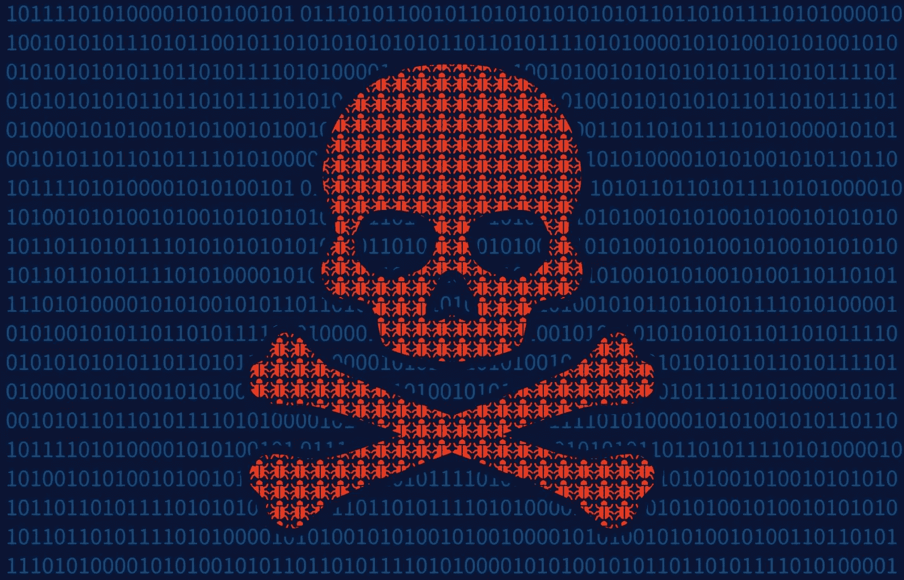

# 你如何保持你的 JavaScript 依赖关系是最新的？

> 原文：<https://www.sitepoint.com/keep-javascript-dependencies-up-to-date/>

这是我们最新的 JavaScript 时事通讯的社论，你可以[在这里](https://www.sitepoint.com/newsletter/)订阅。



最近，安全研究人员分析了 133，000 个网站中过时的 JavaScript 库。他们的发现发表在白皮书《你不应该依赖我:分析网络上过时的 JavaScript 库的使用》中，这并不能带来快乐的阅读。在被分析的网站中，37%加载了不安全的 JavaScript，要么直接加载，要么通过第三方服务加载，比如广告商。

这使我刮目相看。这些研究人员检查的库是 72 个最受欢迎的开源项目——像 Angular 和 jQuery 这样我们每天都在使用的库。我从未真正停下来思考过一个过时的 jQuery 版本是否会带来严重的安全威胁。而且我(几乎)肯定从来没有回去更新过我自己做的网站上的旧版本 jQuery。这是我应该做的事情吗？

## 我作为 L33t H4x0r 的职业生涯

所以，现在我很好奇，决定看看我是否可以使用一个过时的 jQuery 版本来破解我自己的一个页面。我开始搜索“jQuery 安全漏洞”，很快就在 jQuery 的 GitHub repo 上偶然发现了这个问题。人们指出这是一个潜在的[跨站脚本漏洞](https://en.wikipedia.org/wiki/Cross-site_scripting)，这意味着攻击者可以在请求的源头执行任意代码。这听起来很有希望…

这个问题很容易重现——问题是 jQuery 在执行一个`$.get()`请求时会执行收到的每一个`text/javascript`响应——但我的兴奋也就到此为止了。正如一位 jQuery 维护者在帖子中指出的，这种“利用”类似于通过`<script>`标签包含第三方代码。这不太可能让我的网站瘫痪，也不是黑客电影的素材。

## 第二点:一点会话劫持

不想被吓住，我想象如果这个漏洞成功了，我可以在用户的计算机上执行任意代码，我会做什么。我们经常被警告的一件事是[会话劫持](https://en.wikipedia.org/wiki/Session_hijacking)，恶意脚本可以操纵用户的 cookies 来获得对他们登录的信息或服务的未授权访问。所以，我想我应该尝试一下。

我首先试图打印出我登录的一个服务的 cookies(一个简单的 Rails 应用程序，它使用了[device gem](https://github.com/plataformatec/devise)进行认证)。我打开浏览器控制台，输入`document.cookie`,希望看到我的会话令牌返回，我可以出于各种恶意目的将它 ajax 发送到远程服务器……但不幸的是，这个命令只返回了一个空字符串。仔细检查后发现，Devise 使用了[http only cookies](https://www.troyhunt.com/c-is-for-cookie-h-is-for-hacker/)，无法通过 JavaScript 访问这些 cookie 来防止这种攻击。诅咒！事实证明，黑客比我希望的要难得多。

## 外面是一片丛林

好吧，事实证明我不是世界上最好的黑客，但是玩笑归玩笑，这里实际上是一片丛林！在过去的几年里，浏览器的安全性有了突飞猛进的发展(HTTPOnly cookies 就是一个很好的例子)，但是在线罪犯总是领先一两步。可能攻击的[列表](https://www.owasp.org/index.php/Category:Attack)似乎是无穷无尽的，当你构建更复杂的应用程序时，你使用的库将(不知不觉地)在你的代码库中引入漏洞。尽最大努力为这些库打补丁，或者至少意识到一些库是不安全的，这是有意义的，对吗？

我们最初的过时版本的 jQuery 应该不会太难更新，但是当应用程序开始增长时怎么办呢？幸运的是，有一些工具和服务可以帮助你。例如, [npm-check 包](https://www.npmjs.com/package/npm-check)做它在 tin 上所说的事情，并将检查过时的、不正确的和未使用的依赖项。它还会友好地提供一个软件包文档的链接，这样您就可以决定是否需要更新。还有一些服务，如 [Greenkeeper.io](https://greenkeeper.io/) 和 [Snyk](https://snyk.io/) 可以自动完成这一过程，但这些服务开始进入节点领域。

## 一杯上路

我还想分享一个技巧，它可以减轻第三方脚本带来的危险。这是为了使用子资源完整性(SRI)来验证第三方内容。如果您最近试图包含 jQuery CDN 中的 jQuery，您可能会遇到这种情况。您会看到类似这样的内容:

```
<script 
  src="https://code.jquery.com/jquery-3.2.1.min.js"
  integrity="sha256-hwg4gsxgFZhOsEEamdOYGBf13FyQuiTwlAQgxVSNgt4=" 
  crossorigin="anonymous"></script> 
```

这里的新特性是`<script>`标签上的`integrity`属性，它可以用来指定您请求浏览器获取的资源的 base64 编码的加密哈希。这有效地允许浏览器确保托管在第三方服务器上的资源没有被篡改。

使用 SRI 现在是推荐的最佳实践。您可以使用 [SRI 散列生成器](https://www.srihash.org/)来创建您自己的散列。

## 结论

保持应用程序的 JavaScript 依赖关系最新只是更大的安全难题中的一小部分。对于小项目来说，这可能并不代表太多的努力，但是随着项目开始增长，确保项目的所有依赖关系都得到充分修补所涉及的时间和努力也会增加。我认为这是一个重要的话题，但却很少被报道——当谈到安装 JavaScript 库和模块时，我们都倾向于忘记。

但是你怎么看？你有多重视让事情保持最新？你的网站会是 37%加载不安全的 JavaScript 之一吗？这对我们整个行业来说是个多大的问题？请在下面的评论中告诉我。

## 分享这篇文章