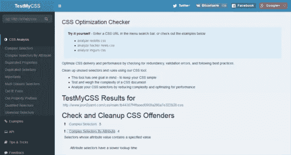
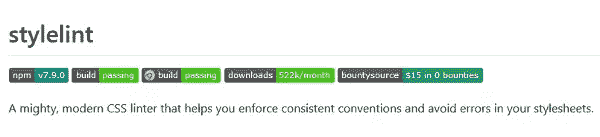
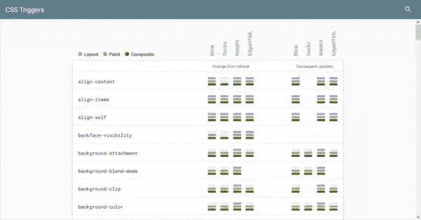
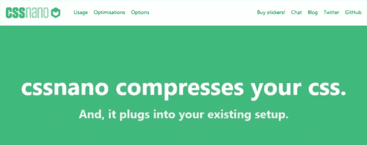
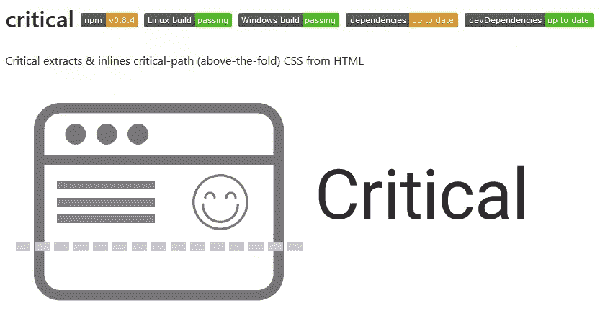

# 五个 CSS 性能工具加速你的网站

> 原文：<https://www.sitepoint.com/five-css-performance-tools-speed-website/>

*本文是与 [SiteGround](https://www.siteground.com/go/css-performance) 合作创作的系列文章的一部分。感谢您对使 SitePoint 成为可能的合作伙伴的支持。*

在这篇文章中，我将列出五个 CSS 性能工具，它们将帮助你把你的网站放在一个快速加载体验的 CSS 食谱上。

## 为什么页面速度如此重要？

一个快速加载的网站对你网站的成功至关重要。有研究发现支持这样的观点:如果用户不得不等待网页内容出现，哪怕只有几秒钟，他们也会很快变得不耐烦。

当这种情况发生在你的网站上时，他们的体验会明显下降，结果是你的网站访问量和转化率会减少，这最终会损害你的业务。

有许多因素会影响 web 性能，例如 HTTP 请求的数量、臃肿的代码、大量的媒体文件等。你如何编写 CSS 以及你的样式表如何在浏览器中加载，对这宝贵的几毫秒时间有着重要的影响，这决定了访问者是停留在你的网站上还是点击进入你的网站。

让我们看看下面的工具是如何帮助你的 CSS 达到顶级的网络性能的。

## TestMyCSS

TestMyCSS 是一款免费的在线优化工具，拥有大量功能。它检查**冗余**、**验证错误**、**未使用的 CSS** ，以及**最佳实践**。

你可以马上开始使用它，只需输入一个网站的 CSS 文件的 url，TestMyCSS 就会吐出所有需要改进的项目。不仅如此，您还可以找到有用的提示

*   如何简化复杂的选择器
*   你需要去掉重复的 CSS 属性和选择器
*   代码中出现的`!important`声明的数量
*   不必要的类别特异性
*   不必要的 IE 修复
*   不再需要厂商前缀的前缀 CSS 属性
*   用标记名限定的类或 ID 规则，例如`a.primary-link`
*   通用选择器使用不当。

## Stylelint

Stylelint 是一个雄心勃勃的 CSS linter，它与 PostCSS(一个开源工具，用于编写最先进的 CSS)一起使用[。linter 是一个检查你的代码并捕捉任何潜在错误的程序。](http://postcss.org/)

Stylelint 罐

*   标记诸如打字错误、无效的十六进制颜色、重复的选择器等错误。
*   实施最佳实践
*   强制执行编码风格约定，如每个 CSS 规则中的一致间距等。
*   为最新的 CSS 语法提供支持
*   使用格式化 CSS 规则的工具 [stylefmt](https://github.com/morishitter/stylefmt) 自动修复一些小警告…

…以及更多。

Stylelint 非常通用，您可以将它与

*   Stylelint CLI(命令行界面)
*   你选择的构建工具的插件，例如，webpack，gulp 等。
*   为您选择的文本编辑器提供插件，例如 Atom、Sublime Text 等。
*   Stylelint 节点 API
*   The Stylelint PostCSS plugin.

你可以在 Stylelint [用户指南](https://github.com/stylelint/stylelint/blob/master/docs/user-guide.md)和[开发者指南](https://github.com/stylelint/stylelint/blob/master/docs/developer-guide.md)中找到更多关于如何开始的细节。

## CSS 触发器

[CSS Triggers](https://csstriggers.com/) 是一个在线资源，它会告诉你哪些 CSS 属性会导致在哪些浏览器中进行布局、绘制和合成操作。这些是浏览器在呈现网页时执行的过程。

特别是:

*   **布局**:浏览器生成每个元素的几何图形和位置
*   **绘制**:浏览器将每个元素的像素解析成[层](https://www.html5rocks.com/en/tutorials/speed/layers/)
*   **复合**:浏览器在屏幕上绘制图层。

如果你在网上制作动画元素，这些信息尤其珍贵。浏览器执行复合操作的成本最低。如果你的 CSS 代码动画属性反复触发布局和绘画操作，它将很难坚持 60fps(每秒帧数)，这是一个流畅的网络动画的关键数字。

## cssnano

当您认为 CSS 处于页面呈现过程的关键路径上时，使用精简且结构良好的样式表文档就变得非常重要。换句话说，默认情况下，浏览器会延迟网页的呈现，直到样式表被加载、解析和执行。因此，如果你的 CSS 文档又大又乱，访问者很可能要等一会儿才能浏览你网站上的内容。

[cssnano](https://github.com/ben-eb/cssnano) 是为 [PostCSS](https://github.com/postcss/postcss) 开发的 CSS 优化和缩小插件。特别是，

> cssnano 会将您精心格式化的 CSS 进行多次优化，以确保最终结果在生产环境中尽可能小。

这个工具有大量的功能，要找到它能为你做的所有事情，请访问 cssnano 网站。

## 批评的

[Critical](https://github.com/addyosmani/critical) 是我在上一节提到的用 CSS 解决关键路径问题的另一个工具。

在 [PageSpeed Insights](https://developers.google.com/web/fundamentals/performance/critical-rendering-path/page-speed-rules-and-recommendations) 的规则和建议中，你会找到这个提示:

> 为了获得最佳性能，您可能需要考虑将关键的 CSS 直接内联到 HTML 文档中。这消除了关键路径中的额外往返…
> 
> 伊利亚·格里戈利克在谷歌开发者博客上。

这个想法是寻找关键的 CSS 规则，并将这些规则放在 HTML 文档的`<head>`部分。至于你认为什么是*关键的 CSS* ，普遍的共识是，任何用于设计基本布局和排版的规则，以及你的网站的内容都是很好的选择。

Critical 为您生成和内联关键路径 CSS，您可以将它与 Grunt 和 Gulp 一起使用。关于使用这个工具内联关键 CSS 的详细教程，不要错过 Asha Laxmi 的[如何以及为什么应该内联关键 CSS](https://www.sitepoint.com/how-and-why-you-should-inline-your-critical-css/) 。

## 结论

在本文中，我强调了快速加载网站的重要性，以及臃肿的样式表意味着您的访问者可能需要等待内容出现在他们的屏幕上。我在这里列出的五个工具将使您的样式表更精简，更不容易出错，因此更容易被浏览器加载和解析。

你用什么来控制 CSS 膨胀？请在下面的评论中告诉我。

## 分享这篇文章