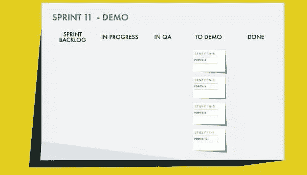
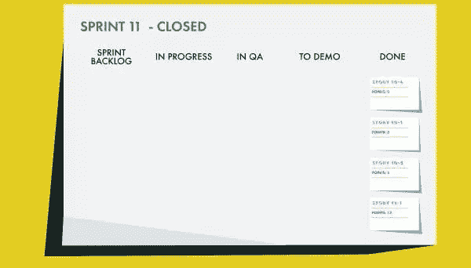

# Scrum:遍历一个故事(第 3 部分)

> 原文：<https://www.sitepoint.com/scrum-walking-story-part-3/>

以下是摘自我们的书《Scrum:新手到忍者，作者是 M. David Green。世界各地的商店都有出售，或者你可以在这里买到电子书。

### 展示故事

在演示的前一天，作为准备工作的一部分，[产品负责人](https://www.sitepoint.com/premium/books/the-lean-product-playbook/)和负责小狗故事的初级工程师坐在一起。在 sprint 期间，他们已经对各种组件进行了多次检查，但是产品负责人希望确保所有的验收标准都能够得到证明。

“我们能及时在生产就绪型服务器上进行演示吗？”产品负责人问。

“差不多，”工程师回答。“这是 QA 一直在测试的服务器。对演示来说应该没问题。”

“我需要知道什么特别的吗，”产品负责人说，“或者我可以直接去我们现在使用的同一台服务器吗？”

“我们不需要定制任何东西，”工程师回答道。“我想你已经看过这些组件几次了。一旦部署完成，您应该能够加入测试版，测试功能，然后成功退出测试版。”

"我现在能把整件事看一遍吗？"产品负责人问。

“还没有，”工程师回答，“但是 QA 已经通过了一切，所以我们只需要在明天之前完成部署。它应该会在演示时准备好。”

“太好了，我很期待看到它，”产品负责人说。

#### 检查验收标准

在演示会上，每个人都出席了，包括质量保证工程师和设计小狗故事的设计师。人们很好奇这件事会如何发展。scrum 板显示了 sprint 正在进行的所有准备演示的故事:

图 8.6。Sprint 11 准备演示

#### 注意:任务发生了什么变化？

小狗故事中的所有任务都不再相关，因此在演示版的 scrum 板上都被隐藏了。一旦一个故事已经完成，对于产品负责人来说，完成它需要什么并不重要，重要的是整个故事是否满足所有的验收标准。为了团队的利益，单独定义的任务仍然被存储，以备以后需要时参考。

产品负责人做的第一件事是验证从之前的 sprint 延续下来的故事现在已经完成了。完成这些并验证所有的验收标准都已满足之后，是时候展示在 sprint 期间花费了大部分时间的大故事了。

“那么，我如何进入测试版？”产品负责人问。

“你应该有一封邀请邮件的样本，里面有加入测试版的链接，”负责这个故事的初级工程师回答道。"检查您的收件箱，并点击链接开始."

产品负责人检查电子邮件，并确认它与提供的文本相匹配。看起来很基础，但确实符合验收标准。设计师开始做笔记。

单击电子邮件中的链接会弹出一个带有邀请消息的自定义登录页面，该页面也符合接受标准。点击接受按钮后，产品所有者登录，并开始在网站的小狗友好版本中导航。

页面顶部显示了警报标题，就像在故事的验收标准中定义的那样。“到目前为止看起来相当不错，”产品负责人说。

“我们不得不在标题的格式上做一些改动，以适应帮助集成，”一位工程师指出。“我认为这个解决方案并不理想，但它确实完成了任务。”

“是啊，我们现在就去看看，”产品负责人说。点击几下，屏幕就会显示网站上的帮助页面。标题在这些页面上展开，揭示了标准帮助屏幕中没有包括的测试版的附加帮助主题。

这位工程师说:“这似乎是在屏幕上获取你需要的信息的最佳方式，人们可能会期望在屏幕上找到这些信息。”。“如果我们有时间进行完整的重构，我们可以直接将它集成到帮助主题中，但我们没有时间以现有的方式对代码进行重构。”

“这看起来不太好，但我明白你的想法，”产品负责人说。

“我认为我们可以想出一些更优雅的方式来做到这一点，”设计师在房间的后面说。"我可以画一些草图。"

“那太好了，”产品负责人说。“我真的不想这样发出去。”

“但确实符合验收标准，对吧？”scrum 主管确认。

“是啊，”产品负责人表示同意。“所以如果我们真的想更新视觉设计，这将是下一个 sprint 的新故事，对吗？”

“听起来就是这样，”scrum 大师说。

在回顾了其余的特性，并仔细检查了所有的验收标准之后，产品负责人发现了许多有待改进的地方。该团队在视觉布局上做了一些权宜的选择，以便将所有的功能放在适当的位置。

并非所有的界面选项都在设计方案中指定，有些功能超出了现有风格指南的范围。设计师现在记笔记，并与产品负责人确认，他们将在演示后检查这些问题，讨论接下来需要做什么。

但是尽管视觉上不够精确，所有的框都被选中了。为了 scrum 过程，团队可以认为故事已经完成，即使它还没有准备好发布。所以 scrum master 更新了 scrum 板上的故事，并将状态设置为 done。这将更新点数，将故事的所有点数添加到 sprint 的总点数中。

在 sprint 11 结束时，团队已经完成了 sprint backlog 中的所有 24 点，scrum 板看起来像这样:

图 8.7。冲刺 11 关闭

#### 冲刺回顾

演示完成后，sprint 关闭，团队坐下来和 scrum master 一起回顾 sprint。重点是让人们谈论他们认为在最后冲刺阶段做得好的地方，他们本可以做得更好的地方，以及他们认为他们应该对未来的过程做出什么改变。

“我认为有一件事做得非常好，那就是有机会从头到尾跟踪这个大故事，”负责小狗故事的初级工程师说。“这给了我一个很好的机会，从上到下观察我们的建筑是如何工作的。”

“你在这方面做得非常好，”参与这个故事的工程师说。“我也了解了一些我以前不知道的关于我们自己的建筑的事情。那里有一些非常乱的东西。”

“是啊，”另一位工程师说，“这是我认为不太顺利的事情之一。我真的认为我们应该有机会在尝试构建这一切之前进行重构。”

“我同意，”第二个工程师说。“但现在至少我们知道一些混乱在哪里，所以我们知道首先关注什么。”

第三位工程师说，“如果我能先潜入水中修理这些东西，事情会简单得多。”“我已经知道它的大部分在哪里，但我仍然很困扰，我们倒过来做了。”

“至少现在你不是唯一知道的人，”第二个工程师指出。

“是的，但是听起来好像我们也没有机会在这个冲刺阶段进行重构了，”第三个工程师说，听起来很冷酷。

“我也是这么觉得的，”第四个工程师插嘴道。“他们将坚持在故事中首先完成测试版的设计变更。”

“我们可能会有一些设计故事来修正测试版的视觉效果，”scrum master 说。“但产品负责人确实同意给我们时间，如果我们完成了这个故事，重构将是重中之重，我们做到了。我会在规划会议前跟进，以确保万无一失。”

“嗯，有一件事，”第三个工程师说，“我想仔细检查一下这些新设计，确保在我们评估它们之前，它们确实是最终的。”

"我们应该把它作为下一次冲刺的另一个目标吗？"scrum 主管问道。

房间里的工程师们点头。在回顾的最后，他们提出了一个简短的清单，列出了他们想要对流程进行的改进，以及 scrum master 需要与产品负责人一起跟进的几项任务。

每个人都同意的两点是，跨整个堆栈工作令人沮丧，但对于暴露代码中需要修复的问题也很有用，下一个 sprint 的优先任务应该是解决这些问题。不管怎样，这将会是一个有趣的进入下一个冲刺阶段的计划会议。

#### 摘要

我们从 scrum 中学到的一件事是，它不能给你想要的团队，但是它可以帮助你优化现有的资源，并支持他们有效地合作。在这一章中，我们已经了解了一个面临挑战的团队是如何处理一个新故事的，这个故事扩展了他们的资源。

*   我们看到了团队是如何组织工作的，以及如何将一个大故事分解成工程任务，以便可以并行开发。
*   我们看到团队遇到了验收标准的问题，并从产品负责人那里得到了关于如何在冲刺阶段解决这些问题的反馈。
*   我们看到了演示期间出现的妥协，以及它们如何导致对即将到来的 sprint 的预期的修改。
*   然后，我们听团队在回顾会上讨论他们关注的问题，讨论哪些进展顺利，哪些可以做得更好，以及他们希望在下一次冲刺中看到什么。

所有这些都隐含着 scrum 背后的协作透明和自我管理的哲学。在下一章，我们将讨论如何让 scrum 为你的团队工作。我们将讨论如何向组织介绍 scrum 的概念，需要什么资源来支持 scrum，以及如何解决在学习应用 scrum 时可能出现的一些反模式。

## 分享这篇文章