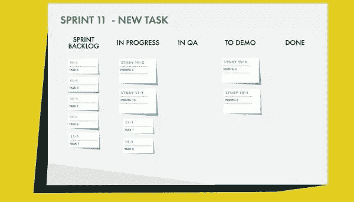

# Scrum:完成一个故事(第 2 部分)

> 原文：<https://www.sitepoint.com/scrum-working-through-a-story-part-2/>

以下是摘自我们的书《Scrum:新手到忍者，作者是 M. David Green。世界各地的商店都有出售，或者你可以在这里买到电子书。

### 第二站

在冲刺的第二天，[产品负责人](https://www.sitepoint.com/premium/books/the-lean-product-playbook/)和 QA 工程师都再次参加 standup。所有的工程师都在场，没有人对他们正在做的故事有任何阻碍。当 scrum master 正要解散团队时，一个工程师站了出来。

“我有一个简短的问题，关于这个小狗的故事将如何与网站上的帮助页面一起工作，”工程师说。“昨晚我一直在想这个问题，如果帮助页面上没有任何东西解释什么是测试版，以及如何回到正规网站，测试版的人会感到困惑。”

“这是一个很好的观点，”产品负责人说。"你认为我们可以用定制页眉的计划来处理这件事吗？"

“我不确定，”工程师说。"标题目前没有被构造成在帮助页面上以不同的方式显示."

“你认为这很容易添加吗？”产品负责人问。

“我不指望它，”另一位工程师说。站点的结构方式是，帮助页面与其余内容分开提供

“没错，”第一个工程师说。“这将是一个棘手的问题。”

“我们需要整个团队都在这里吗？”scrum master 问道，打断了谈话，“或者我们可以离线吗？”

“我不知道，”产品负责人说。

“是的，我们可以让它离线，”第一个工程师回答。

“好的，很好，”scrum master 说。“那样的话，单口相声就结束了。”

当团队的其他成员回到他们的办公桌前继续他们的项目时，scrum master 走向产品负责人和两位工程师，他们正在讨论帮助页面。

“我们三个人应该现在讨论这个问题，还是以后再继续讨论这个问题？”scrum 主管问道。

“我想我知道问题出在哪里了，”产品负责人说。"我可以写一个故事，讲述我认为它应该如何运作。"

"我们要把它作为一个新故事添加进去吗？"scrum 主管问道。

“对我来说，这感觉像是范围蔓延，”第一位工程师说。

“不，我认为它包含在原始故事的接受标准中，”产品负责人说。“这些是网站上的页面，它们需要像网站上的任何其他页面一样进行处理。”

“让我们检查一下验收标准，确保万无一失，”scrum master 说。

他们四个人一起走到电脑前，拉起 scrum 板，看一看团队估计的故事的接受标准。事实上，验收标准确实说，为了支持 puppy 站点的 beta 用户，标题中的更改需要适应站点上的所有页面，而不区分帮助页面。

“嗯，这将是一个棘手的问题，”第一个工程师说。

“一旦我们从产品所有者那里获得了更新的文本，我们还需要关于如何实施的任何进一步的细节吗？”scrum 主管问道。“或者你们中的一个人可以负责写下规格，并将这项任务添加到董事会？”

“我能做到，”第一个工程师有点沮丧地说。“但它确实让人感觉，这可能会给故事增添比我们预期更多的努力。”

“是啊，”第二个工程师同意。“我认为我们对这一点的估计不够。”

“嗯，我们现在不能改变分数估计，”scrum master 说。“只是另一个数据点。我们必须尽我们所能。”

“这是否意味着你认为你无法在冲刺阶段结束前完成这个故事？”产品负责人问。

“我们得看看，”第一个工程师回答。

他们四个人盯着故事的接受标准看了一会儿。然后 scrum 主管问，“好了，我们都好了吗？不要忘记告诉故事所有者您正在添加的任务。”

他们都点点头，回到自己的工作岗位。几个小时后，接受这项任务的工程师将新任务添加到 scrum 板上，该板看起来像这样:

图 8.5。冲刺 11 新任务

### 剩下的冲刺

在 sprint 结束时，团队的大部分人都在讨论小狗的故事，但是其他的事情都没有完成。设计已经完成了前端用户体验和图像资产的流程，并与工程师合作以确保它们得到适当的集成。

当团队在处理代码时，QA 正在开发验证代码所必需的测试。QA 还会与产品负责人会面几次，以澄清验收标准。最终，每项任务都会从进行中状态变为演示状态。

#### 注意:使用第三个工程师进行代码审查

由于这个故事中的许多任务都是成对进行的，所以第三个工程师必须参与代码审查。不是每个团队都要求成对完成的代码由第三个工程师审查，但是这个团队已经把它作为他们对完成的定义的一部分。

尽管需要支持帮助页面，团队还是设法完成并审查了所有代码，直到他们满意为止。因为他们需要采用不同寻常的命名约定，以便将这段代码与站点的其他代码区分开来，所以在代码审查期间会出现一些混乱。这稍微拖慢了开发，但不足以阻止拥有故事所有权的初级工程师在 sprint 结束前将它交给 QA 进行最后检查。

对于这个团队来说，完成的定义包括代码审查和 QA，以及客户验收。因为 QA 从一开始就与团队整合在一起，所以他们在整个 sprint 中基于验收标准构建测试套件。

这个故事的大部分任务已经产生了经过评审的代码，这些代码可以在完成时进行独立的单元测试。现在，运行集成测试并验证特性从开始到结束都按照预期工作是一件简单的事情。如果故事被接受并推向生产，这些测试将被添加到站点的通用套件中。

## 分享这篇文章