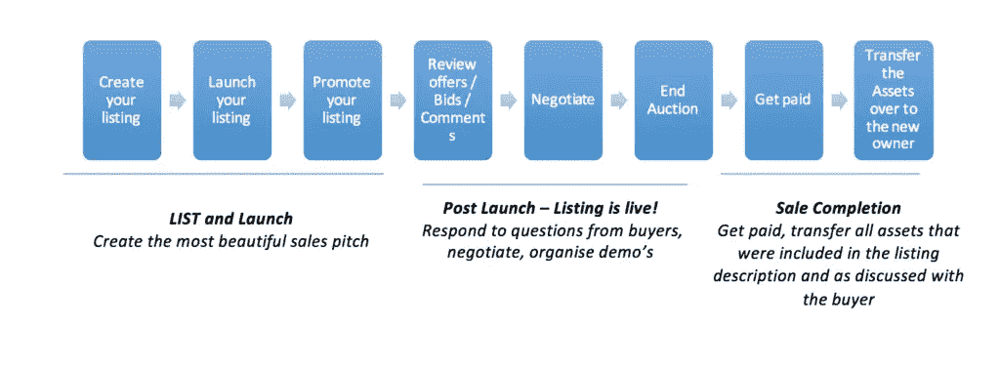

# 我的应用程序值多少钱，我如何销售它？

> 原文：<https://www.sitepoint.com/how-much-is-my-app-worth-and-how-do-i-sell-it/>

所以你已经建立了一个很棒的应用程序，它已经被从应用程序商店下载了无数次。恭喜你！但现在你想继续前进——你没有时间去维护它，一些其他项目在呼唤你，或者发生了其他事情，意味着你再也不能给它应有的爱。你是做什么的？

为什么不**卖了它**？

为什么不为你为开发这款应用并把客户群扩大到现在的水平所付出的努力获得回报，并让其他人给它带来未来繁荣所需的东西呢？

在 Flippa，我们多年来已经促成了数千个应用程序的销售，我们有数千个活跃的买家，他们可能正在寻找一个与您的应用程序一模一样的应用程序！

这篇文章的目的是与你分享这种体验的好处，帮助你更好地理解你的应用程序的价值以及你如何销售它。

## 我的应用值多少钱？

你的应用程序的价值是任何个人愿意支付的最大金额。如果你认为这不是很有帮助，我们还没有完成！请继续读下去。

### 估值类型#1:现金为王！

你以前听过这句话吗？对于应用估值来说，这当然是事实——虽然不是唯一的考虑因素，但你的净现金流可能是最重要的因素。

计算你的净现金流的唯一方法是合计你的应用程序产生的所有现金，并减去所有相关费用。产生的现金可能包括下载费。成本可能包括更新和维护应用程序的成本、许可成本、应用程序商店费用等。

一定要包括你所有的费用！例如，如果你作为所有者/开发者花费自己的时间来维护应用程序，这是一个新所有者需要承担的成本(要么用自己的时间，要么付钱给别人来做)，所以应该包括在内。

一旦你知道你的净现金流，下一步就是把它转化为你的应用的价值。欢迎来到使用倍数进行*估值的世界。密切关注——这将是你的朋友(有时也是你的敌人),无论你做什么买卖。*

假设你的应用程序每年产生 10 万美元的净现金流。“倍数”可能会因一系列因素而有很大差异，但是对于绝大多数应用程序来说，倍数大约是 2 到 3 倍。所以你的应用价值在 20 万到 30 万美元之间。不错吧？

影响您的倍数的因素包括:

*   *增长前景*:如果你的应用持续增长，并且仍处于上升轨道，并且有很多未来增长的机会，你可以期待更高的倍数
*   流派/利基:基于竞争、监管、增长前景(再次)和其他因素，一些被买家认为比其他更有价值
*   *成熟的营销策略*:你如何营销你的应用？这是可持续的吗？买家有什么机会投资并进一步增加客户获取量？
*   *时间承诺*:你在你的 app 上花了多少时间？(这在我们的买家中是个大问题)

### 估价类型#2:可比销售额！

这个很简单…类似的应用卖什么？

这里的诀窍是如何定义“相似”，一般来说，评估倍数的相同因素也适用于此——增长前景、类型/利基、营销策略、时间承诺——以及其他一些因素，如净现金流和每周/每月的下载次数。

你可以在这里看看最近的一些销售[。](https://flippa.com/apps/just-sold?sort_alias=highest_price)

请记住**每个企业都是不同的**，所以仅仅因为《愤怒的小鸟》卖了 1000 万美元并不意味着你的《愤怒的猫鼬》应用会卖同样的价钱！

这两种方法是我们平台上最常用的方法。它们不是评估一家企业的唯一两种方法，但是它们是一个很好的起点，我们强烈建议除了最大和最复杂的企业之外的所有企业都使用它们。

作为一个卖家，所有这些都与你期望买家为你的应用支付的费用有关。然而，重要的是要记住，你的应用程序的真正价值是任何个人愿意支付的最大金额。

## 我怎么卖？

你现在应该知道你的应用程序值多少钱，因此你愿意接受什么样的价格。从现在开始，一切都取决于你的销售技巧。

你的任务应该是获得最大的曝光率。你的列表曝光度越高，找到愿意为你的应用支付最高价格的买家的可能性就越大。

现在是时候[让 Flippa 参与进来](https://flippa.com/why-sell-on-flippa)了。Flippa 是买卖数字业务的头号市场。我们信誉卓著，已经进入市场好几年了。我们每个月都有超过一百万的访问量，我们的用户数据库有超过一百万的潜在买家和卖家。好的房源一般会很快被抢购一空，让我们的卖家和买家都很开心！

我们让销售过程变得非常简单，它是这样运作的:

### 通往最高倍数的道路规则

规则#1 :最重要的是要记住*不要误导*。这永远不会有好结果。最终，买家会发现，很可能你最终不会出售。

**规则#2** :如果从盈利的角度来看，你已经过了糟糕的几个月，*要诚实*。告诉买家发生了什么，你从中学到了什么，以及他们如何避免同样的情况。

**规则#3** :用*证据*支持你所有的主张(收入、成本和利润)！你不需要相信一个陌生人，他们也不需要相信你！

如果你准备好出售你的应用程序或者想开始你的研究，来看看 Flippa ，这是买卖网站和应用程序的头号市场。

销售愉快！

## 分享这篇文章