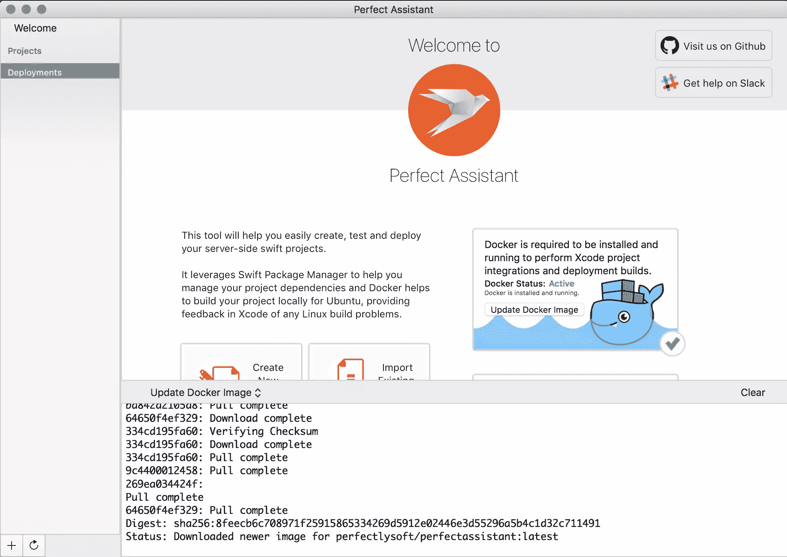
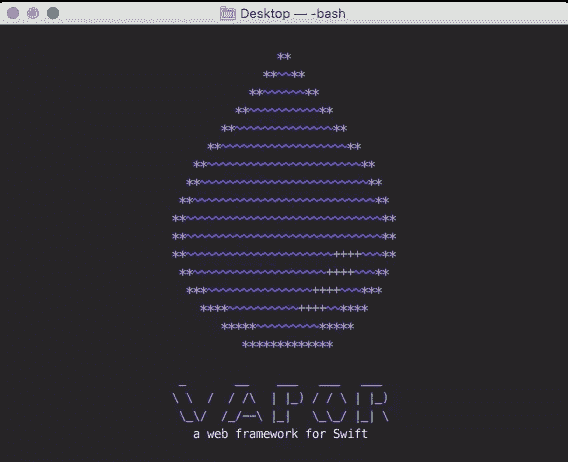

# 服务器端 Swift:Vapor 和 Perfect 的比较

> 原文：<https://www.sitepoint.com/server-side-swift-comparing-vapor-perfect/>

Swift 成为 web 开发领域主要参与者的原因之一是有各种高质量的框架来构建 web 应用。不是所有的框架都是平等的，也不是所有的框架*都觉得*是平等的。我在这里的目标是比较 Perfect 和 Vapor 的受欢迎程度、易用性、特性和社区；以便帮助您决定哪个框架适合您。

## 完美和蒸汽框架的背景

Vapor 得到了一家咨询公司的私人支持，Perfect 去年筹集了 150 万美元的种子资金。凭借 Perfect 在资历和数量上的社会立足点，可以说它是最受欢迎的。此外，Vapor 于 2016 年 9 月发布了第 1 版(在本出版物发布时已有四个月)，其受欢迎程度已经上升到在明星和公共活动中几乎与 Perfect 相匹配。受欢迎程度很难量化，所以这里是截至 2017 年 3 月的事实，我让你来决定:

### 完美的

*   在 GitHub 上有更多的明星(大约多 25%)
*   twitter 上有更多的关注者(大约 4.1 万到 1.4 万)
*   完美存在的时间更长(2016 年 10 月)
*   因为 Slack 中的噪音更少，核心团队对问题的反应更快

### 蒸汽

*   闲置用户数量增加(几乎翻倍)
*   贡献者多于完美者(71 比 36)
*   闲置渠道中的更多活动

## 社区氛围

对我来说，我用来衡量任何技术生存能力的最大标准之一是建造它的人的文化。如果你分析任何公司或技术项目背后的社区，你会发现一个共同的趋势:透明和友好的社区比封闭和粗暴的社区更成功。我决定加入到 Vapor 和 Perfect 的休闲裤中去，开始交谈。我发现 Vapor 周围是一个经验较少但开放的社区，Perfect 周围是一个高级但精英的社区。

### 蒸汽社区:充满活力、亲切而透明

开源软件(OSS)依赖于开放协作，Vapor 在这方面拥有任何 Swift 框架中最好的文化。该框架被授权为 MIT，这是人们可以分配给他们的项目的最慷慨和开放的许可证之一。他们还通过 GitHub 上的里程碑和问题支持公共路线图。这两点都允许来自社区的快速反馈循环和迭代。

我发现的一个反复出现的主题是 Vapor 是一个“有趣”的社区。随着 GitHub 上活跃的开放问题和拉请求，很明显 Vapor 关心包括社区的想法和意见。我与 Joannis、Matt 和 Tim 谈了一会儿，他们坦率地分享了他们的想法和意见。Joannis 对框架及其未来提出了很好的观点，并展示了对社区的奉献和关心。如果这些人是 Vapor 社区作为一个整体的准确样本，这预示着框架健康的未来。为了清晰起见，我编辑了原始记录:

> Vapor 开发者和社区非常开放。测试和文档都是一流的。显然，类型安全是 Vapor 的重要组成部分。他们做得很出色；比任何其他 web 框架都要好，甚至比大多数(如果不是全部的话)库都要好。Vapor 还有其他一些非常好的部分，比如 API。我认为一年前真正参与 SwiftX 项目的每个人都对这种模块化感兴趣。这是一个非常积极的观点。
> 
> —乔安妮斯

Vapor 社区以文化、协作和模块化而自豪。Vapor 自带了构建大多数典型 web 应用程序所需的所有工具。这支持快速应用程序开发(RAD)，这是 Rails 社区提出的一个概念。RAD 相信有一种正确的*和*简单的方法来扩展 web 应用程序；一个框架应该在惯例和特性上坚持己见，以帮助开发人员快速安全地创建富应用程序。RAD 原理已被 Laravel、Django 和 Vapor 采用。

> 我喜欢编写提供者或扩展框架如此简单。这里的社区为软件包做了大量的工作。
> 
> —马蒂亚斯·路德维希

### 完美的社区:经验丰富、成熟、多才多艺

我必须承认，在我研究的开始，由于 reddit 上一些令人讨厌的评论，我对 Perfect 有点偏见。虽然在完美社区中似乎仍然存在一些挥之不去的竞争和激烈的倾向，但创始人大多是中立的、有知识的和乐于助人的。过去社区之间的紧张关系似乎已经平息，现在双方似乎有了一些相互尊重。

> 我认为 Perfect 开始时很瘦，你在构建时添加组件 Vapor 开始时大得多，你需要去掉你不用的东西(如果你担心臃肿)。至少这是我对[蒸汽]的看法。这些可能是赞成或反对的，取决于你在寻找什么。
> 
> —凯尔·杰赛普

Perfect 的创始人在分享这个框架的缺点时非常简洁。该团队还反对开发人员将 Vapor 与此相提并论。总的来说，我觉得我在一个充满自我的聊天室里。说自我是好是坏，是一个视角的问题。

完美社区的一个怪癖是，他们不使用 GitHub 问题来跟踪 bug 或功能请求。在他们的自述文件中，他们透露他们更喜欢 JIRA，这需要你创建一个单独的账户。然而，尽管缺乏可公开跟踪的问题，他们确实通过他们专用的 Slack room 共享拉请求和协作的开放性。

> (我们)完全接受公众的贡献和反馈
> 
> —乔纳森

我逐渐意识到，每个社区都有极端分子，他们的观点和意见不一定反映整体。在我的一些谈话中，我确实发现完美开发者对 Vapor 有更多的敌意，而另一个部落似乎更有礼貌。然而，完美的社区可能有点道理。自负在其他社区中比比皆是，这在很大程度上归结于经验。

## 熟悉且易于使用

### 你好世界

以下是“Hello，World”Vapor 应用程序的外观:

```
let drop = Droplet()

drop.get("hello") { request in
    return "Hello, world!"
} 
```

我发现 Vapor 的 API 非常有表现力和简洁，同时抽象了很多。

下面是一个建立在完美基础上的示例“Hello，World ”:

```
var routes = Routes()
routes.add(method: .get, uris: ["/"], handler: indexHandler)

func indexHandler(request: HTTPRequest, _ response: HTTPResponse) {
  response.appendBody(string: "Hello world")
  response.completed()
} 
```

### 第一步

在处理任何新框架时，我认为最大的障碍是安装和配置时间。如果构建一个应用程序的过程需要很多步骤，那么你可能会因为太沮丧而无法继续下去。Vapor 和 Perfect 都有丰富的文档和示例。此外，根据您的观点，这两个框架的设置过程都很“简单”。

对于非常初级的 web 开发人员来说，Perfect 可能感觉更直观。*完美助手*将让您一键完成安装、设置和部署。如果这是您喜欢的，那么您应该对完整的 GUI 感到宾至如归。

如果你使用过其他框架，那么 Vapor 可能是你最喜欢的框架。它与其他流行的 web 框架非常相似，并且附带了一个 CLI 工具，使系统任务变得非常简单和容易。



从这两个角度来看，Perfect 开发完美助手的努力得到了“A”。该助手是一个本机 macOS 应用程序，允许您从 GUI 中创建和构建新项目。它们包含了样板模板，您可以从这些模板开始搭建，并为您处理大部分安装和配置工作。对于一个新的框架来说，设置的这种成熟度是很少见的。我为他们让完美变得容易投入的努力喝彩。



Vapor 在设置简易性方面也不落后。有人可能会说，对于一个更有经验的开发人员来说，他们的过程甚至更好。大多数高级开发人员更喜欢通过命令行来构建。这允许您观察构建过程，并且更有助于了解底层组件的内部工作方式。Vapor 构建了一个 CLI 程序来安装、设置和管理项目。尽管 Perfect 有一个不错的 GUI 助手，但安装和启动“Hello，World”应用程序的初始过程实际上比使用 Vapor 要长得多。我使用 Vapor 文档中的三个复制/粘贴步骤开始运行，每个步骤都优雅而简单。如果我必须根据我自己的教学和建筑经验选出一个赢家，对我来说最明显的赢家是 Vapor。

## 基准

当谈到基准测试时，Perfect 和 Vapor 之间开始出现更大的差距。它们可能揭示核心的缺点，这些缺点可能在生产中被证明是有问题的。类似于内核加固，如果一个框架的核心没有尽可能地细化，那么扩展该框架的模块将开始增加性能问题。Ryan Collins 做了一些很棒的研究，比较了 Perfect 和 Vapor 在 macOS 和 Linux 上的性能。

Ryan 报告说，在 Mac 上，Perfect 几乎在所有方面都优于 Vapor。Perfect 有更好的构建时间、内存使用、线程使用、每秒请求数和延迟。

## 包扎

在高层次上，我可以总结如下: **Vapor 最适合快速应用程序开发，而 Perfect 最适合构建高性能应用程序。**这两个框架在大多数定性方面几乎势均力敌:受欢迎程度、社区支持以及“赢得”服务器端 Swift 未来的承诺。

# 进一步阅读和资料来源

*   [蒸汽框架](https://GitHub.com/vapor/vapor)
*   [完善的框架](https://GitHub.com/PerfectlySoft/Perfect/)
*   [Linux 上的服务器端 Swift](https://medium.com/@rymcol/linux-ubuntu-benchmarks-for-server-side-swift-vs-node-js-db52b9f8270b#.ih8nxnewj)
*   [Mac 上的服务器端 Swift](https://medium.com/@rymcol/benchmarks-for-the-top-server-side-swift-frameworks-vs-node-js-24460cfe0beb#.kukahiqnu)
*   [完美筹集了 150 万美元的种子资金](https://www.pehub.com/canada/2016/8/perfectlysoft-raises-additional-1-5-mln-in-seed-funding)
*   超级壮观的服务器端 Swift！

## 分享这篇文章