# 如何用草图和视觉传递设计

> 原文：<https://www.sitepoint.com/how-to-handoff-designs-with-sketch-and-invision/>

设计移交是指将网页或应用程序的设计从设计者手中转移到开发人员手中，然后开发人员将对其进行编码。这并不总是容易的。开发人员通常不使用像 Photoshop 或 Sketch 这样的设计软件，但他们仍然需要了解设计的一切。

具体使用了什么颜色？哪些字体？这个元素和那个元素之间有多少空间？

开发者需要知道。进入**检查**，通过视觉。

### 为什么视觉现在是设计师的梦想

InVision App 最初是一个基于浏览器的原型开发工具，拥有一系列非常有用的协作工具。这对设计师来说是一个游戏规则的改变。去年，InVision 团队发布了 Photoshop 和 Sketch 的附加软件 [Craft](https://www.invisionapp.com/craft) ，它最初使设计师能够:

*   快速将真实数据添加到他们的设计中
*   水平和垂直复制对象
*   创建资源和样式的共享库

一段时间后，他们增加了以下功能:

*   原型用户直接在草图中流动
*   将您的可导出资产同步到 Vision

现在，您可以将您的设计同步到 Vision 中，开发人员可以检查它们(并从中生成真正的代码)。原型制作、协作、设计移交——这个循环现在已经完成，所有这些都在一个订阅下完成。设计师的梦想，对吗？

如果你不太熟悉 Craft，这里有一个关于每个 Craft 特性实际上做什么的纲要。如果您已经熟悉，请继续阅读，我们将探索一个扩展的工作流程，在该流程中，我们使用 Sketch、Craft 和 InVision Inspect 将设计交给开发人员。

## 安装工艺

在我们开始之前，[下载 Craft](https://www.invisionapp.com/craft) for Sketch (Photoshop 用户应该也能跟上，但本教程将使用截图中的 Sketch)并下载 [Android N GUI 套件](https://www.sketchappsources.com/free-source/2038-android-n-gui-kit-sketch-freebie-resource.html)。DeveloperTown 的草图文件。

在你为草图安装了 Craft 之后，你将能够使用**命令+ P** 来切换 Craft 工具栏。

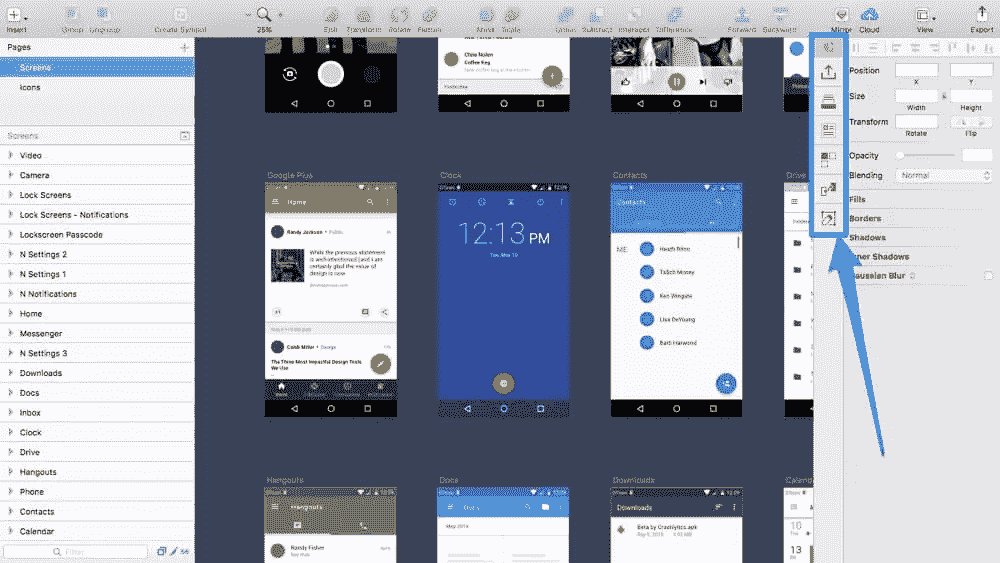

## 组织您的图层

但是在我们开始匆忙交付我们的设计之前，我们首先必须组织它。记住:开发人员可能手头没有 Sketch 的设计工具，但他们仍然像*和*一样看待设计——这意味着我们必须将模糊命名的图层(如“矩形 41 ”)重命名为“按钮背景”,并删除多余/未使用的图层。

以下是你需要知道的速写键盘快捷键:

*   重命名:**命令+ R**
*   组:**命令+ G**
*   *Un * group:**command+shift+G
*   移动图层↑: **command + option + ↑**
*   移动图层↓: **command + option + ↑**

上下移动层意味着我们可以按照它们在设计中出现的顺序排列它们(或者任何你的开发人员觉得更符合逻辑的格式)，将相关的层组合在一起可以使层列表看起来更整洁、更有组织。

## 标记您的出口商品

接下来，我们需要将图像资产标记为可导出。即使我们实际上没有手动导出它们，我们也需要告诉 Craft 我们希望将哪些同步到 InVision(这是开发人员找到图像资产、字体甚至源文件的地方)。

像往常一样，选择您想要导出为图像资源的对象，然后在检查器中点按“可导出”，指定文件格式和分辨率。

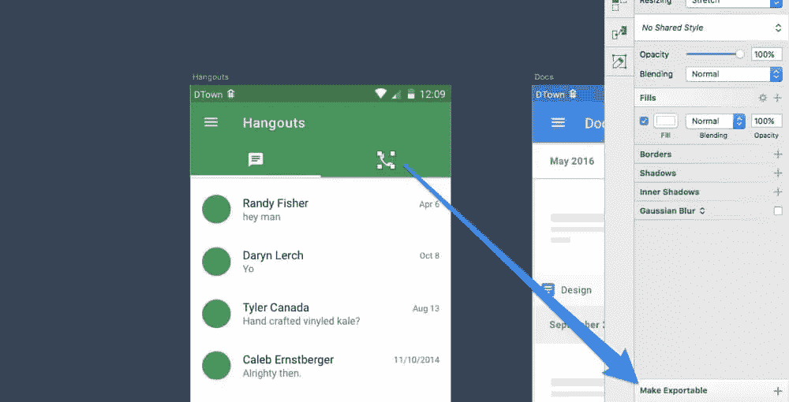

## 记录常见颜色

任何保存在 Sketch 中的*文档颜色*都将随着您的设计迁移到检查中——选择一个具有您想要记录的颜色的图层，从检查器中打开拾色器，然后单击小小的 **+** 图标来保存颜色。

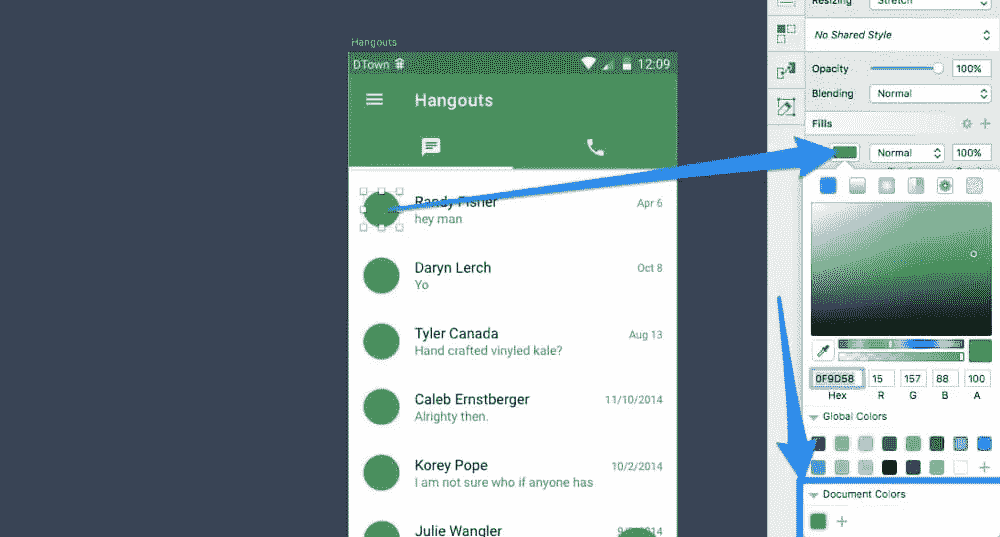

## 使用 Craft Sync 导出到 Vision

现在我们需要将我们有组织的、有颜色记录的设计同步到 Vision 中，这样开发者就可以检查和实现它，但首先我们需要先在 Vision 中创建一个新的原型。

### 开始新的 Vision 项目

*   前往 invisionapp.com
*   点击圆形、粉红色的 **+** 图标(如下图所示)

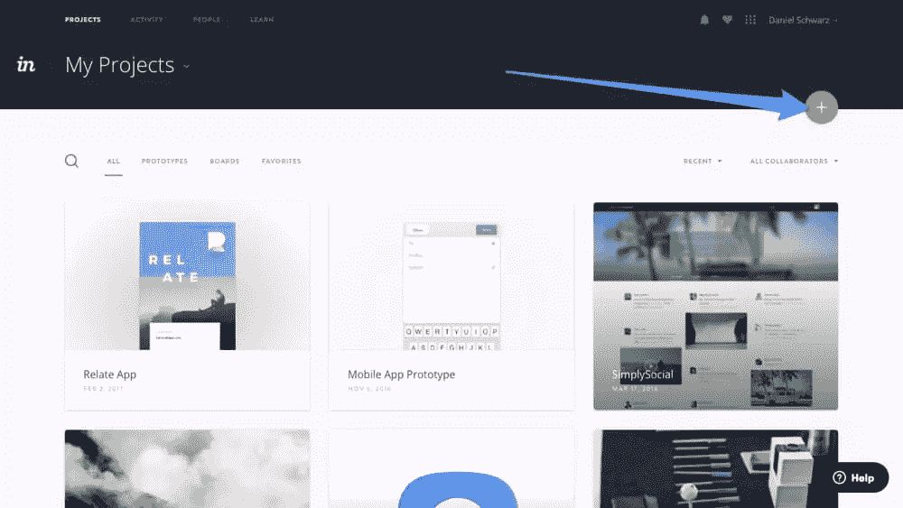

*   点击“创建新原型”

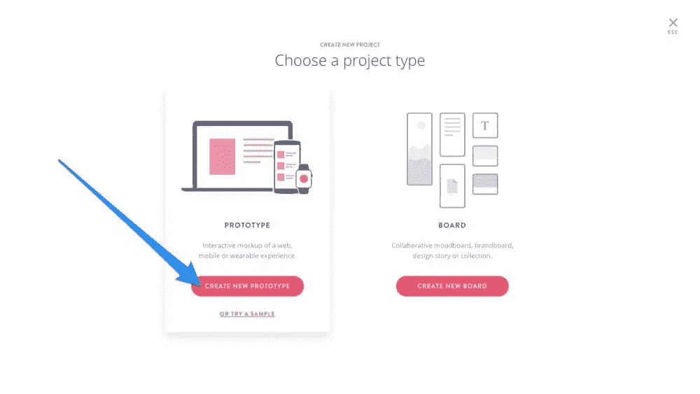

*   为项目命名
*   从选项列表中选择“Android 手机”
*   点击“开始”

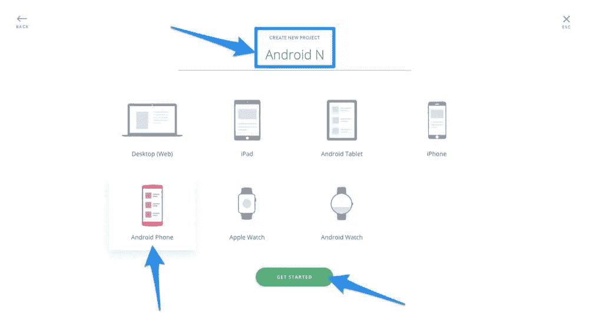

### 将屏幕导出到您的 Vision 项目

回到草图，点击工艺工具栏中的*同步*标签。这里我们需要指定几个选项，然后我们就可以第一次同步了。选择所有屏幕画板后，选择“仅选定的画板”(即，不是标题为“Android”的促销背景画板)。

最后，从选择框中选择您的原型。

点击“同步到视觉”。如果您需要进行更多的更改，有两个键盘快捷键可以帮助您:

*   *仅选定画板* : **control + shift + S**
*   *活动页面上的所有画板* : **control + shift + A**

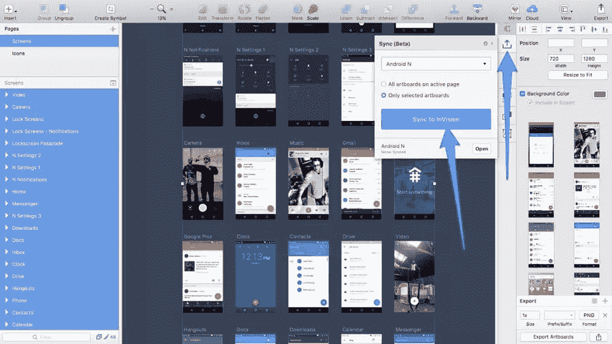

## 检查设计

现在让我们回到 InVision 应用程序，在这里，我们的设计将对检查它的开发人员免费开放。

*   从“屏幕”选项卡中，选择一个屏幕

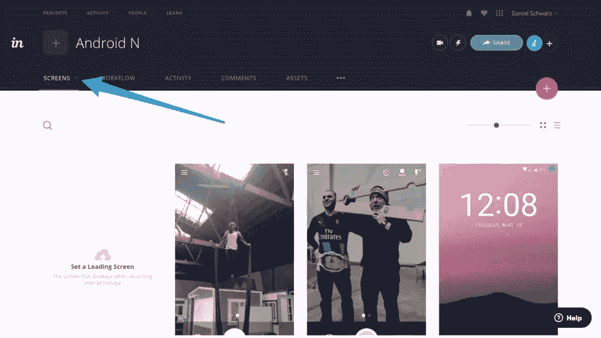

*   切换到“检查模式”。

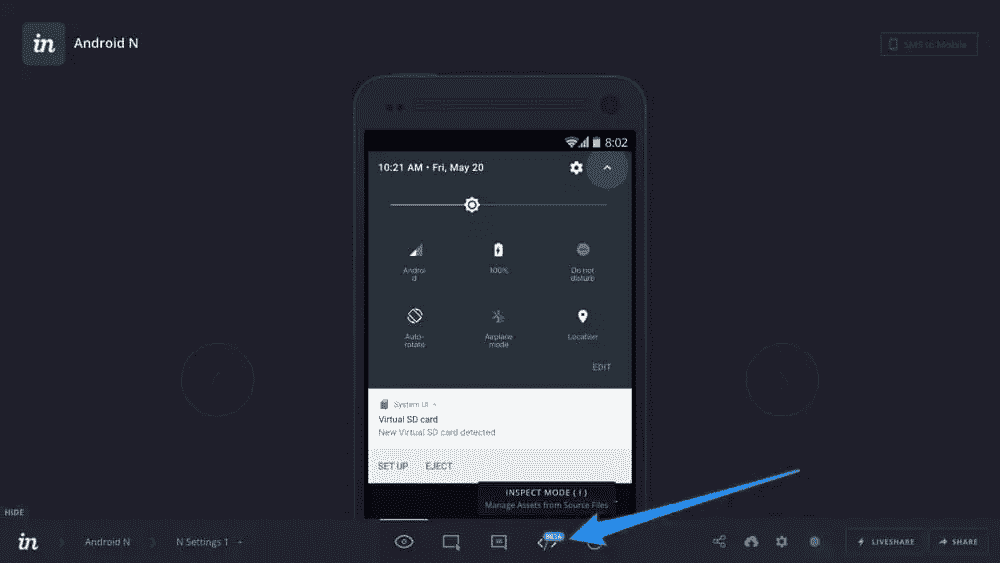

### 熟悉检查模式

也许你会想到的第一件事是:“嘿，这是*就像是*素描！”。嗯，有点像。左边是图层列表，右边是检查器，如果你点击一个图层，智能向导就会出现——唯一的区别是界面稍微优化了一下，适合检查设计。我们来调查一下。

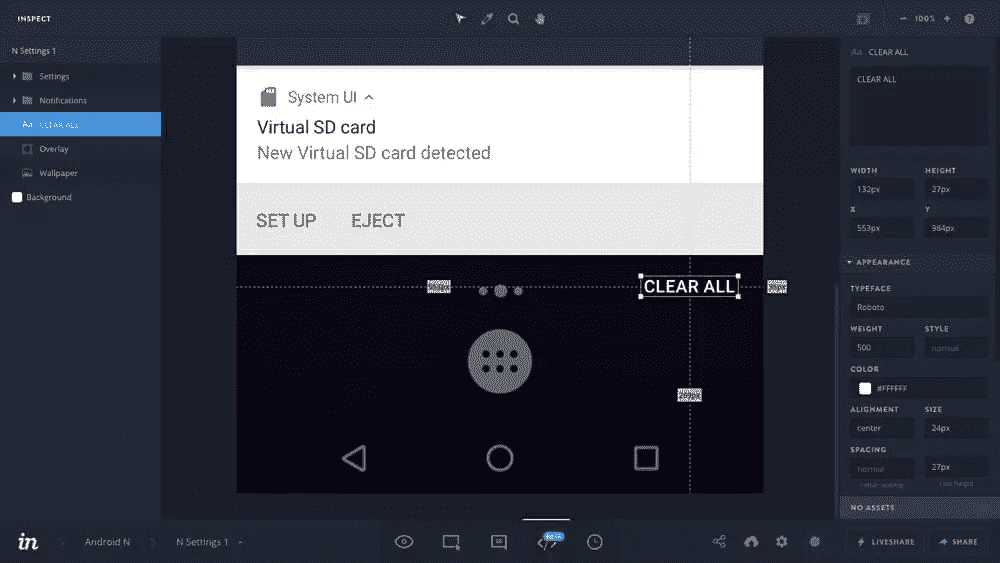

### 提取样式和内容

当你点击检查器中的一个样式时，它会被自动复制到剪贴板，然后开发者会在他们的代码中使用这个样式。开发人员还可以从文本层中提取内容，只需一次单击！

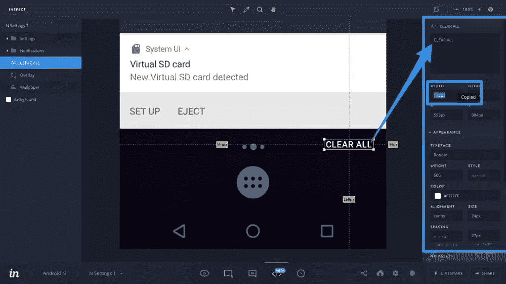

提示:开发者也可以提取样式作为 CSS 代码。

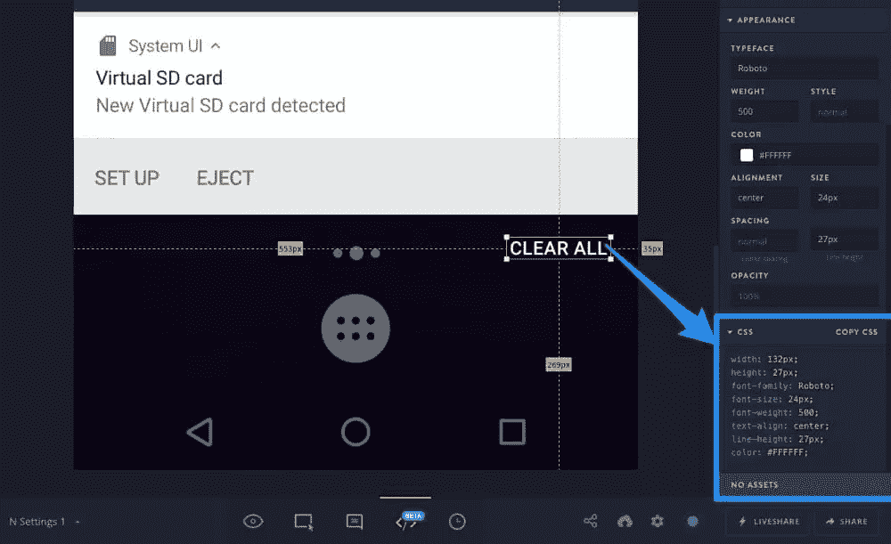

### 下载图像资产

还记得我们在 Sketch 中标记为可导出的图像资源吗？开发人员可以通过点击设计中的图像，然后点击检查器中的下载图标来下载。或者，可以从右上角的*下载所有项目资产*图标下载所有资产(这将是一个压缩的。来自当前屏幕的所有资产的 zip 文件，以及原型中所有的*和其他*屏幕)。

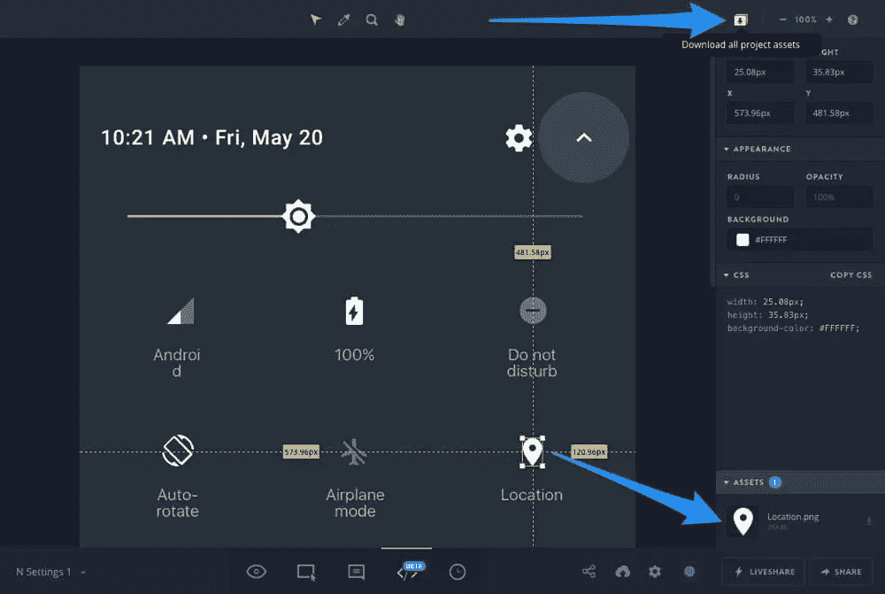

### 概述颜色和字体

如果您从一个层上移开焦点(单击屏幕区域之外的画布上的任何地方)，检查器将显示此屏幕中使用的所有颜色的概述，以及使用的字体和我们前面指定的那些文档颜色。

像往常一样，开发人员只需要点击和复制。

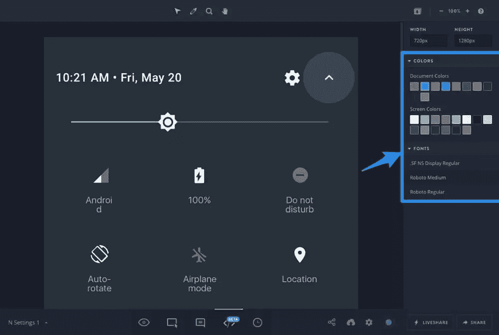

## 结论

InVision 是一个游戏改变者，特别是对于大型团队来说，在没有任何协作和责任的情况下，设计会很快变得一团糟。Inspect 有助于设计人员和开发人员之间的沟通，让工作流程更加顺畅。

有兴趣了解更多关于草图、视觉和工艺的原型制作吗？我最近与 InVision 合作创建了一个免费的电子书,里面充满了技巧和教程，教你如何使用整个工艺套件。

## 分享这篇文章