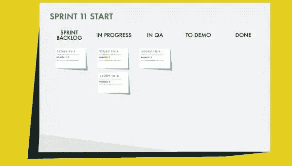
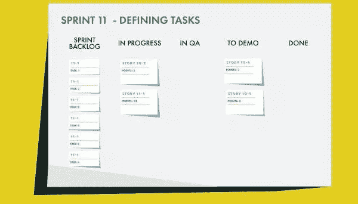
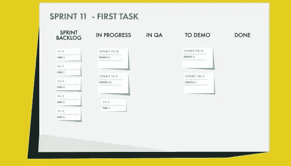
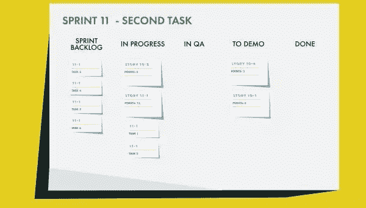

# Scrum:完成一个故事(第 1 部分)

> 原文：<https://www.sitepoint.com/scrum-working-through-a-story-part-1/>

以下是摘自我们的书《Scrum:新手到忍者，作者是 M. David Green。世界各地的商店都有出售，或者你可以在这里买到电子书。

在最后一章中，我们被介绍到了产品负责人的世界，并经历了为团队开发和创建故事的过程。我们看到了需求是如何收集的，产品 backlog 是如何建立的，以及内部和外部客户的期望，以及其他相关方，是如何转化为团队的清晰定义的 scrum 故事的。

然后我们经历了这个过程，看看故事是如何被引入团队的，以及团队是如何评估它们的。我们看着团队与产品负责人协商，以确保他们要做的事情是有意义的，并且能够在 sprint 内完成。

现在是时候通过 sprint 来追踪这个故事了。在这一章中，我们将会看到团队是如何将一个像我们一直在讨论的那样的大故事分成小任务，并将这些任务分配出去，以便它们都可以被处理和完成。我们将会看到故事的各个方面是如何被处理的，直到它们符合“完成”的定义。

最后，我们将看到团队与产品负责人一起完成演示过程，如果运气好的话，这个故事可能会在 sprint 结束时被接受。不管怎样，回顾展上肯定会有很多要讨论的。让我们看看会发生什么。

### 完成一个故事

到计划会议结束时，团队已经承诺了一个新的 sprint backlog。您可能还记得，scrum 板目前看起来是这样的:

图 8.1。Sprint 11 初始积压

创建网站测试版本以支持小狗的新故事，标记为 11-1，在优先级列表上很高，但比之前 sprint 仍在进行中但尚未被接受的一些故事略低。这是产品负责人做出的妥协，这样团队就不会在即将完成的故事中失去动力。

### 取得所有权

第二天早上，球队进行了新一轮冲刺的第一站。像往常一样，团队绕着圈子走，每个工程师报告自从上次起立以来他们做了什么，他们计划在下次起立之前做什么，以及他们是否有任何障碍。前三个工程师仍然需要清理他们在之前的 sprint 中没有完成的故事，而且他们没有障碍。但是第四个工程师，团队中最年轻的，没有任何工作要做，可以开始一个新的故事。

“看来我要拿那个大的了，”初级工程师紧张地说。队里的其他人发出了一些幽默的欢呼。

“好的，我们把你的名字放在上面，”scrum master 说。

“我想我要开始分配任务了，”初级工程师说，“但是我需要一些帮助。有人想和我配对吗？”

“当然，我们可以一起工作，”下一个工程师说。

“太好了，”scrum master 说。“所以你们两个是一个团队，你们在做这个故事。有屏蔽器吗？”

“只是通常的恐吓感，”这位初级工程师说。“但我想我们有这个。”

### 定义任务

当承担一个大事件时，要做的第一件事就是完成它。这意味着定义可以并行处理的单个子任务，这样故事就不会困在一个人的脑袋里。一些团队喜欢在计划会议期间将故事分解成任务，但是这个团队已经决定，拥有故事所有权的人也将负责分解任务。

根据团队的偏好，任务可以像故事一样编写，也可以编写为更适合工程师之间分享想法的技术规范。任务也可以被输入到许多 scrum board 跟踪系统中，因此它们可以被跟踪并在开发、评审和 QA 过程中被分配给不同的人。

负责小狗故事的两个工程师通过子元素工作，这将是使故事成为现实所必需的。这需要几个小时，而且他们必须召集产品负责人几次来澄清观点。当他们完成时，他们已经分解了六个以上的任务，每一个都需要在故事进入 QA 进行最终测试之前完成。

他们一起写下任务的描述，并将它们添加到团队共享的电子 scrum 板上。将任务放在白板上的另一个好处是，不直接负责整个故事的团队成员仍然可以对任务负责，因此工作可以更有效地完成。这也有利于传播关于故事如何在团队中实现的知识。

当他们将新任务添加到 scrum 板后，看起来像这样:

图 8.2。带任务冲刺 11

负责这个故事的工程师特别注意提醒 QA 任务的状态。在与 QA 交谈后，他们讨论测试计划，并决定如何评估测试以符合原始故事的验收标准。在这种情况下，大家同意 QA 将参与测试故事的各个部分，同时完成所有组件。让 QA 提前参与进来给了他们一个尽早开始编写测试的机会。

### 跟踪进度

一旦定义了所有的任务，初始对确定任务的优先级顺序，并决定他们认为需要首先完成的任务，以便支持其余任务的开发。在他们之间，他们觉得自己拥有完成第一项任务所必需的技能，因此他们将自己分配给这项任务，并着手开发必要的代码，而无需寻求额外的帮助。

此时，他们将小狗故事的第一个任务移到了“进行中”列:

图 8.3。冲刺 11 第一个任务

过了一会儿，团队中的另一个工程师完成了一个故事，与 QA 一起检查以确保它是完整的，然后就可以开始创作新的故事了。工程师检查了一下公告板，发现这个高优先级故事中的几个新任务还没有开始。在检查完第一对以确保任务之间没有任何重叠之后，工程师接管顶层故事中下一个优先级最高的任务，更新 scrum 板，然后开始工作。

一旦第二个任务开始，scrum 板看起来就像这样:

图 8.4。冲刺 11 秒任务

产品负责人也在跟进，为小狗故事的文案做一些工作，并与 Design 一起检查资产的状态。现在是检查 scrum 板的好时机，看看发生了什么。

有一个故事正在进行中，在最后一期印刷时尚未完成，现在被列为准备演示。创建网站小狗版的新故事已经开始，已经分成六个任务，其中两个任务已经在进行中。产品负责人做了一个心理记录，以便在明天的会议后检查任务的状态。

在一天结束之前，scrum master 检查板上故事的状态。新的任务已经被添加，格式是干净的，这意味着致力于小狗故事的团队已经正确地遵循了现有的惯例。似乎没有任何必要去打断正在写故事的工程师。

### 第一次单口相声

第二天的每日例会上，负责小狗站点故事的 QA 工程师出席，并记录所有任务的状态。产品负责人也会参加。

#### 注:QA 参加站立会议

一些团队认为 QA 是核心团队成员，但是对于 WithKittens 团队，QA 不需要积极参与所有的团队活动。是否参加单口相声完全取决于不直接属于团队的人。只有在被告知可能会讨论新任务或故事时，QA 才会站起来。产品负责人喜欢尽可能地站着。当然，在团队中的所有工程师都报告了他们的状态之前，QA 和产品负责人都不会说话。即使这样，scrum 大师也把他们限制在与整个团队相关的陈述上。

第一个报告的是负责小狗故事的初级工程师，他解释了他们如何将故事分成任务，以及他们如何开始完成第一个任务。

“我们将感谢任何关于任务分解的反馈，”这位初级工程师说。“我认为我们解决了所有的验收标准，但我们对此关注得越多，我感觉就越好。”

"那么你今天剩下的时间都要做这项工作了？"scrum 主管问道。

“是的，我想我们会的。”

“有屏蔽器吗？”scrum 主管问道。

“我不这么认为，”初级工程师回答。

“不，我不认为我们有任何拦截器，”另一个工程师同意这个说法。"我们应该至少在明天之前一直在做这件事。"

“太好了，”scrum master 说，记下了反馈请求的后续步骤，然后继续绕圈，直到每个人都报告了为止。然后团队解散，工程师们回到他们的各种项目中。

站立之后，产品负责人与 scrum master 和为小狗故事工作的人核对，并让他们知道设计工作已经开始，他们在计划会议上讨论的副本更新在存储库中。需要设计资产的任务都还没有开始。基于站立会议的更新，在设计师做好一切准备之前，他们可能不会开始。

## 分享这篇文章