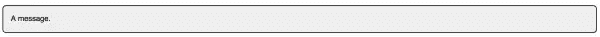

# 编写简洁 CSS 的黄金准则

> 原文：<https://www.sitepoint.com/golden-guidelines-for-writing-clean-css/>

下面是我们的书《CSS 大师》的摘录，作者是蒂芙尼·布朗。世界各地的商店都有出售，或者你可以在这里买到电子书。

### 编写简洁 CSS 的黄金准则

如前所述，有一些编写干净 CSS 的规则是你应该尽力避免违反的。它们将帮助你编写轻量级和可重用的 CSS:

*   避免全局和元素选择器
*   省略过于具体的选择器
*   使用语义类名
*   不要把 CSS 和标记结构联系得太紧密

我们一个一个来看这些。

### 避免全局选择器

**全局选择器**包括通用选择器(`*`)，元素选择器如`p`、`button`、`h1`，属性选择器如`[type=checkbox]`。应用于这些选择器的样式声明将被应用于站点中的每个这样的元素。这里有一个例子:

```
button {
  background: #FFC107;
  border: 1px outset #FF9800;
  display: block;
  font: bold 16px / 1.5 sans-serif;
  margin: 1rem auto;
  width: 50%;
  padding: .5rem;
}
```

这似乎无关痛痒。但是如果我们想创建一个风格不同的按钮呢？让我们设计一个用于关闭对话框模块的`.close`按钮:

```
<section class="dialog"> 
  <button type="button" class="close">Close</button> </section>
```

##### 注意:为什么不用`dialog?`

我们在这里使用`section`而不是`dialog`元素，因为对`dialog`的支持仅限于基于 Blink 的浏览器，如 Chrome/Chromium、Opera 和 Yandex。

现在我们需要编写 CSS 来覆盖我们不想从`button`规则集中继承的每一行:

```
.close {
  background: #e00;
  border: 2px solid #fff;
  color: #fff;
  display: inline-block;
  margin: 0;
  font-size: 12px;
  font-weight: normal;
  line-height: 1;
  padding: 5px;
  border-radius: 100px;
  width: auto;        
}
```

我们仍然需要许多这样的声明来覆盖浏览器默认值。但是如果我们把我们的`button`样式的范围扩大到一个`.default`类呢？然后我们可以从我们的`.close`规则集中删除`display`、`font-weight`、`line-height`、`margin`、`padding`和`width`声明。体积缩小了 23%:

```
.default {
  background: #FFC107;
  border: 1px outset #FF9800;
  display: block;
  font: bold 16px / 1.5 sans-serif;
  margin: 1rem auto;
  width: 50%;
  padding: .5rem;
}

.close {
  background: #e00;
  border: 2px solid #fff;
  color: #fff;
  font-size: 12px;
  padding: 5px;
  border-radius: 100px;
}
```

同样重要的是，避免全局选择器降低了样式冲突的风险。在一个模块或文档上工作的开发人员不会无意中添加一个在另一个模块或文档中产生副作用的规则。

全局样式和选择器完全可以重置和标准化默认浏览器样式。然而，在大多数其他情况下，它们会导致膨胀。

### 避免过于具体的选择器

保持选择器的低特异性是创建轻量级、可重用和可维护 CSS 的关键之一。您可能还记得特殊性，类型选择器的特殊性是 0，0，1。另一方面，类选择器具有 0，1，0 的特异性:

```
/* Specificity of 0,0,1 */
p {
  color: #222;
  font-size: 12px;
}

/* Specificity of 0,1,0 */
.error {
  color: #a00;
}
```

向元素添加类名时，该选择器的规则优先于更一般类型的选择器规则。没有必要通过将类选择器与类型选择器结合来进一步限定它。这样做增加了选择器的特异性，并增加了整个文件的大小。

换句话说，使用`p.error`是不必要的具体，因为`.error`实现了相同的目标。另一个优点是`.error`可以和其他元素一起重用。一个`p.error`选择器将`.error`类限制为`p`元素。

#### 不要连锁上课

还要避免链接类选择器。像`.message.warning`这样的选择器具有 0，2，0 的特异性。更高的特异性意味着它们很难被覆盖，而且链接经常会产生副作用。这里有一个例子:

```
message {
  background: #eee;
  border: 2px solid #333;
  border-radius: 1em;
  padding: 1em;
}
.message.error {
  background: #f30;
  color: #fff;
}
.error {
  background: #ff0;
  border-color: #fc0;
}
```

在这个 CSS 中使用`<p class="message">`,我们得到了一个漂亮的带有深灰色边框的灰色框，如图 2.1 所示:



图 2.1。我们的视觉效果。消息选择器

然而，使用`<p class="message error">`，给了我们`.message.error`的背景和`.error`的边界，如图 2.2 所示:


图 2.2。使用. message.error 作为选择器的直观结果

覆盖链接的类选择器的唯一方法是使用更具体的选择器。为了去掉黄色边框，我们需要向链中添加一个类名或类型选择器:`.message.warning.exception`或`div.message.warning`。相反，创建一个新类更为方便。如果您发现自己正在链接选择器，请回到绘图板。要么是设计不一致，要么是你过早地链接，试图防止你没有的问题。解决这些问题。您将避免的维护难题和获得的可重用性是值得的。

#### 避免使用`id`选择器

因为每个文档的每个`id`只能有一个元素，所以使用`id`选择器的规则集很难重用。这样做通常需要使用一系列的`id`选择器；比如`#sidebar-features`和`#sidebar-sports`。

标识符也有高度的特异性，所以我们需要更长的选择器来覆盖声明。在下面的 CSS 中，我们需要使用`#sidebar.sports`和`#sidebar.local`来覆盖`#sidebar`的背景颜色:

```
#sidebar {
  float: right;
  width: 25%;
  background: #eee;
}
#sidebar.sports  {
  background: #d5e3ff;
}
#sidebar.local {
  background: #ffcccc;
}
```

切换到一个类选择器，比如`.sidebar`，让我们简化我们的选择器链:

```
sidebar {
  float: right;
  width: 25%;
  background: #eee;
}
.sports  {
  background: #d5e3ff;
}
.local {
  background: #ffcccc;
}
```

除了节省一些字节，我们的`.sports`和`.local`规则集现在可以添加到其他元素中。

使用像`[id=sidebar]`这样的属性选择器可以让我们避开标识符的更高特异性。虽然它缺乏类选择器的可重用性，但低特异性意味着我们可以避免链接选择器。

##### 注意:当`id`选择器的高特异性有用时

在某些情况下，你可能 *想要* 一个`id`选择器的更高特异性。例如，媒体站点的网络可能希望在其所有 web 属性上使用相同的导航栏。该组件必须在网络中的站点之间保持一致，并且应该很难重新设计。使用一个`id`选择器减少了那些样式被意外覆盖的机会。

最后说一下`#main article.sports table#stats tr:nth-child(even) td:last-child`之类的选择器。它不仅长得离谱，而且具有 2，3，4 的特异性，也不可重用。在你的标记中，这个选择器有多少个 *可能的* 实例？让我们做得更好。我们可以立即将选择器调整到`#stats tr:nth-child(even) td:last-child`。它足够具体来完成这项工作。然而更好的方法——为了可重用性和最小化字节数——是使用类名。

##### 注意:预处理器嵌套的症状

过于具体的选择器通常是过多预处理器嵌套的结果。

#### 使用语义类名

当我们使用词语 *语义* 时，我们的意思是 *意义* 。类名应该描述规则的作用或它影响的内容类型。我们也希望名称将承受设计要求的变化。命名比看起来要难。

以下是不要做的事情的例子:`.red-text`、`.blue-button`、`.border-4px`、`.margin10px`。这些有什么问题？它们与现有的设计选择结合得太紧密了。使用`class="red-text"`来标记一个错误信息确实有效。但是，如果设计发生变化，错误信息变成橙色框中的黑色文本，会发生什么呢？现在你的类名不准确了，这使得你和你的同事更难理解代码中发生了什么。

在这种情况下，更好的选择是使用类名，如`.alert`、`.error`或`.message-error`。这些名称表明应该如何使用该类以及它们影响的内容(错误消息)的种类。对于定义页面布局的类名，添加一个前缀，如`layout-`、`grid-`、`col-`或简单的`l-`，以便一目了然地表明它们是做什么的。后面关于边界元方法的部分描述了这一过程。

#### 避免将 CSS 与标记紧密联系在一起

您可能在代码中使用过子代或后代选择器。子选择器遵循模式`E > F`，其中 F 是一个元素，E 是它的 *直接* 父元素。例如，`article > h1`影响`<article><h1>Advanced CSS</h1></article>`中的`h1`元素，而不影响`<article><section><h1>Advanced CSS</h1></section></article>`中的`h1`元素。另一方面，后代选择器遵循模式`E F`，其中 F 是元素，E 是祖先。使用我们前面的例子，`article h1`在两种情况下都选择了`h1`元素。

子代选择器和后代选择器都不是天生的坏。事实上，它们很好地限制了 CSS 规则的范围。但是它们远非理想，因为标记偶尔会改变。

如果你经历过以下情况，请举手。你已经为一个客户开发了一些模板，你的 CSS 在几个地方使用了子代和后代选择器。这些子代和后代中的大多数也是元素选择器，所以像`.promo > h2`和`.media h3`这样的选择器遍布于您的代码中。你的客户还雇佣了一名 SEO 顾问，他审查了你的标记，并建议你将`h2`和`h3`元素改为`h1`和`h2`元素。问题是我们也必须改变我们的 CSS。

班级选择器再一次显示了他们的优势。使用`.promo > .headline`或`.media .title`(或者更简单的说`.promo-headline`和`.media-title`)让我们可以在不改变 CSS 的情况下改变我们的标记。

当然，这条规则假设您可以访问和控制标记。如果你正在处理一个遗留的 CMS，这可能不是真的。在这种情况下，使用子类、后代类或伪类选择器是适当且必要的。

##### 注意:更符合体系结构的 CSS 规则

Philip Walton 在他的文章“CSS 架构”中讨论了这些和其他一些规则我还推荐哈里·罗伯特的网站 [CSS 指南](http://cssguidelin.es/)和尼古拉斯·加拉格尔的帖子[关于 HTML 语义和前端架构](http://nicolasgallagher.com/about-html-semantics-front-end-architecture/)以获得更多关于 CSS 架构的想法。

我们现在来看看 CSS 架构的两种方法。这两种方法都是为了改进大型站点和大型团队的开发过程而创建的；然而，对于一个人的团队来说，它们同样适用。

## 分享这篇文章