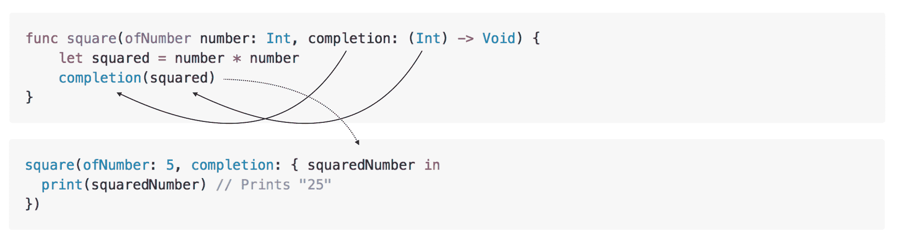

# 提高您的 Swift 关闭结果

> 原文：<https://www.sitepoint.com/improve-swift-closures-result/>

处理异步任务是开发人员的日常任务，Swift 开发人员大多使用闭包来完成这类工作。它们的语法清晰而富有表现力，但是当我们不能充分表示异步操作的结果时，处理闭包可能容易出错。面向结果的编程旨在通过提供一种简单的方法来表示这些结果，从而降低复杂性。本文将介绍闭包的基础知识，并向您展示如何在代码中使用`Result`。

所有的例子都可以在[这个 Github 库](https://github.com/sitepoint-editors/ResultOrientedSwift)中找到。

## Swift 中的闭包

**闭包是自包含的代码块。**它们可以像其他对象一样在你的代码中传递和使用。事实上，闭包有类型，就像`Int`或`String`是类型一样。它们的不同之处在于它们可以有输入参数，并且必须提供返回类型。

默认情况下，闭包没有任何使它们异步的特性。正是它们的使用方式使它们在异步环境中运行良好。

### 句法

闭包由它的参数、返回类型和其中的语句定义:

```
{ (parameters) -> (return type) in
  (statements)
} 
```

闭包参数类型可以是任何 Swift 类型。返回类型也可以是任何 Swift 类型。在某些情况下，返回类型是`Void`并且不需要`return`语句。

让我们看看如何实现一个简单的闭包来计算一个数的平方。与任何常规函数一样，您将有两个参数和一个返回值。

```
let sumNumbers: ((Int, Int) -> Int) = { firstNumber, secondNumber -> Int in
    return firstNumber + secondNumber
} 
```

只要返回类型的值，闭包体内可以有任意数量的语句。在这种情况下，闭包返回`firstNumber`和`secondNumber`的和。

闭包可以像任何方法一样执行:

```
sumNumbers(10,4) // returns 14 
```

### 闭包在异步环境中如何工作

如果你观察任何一个闭包，你会发现它封装了一个代码块。闭包的实例可以在您的代码中传递并执行，而不需要了解它的内部结构。这使得它们非常适合异步开发。一个典型的用例是当您指定异步操作返回时应该执行的代码，并将其作为参数传递。异步方法将完成它的工作并执行闭包中的代码，不管它包含什么。

假设我们想在后台执行平方的计算，并执行一些可以使用其结果的任意代码。我们将传递一个闭包作为我们的`completion`参数:

```
func square(of number: Int, completion: @escaping (Int) -> Void) 
```

可以看到`square(of number: completion:)`方法有两个参数。第一个参数是类型为`Int`的`number`，它是要平方的数字。第二个是类型为`(Int) -> Void`的闭包。执行该方法时，平方数结果将作为闭包中的`Int`参数提供。闭包的返回类型是`Void`，因为没有什么要返回。由于在函数返回后会调用*，所以必须以`@escaping`为前缀。*

让我们来看看这个函数是如何实现的:

```
func square(of number: Int, completion: @escaping (Int) -> Void) {
    OperationQueue().addOperation {
      let squared = number * number
      OperationQueue.main.addOperation {
        completion(squared)
      }
    }
} 
```

在方法体内，`squared`首先在后台计算。之后，在主线程上调用`completion` closure。因为完成将`Int`作为第一个参数，`squared`将被传递给那个参数。

```
square(of: 5, completion: { squaredNumber in
  print(squaredNumber) // Prints "25"
}) 
```



> 这张图片展示了参数和闭包返回值是如何传递的。

## 可选参数及其问题

在某些情况下，异步工作的成功执行可能取决于各种变量，例如网络连接。在这些情况下，异步调用需要提供关于所发生错误的信息。如果调用成功，闭包也需要提供结果。由于有许多可能的结果，闭包将它们的参数定义为可选的。

例如，`URLSession` API 定义了以下运行网络请求的方法。

```
func dataTask(with url: URL,
              completionHandler: @escaping (Data?, URLResponse?, Error?) -> Void) -> URLSessionDataTask 
```

您可以看到`completionHandler`是一个带有三个可选参数的闭包。当与他们一起工作时，你需要检查哪些是`nil`，哪些不是。如果`Error`不为零，你需要处理这个错误。如果是，你需要打开`Data`和`URLResponse`对象并使用它们。但是没有明显的程序来涵盖所有可能成功和不成功的案例。

## 面向结果的程序设计

面向结果的编程旨在解决这个问题，用一个`Result<T>`枚举替换可选函数中的零检查。

### 什么是`Result<T>`？

`Result<T>`是我们如何表示有两种可能结果的操作的返回值:成功或不成功。

这种表现形式与 Swift 中实施期权的方式非常相似。请记住，光学单体可以处于两种状态之一

*   包含一个包装值——这意味着在可选实例中有一些值。
*   不包含任何内容–意味着可选实例不包含任何内容。

如果您看一下 Swift 中选项是如何实施的，您会发现它实际上是作为 enum 实施的:

```
enum Optional<T> {
  case some(T)
  case none
} 
```

`Optional`是一个通用枚举。这使我们能够使用任何类型的选项，如`Optional<Int>`或`Optional<UIView>`。

同样，`Result<T>`提供了两种基本情况，`success(T)`和`error(Error)`。`T`是结果定义的类型，`Error`是 Swift 原生错误定义。

### `Result<T>`的基本用法

枚举的一个基本实现如下所示:

```
enum Result<T> {
  case success(T)
  case error(Error)
} 
```

假设你正在开发一个处理数学计算的软件。由于用户输入不正确，其中一些可能会失败。一个经典的例子是试图将一个数除以零(这是数学基本规则所不允许的)。所以，如果你要建立一个除法方法，用两个数相除，你会有两种可能的结果。如果除法成功并且返回数字，或者出现被零除的情况。通过使用`Result<T>`,我们可以这样表达它:

```
// Define error that can occur in the computation process
enum MathError: Error {
  case divisionWithZero
}

func divide(_ first: Double, with second: Double) -> Result<Double> {
  // Check if divisor is zero
  // If it is, return error result
  if second == 0 { return .error(MathError.divisionWithZero) }

  // Return successful result if second number
  // is not zero
  return .success(first / second)
} 
```

为了执行我们的除法，我们将使用一个`switch`语句:

```
let divisonResult = divide(5, with: 0) 
switch divisionResult {
case let .success(value):
  print("Result of division is \(value)")
case let .error(error):
  print("error: \(error)")
} 
```

### `Result<T>`的高级用法

enum 可以很容易地集成到任何开发环境中。为了理解如何做到这一点，我们将使用一个图像处理示例。

在本例中，位于 URL 的图像将使用棕褐色过滤器进行过滤，并通过`Result<UIImage>`对象在闭包中返回。我们的方法签名如下所示:

```
func applyFilterToImage(at urlString: String, completion: @escaping ((Result<UIImage>) -> ())) 
```

为了使这个过程更快，我们将使用后台队列进行图像下载和过滤。这样，应用程序 UI 不会被网络请求阻塞。当图像下载完成时，过滤将被分派到主队列。

使用这种方法过滤图像涉及几个步骤:

1.  从`urlString`参数创建`URL`对象，以便提取图像数据
2.  为执行网络请求创建后台队列
3.  从后台队列上的`URL`对象获取图像二进制数据
4.  检查提取的数据是否可用于创建`UIImage`对象
5.  从提取的数据创建`UIImage`
6.  在主队列上创建并应用过滤器
7.  通过闭包传递适当的结果

此操作的良好实现应该涵盖所有这些步骤，并处理所有可能发生的错误:

*   Url 字符串参数的格式可能不正确
*   由于网络问题，图像获取可能会失败
*   提取的数据可能不是实际的图像

#### 示例实现

让我们先定义我们的错误。这个例子将使用简单的`PhotoError`枚举来定义它们。当然，除了已经定义的错误之外，您还可以使用其他错误。

```
enum PhotoError: Error {
  // Invalid url string used
  case invalidURL(String)
  // Invalid data used
  case invalidData
} 
```

出现错误后，方法体被定义为:

```
func applyFilterToImage(at urlString: String, completion: @escaping ((Result<UIImage>) -> ())) {

    // Check if `URL` object can be created from the URL string
    guard let url = URL(string: urlString) else {
        completion(.error(PhotoError.invalidURL(urlString)))
        return
    }

    // Create background queue
    let backgroundQueue = DispatchQueue.global(qos: .background)

    // Dispatch to background queue
    backgroundQueue.async {
        do {
            let data = try Data(contentsOf: url)

            // Check if `UIImage` object can be constructed with data
            guard let image = UIImage(data: data) else {
                completion(.error(PhotoError.invalidData))
                return
            }

            // Dispatch filtering to main queue
            DispatchQueue.main.async {
                // Crate sepia filter
                let filter = CIFilter(name: "CISepiaTone")!

                // Setup filter options
                let inputImage = CIImage(image: image)
                filter.setDefaults()
                filter.setValue(inputImage, forKey: kCIInputImageKey) // Set input image

                // Get filtered image
                let filteredImage = UIImage(ciImage: filter.outputImage!)

                // Return successful result
                completion(.success(filteredImage))
            }
        } catch {
            // Dispatch error completion to main queue
            DispatchQueue.main.async { completion(.error(error)) }
        }
    }
} 
```

如您所见，可能抛出错误的方法被封装在一个`do { } catch { }`块中。首先，创建`URL`对象。如果`urlString`无效，`PhotoError.invalidURL`将被返回。这种错误检查模式遵循该方法的其余部分。如果每个操作都成功，将返回过滤图像的成功结果。

假设我们想在一张名为`landscape.jpeg`的本地照片上使用这种方法。我们创建一个`imageURL`，然后执行`applyFilterToImage`方法。为了检查图像过滤是否成功，我们可以使用`switch`语句。如果结果成功，其关联的`UIImage`对象可以作为任何其他对象使用。

```
let imageURL = Bundle.main.path(forResource: "landscape", ofType: "jpeg")!

applyFilterToImage(at: imageURL) { result in
  switch result {
  case let .success(image):
    let someImageView = UIImageView()
    someImageView.image = image
  case let .error(error):
    print(error)
  }
} 
```

## 结论

面向结果的编程是任何 Swift 开发人员的重要工具。它可以使异步代码的编写和处理更加容易和直观。背后的思想非常简单，很容易掌握，即使是初学者。

## 分享这篇文章